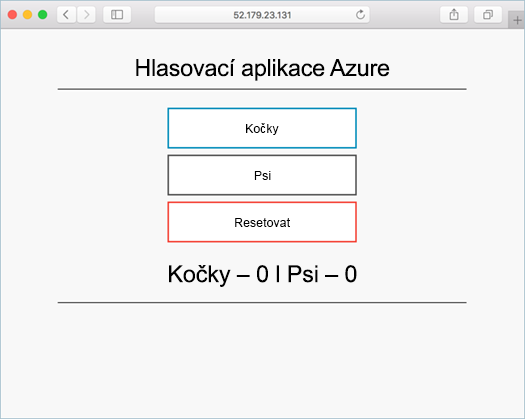

# <a name="prepare-application-for-azure-container-service-aks"></a>Příprava aplikací pro Azure Container Service (AKS)

V tomto kurzu, 8, první část je více kontejnerové aplikace připravené pro použití v Kubernetes. Dokončit krokům patří:  

> [!div class="checklist"]
> * Klonování zdroje aplikace z GitHubu  
> * Vytvoření kontejneru image ze zdroje aplikace
> * Testování aplikace v místním prostředí Docker

Po dokončení následující aplikace je dostupné ve vašem místním vývojovém prostředí.



V následujících kurzech se kontejner image nahrané do registru kontejneru služby Azure a spusťte v clusteru služby AKS.

## <a name="before-you-begin"></a>Než začnete

V tomto kurzu se předpokládá základní znalost klíčových konceptů Dockeru, jako jsou kontejnery, image kontejnerů a základní příkazy Dockeru. V případě potřeby, najdete v části [začít pracovat s Docker] [ docker-get-started] pro úvod do na základní informace o kontejneru. 

K dokončení tohoto kurzu potřebujete vývojové prostředí pro Docker. Docker poskytuje balíčky, které můžete snadno konfigurovat Docker na žádném [Mac][docker-for-mac], [Windows][docker-for-windows], nebo [Linux] [ docker-for-linux] systému.

Prostředí Azure Cloud neobsahuje součásti Docker nutné pro dokončení každý krok v tomto kurzu. Proto doporučujeme používat úplnou Docker vývojovém prostředí.

## <a name="get-application-code"></a>Získání kódu aplikace

Ukázková aplikace používá v tomto kurzu je základní hlasovací aplikaci. Aplikace se skládá z front-endové webové součásti a instanci Redis back-end. Součást webové je zabalené do bitové kopie vlastní kontejner. Redis instance používá image beze změny z úložiště Docker Hub.  

Pomocí git stáhnout kopii aplikace na svoje vývojové prostředí.

```console
git clone https://github.com/Azure-Samples/azure-voting-app-redis.git
```

Změňte adresáře tak, aby při práci z klonovaného adresáře.

```console
cd azure-voting-app-redis
```

V adresáři je zdrojový kód aplikace, předem vytvořené Docker compose soubor a soubor manifestu Kubernetes. Tyto soubory se používají v celé sadě kurzu. 

## <a name="create-container-images"></a>Vytvořit kontejner bitové kopie

[Docker Compose] [ docker-compose] můžete použít k automatizaci sestavení mimo kontejner bitové kopie a nasazení aplikací s více kontejneru.

Spustit `docker-compose.yml` soubor pro vytvoření bitové kopie kontejneru, stáhněte bitovou kopii Redis a spusťte aplikaci.

```console
docker-compose up -d
```

Po dokončení použít [imagí dockeru] [ docker-images] příkazu zobrazte vytvořené bitové kopie.

```console
docker images
```

Všimněte si, že tři bitové kopie byly staženy nebo vytvořeny. `azure-vote-front` Image obsahuje aplikace a používá `nginx-flask` bitovou kopii jako základ. `redis` Image se použije ke spuštění Redis instance.

```
REPOSITORY                   TAG        IMAGE ID            CREATED             SIZE
azure-vote-front             latest     9cc914e25834        40 seconds ago      694MB
redis                        latest     a1b99da73d05        7 days ago          106MB
tiangolo/uwsgi-nginx-flask   flask      788ca94b2313        9 months ago        694MB
```

Spustit [docker ps] [ docker-ps] příkazu zobrazte spuštěných kontejnerů.

```console
docker ps
```

Výstup:

```
CONTAINER ID        IMAGE             COMMAND                  CREATED             STATUS              PORTS                           NAMES
82411933e8f9        azure-vote-front  "/usr/bin/supervisord"   57 seconds ago      Up 30 seconds       443/tcp, 0.0.0.0:8080->80/tcp   azure-vote-front
b68fed4b66b6        redis             "docker-entrypoint..."   57 seconds ago      Up 30 seconds       0.0.0.0:6379->6379/tcp          azure-vote-back
```

## <a name="test-application-locally"></a>Testovací aplikace místně

Přejděte na adrese http://localhost: 8080 zobrazíte běžící aplikaci.


## <a name="clean-up-resources"></a>Vyčištění prostředků

Teď, když funkce aplikace byl ověřen, může spuštěných kontejnerů zastavena a odebrat. Neodstraňujte kontejneru bitové kopie. `azure-vote-front` Bitové kopie se nahraje instanci Azure Container registru v dalším kurzu.

Spusťte následující příkaz k zastavení spuštěných kontejnerů.

```console
docker-compose stop
```

Odstraňte zastaven kontejnery a prostředky pomocí následujícího příkazu.

```console
docker-compose down
```

Při dokončení máte kontejneru bitovou kopii, která obsahuje aplikaci Azure hlas.

## <a name="next-steps"></a>Další kroky

V tomto kurzu aplikace byla testována a vytvořit kontejner bitových kopií pro aplikaci. Dokončili jste následující kroky:

> [!div class="checklist"]
> * Klonování zdroje aplikace z GitHubu  
> * Vytvořené bitové kopie kontejneru z zdroj aplikace
> * Testování aplikace v místním prostředí Docker

Přejděte k dalšímu kurzu, ve kterém se seznámíte s ukládáním imagí kontejnerů ve službě Azure Container Registry.

> [!div class="nextstepaction"]
> [Push bitové kopie do registru kontejner Azure][aks-tutorial-prepare-acr]

<!-- LINKS - external -->
[docker-compose]: https://docs.docker.com/compose/
[docker-for-linux]: https://docs.docker.com/engine/installation/#supported-platforms
[docker-for-mac]: https://docs.docker.com/docker-for-mac/
[docker-for-windows]: https://docs.docker.com/docker-for-windows/
[docker-get-started]: https://docs.docker.com/get-started/
[docker-images]: https://docs.docker.com/engine/reference/commandline/images/
[docker-ps]: https://docs.docker.com/engine/reference/commandline/ps/

<!-- LINKS - internal -->
[aks-tutorial-prepare-acr]: ./tutorial-kubernetes-prepare-acr.md