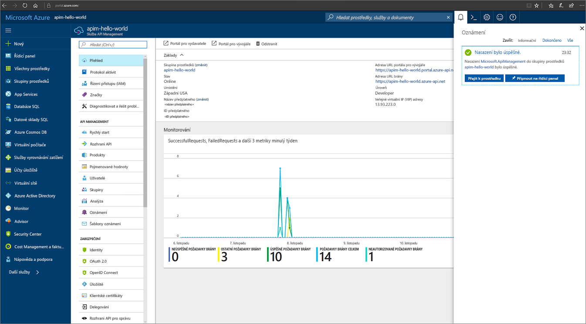

# Vytvoření nové instance služby Azure API Management

Azure API Management (APIM) pomáhá organizacím při publikování rozhraní API pro externí, partnerské a interní vývojáře, aby tak uvolnila potenciál jejich dat a služeb. Služba API Management nabízí základní možnosti pro zajištění úspěšného programu s rozhraním API prostřednictvím zapojení vývojářů, obchodních přehledů, analýz, zabezpečení a ochrany. APIM umožňuje vytvářet a spravovat moderní brány API pro existující backendové služby hostované kdekoli. Další informace najdete v tématu [Přehled](api-management-key-concepts.md).

Tento rychlý start popisuje kroky pro vytvoření nové instance API Managementu pomocí webu Azure Portal.

[!INCLUDE [quickstarts-free-trial-note](../../includes/quickstarts-free-trial-note.md)]

## Přihlaste se k Azure.

Přihlaste se k webu Azure Portal na adrese http://portal.azure.com.

## Vytvoření nové služby

1. Na webu [Azure Portal](https://portal.azure.com/) vyberte **Nový** > **Podniková integrace** > **API management**.

    Další možností je zvolit **Nový**, do vyhledávacího pole zadat `API management` a stisknout Enter. Klikněte na možnost **Vytvořit**.

2. Zadejte nastavení v okně **Služba API Management**.

    

    | Nastavení      | Navrhovaná hodnota  | Popis              |
    | ------------ |  ------- | ---------------------------------|
    |**Název**|Jedinečný název pro vaši službu API Management| Tento název není možné později změnit. Název služby se používá k vygenerování výchozího názvu domény ve tvaru *{název}.azure-api.net*. Pokud chcete použít vlastní název domény, přečtěte si téma [Konfigurace vlastní domény](configure-custom-domain.md).   Název služby se používá k odkazování na službu a odpovídající prostředek Azure.|
    |**Předplatné**|Vaše předplatné | Předplatné, v jehož rámci se tato nová instance služby vytvoří. Můžete si vybrat jedno z různých předplatných Azure, ke kterým máte přístup.|
    |**Skupina prostředků**|*apimResourceGroup*|Můžete vybrat nový nebo existující prostředek. Skupina prostředků je kolekce prostředků, které sdílejí životní cyklus, oprávnění a zásady. Další informace najdete [tady](../azure-resource-manager/resource-group-overview.md#resource-groups).|
    |**Umístění**|*USA – západ*|Vyberte geografickou oblast blízko vás. V rozevíracím seznamu se zobrazí jenom dostupné oblasti služby API Management. |
    |**Název organizace**|Název vaší organizace|Tento název se používá na řadě míst, včetně názvu portálu pro vývojáře a odesilatele e-mailů s oznámeními.|
    |**E-mail správce**|*admin@org.com*|Nastavte e-mailovou adresu, na kterou se budou posílat všechna oznámení z **API Managementu**.|
    |**Cenová úroveň**|*Developer*|Pro vyhodnocení služby nastavte úroveň **Developer**. Tato úroveň není určená pro použití v produkčním prostředí. Další informace o škálování úrovní služby API Management najdete v tématu věnovaném [upgradu a škálování](upgrade-and-scale.md).|
3. Zvolte **Vytvořit**.

    > [!TIP]
    > Vytvoření služby API Management obvykle trvá 20 až 30 minut. Výběr možnosti **Připnout na řídicí panel** usnadňuje pozdější vyhledání nově vytvořené služby.

[!INCLUDE [api-management-navigate-to-instance.md](../../includes/api-management-navigate-to-instance.md)]

## Vyčištění prostředků

Pokud už je nepotřebujete, můžete k odebrání skupiny prostředků a všech souvisejících prostředků použít následující postup:

1. Na webu Azure Portal vyberte .
2. Vyberte **Skupiny prostředků**.
3. Najděte vaši skupinu prostředků.
4. Klikněte na . . . a odstraňte vaši skupinu.

## Další kroky

> [!div class="nextstepaction"]
> [Import a publikování vašeho prvního rozhraní API](import-and-publish.md)
