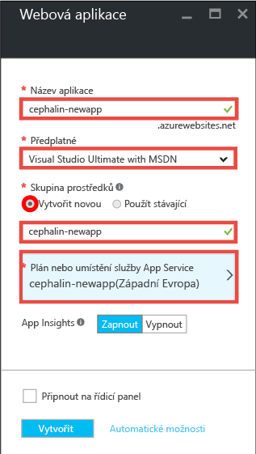
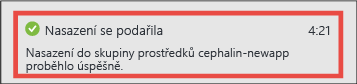
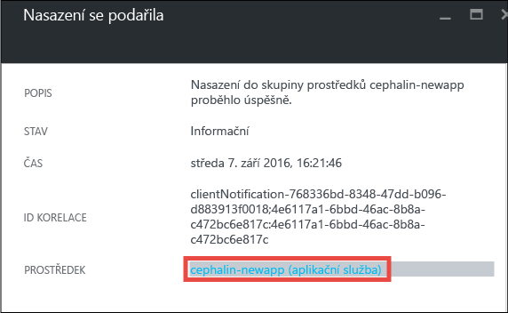
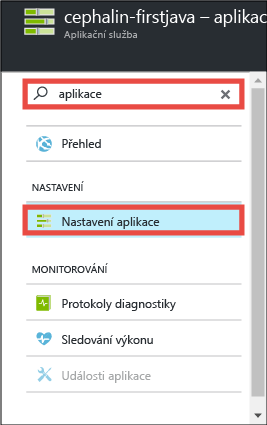
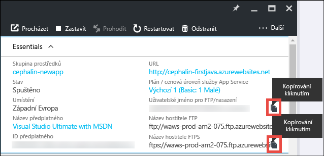
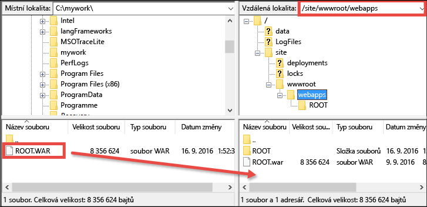

<properties 
    pageTitle="Nasazení první webové aplikace v Javě do Azure během pěti minut | Microsoft Azure" 
    description="Nasazením ukázkové aplikace zjistíte, jak snadné je spustit webové aplikace ve službě App Service. Pusťte se hned do skutečného vývoje. Výsledky uvidíte okamžitě." 
    services="app-service\web"
    documentationCenter=""
    authors="cephalin"
    manager="wpickett"
    editor=""
/>

<tags
    ms.service="app-service-web"
    ms.workload="web"
    ms.tgt_pltfrm="na"
    ms.devlang="na"
    ms.topic="hero-article"
    ms.date="09/16/2016" 
    ms.author="cephalin"
/>
    
# Nasazení první webové aplikace v Javě do Azure během pěti minut

Tento kurz vám pomůže nasadit jednoduchou webovou aplikaci v Javě do služby [Azure App Service](../app-service/app-service-value-prop-what-is.md).
Službu App Service můžete používat při vytváření webových aplikací, [back-endů mobilních aplikací](/documentation/learning-paths/appservice-mobileapps/) a [aplikací API](../app-service-api/app-service-api-apps-why-best-platform.md).

Budete postupovat takto: 

- Vytvoříte webovou aplikaci ve službě Azure App Service.
- Nasadíte ukázkovou aplikaci v Javě.
- Prohlédnete si spuštění kódu naživo v produkčním prostředí.

## Požadavky

- Získat klienta FTP/FTPS, jako je [FileZilla](https://filezilla-project.org/).
- Získat účet Microsoft Azure. Pokud nemáte účet, můžete se [zaregistrovat k bezplatné zkušební verzi](/pricing/free-trial/?WT.mc_id=A261C142F) nebo si [aktivovat výhody předplatitele Visual Studio](/pricing/member-offers/msdn-benefits-details/?WT.mc_id=A261C142F).

>[AZURE.NOTE] [App Service si můžete vyzkoušet](http://go.microsoft.com/fwlink/?LinkId=523751) bez účtu Azure. Můžete si vytvořit úvodní aplikaci a celou hodinu si s ní hrát, bez platebních karet a bez závazků.

## Vytvoření webové aplikace

1. Přihlaste se k webu [Azure Portal](https://portal.azure.com) pomocí svého účtu Azure.

2. V levé nabídce klikněte na **Nové** > **Web + mobilní zařízení** > **Webová aplikace**.

    

3. V okně pro vytvoření aplikace použijte pro novou aplikaci následující nastavení:

    - **Název aplikace**: Zadejte jedinečný název.
    - **Skupina prostředků**: Vyberte **Vytvořit novou** a zadejte název nové skupiny prostředků.
    - **Plán/umístění služby App Service**: Kliknutím na tuto položku přejděte ke konfiguraci a potom klikněte na **Vytvořit nový** a nastavte název, umístění a cenovou úroveň plánu služby App Service. Nebojte se využít cenovou úroveň **Free**.

    Až skončíte, mělo by okno pro vytvoření aplikace vypadat takto:

    

3. V dolní části klikněte na **Vytvořit**. Kliknutím na ikonu **Oznámení** v horní části můžete zobrazit průběh akce.

    

4. Až se nasazení dokončí, mělo by se zobrazit tato oznámení. Kliknutím na tuto zprávu otevřete okno vašeho nasazení.

    

5. V okně **Nasazení bylo úspěšné** klikněte na odkaz **Prostředek**. Otevře se okno nové webové aplikace.

    

## Nasazení aplikace v Javě do vaší webové aplikace

Teď nasadíme aplikaci v Javě do Azure pomocí FTPS.

5. V okně webové aplikace se posuňte dolů k položce **Nastavení aplikace** (nebo ji vyhledejte) a potom na ni klikněte. 

    

6. V části **Verze Javy** vyberte **Java 8** a klikněte na **Uložit**.

    

    Když se zobrazí oznámení **Nastavení webové aplikace se úspěšně aktualizovalo**, přejdete na http://*&lt;název_aplikace>*.azurewebsites.net a prohlédněte si výchozí servlet JSP v akci.

7. V okně webové aplikace se posuňte dolů k položce **Přihlašovací údaje pro nasazení** (nebo ji vyhledejte) a potom na ni klikněte.

8. Nastavte přihlašovací údaje pro nasazení a klikněte na **Uložit**.

7. V okně webové aplikace klikněte na tlačítko **Přehled**. Kliknutím na tlačítko **Kopírovat** vedle položek **Uživatelské jméno pro FTP/nasazení** a **Název hostitele FTPS** tyto hodnoty zkopírujte.

    

    Teď jste připraveni nasadit svou aplikaci v Javě pomocí FTPS.

8. V klientovi FTP/FTPS se přihlaste k serveru FTP webové aplikace Azure pomocí hodnoty, které jste zkopírovali v posledním kroku. Použijte heslo nasazení, který jste vytvořili dříve.

    Následující snímek obrazovky ukazuje přihlášení pomocí FileZilly.

    

    Může se zobrazit upozornění zabezpečení na nerozpoznaný certifikát SSL z Azure. Bez obav pokračujte.

9. Kliknutím na [tento odkaz](https://github.com/Azure-Samples/app-service-web-java-get-started/raw/master/webapps/ROOT.war) stáhněte soubor WAR do místního počítače.

9. V klientovi FTP/FTPS přejdete ve vzdálené lokalitě na **/site/wwwroot/webapps** a stažený soubor WAR přetáhněte z místního počítače do tohoto vzdáleného adresáře.

    

    Kliknutím na **OK** přepište tento soubor v Azure.

    >[AZURE.NOTE] V souladu s výchozím chováním Tomcatu vám název souboru **ROOT.war** v /site/wwwroot/webapps poskytne kořenovou webovou aplikaci (http://*&lt;název_aplikace>*.azurewebsites.net) a název souboru ***&lt;libovolný_název>*.war** poskytne pojmenovanou webovou aplikaci (http://*&lt;název_aplikace>*.azurewebsites.net/*&lt;libovolný_název>*).

A to je vše! Vaše aplikace v Javě teď živě běží v Azure. V prohlížeči přejděte na http://*&lt;název_aplikace>*.azurewebsites.net a prohlédněte si ho. 

## Provádění aktualizací aplikace

Pokud potřebujete provést aktualizaci, stačí pomocí klienta FTP/FTPS odeslat do stejného vzdáleného adresáře nový soubor WAR.

## Další kroky

[Vytvořte webovou aplikaci v Javě pomocí šablony v Azure Marketplace](app-service-web-java-get-started.md#marketplace). Můžete mít svůj vlastní plně přizpůsobitelný kontejner Tomcat a využít známé uživatelské rozhraní správce. 

Odlaďte webovou aplikaci Azure přímo v [IntelliJ](app-service-web-debug-java-web-app-in-intellij.md) nebo [Eclipse](app-service-web-debug-java-web-app-in-eclipse.md).

Další možností je pokračovat v práci s první webovou aplikací. Příklad:

- Vyzkoušejte si [další způsoby nasazení kódu do Azure](../app-service-web/web-sites-deploy.md). Pokud třeba chcete pro nasazení použít některé z úložišť GitHubu, stačí v části **Možnosti nasazení** místo **Místní úložiště Git** vybrat **GitHub**.
- Zdokonalte aplikaci Azure o další úroveň. Ověřte svoje uživatele. Škálujte ji na základě poptávky. Nastavte některá upozornění týkající se výkonu. To vše pomocí několika kliknutí. Viz téma [Přidání funkce do první webové aplikace](app-service-web-get-started-2.md).

<!--HONumber=Sep16_HO4-->

