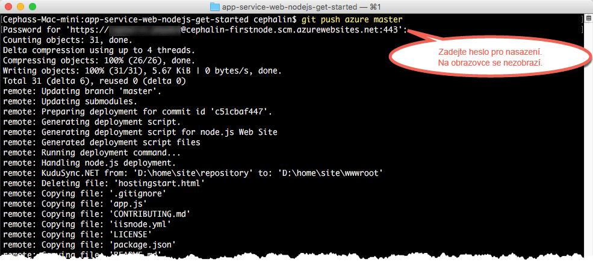

# Nasazení první webové aplikace v Node.js do Azure během pěti minut (CLI 2.0 Preview)

> [!div class="op_single_selector"]
> * [První web v HTML](app-service-web-get-started-html.md)
> * [První aplikace v .NET](app-service-web-get-started-dotnet.md)
> * [První aplikace v PHP](app-service-web-get-started-php.md)
> * [První aplikace v Node.js](app-service-web-get-started-nodejs.md)
> * [První aplikace v Pythonu](app-service-web-get-started-python.md)
> * [První aplikace v Javě](app-service-web-get-started-java.md)
> 
> 

Tento kurz vám pomůže nasadit první webovou aplikaci v Node.js do služby [Azure App Service](../app-service/app-service-value-prop-what-is.md).
Službu App Service můžete používat při vytváření webových aplikací, [back-endů mobilních aplikací](/documentation/learning-paths/appservice-mobileapps/) a [aplikací API](../app-service-api/app-service-api-apps-why-best-platform.md).

Vaším úkolem je: 

* Vytvořit webovou aplikaci ve službě Azure App Service.
* Nasadit ukázkový kód Node.js.
* Sledovat spuštění kódu naživo v produkčním prostředí.
* Aktualizovat webovou aplikaci stejným způsobem, jakým byste [nuceně doručili (push) potvrzené změny do Git](https://git-scm.com/docs/git-push).

[!INCLUDE [app-service-linux](../../includes/app-service-linux.md)]

## Verze rozhraní příkazového řádku pro dokončení úlohy

K dokončení úlohy můžete využít jednu z následujících verzí rozhraní příkazového řádku:

- [Azure CLI 1.0](app-service-web-get-started-nodejs-cli-nodejs.md) – naše rozhraní příkazového řádku pro klasické modely nasazení a modely nasazení správy prostředků
- [Azure CLI 2.0 (Preview)](app-service-web-get-started-nodejs.md) – naše rozhraní příkazového řádku nové generace pro model nasazení správy prostředků

## Požadavky
* [Git](http://www.git-scm.com/downloads)
* [Azure CLI 2.0 Preview](/cli/azure/install-az-cli2)
* Účet Microsoft Azure. Pokud nemáte účet, můžete se [zaregistrovat k bezplatné zkušební verzi](https://azure.microsoft.com/pricing/free-trial/?WT.mc_id=A261C142F) nebo si [aktivovat výhody předplatitele sady Visual Studio](https://azure.microsoft.com/pricing/member-offers/msdn-benefits-details/?WT.mc_id=A261C142F).

> [!NOTE]
> [App Service si můžete vyzkoušet](https://azure.microsoft.com/try/app-service/) bez účtu Azure. Můžete si vytvořit úvodní aplikaci a celou hodinu si s ní hrát, bez platebních karet a bez závazků.
> 
> 

## Nasazení webové aplikace v Node.js
1. Otevřete nový příkazový řádek systému Windows, okno prostředí PowerShell, prostředí Linux nebo terminál OS X. Spusťte `git --version` a `azure --version` ověřte, zda jsou v počítači nainstalovány Git a rozhraní příkazového řádku Azure CLI.
   
    
   
    Pokud jste nástroje ještě nenainstalovali, odkazy na stažení naleznete v části [Požadavky](#Prerequisites).
2. Přihlaste se k Azure tímto způsobem:
   
        az login
   
    Postupujte podle zprávy nápovědy a pokračujte v procesu přihlášení.
   
    

3. Nastavte uživatele nasazení pro App Service. Později pomocí těchto přihlašovacích údajů nasadíte kód.
   
        az appservice web deployment user set --user-name <username> --password <password>

3. Vytvořte novou [skupinu prostředků](../azure-resource-manager/resource-group-overview.md). V tomto prvním kurzu ke službě App Service ještě ani nepotřebujete vědět, co to je.

        az group create --location "<location>" --name my-first-app-group

    K zobrazení možných hodnot, které se dají použít pro `<location>`, použijte příkaz `az appservice list-locations` rozhraní příkazového řádku.

3. Vytvořte nový BEZPLATNÝ [plán služby App Service](../app-service/azure-web-sites-web-hosting-plans-in-depth-overview.md). Pro tento první kurz ke službě App Service stačí vědět, že se vám za webové aplikace v tomto plánu nebude nic účtovat.

        az appservice plan create --name my-free-appservice-plan --resource-group my-first-app-group --sku FREE

4. Vytvořte novou webovou aplikaci s jedinečným názvem ve značce `<app_name>`.

        az appservice web create --name <app_name> --resource-group my-first-app-group --plan my-free-appservice-plan

4. Teď získáte ukázkový kód Node.js, který chcete nasadit. Přejděte do pracovního adresáře (`CD`) a naklonujte ukázkovou aplikaci tímto způsobem:
   
        cd <working_directory>
        git clone https://github.com/Azure-Samples/app-service-web-nodejs-get-started.git

5. Přejděte do úložiště ukázkové aplikace.
   
        cd app-service-web-nodejs-get-started
5. Ke konfiguraci místního nasazení Gitu pro webovou aplikaci App Service použijete následující příkaz:

        az appservice web source-control config-local-git --name <app_name> --resource-group my-first-app-group

    Získáte výstup JSON podobný tomuto. To znamená, že vzdálené úložiště Git je nakonfigurované:

        {
        "url": "https://<deployment_user>@<app_name>.scm.azurewebsites.net/<app_name>.git"
        }

6. Přidejte adresu URL v kódu JSON jako vzdálené úložiště Git pro vaše místní úložiště (pro zjednodušení nazvané `azure`).

        git remote add azure https://<deployment_user>@<app_name>.scm.azurewebsites.net/<app_name>.git
   
7. Nasaďte ukázkový kód do aplikace Azure stejným způsobem, jakým byste doručili bez vyžádání (push) libovolný kód prostřednictvím Gitu. Po zobrazení výzvy použijte heslo, které jste nakonfigurovali v předchozích krocích.
   
        git push azure master
   
    
   
    Příkaz `git push` nejen že vloží kód do Azure, ale také aktivuje úlohy nasazení v modulu nasazení. 
    Pokud máte v kořenovém adresáři (úložišti) projektu soubor package.json, skript nasazení obnoví požadované balíčky za vás. 

Blahopřejeme, úspěšně jste nasadili aplikaci do služby Azure App Service.

## Sledování živého běhu aplikace
Chcete-li sledovat živý běh v Azure, spusťte následující příkaz z libovolného adresáře v úložišti:

    azure site browse

## Provádění aktualizací aplikace
Nyní můžete pomocí Git kdykoli provádět nucené doručení (push) z kořenového adresáře projektu (úložiště) a aktualizovat živý web. Postup je stejný jako při prvním nasazení kódu. Například pokaždé, když chcete nuceně doručit (push) novou změnu, kterou jste místně otestovali, stačí spustit následující příkazy z kořenového adresáře projektu (úložiště):

    git add .
    git commit -m "<your_message>"
    git push azure master

## Další kroky
[Vytvořte, nakonfigurujte a nasaďte webovou aplikaci Node.js Express do Azure](app-service-web-nodejs-get-started.md). V tomto kurzu se naučíte základní dovednosti, které v Azure potřebujete ke spuštění libovolné webové aplikace v Node.js, jako je:

* Vytvoření a konfigurace aplikací v Azure z prostředí PowerShell/Bash
* Nastavení verze Node.js
* Použití spouštěcího souboru, který není v kořenovém adresáři aplikace
* Automatizace pomocí NPM
* Získání protokolů chyb a výstupu

Další možností je pokračovat v práci s první webovou aplikací. Příklad:

* Vyzkoušejte si [další způsoby nasazení kódu do Azure](web-sites-deploy.md). Pokud třeba chcete pro nasazení použít některé z úložišť GitHubu, stačí v části **Možnosti nasazení** místo **Místní úložiště Git** vybrat **GitHub**.
* Zdokonalte aplikaci Azure o další úroveň. Ověřte svoje uživatele. Škálujte ji na základě poptávky. Nastavte některá upozornění týkající se výkonu. To vše pomocí několika kliknutí. Viz téma [Přidání funkce do první webové aplikace](app-service-web-get-started-2.md).

<!--HONumber=Feb17_HO1-->

