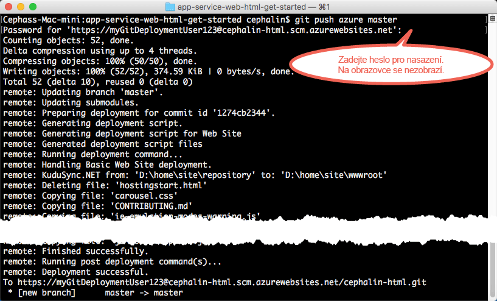

# Nasazení vaší první webové aplikace do Azure během pěti minut
Tento kurz vám pomůže nasadit první webovou aplikaci do služby [Azure App Service](../app-service/app-service-value-prop-what-is.md).
Službu App Service můžete používat při vytváření webových aplikací, [back-endů mobilních aplikací](/documentation/learning-paths/appservice-mobileapps/) a [aplikací API](../app-service-api/app-service-api-apps-why-best-platform.md).

Vaším úkolem je: 

* Vytvořit webovou aplikaci ve službě Azure App Service.
* Nasadit ukázkový kód (zvolte ASP.NET, PHP, Node.js, Javu nebo Python).
* Sledovat spuštění kódu naživo v produkčním prostředí.
* Aktualizovat webovou aplikaci stejným způsobem, jakým byste [nuceně doručili (push) potvrzené změny do Git](https://git-scm.com/docs/git-push).

> [!INCLUDE [app-service-linux](../../includes/app-service-linux.md)]
> 
> 

## Požadavky
* [Git](http://www.git-scm.com/downloads)
* [Rozhraní příkazového řádku Azure](../xplat-cli-install.md).
* Účet Microsoft Azure. Pokud nemáte účet, můžete se [zaregistrovat k bezplatné zkušební verzi](/pricing/free-trial/?WT.mc_id=A261C142F) nebo si [aktivovat výhody předplatitele sady Visual Studio](/pricing/member-offers/msdn-benefits-details/?WT.mc_id=A261C142F).

> [!NOTE]
> [App Service si můžete vyzkoušet](http://go.microsoft.com/fwlink/?LinkId=523751) bez účtu Azure. Můžete si vytvořit úvodní aplikaci a celou hodinu si s ní hrát, bez platebních karet a bez závazků.
> 
> 

## Nasazení webové aplikace
Nyní nasadíme webovou aplikaci do služby Azure App Service.

1. Otevřete nový příkazový řádek systému Windows, okno prostředí PowerShell, prostředí Linux nebo terminál OS X. Spusťte `git --version` a `azure --version` ověřte, zda jsou v počítači nainstalovány Git a rozhraní příkazového řádku Azure CLI.
   
    
   
    Pokud jste nástroje ještě nenainstalovali, odkazy na stažení naleznete v části [Požadavky](#Prerequisites).
2. Přihlaste se k Azure tímto způsobem:
   
        azure login
   
    Postupujte podle zprávy nápovědy a pokračujte v procesu přihlášení.
   
    
3. Přepněte rozhraní příkazového řádku Azure do režimu ASM a potom nastavte uživatele nasazení pro službu App Service. Později pomocí těchto přihlašovacích údajů nasadíte kód.
   
        azure config mode asm
        azure site deployment user set --username <username> --pass <password>
4. Přejděte do pracovního adresáře (`CD`) a naklonujte ukázkovou aplikaci tímto způsobem:
   
        git clone <github_sample_url>
   
    
   
    Jako adresu *&lt;github_sample_url>* použijte jednu z následujících adres URL, a to v závislosti na vámi upřednostňovaném prostředí:
   
   * HTML+CSS+JS: [https://github.com/Azure-Samples/app-service-web-html-get-started.git](https://github.com/Azure-Samples/app-service-web-html-get-started.git)
   * ASP.NET: [https://github.com/Azure-Samples/app-service-web-dotnet-get-started.git](https://github.com/Azure-Samples/app-service-web-dotnet-get-started.git)
   * PHP (CodeIgniter): [https://github.com/Azure-Samples/app-service-web-php-get-started.git](https://github.com/Azure-Samples/app-service-web-php-get-started.git)
   * Node.js (Express): [https://github.com/Azure-Samples/app-service-web-nodejs-get-started.git](https://github.com/Azure-Samples/app-service-web-nodejs-get-started.git)
   * Java: [https://github.com/Azure-Samples/app-service-web-java-get-started.git](https://github.com/Azure-Samples/app-service-web-java-get-started.git)
   * Python (Django): [https://github.com/Azure-Samples/app-service-web-python-get-started.git](https://github.com/Azure-Samples/app-service-web-python-get-started.git)
5. Přejděte do úložiště ukázkové aplikace. Například:
   
        cd app-service-web-html-get-started
6. V Azure vytvořte prostředek aplikace služby App Service s jedinečným názvem aplikace a uživatelem nasazení, kterého jste nakonfigurovali v předchozích krocích. Po zobrazení výzvy zadejte číslo požadované oblasti.
   
        azure site create <app_name> --git --gitusername <username>
   
    
   
    Aplikace je nyní vytvořena v Azure. Aktuální adresář je také inicializován pro Git a připojený k nové aplikaci služby App Service jako vzdálený adresář Git.
    Můžete přejít na adresu URL aplikace (http://&lt;název_aplikace>.azurewebsites.net) a prohlédnout si krásnou výchozí stránku HTML, ale nyní tam raději umístíme váš kód.
7. Nasaďte ukázkový kód do aplikace Azure stejným způsobem, jakým byste doručili bez vyžádání (push) libovolný kód prostřednictvím Gitu. Po zobrazení výzvy použijte heslo, které jste nakonfigurovali v předchozích krocích.
   
        git push azure master
   
    
   
    Pokud jste použili jedno z jazykových rozhraní, zobrazí se jiný výstup. Příkaz `git push` nejen že vloží kód do Azure, ale také aktivuje úlohy nasazení v modulu nasazení. Máte-li v kořenovém adresáři projektu (úložiště) libovolné soubory package.json (Node.js) nebo requirements.txt (Python) nebo máte-li v projektu ASP.NET soubor packages.config, skripty nasazení vám obnoví požadované balíčky. Můžete také [povolit rozšíření Autora](web-sites-php-mysql-deploy-use-git.md#composer) a automaticky zpracovávat soubory composer.json v aplikaci PHP.

Blahopřejeme, úspěšně jste nasadili aplikaci do služby Azure App Service.

## Sledování živého běhu aplikace
Chcete-li sledovat živý běh v Azure, spusťte následující příkaz z libovolného adresáře v úložišti:

    azure site browse

## Provádění aktualizací aplikace
Nyní můžete pomocí Git kdykoli provádět nucené doručení (push) z kořenového adresáře projektu (úložiště) a aktualizovat živý web. Postup je stejný jako při prvním nasazení kódu. Například pokaždé, když chcete nuceně doručit (push) novou změnu, kterou jste místně otestovali, stačí spustit následující příkazy z kořenového adresáře projektu (úložiště):

    git add .
    git commit -m "<your_message>"
    git push azure master

## Další kroky
Vyhledejte upřednostňované kroky při vývoji a nasazení pro vaše jazykové prostředí:

> [!div class="op_single_selector"]
> * [.NET](web-sites-dotnet-get-started.md)
> * [PHP](app-service-web-php-get-started.md)
> * [Node.js](app-service-web-nodejs-get-started.md)
> * [Python](web-sites-python-ptvs-django-mysql.md)
> * [Java](web-sites-java-get-started.md)
> 
> 

Další možností je pokračovat v práci s první webovou aplikací. Příklad:

* Vyzkoušejte si [další způsoby nasazení kódu do Azure](web-sites-deploy.md). Pokud třeba chcete pro nasazení použít některé z úložišť GitHubu, stačí v části **Možnosti nasazení** místo **Místní úložiště Git** vybrat **GitHub**.
* Zdokonalte aplikaci Azure o další úroveň. Ověřte svoje uživatele. Škálujte ji na základě poptávky. Nastavte některá upozornění týkající se výkonu. To vše pomocí několika kliknutí. Viz téma [Přidání funkce do první webové aplikace](app-service-web-get-started-2.md).

<!--HONumber=Nov16_HO2-->

