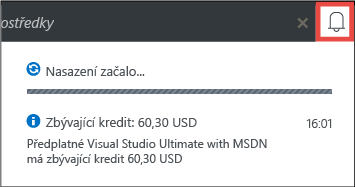
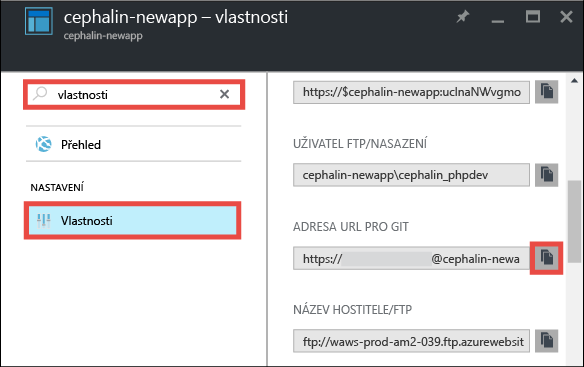
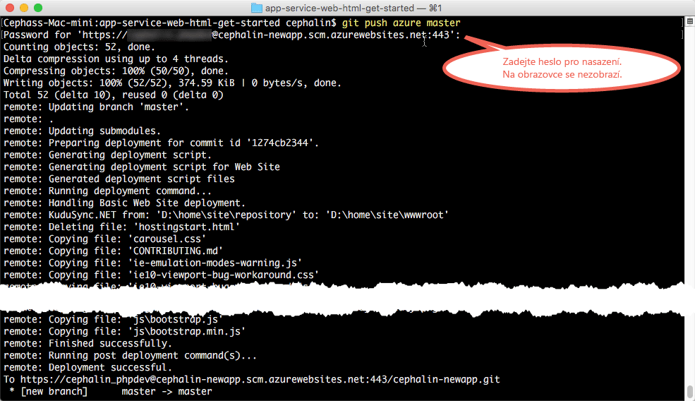

<properties 
    pageTitle="Nasazení vaší první webové aplikace do Azure během pěti minut | Microsoft Azure" 
    description="Nasazením ukázkové aplikace zjistíte, jak snadné je spustit webové aplikace ve službě App Service. Pusťte se hned do skutečného vývoje. Výsledky uvidíte okamžitě." 
    services="app-service\web"
    documentationCenter=""
    authors="cephalin"
    manager="wpickett"
    editor=""
/>

<tags
    ms.service="app-service-web"
    ms.workload="web"
    ms.tgt_pltfrm="na"
    ms.devlang="na"
    ms.topic="hero-article"
    ms.date="09/09/2016" 
    ms.author="cephalin"
/>
    
# Nasazení vaší první webové aplikace do Azure během pěti minut

Tento kurz vám pomůže nasadit první webovou aplikaci do služby [Azure App Service](../app-service/app-service-value-prop-what-is.md).
Službu App Service můžete používat při vytváření webových aplikací, [back-endů mobilních aplikací](/documentation/learning-paths/appservice-mobileapps/) a [aplikací API](../app-service-api/app-service-api-apps-why-best-platform.md).

Vaším úkolem je: 

- Vytvořit webovou aplikaci ve službě Azure App Service.
- Nasadit ukázkový kód (zvolte ASP.NET, PHP, Node.js, Javu nebo Python).
- Sledovat spuštění kódu naživo v produkčním prostředí.
- Aktualizovat webovou aplikaci stejným způsobem, jakým byste [nuceně doručili (push) potvrzené změny do Git](https://git-scm.com/docs/git-push).

## Požadavky

- [Nainstalovat Git](http://www.git-scm.com/downloads). Ověřit, že instalace proběhla úspěšně, a to spuštěním `git --version` z nového příkazového řádku Windows, okna PowerShellu, prostředí Linuxu nebo terminálu OS X.
- Získat účet Microsoft Azure. Pokud nemáte účet, můžete se [zaregistrovat k bezplatné zkušební verzi](/pricing/free-trial/?WT.mc_id=A261C142F) nebo si [aktivovat výhody předplatitele Visual Studio](/pricing/member-offers/msdn-benefits-details/?WT.mc_id=A261C142F).

>[AZURE.NOTE] [App Service si můžete vyzkoušet](http://go.microsoft.com/fwlink/?LinkId=523751) bez účtu Azure. Můžete si vytvořit úvodní aplikaci a celou hodinu si s ní hrát, bez platebních karet a bez závazků.

## Vytvoření webové aplikace

1. Přihlaste se k webu [Azure Portal](https://portal.azure.com) pomocí svého účtu Azure.

2. V levé nabídce klikněte na **Nové** > **Web + mobilní zařízení** > **Webová aplikace**.

    

3. V okně pro vytvoření aplikace použijte pro novou aplikaci následující nastavení:

    - **Název aplikace**: Zadejte jedinečný název.
    - **Skupina prostředků**: Vyberte **Vytvořit novou** a zadejte název nové skupiny prostředků.
    - **Plán/umístění služby App Service**: Kliknutím na tuto položku přejděte ke konfiguraci a potom klikněte na **Vytvořit nový** a nastavte název, umístění a cenovou úroveň plánu služby App Service. Nebojte se využít cenovou úroveň **Free**.

    Až skončíte, mělo by okno pro vytvoření aplikace vypadat takto:

    

3. V dolní části klikněte na **Vytvořit**. Kliknutím na ikonu **Oznámení** v horní části můžete zobrazit průběh akce.

    

4. Až se nasazení dokončí, mělo by se zobrazit tato oznámení. Kliknutím na tuto zprávu otevřete okno vašeho nasazení.

    

5. V okně **Nasazení bylo úspěšné** klikněte na odkaz **Prostředek**. Otevře se okno nové webové aplikace.

    

## Nasazení kódu do webové aplikace

Teď do Azure pomocí Gitu nasadíme kód.

5. V okně webové aplikace se posuňte dolů k položce **Možnosti nasazení** (nebo ji vyhledejte) a potom na ni klikněte. 

    

6. Klikněte na **Zvolit zdroj** > **Místní úložiště Git** > **OK**.

7. V okně webové aplikace klikněte na **Přihlašovací údaje pro nasazení**.

8. Nastavte přihlašovací údaje pro nasazení a klikněte na **Uložit**.

7. V okně webové aplikace se posuňte dolů k položce **Vlastnosti** (nebo ji vyhledejte) a potom na ni klikněte. Vedle položky **Adresa URL pro Git** klikněte na tlačítko **Kopírovat**.

    

    Teď jste připraveni nasadit svůj kód pomocí Gitu.

1. V terminálu příkazového řádku přejděte do pracovního adresáře (`CD`) a naklonujte ukázkovou aplikaci tímto způsobem:

        git clone <github_sample_url>

    

    Jako adresu *&lt;github_sample_url>* použijte jednu z následujících adres URL, a to v závislosti na vámi upřednostňovaném prostředí:

    - HTML+CSS+JS: [https://github.com/Azure-Samples/app-service-web-html-get-started.git](https://github.com/Azure-Samples/app-service-web-html-get-started.git)
    - ASP.NET: [https://github.com/Azure-Samples/app-service-web-dotnet-get-started.git](https://github.com/Azure-Samples/app-service-web-dotnet-get-started.git)
    - PHP (CodeIgniter): [https://github.com/Azure-Samples/app-service-web-php-get-started.git](https://github.com/Azure-Samples/app-service-web-php-get-started.git)
    - Node.js (Express): [https://github.com/Azure-Samples/app-service-web-nodejs-get-started.git](https://github.com/Azure-Samples/app-service-web-nodejs-get-started.git)
    - Java: [https://github.com/Azure-Samples/app-service-web-java-get-started.git](https://github.com/Azure-Samples/app-service-web-java-get-started.git)
    - Python (Django): [https://github.com/Azure-Samples/app-service-web-python-get-started.git](https://github.com/Azure-Samples/app-service-web-python-get-started.git)

2. Přejděte do úložiště ukázkové aplikace. Například: 

        cd app-service-web-html-get-started

3. Nakonfigurujte vzdálené úložiště Git pro aplikaci Azure pomocí adresy URL pro Git, kterou jste zkopírovali z portálu v jednom z předchozích kroků.

        git remote add azure <giturlfromportal>

4. Nasaďte ukázkový kód do aplikace Azure stejným způsobem, jakým byste doručili bez vyžádání (push) libovolný kód prostřednictvím Gitu:

        git push azure master

        

    Pokud jste použili jedno z jazykových rozhraní, zobrazí se jiný výstup. Důvodem je, že `git push` nejen vloží kód v Azure, ale také aktivuje úlohy nasazení v modulu pro nasazení. Máte-li v kořenovém adresáři projektu (úložiště) libovolné soubory package.json (Node.js) nebo requirements.txt (Python) nebo máte-li v projektu ASP.NET soubor packages.config, skripty nasazení vám obnoví požadované balíčky. Můžete také [povolit rozšíření Autora](web-sites-php-mysql-deploy-use-git.md#composer) a automaticky zpracovávat soubory composer.json v aplikaci PHP.

A to je vše! Váš kód teď živě běží v Azure. V prohlížeči přejděte na http://*&lt;název_aplikace>*.azurewebsites.net a prohlédněte si ho. 

## Provádění aktualizací aplikace

Nyní můžete pomocí Git kdykoli provádět nucené doručení (push) z kořenového adresáře projektu (úložiště) a aktualizovat živý web. Postup je stejný jako při prvním nasazení kódu. Například pokaždé, když chcete nuceně doručit (push) novou změnu, kterou jste místně otestovali, stačí spustit následující příkazy z kořenového adresáře projektu (úložiště):

    git add .
    git commit -m "<your_message>"
    git push azure master

## Další kroky

Vyhledejte upřednostňované kroky při vývoji a nasazení pro vaše jazykové prostředí:

> [AZURE.SELECTOR]
- [.NET](web-sites-dotnet-get-started.md)
- [PHP](app-service-web-php-get-started.md)
- [Node.js](app-service-web-nodejs-get-started.md)
- [Python](web-sites-python-ptvs-django-mysql.md)
- [Java](web-sites-java-get-started.md)

Další možností je pokračovat v práci s první webovou aplikací. Příklad:

- Vyzkoušejte si [další způsoby nasazení kódu do Azure](../app-service-web/web-sites-deploy.md). Pokud třeba chcete pro nasazení použít některé z úložišť GitHubu, stačí v části **Možnosti nasazení** místo **Místní úložiště Git** vybrat **GitHub**.
- Zdokonalte aplikaci Azure o další úroveň. Ověřte svoje uživatele. Škálujte ji na základě poptávky. Nastavte některá upozornění týkající se výkonu. To vše pomocí několika kliknutí. Viz téma [Přidání funkce do první webové aplikace](app-service-web-get-started-2.md).

<!--HONumber=sep14_HO2-->

