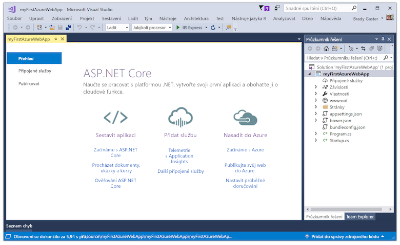
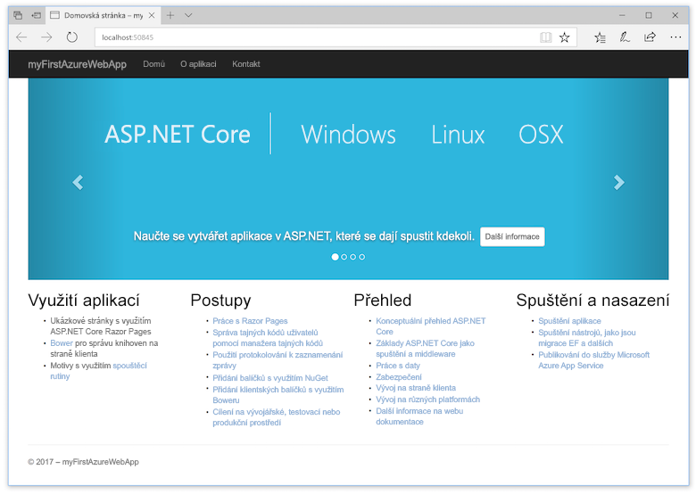
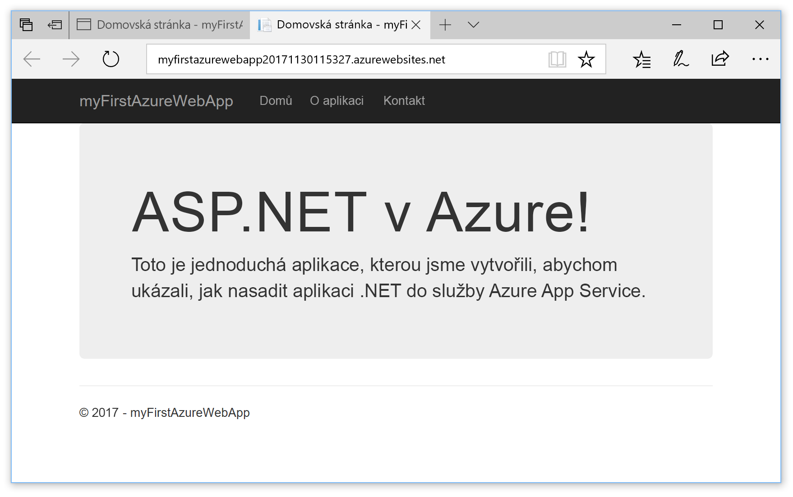

# <a name="create-an-aspnet-core-web-app-in-azure"></a>Vytvoření webové aplikace ASP.NET Core v Azure

> [!NOTE]
> Tento článek nasadí aplikaci do služby App Service ve Windows. Nasazení do služby App Service v _Linuxu_ je popsané v tématu [Vytvoření webové aplikace v .NET Core ve službě App Service v Linuxu](./containers/quickstart-dotnetcore.md).
>
> Pokud hledáte postup pro aplikaci ASP.NET Framework, přečtěte si téma [Vytvoření webové aplikace ASP.NET Framework v Azure](app-service-web-get-started-dotnet-framework.md). 
>

[Azure Web Apps](app-service-web-overview.md) je vysoce škálovatelná služba s automatickými opravami pro hostování webů.  V tomto kurzu Rychlý start se dozvíte, jak nasadit svoji první webovou aplikaci ASP.NET Core do služby Azure Web Apps. Po dokončení kurzu budete mít skupinu prostředků, která se bude skládat z plánu služby App Service a webové aplikace Azure s nasazenou webovou aplikací.

[!INCLUDE [quickstarts-free-trial-note](../../includes/quickstarts-free-trial-note.md)]

## <a name="prerequisites"></a>Požadavky

K provedení kroků v tomto kurzu je potřeba:

* Nainstalovat <a href="https://www.visualstudio.com/downloads/" target="_blank">Visual Studio 2017</a> s následujícími sadami funkcí:
    - **Vývoj pro ASP.NET a web**
    - **Azure – vývoj**

    

## <a name="create-an-aspnet-core-web-app"></a>Vytvoření webové aplikace ASP.NET Core

Ve Visual Studiu vytvořte projekt tak, že vyberete **Soubor > Nový > Projekt**. 

V dialogovém okně **Nový projekt** vyberte **Visual C# > Web > Webová aplikace ASP.NET Core**.

Pojmenujte aplikaci _myFirstAzureWebApp_, pak vyberte **Vytvořit nové úložiště Git** a vyberte **OK**.
   


Do Azure můžete nasadit jakýkoli typ webové aplikace ASP.NET Core. V tomto kurzu Rychlý start vyberte šablonu **Webová aplikace** a ujistěte se, že u ověřování je nastavena možnost **Bez ověření**.
      
Vyberte **OK**.


Jakmile se vytvoří projekt ASP.NET Core, zobrazí se úvodní stránka ASP.NET Core s řadou odkazů, které vám pomohou v začátcích. 



V nabídce vyberte **Ladit > Spustit bez ladění** a spusťte tak webovou aplikaci místně.



[!INCLUDE [cloud-shell-try-it.md](../../includes/cloud-shell-try-it.md)]

[!INCLUDE [Configure deployment user](../../includes/configure-deployment-user.md)] 

[!INCLUDE [Create resource group](../../includes/app-service-web-create-resource-group.md)] 

[!INCLUDE [Create app service plan](../../includes/app-service-web-create-app-service-plan.md)] 

[!INCLUDE [Create web app](../../includes/app-service-web-create-web-app.md)] 


## <a name="push-to-azure-from-visual-studio"></a>Uložení do Azure ze sady Visual Studio

Zpět v sadě Visual Studio klikněte v nabídce **Zobrazit** na **Team Explorer**. Zobrazí se **Team Explorer**.

V zobrazení **Domů** klikněte na **Nastavení** > **Nastavení úložiště**.


V části **Vzdálená úložiště** vyberte v **Nastavení úložiště** **Přidat**. Zobrazí se dialogové okno **Přidat vzdálené úložiště**.

V poli **Název** zadejte _Azure_ a v poli **Načíst** zadejte adresu URL, kterou jste si uložili v kroku [Vytvoření webové aplikace](#create-a-web-app). Klikněte na **Uložit**.


Toto nastavení je ekvivalentní příkazu Git `git remote add Azure <URL>`.

Klikněte na tlačítko **Domů** v horní části.

Vyberte **Nastavení** > **Globální nastavení**. Zkontrolujte, jestli je zadané jméno a e-mailová adresa. V případě potřeby vyberte **Aktualizovat**.

Visual Studio už potvrdilo všechny soubory do úložiště Git, když vytvořilo projekt. Teď stačí jen odeslat soubory do Azure.

Klikněte na tlačítko **Domů** v horní části. Vyberte **Synchronizace** > **Akce** > **Otevřít příkazový řádek**. 

V příkazovém okně zadejte následující příkaz a po zobrazení výzvy zadejte heslo nasazení:

```
git push Azure master
```

Spuštění tohoto příkazu může trvat několik minut. Při spuštění příkaz zobrazí podobné informace jako v následujícím příkladu:

```
Counting objects: 4, done.
Delta compression using up to 8 threads.
Compressing objects: 100% (4/4), done.
Writing objects: 100% (4/4), 349 bytes | 349.00 KiB/s, done.
Total 4 (delta 3), reused 0 (delta 0)
remote: Updating branch 'master'.
remote: Updating submodules.
remote: Preparing deployment for commit id '9e20345e9c'.
remote: Generating deployment script.
remote: Project file path: .\myFirstAzureWebApp\myFirstAzureWebApp.csproj
remote: Solution file path: .\myFirstAzureWebApp.sln
remote: Generated deployment script files
remote: Running deployment command...
remote: Handling ASP.NET Core Web Application deployment.
remote:   Restoring packages for D:\home\site\repository\myFirstAzureWebApp\myFirstAzureWebApp.csproj...
remote:   Restoring packages for D:\home\site\repository\myFirstAzureWebApp\myFirstAzureWebApp.csproj...
...
remote: Finished successfully.
remote: Running post deployment command(s)...
remote: Deployment successful.
To https://<app_name>.scm.azurewebsites.net/<app_name>.git
 * [new branch]      master -> master
```

## <a name="browse-to-the-app"></a>Přechod do aplikace

V prohlížeči přejděte na adresu URL webové aplikace Azure: `http://<app_name>.azurewebsites.net`.

Stránka je spuštěná jako webová aplikace služby Azure App Service.


Blahopřejeme, vaše webová aplikace ASP.NET Core je spuštěná ve službě Azure App Service.

## <a name="update-the-app-and-redeploy"></a>Aktualizace a opětovné nasazení aplikace

Z **Průzkumníku řešení** otevřete _Pages/Index.cshtml_.

Najděte HTML značku `<div id="myCarousel" class="carousel slide" data-ride="carousel" data-interval="6000">` poblíž začátku a nahraďte celý element následujícím kódem:

```HTML
<div class="jumbotron">
    <h1>ASP.NET in Azure!</h1>
    <p class="lead">This is a simple app that we’ve built that demonstrates how to deploy a .NET app to Azure App Service.</p>
</div>
```

V **Průzkumníku řešení** klikněte pravým tlačítkem na _Pages/Index.cshtml_ a klikněte na **Potvrdit**. Zadejte zprávu potvrzení změny a klikněte na **Potvrdit vše**.

Zpět v okně příkazového řádku odešlete změny kódu do Azure.

```bash
git push Azure master
```

Po dokončení nasazení přejděte znovu na `http://<app_name>.azurewebsites.net`.



## <a name="manage-the-azure-web-app"></a>Správa webové aplikace Azure

Pokud chcete webovou aplikaci spravovat, přejděte na portál <a href="https://portal.azure.com" target="_blank">Azure Portal</a>.

V levé nabídce klikněte na **App Services** a potom vyberte název své webové aplikace Azure.


Zobrazí se stránka s přehledem vaší webové aplikace. Tady můžete provádět základní úlohy správy, jako je procházení, zastavení, spuštění, restartování a odstranění. 


Levá nabídka obsahuje odkazy na různé stránky pro konfiguraci vaší aplikace. 

[!INCLUDE [Clean-up section](../../includes/clean-up-section-portal.md)]

## <a name="next-steps"></a>Další kroky

> [!div class="nextstepaction"]
> [ASP.NET Core s SQL Database](app-service-web-tutorial-dotnetcore-sqldb.md)
