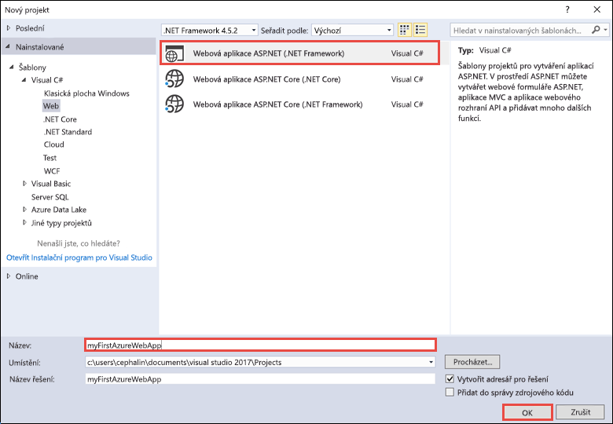
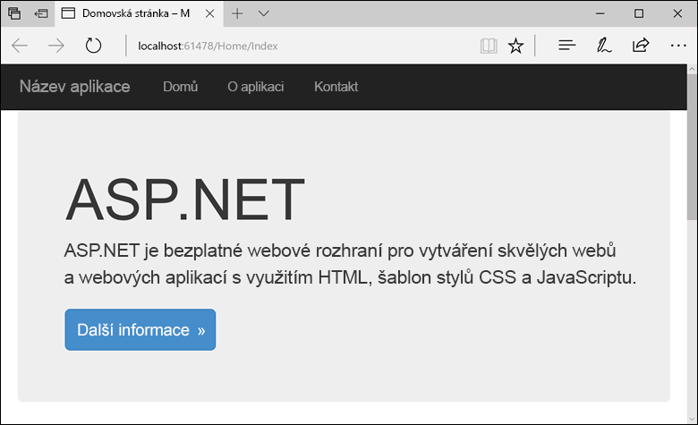
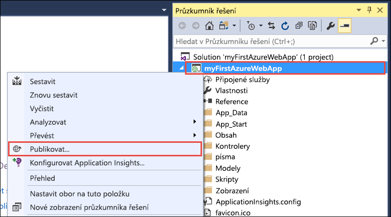
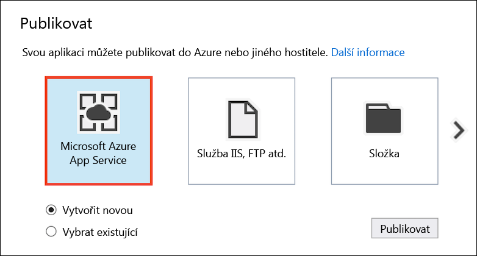
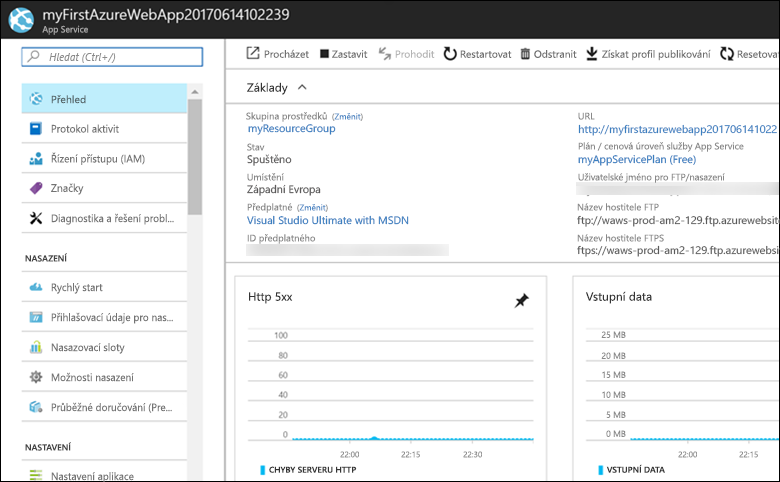

# <a name="create-an-aspnet-web-app-in-azure"></a>Vytvoření webové aplikace ASP.NET v Azure

[Azure Web Apps](app-service-web-overview.md) je vysoce škálovatelná služba s automatickými opravami pro hostování webů.  V tomto kurzu Rychlý start se dozvíte, jak nasadit svoji první webovou aplikaci ASP.NET pomocí služby Azure Web Apps. Po dokončení kurzu budete mít skupinu prostředků, která se bude skládat z plánu služby App Service a webové aplikace Azure s nasazenou webovou aplikací.

Podívejte se na video s tímto rychlým startem v akci a potom sami proveďte příslušné kroky a publikujte svou první aplikaci .NET v Azure.

> [!VIDEO https://channel9.msdn.com/Shows/Azure-for-NET-Developers/Create-a-NET-app-in-Azure-Quickstart/player]

## <a name="prerequisites"></a>Požadavky

K provedení kroků v tomto kurzu je potřeba:

* Nainstalovat [Visual Studio 2017](https://www.visualstudio.com/downloads/) s následujícími sadami funkcí:
    - **Vývoj pro ASP.NET a web**
    - **Azure – vývoj**

    

[!INCLUDE [quickstarts-free-trial-note](../../includes/quickstarts-free-trial-note.md)]

## <a name="create-an-aspnet-web-app"></a>Vytvoření webové aplikace ASP.NET

Ve Visual Studiu vytvořte projekt tak, že vyberete **Soubor > Nový > Projekt**. 

V dialogovém okně **Nový projekt** vyberte **Visual C# > Web > Webová aplikace ASP.NET (.NET Framework)**.

Aplikaci pojmenujte _myFirstAzureWebApp_ a pak vyberte **OK**.
   


Do Azure můžete nasadit jakýkoli typ webové aplikace ASP.NET. V tomto kurzu Rychlý start vyberte šablonu **MVC** a ujistěte se, že u ověřování je nastavena možnost **Bez ověření**.
      
Vyberte **OK**.


V nabídce vyberte **Ladit > Spustit bez ladění** a spusťte tak webovou aplikaci místně.



## <a name="publish-to-azure"></a>Publikování aplikací do Azure

V **Průzkumníku řešení** klikněte pravým tlačítkem na projekt **myFirstAzureWebApp** a vyberte možnost **Publikovat**.



Zkontrolujte, že je vybrána možnost **Microsoft Azure App Service** a vyberte **Publikovat**.



Tím se otevře dialogové okno **Vytvořit plán Aplikační služby**, které vám pomůže vytvořit všechny prostředky služby Azure potřebné ke spuštění webové aplikace ASP.NET ve službě Azure.

## <a name="sign-in-to-azure"></a>Přihlášení k Azure

V dialogovém okně **Vytvořit plán Aplikační služby** vyberte **Přidat účet** a přihlaste se ke svému předplatnému Azure. Pokud už jste přihlášeni, vyberte z rozevíracího seznamu účet, který obsahuje požadované předplatné.

> [!NOTE]
> Pokud už jste přihlášení, nevybírejte zatím možnost **Vytvořit**.
>
>
   


## <a name="create-a-resource-group"></a>Vytvoření skupiny prostředků

[!INCLUDE [resource group intro text](../../includes/resource-group.md)]

Vedle pole **Skupina prostředků** vyberte **Nová**.

Skupinu prostředků pojmenujte **myResourceGroup** a vyberte **OK**.

## <a name="create-an-app-service-plan"></a>Vytvoření plánu služby App Service

[!INCLUDE [app-service-plan](../../includes/app-service-plan.md)]

Vedle pole **Plán služby App Service** vyberte **Nový**. 

V dialogovém okně **Konfigurovat plán Aplikační služby** použijte nastavení podle tabulky následující po snímku obrazovky.


| Nastavení | Navrhovaná hodnota | Popis |
|-|-|-|
|Plán služby App Service| myAppServicePlan | Název plánu služby App Service. |
| Umístění | Západní Evropa | Datacentrum, které je hostitelem webové aplikace. |
| Velikost | Free | [Cenová úroveň](https://azure.microsoft.com/pricing/details/app-service/?ref=microsoft.com&utm_source=microsoft.com&utm_medium=docs&utm_campaign=visualstudio) určuje funkce hostování. |

Vyberte **OK**.

## <a name="create-and-publish-the-web-app"></a>Vytvoření a publikování webové aplikace

V části **Název webové aplikace** zadejte jedinečný název aplikace (platné znaky jsou `a-z`, `0-9` a `-`) nebo přijměte automaticky vygenerovaný jedinečný název. Adresa URL webové aplikace je `http://<app_name>.azurewebsites.net`, kde `<app_name>` je název vaší webové aplikace.

Výběrem možnosti **Vytvořit** spustíte vytváření prostředků Azure.


Průvodce po dokončení publikuje webovou aplikaci ASP.NET do služby Azure a pak aplikaci spustí ve výchozím prohlížeči.


Název webové aplikace zadaný v [kroku vytvoření a publikování](#create-and-publish-the-web-app) se použije jako předpona adresy URL ve formátu `http://<app_name>.azurewebsites.net`.

Blahopřejeme, vaše webová aplikace ASP.NET je veřejně spuštěná ve službě Azure App Service.

## <a name="update-the-app-and-redeploy"></a>Aktualizace a opětovné nasazení aplikace

Z **Průzkumníku řešení** otevřete _Views\Home\Index.cshtml_.

Najděte HTML značku `<div class="jumbotron">` poblíž začátku a nahraďte celý element následujícím kódem:

```HTML
<div class="jumbotron">
    <h1>ASP.NET in Azure!</h1>
    <p class="lead">This is a simple app that we’ve built that demonstrates how to deploy a .NET app to Azure App Service.</p>
</div>
```

Opětovné nasazení do služby Azure provedete tak, že v **Průzkumníku řešení** kliknete pravým tlačítkem na projekt **myFirstAzureWebApp** a vyberete **Publikovat**.

Na stránce publikování vyberte **Publikovat**.

Po dokončení publikování spustí Visual Studio prohlížeč na adrese URL webové aplikace.


## <a name="manage-the-azure-web-app"></a>Správa webové aplikace Azure

Pokud chcete webovou aplikaci spravovat, přejděte na web <a href="https://portal.azure.com" target="_blank">Azure Portal</a>.

V levé nabídce klikněte na **App Services** a potom vyberte název své webové aplikace Azure.


Zobrazí se stránka s přehledem vaší webové aplikace. Tady můžete provádět základní úlohy správy, jako je procházení, zastavení, spuštění, restartování a odstranění. 



Levá nabídka obsahuje odkazy na různé stránky pro konfiguraci vaší aplikace. 

[!INCLUDE [Clean-up section](../../includes/clean-up-section-portal.md)]

## <a name="next-steps"></a>Další kroky

> [!div class="nextstepaction"]
> [ASP.NET s databází SQL Database](app-service-web-tutorial-dotnet-sqldatabase.md)
