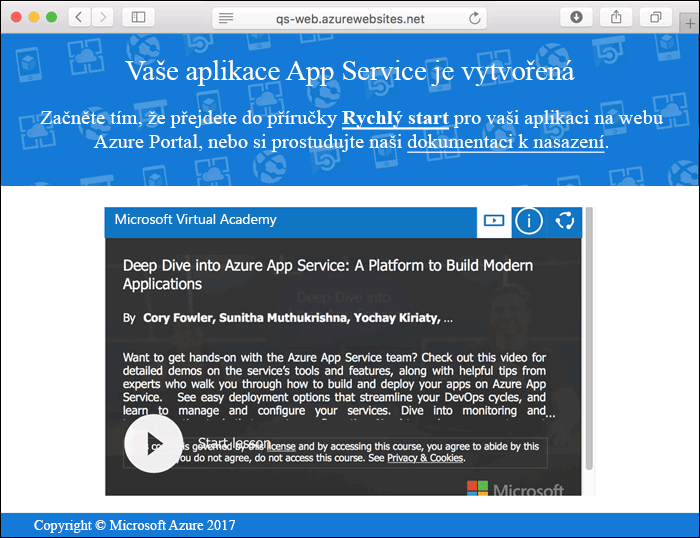
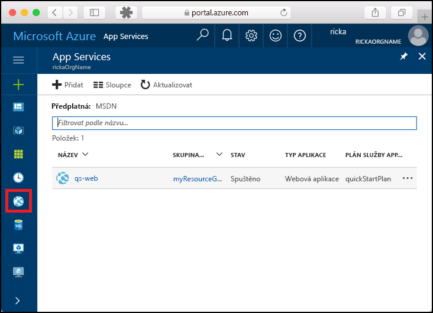
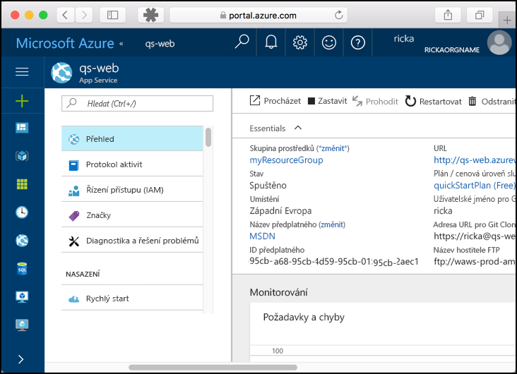

# <a name="create-a-static-html-web-app-in-azure"></a>Vytvoření webové aplikace ve statickém HTML ve službě Azure

[Azure Web Apps](app-service-web-overview.md) je vysoce škálovatelná služba s automatickými opravami pro hostování webů.  Tento kurz Rychlý start vás provede postupem nasazení základního webu v HTML se styly CSS do služby Azure Web Apps. Vytvoříte webovou aplikaci pomocí rozhraní příkazového řádku [Azure CLI](https://docs.microsoft.com/cli/azure/get-started-with-azure-cli) a pomocí Gitu nasadíte ukázkový obsah v HTML do webové aplikace.


Následující postup můžete použít v případě počítačů Mac, Windows nebo Linux. Pokud máte nainstalované všechny požadované prostředky, zabere vám tento postup zhruba pět minut.

## <a name="prerequisites"></a>Požadavky

K provedení kroků v tomto kurzu Rychlý start je potřeba:

- <a href="https://git-scm.com/" target="_blank">Nainstalovat Git</a>.

[!INCLUDE [quickstarts-free-trial-note](../../includes/quickstarts-free-trial-note.md)]

## <a name="download-the-sample"></a>Stažení ukázky

V okně terminálu naklonujte spuštěním následujícího příkazu úložiště ukázkové aplikace do místního počítače.

```bash
git clone https://github.com/Azure-Samples/html-docs-hello-world.git
```

Přejděte do adresáře, který obsahuje vzorový kód.

```bash
cd html-docs-hello-world
```

## <a name="view-the-html"></a>Zobrazení kódu HTML

Přejděte do adresáře, který obsahuje ukázkový kód HTML. Otevřete v prohlížeči soubor *index.html*.


[!INCLUDE [cloud-shell-try-it.md](../../includes/cloud-shell-try-it.md)]

[!INCLUDE [Configure deployment user](../../includes/configure-deployment-user.md)] 

[!INCLUDE [Create resource group](../../includes/app-service-web-create-resource-group.md)] 

[!INCLUDE [Create app service plan](../../includes/app-service-web-create-app-service-plan.md)] 

[!INCLUDE [Create web app](../../includes/app-service-web-create-web-app.md)] 



[!INCLUDE [Push to Azure](../../includes/app-service-web-git-push-to-azure.md)] 

```bash
Counting objects: 13, done.
Delta compression using up to 4 threads.
Compressing objects: 100% (11/11), done.
Writing objects: 100% (13/13), 2.07 KiB | 0 bytes/s, done.
Total 13 (delta 2), reused 0 (delta 0)
remote: Updating branch 'master'.
remote: Updating submodules.
remote: Preparing deployment for commit id 'cc39b1e4cb'.
remote: Generating deployment script.
remote: Generating deployment script for Web Site
remote: Generated deployment script files
remote: Running deployment command...
remote: Handling Basic Web Site deployment.
remote: KuduSync.NET from: 'D:\home\site\repository' to: 'D:\home\site\wwwroot'
remote: Deleting file: 'hostingstart.html'
remote: Copying file: '.gitignore'
remote: Copying file: 'LICENSE'
remote: Copying file: 'README.md'
remote: Finished successfully.
remote: Running post deployment command(s)...
remote: Deployment successful.
To https://<app_name>.scm.azurewebsites.net/<app_name>.git
 * [new branch]      master -> master
```

## <a name="browse-to-the-app"></a>Přechod do aplikace

V prohlížeči přejděte na adresu URL webové aplikace Azure: `http://<app_name>.azurewebsites.net`.

Stránka je spuštěná jako webová aplikace služby Azure App Service.


**Blahopřejeme!** Nasadili jste svoji první aplikaci v HTML do služby App Service.

## <a name="update-and-redeploy-the-app"></a>Aktualizace a opětovné nasazení aplikace

V textovém editoru otevřete soubor *index.html* a změňte kód. Můžete například změnit nadpis H1 z „Azure App Service - Sample Static HTML Site“ na „Azure App Service“.

V místním okně terminálu potvrďte změny v Gitu a potom nasdílejte změny kódu do Azure.

```bash
git commit -am "updated HTML"
git push azure master
```

Po dokončení nasazení aktualizujte prohlížeč, aby se změny projevily.


## <a name="manage-your-new-azure-web-app"></a>Správa vaší nové webové aplikace Azure

Pokud chcete spravovat webovou aplikaci, kterou jste vytvořili, přejděte na web <a href="https://portal.azure.com" target="_blank">Azure Portal</a>.

V levé nabídce klikněte na **App Services** a pak klikněte na název vaší webové aplikace Azure.



Zobrazí se stránka s přehledem vaší webové aplikace. Tady můžete provádět základní úlohy správy, jako je procházení, zastavení, spuštění, restartování a odstranění. 



Levá nabídka obsahuje odkazy na různé stránky pro konfiguraci vaší aplikace. 

[!INCLUDE [cli-samples-clean-up](../../includes/cli-samples-clean-up.md)]

## <a name="next-steps"></a>Další kroky

> [!div class="nextstepaction"]
> [Mapování vlastní domény](app-service-web-tutorial-custom-domain.md)
