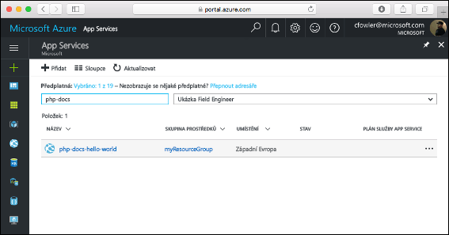
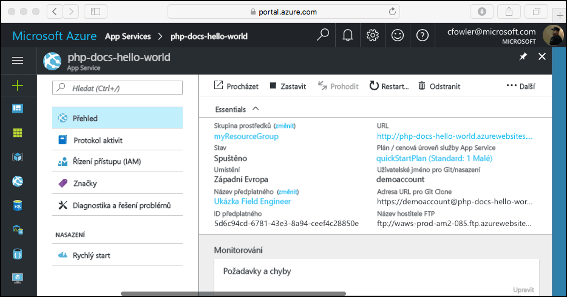

# <a name="create-a-php-web-app-in-azure"></a>Vytvoření webové aplikace v PHP v Azure

[Azure Web Apps](app-service-web-overview.md) je vysoce škálovatelná služba s automatickými opravami pro hostování webů.  V tomto kurzu Rychlý start se dozvíte, jak nasadit aplikaci PHP pomocí služby Azure Web Apps. Pomocí [Azure CLI](https://docs.microsoft.com/cli/azure/get-started-with-azure-cli) ve službě Cloud Shell vytvoříte webovou aplikaci a pomocí Gitu do této webové aplikace nasadíte vzorový kód PHP.

![Sample app running in Azure]](media/app-service-web-get-started-php/hello-world-in-browser.png)

Následující postup můžete použít v případě počítačů Mac, Windows nebo Linux. Pokud máte nainstalované všechny požadované prostředky, zabere vám tento postup zhruba pět minut.

## <a name="prerequisites"></a>Požadavky

K provedení kroků v tomto kurzu Rychlý start je potřeba:

* <a href="https://git-scm.com/" target="_blank">Nainstalovat Git</a>.
* <a href="https://php.net" target="_blank">Nainstalovat PHP</a>.

[!INCLUDE [quickstarts-free-trial-note](../../includes/quickstarts-free-trial-note.md)]

## <a name="download-the-sample-locally"></a>Místní stažení ukázky

V okně terminálu spusťte následující příkazy. Tím se na váš místní počítač naklonuje ukázková aplikace a přejdete do adresáře se vzorovým kódem.

```bash
git clone https://github.com/Azure-Samples/php-docs-hello-world
cd php-docs-hello-world
```

## <a name="run-the-app-locally"></a>Místní spuštění aplikace

Aplikaci spustíte místně tak, že otevřete okno terminálu a pomocí příkazu `php` spustíte integrovaný webový server PHP.

```bash
php -S localhost:8080
```

Otevřete webový prohlížeč a přejděte na ukázkovou aplikaci v `http://localhost:8080`.

Na stránce se zobrazí zpráva **Hello World!** z ukázkové aplikace.


V okně terminálu ukončete webový server stisknutím **Ctrl + C**.

[!INCLUDE [cloud-shell-try-it.md](../../includes/cloud-shell-try-it.md)]

[!INCLUDE [Configure deployment user](../../includes/configure-deployment-user.md)]

[!INCLUDE [Create resource group](../../includes/app-service-web-create-resource-group.md)]

[!INCLUDE [Create app service plan](../../includes/app-service-web-create-app-service-plan.md)]

## <a name="create-a-web-app"></a>Vytvoření webové aplikace

[!INCLUDE [Create web app](../../includes/app-service-web-create-web-app-php-no-h.md)]

Vyhledejte nově vytvořenou webovou aplikaci. Nahraďte  _&lt;název aplikace >_ s jedinečným názvem aplikace.

```bash
http://<app name>.azurewebsites.net
```


[!INCLUDE [Push to Azure](../../includes/app-service-web-git-push-to-azure.md)] 

```bash
Counting objects: 2, done.
Delta compression using up to 4 threads.
Compressing objects: 100% (2/2), done.
Writing objects: 100% (2/2), 352 bytes | 0 bytes/s, done.
Total 2 (delta 1), reused 0 (delta 0)
remote: Updating branch 'master'.
remote: Updating submodules.
remote: Preparing deployment for commit id '25f18051e9'.
remote: Generating deployment script.
remote: Running deployment command...
remote: Handling Basic Web Site deployment.
remote: Kudu sync from: '/home/site/repository' to: '/home/site/wwwroot'
remote: Copying file: '.gitignore'
remote: Copying file: 'LICENSE'
remote: Copying file: 'README.md'
remote: Copying file: 'index.php'
remote: Ignoring: .git
remote: Finished successfully.
remote: Running post deployment command(s)...
remote: Deployment successful.
To https://<app_name>.scm.azurewebsites.net/<app_name>.git
   cc39b1e..25f1805  master -> master
```

## <a name="browse-to-the-app-locally"></a>Místní přechod do aplikace

V prohlížeči zadejte adresu nasazené aplikace.

```bash
http://<app_name>.azurewebsites.net
```

Vzorový kód PHP je spuštěný ve webové aplikaci služby Azure App Service.


**Blahopřejeme!** Nasadili jste svoji první aplikaci v PHP do služby App Service.

## <a name="update-locally-and-redeploy-the-code"></a>Místní aktualizace a opětovné nasazení kódu

Pomocí místního textového editoru otevřete soubor `index.php`, který je součástí PHP aplikace, a proveďte malou změnu textu v řetězci vedle `echo`:

```php
echo "Hello Azure!";
```

V místní okno terminálu potvrdit změny v úložišti Git a potom odešlete změny kódu do Azure.

```bash
git commit -am "updated output"
git push azure master
```

Po dokončení nasazení se vraťte do okna prohlížeče, které se otevřelo v kroku **Přechod do aplikace**, a aktualizujte zobrazení stránky.


## <a name="manage-your-new-azure-web-app"></a>Správa vaší nové webové aplikace Azure

Pokud chcete spravovat webovou aplikaci, kterou jste vytvořili, přejděte na web <a href="https://portal.azure.com" target="_blank">Azure Portal</a>.

V levé nabídce klikněte na **App Services** a pak klikněte na název vaší webové aplikace Azure.



Zobrazí se stránka s přehledem vaší webové aplikace. Tady můžete provádět základní úlohy správy, jako je procházení, zastavení, spuštění, restartování a odstranění.



Levá nabídka obsahuje odkazy na různé stránky pro konfiguraci vaší aplikace. 

[!INCLUDE [cli-samples-clean-up](../../includes/cli-samples-clean-up.md)]

## <a name="next-steps"></a>Další kroky

> [!div class="nextstepaction"]
> [PHP s databází MySQL](app-service-web-tutorial-php-mysql.md)
