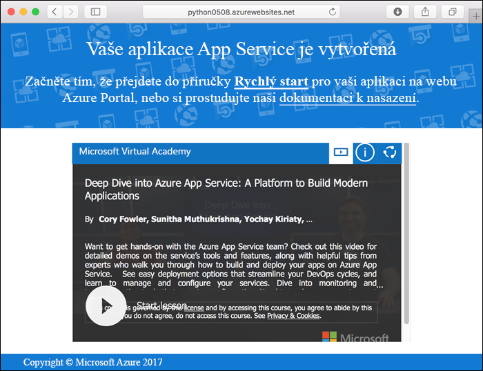
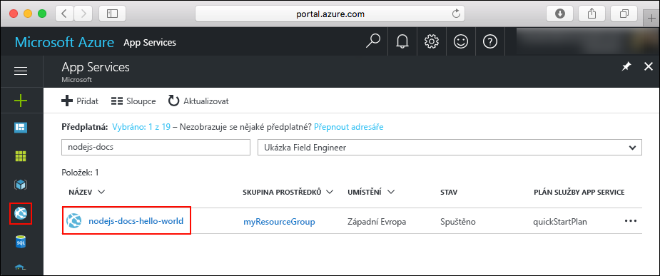
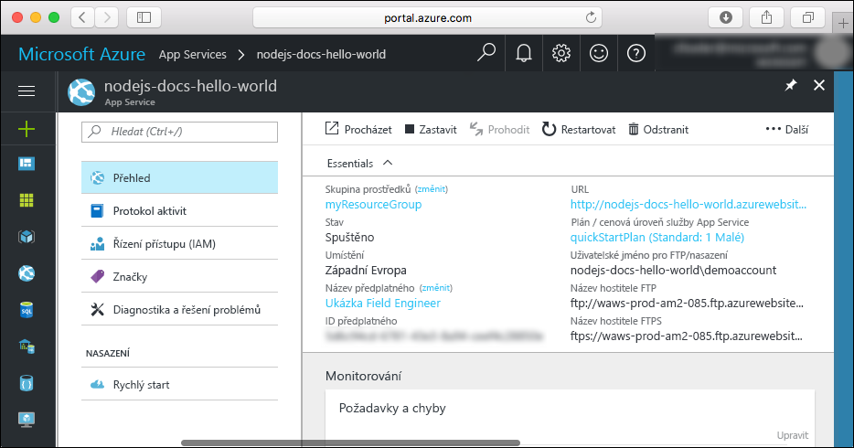

# <a name="create-a-python-web-app-in-azure"></a>Vytvoření webové aplikace v Pythonu v Azure

[Azure Web Apps](app-service-web-overview.md) je vysoce škálovatelná služba s automatickými opravami pro hostování webů.  Tento kurz Rychlý start vás provede vývojem a nasazením aplikace v Pythonu do Azure Web Apps. Vytvoříte webovou aplikaci pomocí rozhraní příkazového řádku [Azure CLI](https://docs.microsoft.com/cli/azure/get-started-with-azure-cli) a pomocí Gitu nasadíte do této webové aplikace ukázkový kód v Pythonu.


Postup v tomto kurzu můžete použít v případě počítačů se systémem Mac, Windows nebo Linux. Pokud máte nainstalované všechny požadované prostředky, zabere vám tento postup zhruba pět minut.

[!INCLUDE [quickstarts-free-trial-note](../../includes/quickstarts-free-trial-note.md)]

## <a name="prerequisites"></a>Požadavky

Pro absolvování tohoto kurzu potřebujete:

* <a href="https://git-scm.com/" target="_blank">Nainstalovat Git</a>.
* <a href="https://www.python.org/downloads/" target="_blank">Nainstalovat Python</a>.

## <a name="download-the-sample"></a>Stažení ukázky

V okně terminálu naklonujte spuštěním následujícího příkazu úložiště ukázkové aplikace do místního počítače.

```bash
git clone https://github.com/Azure-Samples/python-docs-hello-world
```

Přejděte do adresáře, který obsahuje vzorový kód.

```bash
cd python-docs-hello-world
```

## <a name="run-the-app-locally"></a>Místní spuštění aplikace

Nainstalujte požadovaný balíček pomocí `pip`.

```bash
pip install -r requirements.txt
```

Aplikaci spustíte místně tak, že otevřete okno terminálu a pomocí příkazu `Python` spustíte integrovaný webový server Python.

```bash
python main.py
```

Otevřete webový prohlížeč a přejděte do ukázkové aplikace na adrese `http://localhost:5000`.

Na stránce se zobrazí zpráva **Hello World** od ukázkové aplikace.


V okně terminálu ukončete webový server stisknutím **Ctrl + C**.

[!INCLUDE [cloud-shell-try-it.md](../../includes/cloud-shell-try-it.md)]

[!INCLUDE [Configure deployment user](../../includes/configure-deployment-user.md)]

[!INCLUDE [Create resource group](../../includes/app-service-web-create-resource-group.md)]

[!INCLUDE [Create app service plan](../../includes/app-service-web-create-app-service-plan.md)]

## <a name="create-a-web-app"></a>Vytvoření webové aplikace

[!INCLUDE [Create web app](../../includes/app-service-web-create-web-app-python-no-h.md)]

Přejděte do vaší nově vytvořené webové aplikace. Nahraďte _&lt;app name>_ jedinečným názvem aplikace.

```
http://<app name>.azurewebsites.net
```

Vaše nová webová aplikace by měla vypadat takto:



[!INCLUDE [Push to Azure](../../includes/app-service-web-git-push-to-azure.md)]

```bash
Counting objects: 18, done.
Delta compression using up to 4 threads.
Compressing objects: 100% (16/16), done.
Writing objects: 100% (18/18), 4.31 KiB | 0 bytes/s, done.
Total 18 (delta 4), reused 0 (delta 0)
remote: Updating branch 'master'.
remote: Updating submodules.
remote: Preparing deployment for commit id '44e74fe7dd'.
remote: Generating deployment script.
remote: Generating deployment script for python Web Site
remote: Generated deployment script files
remote: Running deployment command...
remote: Handling python deployment.
remote: KuduSync.NET from: 'D:\home\site\repository' to: 'D:\home\site\wwwroot'
remote: Deleting file: 'hostingstart.html'
remote: Copying file: '.gitignore'
remote: Copying file: 'LICENSE'
remote: Copying file: 'main.py'
remote: Copying file: 'README.md'
remote: Copying file: 'requirements.txt'
remote: Copying file: 'virtualenv_proxy.py'
remote: Copying file: 'web.2.7.config'
remote: Copying file: 'web.3.4.config'
remote: Detected requirements.txt.  You can skip Python specific steps with a .skipPythonDeployment file.
remote: Detecting Python runtime from site configuration
remote: Detected python-3.4
remote: Creating python-3.4 virtual environment.
remote: .................................
remote: Pip install requirements.
remote: Successfully installed Flask click itsdangerous Jinja2 Werkzeug MarkupSafe
remote: Cleaning up...
remote: .
remote: Overwriting web.config with web.3.4.config
remote:         1 file(s) copied.
remote: Finished successfully.
remote: Running post deployment command(s)...
remote: Deployment successful.
To https://<app_name>.scm.azurewebsites.net/<app_name>.git
 * [new branch]      master -> master
```

## <a name="browse-to-the-app"></a>Přechod do aplikace

V prohlížeči zadejte adresu nasazené aplikace.

```bash
http://<app_name>.azurewebsites.net
```

Ukázkový kód Pythonu je spuštěný ve webové aplikaci služby Azure App Service.


**Blahopřejeme!** Nasadili jste svoji první aplikaci v Pythonu do služby App Service.

## <a name="update-and-redeploy-the-code"></a>Aktualizace a opětovné nasazení kódu

Pomocí místního textového editoru otevřete soubor `main.py` v rámci aplikace v Pythonu a proveďte malou změnu textu vedle příkazu `return`:

```python
return 'Hello, Azure!'
```

V místním okně terminálu potvrďte změny v Gitu a potom nasdílejte změny kódu do Azure.

```bash
git commit -am "updated output"
git push azure master
```

Po dokončení nasazení se vraťte do okna prohlížeče, které se otevřelo v kroku [Přechod do aplikace](#browse-to-the-app), a aktualizujte zobrazení stránky.


## <a name="manage-your-new-azure-web-app"></a>Správa vaší nové webové aplikace Azure

Pokud chcete spravovat webovou aplikaci, kterou jste vytvořili, přejděte na web <a href="https://portal.azure.com" target="_blank">Azure Portal</a>.

V levé nabídce klikněte na **App Services** a pak klikněte na název vaší webové aplikace Azure.



Zobrazí se stránka s přehledem vaší webové aplikace. Tady můžete provádět základní úlohy správy, jako je procházení, zastavení, spuštění, restartování a odstranění.



Levá nabídka obsahuje odkazy na různé stránky pro konfiguraci vaší aplikace.

[!INCLUDE [cli-samples-clean-up](../../includes/cli-samples-clean-up.md)]

## <a name="next-steps"></a>Další kroky

> [!div class="nextstepaction"]
> [Mapování existujícího vlastního názvu DNS na Azure Web Apps](app-service-web-tutorial-custom-domain.md)
