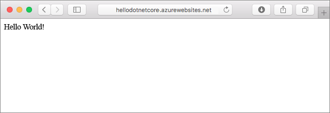
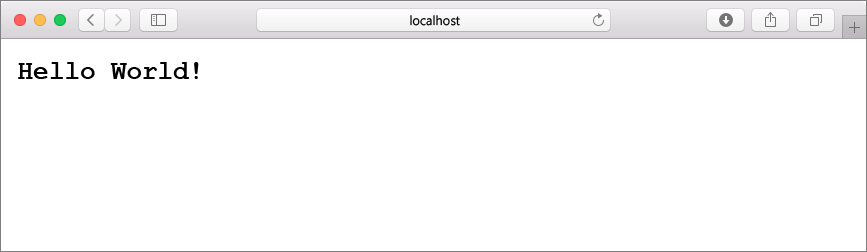
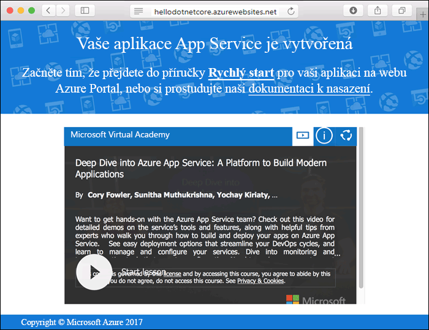
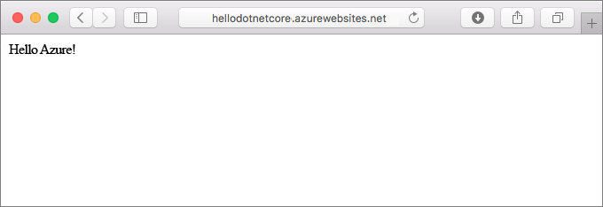
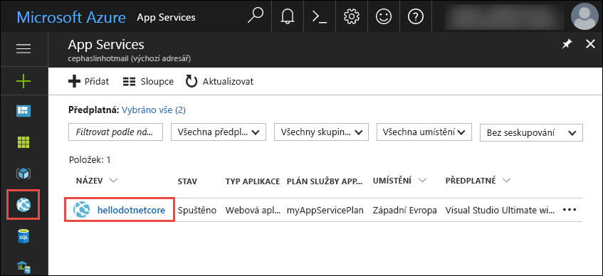
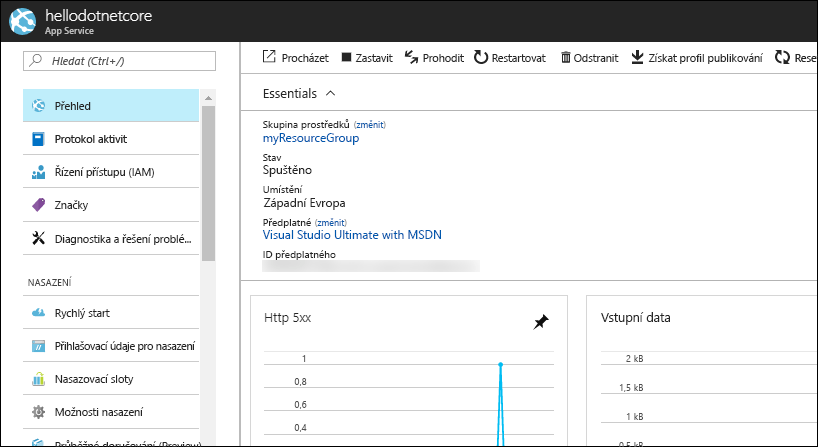

# <a name="create-a-net-core-web-app-in-app-service-on-linux"></a>Vytvoření webové aplikace .NET Core ve službě App Service v Linuxu

> [!NOTE]
> Tento článek nasadí aplikaci do služby App Service v Linuxu. Nasazení do služby App Service ve _Windows_ je popsané v tématu [Vytvoření webové aplikace v ASP.NET Core v Azure](../app-service-web-get-started-dotnet.md).
>

[App Service v Linuxu](app-service-linux-intro.md) je vysoce škálovatelná služba s automatickými opravami pro hostování webů s využitím operačního systému Linux. V tomto rychlém startu se dozvíte, jak vytvořit aplikaci [.NET Core](https://docs.microsoft.com/aspnet/core/) ve službě App Service v Linuxu. Pomocí [Azure CLI](https://docs.microsoft.com/cli/azure/get-started-with-azure-cli) vytvoříte webovou aplikaci a pomocí Gitu do této webové aplikace nasadíte kód .NET Core.



Následující postup můžete použít v případě počítačů Mac, Windows nebo Linux.

## <a name="prerequisites"></a>Požadavky

K provedení kroků v tomto kurzu Rychlý start je potřeba:

* <a href="https://git-scm.com/" target="_blank">Nainstalovat Git</a>.
* <a href="https://github.com/dotnet/core/blob/master/release-notes/download-archives/1.1.6-sdk-download.md" target="_blank">Nainstalovat sadu .NET Core SDK 1.1</a>

[!INCLUDE [quickstarts-free-trial-note](../../../includes/quickstarts-free-trial-note.md)]

## <a name="create-the-app-locally"></a>Místní vytvoření aplikace

V okně terminálu na svém počítači vytvořte adresář `hellodotnetcore` a přejděte do něj.

```bash
md hellodotnetcore
cd hellodotnetcore
```

Vytvořte novou webovou aplikaci .NET Core.

```bash
dotnet new web
```

## <a name="run-the-app-locally"></a>Místní spuštění aplikace

Obnovte balíčky NuGet a spusťte aplikaci.

```bash
dotnet restore
dotnet run
```

Otevřete webový prohlížeč a přejděte do aplikace na adrese `http://localhost:5000`.

Na stránce se zobrazí zpráva **Hello World** z ukázkové aplikace.



V okně terminálu ukončete webový server stisknutím **Ctrl + C**. Inicializujte úložiště Git pro projekt .NET Core.

```bash
git init
git add .
git commit -m "first commit"
```

[!INCLUDE [cloud-shell-try-it.md](../../../includes/cloud-shell-try-it.md)]

[!INCLUDE [Configure deployment user](../../../includes/configure-deployment-user.md)]

[!INCLUDE [Create resource group](../../../includes/app-service-web-create-resource-group.md)]

[!INCLUDE [Create app service plan](../../../includes/app-service-web-create-app-service-plan-linux.md)]

## <a name="create-a-web-app"></a>Vytvoření webové aplikace

[!INCLUDE [Create web app](../../../includes/app-service-web-create-web-app-dotnetcore-no-h.md)]

Přejděte do vaší nově vytvořené webové aplikace. Nahraďte _&lt;app name>_ názvem vaší webové aplikace.

```bash
http://<app name>.azurewebsites.net
```



[!INCLUDE [Push to Azure](../../../includes/app-service-web-git-push-to-azure.md)] 

```bash
Counting objects: 22, done.
Delta compression using up to 8 threads.
Compressing objects: 100% (18/18), done.
Writing objects: 100% (22/22), 51.21 KiB | 3.94 MiB/s, done.
Total 22 (delta 1), reused 0 (delta 0)
remote: Updating branch 'master'.
remote: Updating submodules.
remote: Preparing deployment for commit id '741f16d1db'.
remote: Generating deployment script.
remote: Project file path: ./hellodotnetcore.csproj
remote: Generated deployment script files
remote: Running deployment command...
remote: Handling ASP.NET Core Web Application deployment.
remote: ...............................................................................................
remote:   Restoring packages for /home/site/repository/hellodotnetcore.csproj...
remote: ....................................
remote:   Installing System.Xml.XPath 4.0.1.
remote:   Installing System.Diagnostics.Tracing 4.1.0.
remote:   Installing System.Threading.Tasks.Extensions 4.0.0.
remote:   Installing System.Reflection.Emit.ILGeneration 4.0.1.
remote:   ...
remote: Finished successfully.
remote: Running post deployment command(s)...
remote: Deployment successful.
To https://cephalin-dotnetcore.scm.azurewebsites.net/cephalin-dotnetcore.git
 * [new branch]      master -> master
```

## <a name="browse-to-the-app"></a>Přechod do aplikace

V prohlížeči zadejte adresu nasazené aplikace.

```bash
http://<app_name>.azurewebsites.net
```

Vzorový kód Node.js je spuštěný ve webové aplikaci s použitím integrované image.


**Blahopřejeme!** Nasadili jste svoji první aplikaci Node.js do služby App Service v Linuxu.

## <a name="update-and-redeploy-the-code"></a>Aktualizace a opětovné nasazení kódu

V místním adresáři otevřete soubor _Startup.cs_. Proveďte malou změnu textu ve volání metody `context.Response.WriteAsync`:

```csharp
await context.Response.WriteAsync("Hello Azure!");
```

Potvrďte změny v Gitu a potom odešlete změny kódu do Azure.

```bash
git commit -am "updated output"
git push azure master
```

Po dokončení nasazení se vraťte do okna prohlížeče, které se otevřelo v kroku **Přechod do aplikace**, a stiskněte tlačítko Aktualizovat.



## <a name="manage-your-new-azure-web-app"></a>Správa vaší nové webové aplikace Azure

Pokud chcete spravovat webovou aplikaci, kterou jste vytvořili, přejděte na web <a href="https://portal.azure.com" target="_blank">Azure Portal</a>.

V levé nabídce klikněte na **App Services** a pak klikněte na název vaší webové aplikace Azure.



Zobrazí se stránka s přehledem vaší webové aplikace. Tady můžete provádět základní úlohy správy, jako je procházení, zastavení, spuštění, restartování a odstranění. 



Levá nabídka obsahuje odkazy na různé stránky pro konfiguraci vaší aplikace. 

[!INCLUDE [cli-samples-clean-up](../../../includes/cli-samples-clean-up.md)]

## <a name="next-steps"></a>Další kroky

> [!div class="nextstepaction"]
> [Vytvoření webové aplikace .NET Core využívající SQL Database ve službě Azure App Service v Linuxu](tutorial-dotnetcore-sqldb-app.md)
