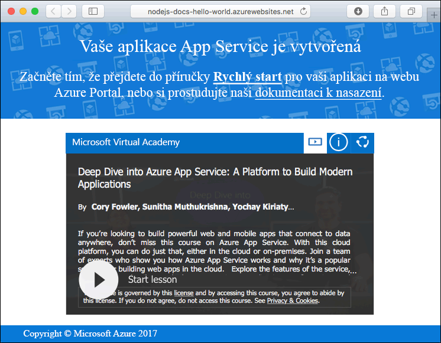
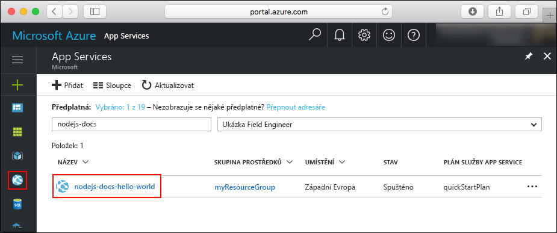

# <a name="create-a-nodejs-web-app-in-azure-app-service-on-linux"></a>Vytvoření webové aplikace Node.js ve službě Azure App Service v systému Linux

[Aplikační služby v systému Linux](app-service-linux-intro.md) nabízí vysoce škálovatelnou a automatických oprav webové hostitelské služby pomocí operační systém Linux. Tento rychlý start ukazuje, jak nasadit aplikace Node.js do služby App Service v systému Linux pomocí předdefinovaných bitové kopie. Vytvořit webovou aplikaci s použitím předdefinované bitové kopie [rozhraní příkazového řádku Azure](https://docs.microsoft.com/cli/azure/get-started-with-azure-cli), a pomocí Git nasaďte kód Node.js do webové aplikace.


Následující postup můžete použít v případě počítačů Mac, Windows nebo Linux.

## <a name="prerequisites"></a>Požadavky

K provedení kroků v tomto kurzu Rychlý start je potřeba:

* <a href="https://git-scm.com/" target="_blank">Nainstalovat Git</a>.
* <a href="https://nodejs.org/" target="_blank">Nainstalovat Node.js a NPM</a>.

[!INCLUDE [quickstarts-free-trial-note](../../../includes/quickstarts-free-trial-note.md)]

## <a name="download-the-sample"></a>Stažení ukázky

V okně terminálu na počítači spusťte následující příkaz klonovat úložiště ukázkové aplikace do místního počítače.

```bash
git clone https://github.com/Azure-Samples/nodejs-docs-hello-world
```

Toto okno terminálu budete používat ke spuštění všech příkazů v tomto kurzu Rychlý start.

Přejděte do adresáře, který obsahuje vzorový kód.

```bash
cd nodejs-docs-hello-world
```

## <a name="run-the-app-locally"></a>Místní spuštění aplikace

Aplikaci spustíte místně tak, že otevřete okno terminálu a pomocí skriptu `npm start` spustíte integrovaný server HTTP aplikace Node.js.

```bash
npm start
```

Otevřete webový prohlížeč a přejděte na ukázkovou aplikaci v `http://localhost:1337`.

Na stránce se zobrazí zpráva **Hello World** z ukázkové aplikace.


V okně terminálu ukončete webový server stisknutím **Ctrl + C**.

[!INCLUDE [cloud-shell-try-it.md](../../../includes/cloud-shell-try-it.md)]

[!INCLUDE [Configure deployment user](../../../includes/configure-deployment-user.md)]

[!INCLUDE [Create resource group](../../../includes/app-service-web-create-resource-group.md)]

[!INCLUDE [Create app service plan](../../../includes/app-service-web-create-app-service-plan-linux.md)]

## <a name="create-a-web-app"></a>Vytvoření webové aplikace

[!INCLUDE [Create web app](../../../includes/app-service-web-create-web-app-nodejs-no-h.md)]

Vyhledejte nově vytvořenou webovou aplikaci. Nahraďte  _&lt;název aplikace >_ s názvem vaší webové aplikace.

```bash
http://<app name>.azurewebsites.net
```



[!INCLUDE [Push to Azure](../../../includes/app-service-web-git-push-to-azure.md)]

```bash
Counting objects: 23, done.
Delta compression using up to 4 threads.
Compressing objects: 100% (21/21), done.
Writing objects: 100% (23/23), 3.71 KiB | 0 bytes/s, done.
Total 23 (delta 8), reused 7 (delta 1)
remote: Updating branch 'master'.
remote: Updating submodules.
remote: Preparing deployment for commit id 'bf114df591'.
remote: Generating deployment script.
remote: Generating deployment script for node.js Web Site
remote: Generated deployment script files
remote: Running deployment command...
remote: Handling node.js deployment.
remote: Kudu sync from: '/home/site/repository' to: '/home/site/wwwroot'
remote: Copying file: '.gitignore'
remote: Copying file: 'LICENSE'
remote: Copying file: 'README.md'
remote: Copying file: 'index.js'
remote: Copying file: 'package.json'
remote: Copying file: 'process.json'
remote: Deleting file: 'hostingstart.html'
remote: Ignoring: .git
remote: Using start-up script index.js from package.json.
remote: Node.js versions available on the platform are: 4.4.7, 4.5.0, 6.2.2, 6.6.0, 6.9.1.
remote: Selected node.js version 6.9.1. Use package.json file to choose a different version.
remote: Selected npm version 3.10.8
remote: Finished successfully.
remote: Running post deployment command(s)...
remote: Deployment successful.
To https://<app_name>.scm.azurewebsites.net:443/<app_name>.git
 * [new branch]      master -> master
```

## <a name="browse-to-the-app"></a>Přechod do aplikace

V prohlížeči zadejte adresu nasazené aplikace.

```bash
http://<app_name>.azurewebsites.net
```

Ukázkový kód Node.js běží ve webové aplikaci s integrovanou bitové kopie.


**Blahopřejeme!** První aplikaci Node.js jste nasadili do služby App Service v systému Linux.

## <a name="update-and-redeploy-the-code"></a>Aktualizace a opětovné nasazení kódu

V místním adresáři, otevřete `index.js` souboru v aplikaci Node.js a změňte malá text ve volání `response.end`:

```nodejs
response.end("Hello Azure!");
```

Potvrďte změny v Gitu a potom odešlete změny kódu do Azure.

```bash
git commit -am "updated output"
git push azure master
```

Po dokončení nasazení se vraťte do okna prohlížeče, které se otevřelo v kroku **Přechod do aplikace**, a stiskněte tlačítko Aktualizovat.


## <a name="manage-your-new-azure-web-app"></a>Správa vaší nové webové aplikace Azure

Pokud chcete spravovat webovou aplikaci, kterou jste vytvořili, přejděte na web <a href="https://portal.azure.com" target="_blank">Azure Portal</a>.

V levé nabídce klikněte na **App Services** a pak klikněte na název vaší webové aplikace Azure.



Zobrazí se stránka s přehledem vaší webové aplikace. Tady můžete provádět základní úlohy správy, jako je procházení, zastavení, spuštění, restartování a odstranění. 


Levá nabídka obsahuje odkazy na různé stránky pro konfiguraci vaší aplikace. 

[!INCLUDE [cli-samples-clean-up](../../../includes/cli-samples-clean-up.md)]

## <a name="next-steps"></a>Další kroky

> [!div class="nextstepaction"]
> [Node.js s databází MongoDB](tutorial-nodejs-mongodb-app.md)
