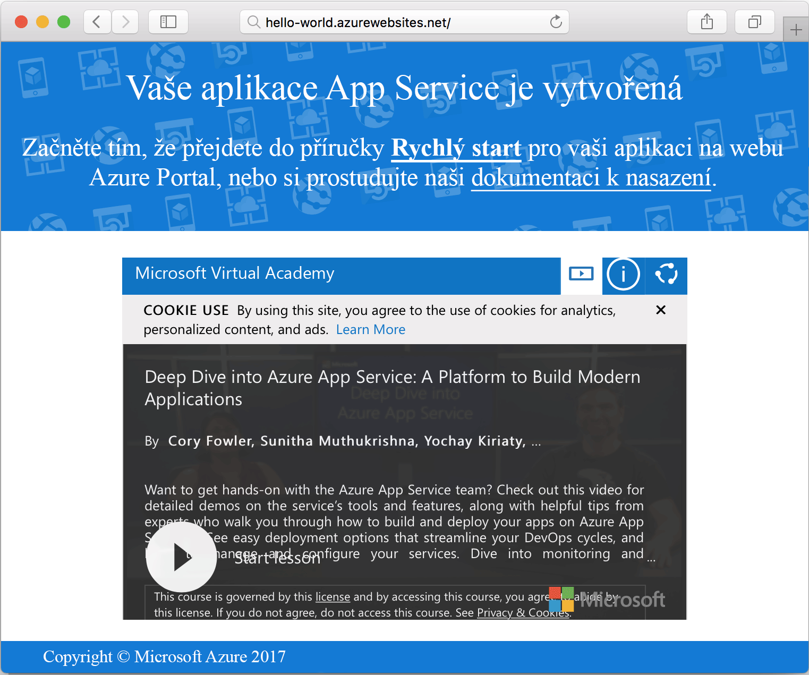

# <a name="create-a-ruby-app-in-app-service-on-linux"></a>Vytvoření aplikace v Ruby ve službě App Service v Linuxu

[App Service v Linuxu](app-service-linux-intro.md) je vysoce škálovatelná služba s automatickými opravami pro hostování webů. V tomto rychlém startu se dozvíte, jak vytvořit základní aplikaci v Ruby on Rails a pak ji nasadit do Azure jako webovou aplikaci v Linuxu.


## <a name="prerequisites"></a>Požadavky

* <a href="https://www.ruby-lang.org/en/documentation/installation/#rubyinstaller" target="_blank">Nainstalovat Ruby 2.4.1 nebo novější</a>.
* <a href="https://git-scm.com/" target="_blank">Nainstalovat Git</a>.

[!INCLUDE [quickstarts-free-trial-note](../../../includes/quickstarts-free-trial-note.md)]

## <a name="download-the-sample"></a>Stažení ukázky

V okně terminálu naklonujte spuštěním následujícího příkazu úložiště ukázkové aplikace do místního počítače:

```bash
git clone https://github.com/Azure-Samples/ruby-docs-hello-world
```

## <a name="run-the-application-locally"></a>Místní spuštění aplikace

Aby aplikace fungovala, spusťte server Rails. Přejděte do adresáře *hello-world* a příkazem `rails server` spusťte server.

```bash
cd hello-world\bin
rails server
```

Ve webovém prohlížeči přejděte na adresu `http://localhost:3000` a místně otestujte aplikaci.


## <a name="modify-app-to-display-welcome-message"></a>Upravení aplikace pro zobrazení uvítací zprávy

Upravte aplikaci tak, aby zobrazila uvítací zprávu. Nejprve musíte nastavit tratu upravením souboru *~/workspace/ruby-docs-hello-world/config/routes.rb* tak, aby obsahoval trasu `hello`.

  ```ruby
  Rails.application.routes.draw do
      #For details on the DSL available within this file, see http://guides.rubyonrails.org/routing.html
      root 'application#hello'
  end
  ```

Změňte kontroler aplikace tak, aby do prohlížeče vracel zprávu ve formátu HTML. 

Otevřete soubor *~/workspace/hello-world/app/controllers/application_controller.rb* pro úpravy. Upravte třídu `ApplicationController`, aby vypadala jako v následujícím vzorovém kódu:

  ```ruby
  class ApplicationController > ActionController :: base
    protect_from_forgery with: :exception
    def hello
      render html: "Hello, world from Azure Web App on Linux!"
    end
  end
  ```

Vaše aplikace je nyní nakonfigurovaná. Ve webovém prohlížeči přejděte na adresu `http://localhost:3000` a zkontrolujte kořenovou úvodní stránku.


[!INCLUDE [Try Cloud Shell](../../../includes/cloud-shell-try-it.md)]

[!INCLUDE [Configure deployment user](../../../includes/configure-deployment-user.md)]

## <a name="create-a-ruby-web-app-on-azure"></a>Vytvoření webové aplikace v Ruby v Azure

Vyžaduje se skupina prostředků, která bude obsahovat prostředky nezbytné pro vaši webovou aplikaci. Skupinu prostředků vytvoříte pomocí příkazu [az group create]().

```azurecli-interactive
az group create --location westeurope --name myResourceGroup
```

Pomocí příkazu [az appservice plan create](https://docs.microsoft.com/cli/azure/appservice/plan#az_appservice_plan_create) vytvořte plán služby App Service pro vaši aplikaci.

```azurecli-interactive
az appservice plan create --name myAppServicePlan --resource-group myResourceGroup --is-linux
```

Dále pomocí příkazu [az webapp create](https://docs.microsoft.com/cli/azure/webapp) vytvořte webovou aplikaci, která využívá nově vytvořený plán služby. Všimněte si, že modul runtime je nastavený na `ruby|2.3`. Nezapomeňte nahradit `<app name>` jedinečným názvem aplikace.

```azurecli-interactive
az webapp create --resource-group myResourceGroup --plan myAppServicePlan --name <app name> \
--runtime "ruby|2.3" --deployment-local-git
```

Výstup z příkazu odhaluje informace o nově vytvořené webové aplikaci a také adresu URL nasazení. Měl by vypadat podobně jako v následující ukázce. Zkopírujte adresu URL pro pozdější použití v tomto kurzu.

```bash
https://<deployment user name>@<app name>.scm.azurewebsites.net/<app name>.git
```

Po vytvoření webové aplikace můžete zobrazit stránku **Přehled**. Přejděte na ni. Zobrazí se následující úvodní stránka:




## <a name="deploy-your-application"></a>Nasazení aplikace

Spuštěním následujících příkazů nasaďte místní aplikaci do webu Azure:

```bash
git remote add azure <Git deployment URL from above>
git add -A
git commit -m "Initial deployment commit"
git push azure master
```

Zkontrolujte, že operace vzdáleného nasazení hlásí úspěch. Příkazy vygenerují výstup podobný následujícímu textu:

```bash
remote: Using sass-rails 5.0.6
remote: Updating files in vendor/cache
remote: Bundle gems are installed into ./vendor/bundle
remote: Updating files in vendor/cache
remote: ~site/repository
remote: Finished successfully.
remote: Running post deployment command(s)...
remote: Deployment successful.
To https://<your web app name>.scm.azurewebsites.net/<your web app name>.git
  579ccb....2ca5f31  master -> master
myuser@ubuntu1234:~workspace/<app name>$
```

Po dokončení nasazení pomocí příkazu [az webapp restart](https://docs.microsoft.com/cli/azure/webapp#az_webapp_restart) restartujte webovou aplikaci, aby se nasazení projevilo. Tady je příklad příkazu:

```azurecli-interactive
az webapp restart --name <app name> --resource-group myResourceGroup
```

Přejděte na váš web a ověřte výsledky.

```bash
http://<app name>.azurewebsites.net
```


> [!NOTE]
> Pokud se pokusíte o procházení webu v průběhu restartování aplikace, výsledkem bude stavový kód HTTP `Error 503 Server unavailable`. Úplné restartování může trvat několik minut.
>

[!INCLUDE [Clean-up section](../../../includes/cli-script-clean-up.md)]

## <a name="next-steps"></a>Další kroky

[Nejčastější dotazy k Azure App Service v Linuxu](https://docs.microsoft.com/azure/app-service-web/app-service-linux-faq.md)
