# Přehled Application Insights pro DevOps

S [Application Insights](app-insights-overview.md), můžete rychle zjistit, jaký je výkon aplikace a právě používá, když je za provozu. Pokud dojde k potížím, umožňuje vědět o jeho, pomůže posoudit dopad a pomáhají zjistit příčinu.

Zde je účet od týmu, který sama vyvinula webových aplikací:

* *"Během několika dní před jsme nasadili, vedlejší, opravy hotfix. Jsme nespustily průchodu testu široký, ale bohužel získali některé nečekaným změnám sloučeny do datové části způsobuje nekompatibilitu mezi front-end a back-EndY. Hned aktivováno naše výstrahy výjimek serveru surged a jsme byly provedeny vědět situaci. Pár kliknutí rychle na portálu služby Application Insights, My dostatek informací z callstacks výjimka můžete zúžit problém. Jsme vrácena okamžitě a omezené škody. Application Insights udělal Tato část devops cyklus velmi snadno a níž lze provést akci."*

V tomto článku jsme podle týmu v bance společnosti Fabrikam, která sama vyvinula systému online bankovnictví (OBS) chcete zobrazit, jak se pomocí Application Insights rychle reagovat na zákazníky a provádět aktualizace.  

Tým funguje v cyklu DevOps znázorněný na následujícím obrázku:

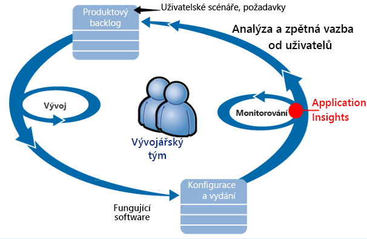

Požadavky na informačního kanálu do jejich vývoj nevyřízených položek (seznam úkolů). Tyto funkce fungují v krátkém sprintů, které často poskytovat software pracovní – obvykle ve formě vylepšení a rozšíření stávající aplikace. Pomocí nové funkce je často aktualizována aplikace za provozu. I když je za provozu, monitoruje ho týmem pro výkonu a využití pomocí Application Insights. Tato data APM kanály zpátky na jejich vývoj nevyřízených položek.

Tým služby Application Insights používá k monitorování živou webovou aplikaci úzce pro:

* Výkon. Chtějí zjistit, jak se počtu žádostí o; lišit podle doby odezvy kolik procesoru, sítě, disk a další prostředky jsou používány; které aplikace kódu pomaleji výkonu; a kde jsou kritická místa.
* Selhání. Pokud jsou výjimky nebo neúspěšné požadavky, nebo pokud se čítač výkonu ocitne mimo rozsah jeho možnost, tým musí znát rychle, aby přijaly akce.
* Využití. Při každém vydání nové funkce, týmem chcete vědět, do jaké míry se používá, a toho, jestli uživatelé mají všechny problémy s ním.

Umožňuje soustředit na části zpětnou vazbu cyklu:

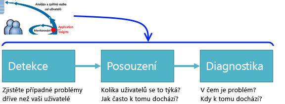

## Zjištění nízký dostupnosti
Marcela Markova je vývojář senior OBS týmu a trvá realizace na sledování výkonu online. Jana nastaví několik [testy dostupnosti](app-insights-monitor-web-app-availability.md):

* Testu jedné adresy URL pro hlavní cílová stránka aplikace, http://fabrikambank.com/onlinebanking/. Jana nastaví kritéria kód HTTP 200 a text "Vítejte!". Pokud tento test ale selže, je vážně problém se sítí nebo servery nebo může být problém s nasazení. (Nebo někdo došlo ke změně zobrazení úvodní! zpráva na stránce bez možnosti čtení jeho Přehled.)
* Hlubší vícekrokového testu, který se přihlásí a získá aktuálního účtu výpis, kontrola pár klíčů podrobnosti na každé stránce. Tento test ověřuje, že odkaz na databázi účty funguje. Použije Jana id fiktivní zákazníka: několik z nich jsou zachována pro účely testování.

Tyto testy nastavit je Marcela jisti, že týmem rychle upozornit všechny výpadku.  

Selhání zobrazují jako červené tečky na graf webového testu:

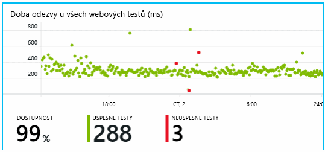

Ale důležitější, je výstraha o jakákoli chyba e-mailem do vývojového týmu. Tento způsob se vědět o něm před téměř všechny zákazníky.

## Monitorování výkonu
Na stránce Přehled ve službě Application Insights je graf, který obsahuje celou řadu [klíčové metriky](app-insights-web-monitor-performance.md).

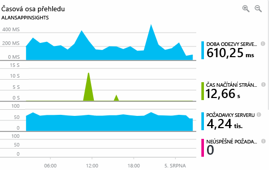

Čas načítání stránky prohlížeče je odvozená od telemetrické zprávy odesílané přímo z webové stránky. Doba odezvy serveru, počtu žádostí o serveru a počet neúspěšných požadavků jsou všechny měří ve webovém serveru a odeslaných do služby Application Insights z ní.

Marcela je mírně nevadí graf odpovědi serveru. Tento graf znázorňuje průměrný čas mezi když server obdrží požadavek HTTP z prohlížeče uživatele, a když vrátí odpověď. Není zobrazíte varianta v tomto grafu, jak se liší podle zatížení systému. Ale v takovém případě zdá, že existuje korelace mezi malé přírůstky. počet požadavků a big roste doby odezvy. Který by to znamenat, že je pouze při jeho omezení operačního systému.

Jana otevře grafy servery:

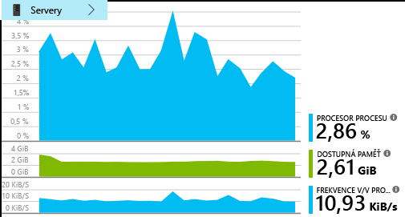

Nejspíš žádné přihlašovací omezení prostředků existuje, takže možná, že jsou právě shoda hrboly v grafech odpověď serveru.

## Nastavit upozornění ke splnění cílů
Nicméně chce dohlížet na dobu odezvy. Pokud přejde příliš vysoké, chce vědět o něm okamžitě.

Aby Jana nastaví [výstraha](app-insights-metrics-explorer.md), pro větší než typické prahová hodnota doby odezvy. Díky tomu svůj spolehlivosti, které Jana budete vědět o něm, pokud jsou pomalé odezvy.

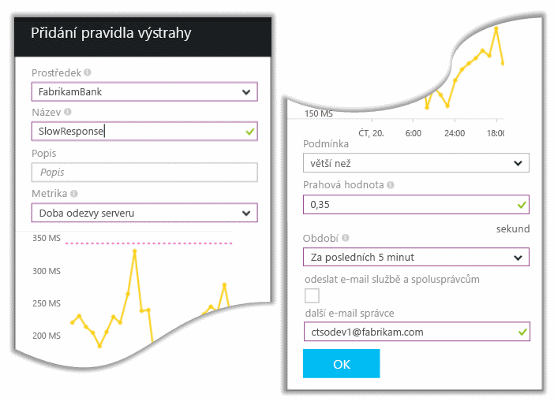

Výstrahy můžete nastavit na širokou škálu jiné metriky. Například může přijímat e-mailů, pokud zvýší počet výjimky nebo přejde nízkou dostupnou paměť, nebo pokud je v klientských požadavků ve špičce.

## Udržení informovanosti s výstrahami Inteligentní detekce
Další den výstrahy e-mailu přicházejí z Application Insights. Ale když uživatel otevře, Jana zjistí, že není oznámení čas odezvy, které Jana nastavit. Místo toho se sdělením, že došlo nečekané zvýšení neúspěšných požadavků – to znamená, požadavků, které vráceno selhání kódy 500 nebo víc.

Neúspěšné požadavky jsou, odkud mají uživatelé vidět chybu – obvykle následující výjimka vyvolána v kódu. Možná zobrazí zpráva s oznámením "Bohužel jsme nelze nyní aktualizovat podrobností o." Nebo na absolutní to nepříjemné nejhorší, výpisu zásobníku se zobrazí na obrazovce uživatele s laskavým svolením webového serveru.

Tato výstraha je neočekávaném, protože čas posledního Jana zvážení, byl encouragingly nízkou počet chybných požadavků. Malý počet selhání je očekáváno v zaneprázdněný server.

Bylo rovněž kousek neočekávaném pro ní protože Jana neměly ke konfiguraci této výstrahy. Application Insights zahrnují inteligentní zjišťování. Je automaticky přizpůsobí obvyklé selhání vzor vaší aplikace a selhání "získá se používá pro" na konkrétní stránky, nebo vysoké zatížení, nebo spojených s další metriky. Pouze v případě, že je zvýšení výše pochází očekávat vyvolá upozornění.

To je velmi užitečná e-mailu. Právě se nepodporuje vyvolat alarm. Příliš mnoho třídění a diagnostiky pracovní dělá.

Zobrazuje jak mnoho zákazníků pocítí důsledky a které webové stránky nebo operace. Marcela můžete rozhodnout, jestli Jana potřebuje získat celý tým práce na tomto jako protipožární cvičení, nebo jestli se můžete ignorovat až do příštího týdne.

E-mailu také ukazuje, že určité výjimky došlo k chybě a - i další zajímavé – selhání volání se nezdařilo pro konkrétní databázi přidružen. Tato část popisuje, proč selhání najednou zobrazovaly i v případě, že aktualizace nebyla nasazena nedávno Marcela na tým.

Marcella odešle příkaz ping vedoucí týmu databáze založené na tento e-mail. Jana zjišťuje, že se vydaná oprava hotfix v posledních půl hodiny; a bohužel se možná pravděpodobně změnu menší schématu...

Problém je proto na cestě k odstraněna, i před příčin protokoly a do 15 minut od jeho použití. Ale Marcela klikne na odkaz otevřete Application Insights. Otevře se přímo na chybné žádosti a tak může vidět databázi se nezdařilo volání v seznamu přidružené závislosti volání.

## Zjištění výjimek
S chvilku instalačního programu [výjimky](app-insights-asp-net-exceptions.md) hlášení Application Insights automaticky. Se také dají zachytit explicitně vložením volání [TrackException()](app-insights-api-custom-events-metrics.md#trackexception) do kódu:  

    var telemetry = new TelemetryClient();
    ...
    try
    { ...
    }
    catch (Exception ex)
    {
       // Set up some properties:
       var properties = new Dictionary <string, string>
         {{"Game", currentGame.Name}};

       var measurements = new Dictionary <string, double>
         {{"Users", currentGame.Users.Count}};

       // Send the exception telemetry:
       telemetry.TrackException(ex, properties, measurements);
    }

Týmem Fabrikam Bank má vyvinuly postup vždy odesílat telemetrii na výjimku, pokud je zřejmé obnovení.  

Ve skutečnosti je i širší než jejich strategie: odesílání telemetrických dat ve všech případech, kde je zákazník frustrovaní v co chtěli provést, jestli odpovídá výjimku v kódu nebo ne. Například pokud externí přenos mezi bank systém vrátí zprávu "nelze dokončit tuto transakci" nějakého důvodu provozní (žádné chyby zákazníka) pak budou sledovat tuto událost.

    var successCode = AttemptTransfer(transferAmount, ...);
    if (successCode < 0)
    {
       var properties = new Dictionary <string, string>
            {{ "Code", returnCode, ... }};
       var measurements = new Dictionary <string, double>
         {{"Value", transferAmount}};
       telemetry.TrackEvent("transfer failed", properties, measurements);
    }

TrackException se používají k hlášení výjimky, protože odešle kopii zásobníku. TrackEvent se používají k hlášení další události. Všechny vlastnosti, které mohou být užitečné při diagnostiku můžete připojit.

Výjimky a události v se zobrazují [diagnostické vyhledávání](app-insights-diagnostic-search.md) okno. Můžete zobrazit další podrobnosti do mají najdete v části Další vlastnosti a trasováním zásobníku.

## Proaktivní monitorování
Marcela není právě nacházejí kolem čekání výstrahy. Krátce po každé nové nasazení, která se podíváme na [odezvy](app-insights-web-monitor-performance.md) -celkový obrázek a tabulka nejpomalejší požadavky a také počty výjimka.  

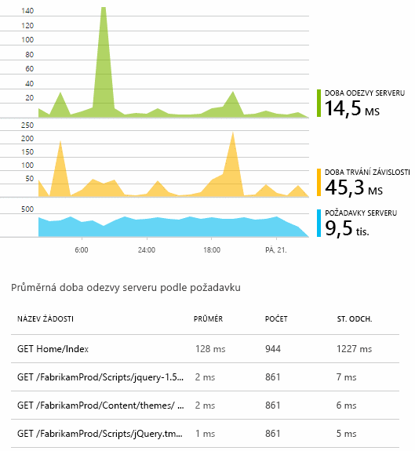

Jana můžete vyhodnotit vliv výkon každé nasazení obvykle porovnávání každý týden s poslední. Pokud je nečekané zhoršování, se vyvolá, s vývojáři relevantní.

## Problémy třídění
Třídění - hodnocení závažnosti a rozsah problém – jde o první krok po zjišťování. Měli jsme vyvolávající týmem půlnoci? Nebo může být až další pohodlný mezery v nevyřízené položky ponecháno? Existují některé klíčové otázky v třídění.

Jak často se se děje? Grafy v okně Přehled poskytnout některé perspektivy k problému. Například společnost Fabrikam aplikace generuje čtyři webového testu výstrahy jednu noc. Prohlížení grafu ráno, tým by mohli zobrazit, aby byly skutečně některé červené tečky, i když stále většinu testů byly zelená. Podrobnostem grafu dostupnosti, bylo naprosto jasné, že všechny tyto přerušované problémy byly z umístění jeden test. To se samozřejmě potíže se sítí, které mají vliv jenom jeden postup a sám s největší pravděpodobností zrušte.  

Naopak stabilní a výrazné zvýšení v grafu počet výjimka počty nebo odpovědi je samozřejmě něco mít obavy o.

Užitečné třídění cílem je, zkuste ho sami. Pokud spustíte ke stejnému problému, víte, že je skutečné.

Jaké podíl uživatelů ovlivněných? Chcete-li získat hrubý odpovědí, vydělte je míra selhání počet relací.

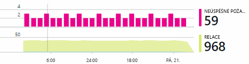

Po pomalé odezvy se porovnejte v tabulce nejpomalejší neodpovídá požadavků s četností využití každé stránky.

Jak důležité je blokované scénář? Pokud je to funkčního problému blokování konkrétní uživatelský scénář, záleží mnohem? Pokud zákazníci nelze platit svými účty, je to závažné; Pokud nemohou změnit svoje předvolby barvy obrazovky, možná ho můžete počkat. Podrobnosti o události nebo výjimky nebo identita stránce pomalé poznáte, kde mají zákazníci potíže s.

## Diagnostikovat problémy
Diagnostika není poměrně stejná jako ladění. Než začnete sledování v kódu, byste měli mít hrubý představu o tom, proč, kde a kdy dochází k problému.

**Pokud k tomu dojít?** Historický přehled poskytované grafy události a metriky usnadňuje korelovat důsledky s možné příčiny. Pokud jsou v odpovědi čas nebo výjimky sazby přerušované vrcholů, podívejte se na počtu žádostí o: Pokud je nejlepší při ve stejnou dobu, pak to vypadá problém prostředků. Je třeba přiřadit více procesorů nebo paměti? Nebo je závislost, která nemůže spravovat zatížení?

**Je nám?**  Pokud máte nečekané pokles výkonu konkrétní typ požadavku – například když zákazník chce stavu účtu - pak je možné, může to být externí subsystému spíše než webové aplikace. V Průzkumníku metrik vyberte míra selhání závislostí a doby trvání závislosti sazby a porovnání jejich historií po posledních několik hodin nebo dnů s problémem, který jste rozpoznali. Pokud jsou existuje korelace změny, může být na straně zmocnitele externí subsystému.  

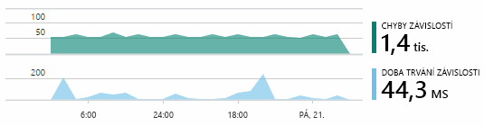

Některé pomalé závislosti jsou problémy, které informace o zeměpisné poloze. Společnost Fabrikam Bank používá virtuální počítače Azure a zjistit, že jejich měl nechtěně umístění jejich webový server a server poskytující účty v různých zemí. Představují výrazné zlepšení byl způsobené migrace jeden z nich.

**Co jsme?** Pokud tento problém se nezobrazí v závislost a nebyl vždy existuje, je pravděpodobně způsobena změnou poslední. Historický přehled poskytované grafy metriky a události lze snadno ke korelaci změny nečekané s nasazením. Který zužuje hledat problém. Chcete-li zjistit, které řádky v kódu aplikace ke zpomalení výkonu, povolte profileru Application Insights. Naleznete [profilování za provozu Azure web apps s Application Insights](./app-insights-profiler.md). Po povolení profileru, zobrazí se podobné následujícímu trasování. V tomto příkladu je snadno patrné, metoda *GetStorageTableData* příčinou problému.  

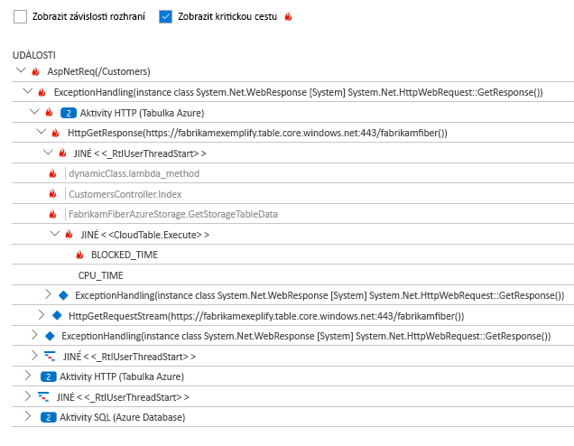

**Co se děje?** Některé problémy dojít pouze zřídka a může být obtížné sledovat testování do offline režimu. Všechny, které může provádět jsme se pokusí zaznamenat chybě, když dojde k za provozu. Si můžete prohlédnout výpisy zásobníku v sestavách výjimka. Kromě toho můžete zapsat trasování volání, buď vašeho oblíbeného rozhraní protokolování, nebo TrackTrace() nebo TrackEvent().  

Společnost Fabrikam měl občasný problém s přenosy mezi společnostmi, ale pouze s určitými typy účtu. Lépe pochopit, co se děje, budou vloženy TrackTrace() volání na klíčové body kód připojení typ účtu jako vlastnost pro každé volání. Který usnadnit filtrovat pouze tyto trasování ve vyhledávání diagnostiky. Také se parametr hodnoty jako vlastnosti a míry připojený k trasování volání.

## Reakce na zjištěné problémy
Jakmile jste diagnostikovat problém, můžete nastavit plán a opravte ji. Možná budete muset vrátit zpět ke změnám, nebo může být můžete právě pokračujte a opravte ho. Po dokončení opravu Application Insights poznáte, jestli byla úspěšná.  

Společnost Fabrikam Bank vývojový tým trvat více strukturovanými přístup k měření výkonu než používají k před používají Application Insights.

* Na stránce Přehled služby Application Insights nastavují výkonnostní cíle z hlediska konkrétní míry.
* Jejich návrh měření výkonu do aplikace od začátku, jako je například metriky, které měření postupu uživatele prostřednictvím nálevky.  

## Monitorování aktivity uživatelů
Když je trvale dobré doba odezvy a existuje několik výjimek, týmem vývojářů můžete přesunout k použitelnost. Se dá chápat jak k vylepšení zkušeností uživatelů a jak podporovat více uživatelů k dosažení požadovaných cílů.

Application Insights můžete použít také se dozvíte, co uživatelé dělají s aplikací. Jakmile je plynulý chod, týmem chcete vědět, funkce, které jsou nejčastěji používané, co uživatelé jako nebo mít potíže s a jak často se vrátí. Které budou pomoci určit priority nadcházející práci. A můžete naplánovat měření úspěchu každé funkce jako součást cyklu vývoje.

Například běžný uživatel cesty přes webu má zrušte "trychtýřového grafu." Podívejte se na kurzy různých typů úvěr mnoho zákazníků. Zmenšete počet přejděte na vyplňte formulář uvozovek. Několik z nich, kteří získat nabídky, pokračujte a vyjměte úvěr.

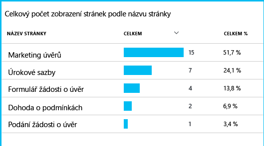

Vzhledem k tomu kde největší množství zákazníků vyřadit, firmu pracovat na to, jak získat více uživatelů prostřednictvím v dolní části trychtýřového grafu. V některých případech může být selhání uživatelské rozhraní (UX) – například tlačítka 'Další' je obtížné najít, nebo nejsou zřejmé pokynů. Existuje více pravděpodobně větších obchodní důvody pro rozevírací li: možná jsou příliš vysoké míry úvěr.

Ať důvodům, data pomáhá týmem vycházejí co uživatelé dělají. Další volání sledování jde vložit pro práci se podrobněji. TrackEvent() slouží k určení počtu žádné akce uživatele, z dobře podrobností kliknutí na jednotlivé tlačítko, k významné herních bonusů, jako je například platícího vypnout úvěr.

Tým získávání slouží k s údaji o činnosti uživatelů. V současné době vždy, když se navrhnout novou funkci, pracují na tom, jak bude získání zpětné vazby o jeho používání. Jejich návrh sledování volání do funkce od začátku. Zpětnou vazbu používají ke zlepšení funkci v každém cyklu vývoje.

[Další informace o sledování využití](app-insights-usage-overview.md).

## Použít DevOps cyklu
Proto je jak jedno použití team Application Insights, nikoli pouze na jednotlivé problémy, ale ke zlepšení jejich životního cyklu. Snad že ho udělil některé nápady o tom, jak Application Insights vám může pomoct se správou výkonu aplikací v aplikaci.

## Video

> [!VIDEO https://channel9.msdn.com/events/Connect/2016/112/player]

## Další kroky
Můžete začít používat několika způsoby v závislosti na vlastnosti aplikace. Vyberte, co vám nejvíc vyhovuje:

* [Webové aplikace ASP.NET](app-insights-asp-net.md)
* [Webové aplikace Java](app-insights-java-get-started.md)
* [Webové aplikace Node.js](app-insights-nodejs.md)
* Nasazené aplikace, které jsou hostované na [IIS](app-insights-monitor-web-app-availability.md), [J2EE](app-insights-java-live.md), nebo [Azure](app-insights-azure.md).
* [Webové stránky](app-insights-javascript.md) -jedné stránky aplikace nebo obyčejnou webová stránka – použít samostatně nebo v přidání do některé z možností serveru.
* [Testy dostupnosti](app-insights-monitor-web-app-availability.md) k testování aplikace z veřejného Internetu.
