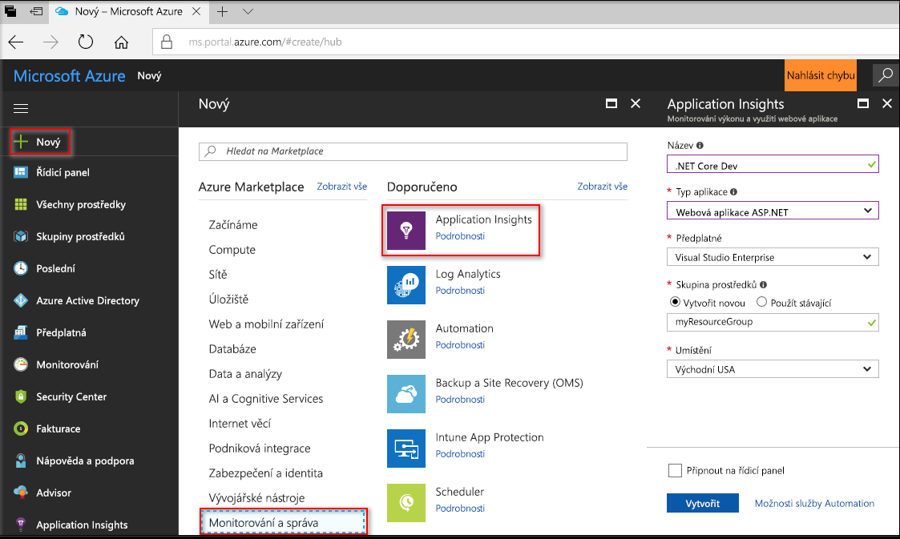
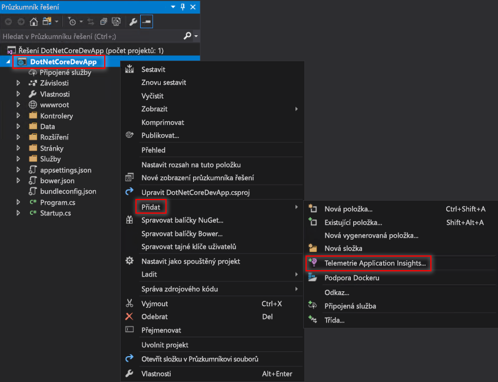
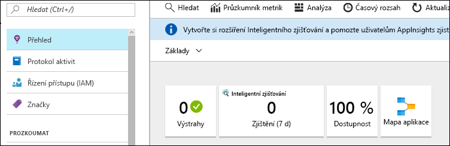
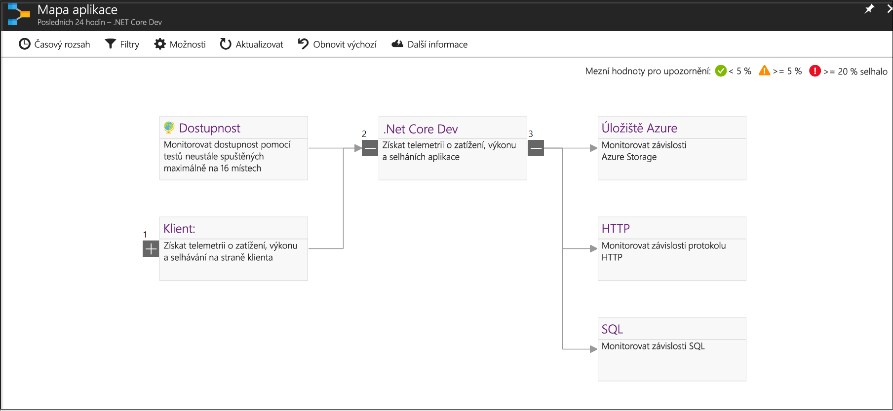
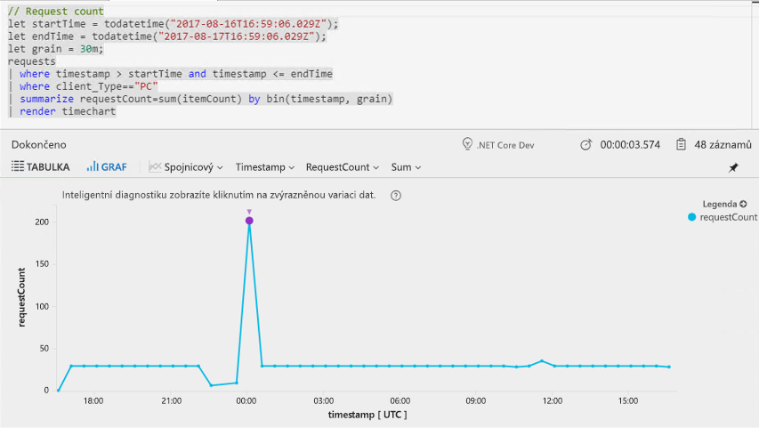
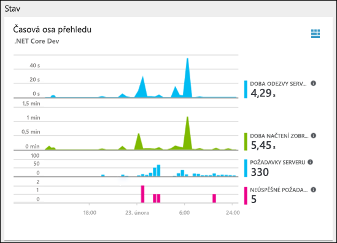
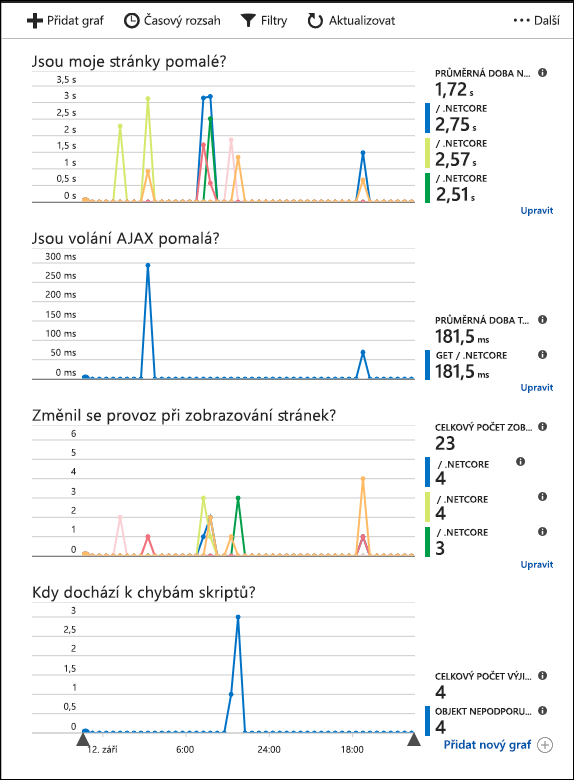

# <a name="start-monitoring-your-aspnet-core-web-application"></a>Zahájení monitorování webové aplikace ASP.NET Core

Azure Application Insights umožňuje snadné monitorování webové aplikace z hlediska dostupnosti, výkonu a využití. Můžete také rychle identifikovat a diagnostikovat chyby ve vaší aplikaci a nečekat na to, až je nahlásí uživatelé. 

Tento rychlý start vás provede přidáním sady Application Insights SDK do existující webové aplikace ASP.NET Core. 

## <a name="prerequisites"></a>Požadavky

K provedení kroků v tomto kurzu Rychlý start je potřeba:

- [Nainstalovat sadu Visual Studio 2017](https://www.visualstudio.com/downloads/) s následujícími sadami funkcí:
  - Vývoj pro ASP.NET a web
  - Vývoj pro Azure
- [Nainstalovat sadu .NET Core 2.0 SDK](https://www.microsoft.com/net/core)
- Budete potřebovat předplatné Azure a webovou aplikaci v .NET Core.

Pokud webovou aplikaci ASP.NET Core nemáte, můžete si ji vytvořit pomocí [Příručky k vytvoření webové aplikace ASP.NET Core](https://docs.microsoft.com/aspnet/core/tutorials/publish-to-azure-webapp-using-vs).

Pokud ještě nemáte předplatné Azure, vytvořte si [bezplatný účet](https://azure.microsoft.com/free/) před tím, než začnete.

## <a name="log-in-to-the-azure-portal"></a>Přihlášení k portálu Azure Portal

Přihlaste se k portálu [Azure Portal](https://portal.azure.com/).

## <a name="enable-application-insights"></a>Povolení Application Insights

Application Insights může shromažďovat telemetrická data ze všech aplikací připojených k internetu bez ohledu na to, jestli jsou spuštěné místně nebo v cloudu. Pokud chcete tato data začít zobrazovat, použijte následující kroky.

1. Vyberte **Vytvořit prostředek** > **Monitorování a správa** > **Application Insights**.

   

    Zobrazí se konfigurační pole. K vyplnění vstupních polí použijte následující tabulku.

    | Nastavení        |  Hodnota           | Popis  |
   | ------------- |:-------------|:-----|
   | **Název**      | Globálně jedinečná hodnota | Název identifikující aplikaci, kterou monitorujete |
   | **Typ aplikace** | Webová aplikace ASP.NET | Typ aplikace, kterou monitorujete |
   | **Skupina prostředků**     | myResourceGroup      | Název pro novou skupinu prostředků, která bude hostovat data App Insights |
   | **Umístění** | Východ USA | Vyberte umístění ve vaší blízkosti nebo v blízkosti místa, kde se vaše aplikace hostuje. |

2. Klikněte na možnost **Vytvořit**.

## <a name="configure-app-insights-sdk"></a>Konfigurace sady App Insights SDK

1. Otevřete svůj **projekt** webové aplikace ASP.NET Core v sadě Visual Studio, klikněte pravým tlačítkem na název aplikace v **Průzkumníku řešení** a vyberte **Přidat** > **Telemetrie Application Insights**.

    

2. Klikněte na tlačítko **Začít zdarma**, vyberte **Existující prostředek**, který jste vytvořili na webu Azure Portal, a klikněte na **Zaregistrovat**.

3. Vyberte **Ladění** > **Spustit bez ladění** (Ctrl + F5) a spusťte vaši aplikaci.

> [!NOTE]
> Trvá 3–5 minut, než se na portálu začnou zobrazovat data. Pokud používáte testovací aplikaci s nízkým provozem, nezapomínejte, že většina metrik se zachycuje, jenom když jsou nějaké aktivní požadavky nebo operace.

## <a name="start-monitoring-in-the-azure-portal"></a>Zahájení monitorování na webu Azure Portal

1. Teď můžete znovu otevřít stránku **Přehled** služby Application Insights na webu Azure Portal výběrem **Projekt** > **Application Insights** > **Otevřít portál Application Insights** a zobrazit podrobné informace o aktuálně spuštěné aplikaci.

   

2. Po kliknutí na **Mapa aplikace** se zobrazí rozložení vztahů závislosti mezi komponentami vaší aplikace. U každé komponenty se zobrazují klíčové ukazatele výkonu, jako je zatížení, výkon, selhání a upozornění.

   

3. Klikněte na ikonu **Analýza aplikace** .  Otevře se **Application Insights – Analytics** s bohatým dotazovacím jazykem pro analýzu všech dat shromážděných službou Application Insights. V tomto případě jsme za vás vytvořili dotaz, který vykreslí počet požadavků ve formě grafu. Můžete psát své vlastní dotazy pro analýzu dalších dat.

   

4. Vraťte se na stránku **Přehled** a prozkoumejte **časovou osu přehledu stavu**.  Tento řídicí panel poskytuje statistické údaje o stavu vaší aplikace, včetně počtu příchozích požadavků, doby jejich trvání a všech chyb, ke kterým došlo. 

   

   Pokud chcete povolit, aby se graf **Doba načtení zobrazení stránky** naplnil **telemetrií na straně klienta**, na každou stránku, kterou chcete sledovat, přidejte následující skript:

   ```HTML
   <!-- 
   To collect end-user usage analytics about your application, 
   insert the following script into each page you want to track.
   Place this code immediately before the closing </head> tag,
   and before any other scripts. Your first data will appear 
   automatically in just a few seconds.
   -->
   <script type="text/javascript">
     var appInsights=window.appInsights||function(config){
       function i(config){t[config]=function(){var i=arguments;t.queue.push(function(){t[config].apply(t,i)})}}var t={config:config},u=document,e=window,o="script",s="AuthenticatedUserContext",h="start",c="stop",l="Track",a=l+"Event",v=l+"Page",y=u.createElement(o),r,f;y.src=config.url||"https://az416426.vo.msecnd.net/scripts/a/ai.0.js";u.getElementsByTagName(o)[0].parentNode.appendChild(y);try{t.cookie=u.cookie}catch(p){}for(t.queue=[],t.version="1.0",r=["Event","Exception","Metric","PageView","Trace","Dependency"];r.length;)i("track"+r.pop());return i("set"+s),i("clear"+s),i(h+a),i(c+a),i(h+v),i(c+v),i("flush"),config.disableExceptionTracking||(r="onerror",i("_"+r),f=e[r],e[r]=function(config,i,u,e,o){var s=f&&f(config,i,u,e,o);return s!==!0&&t["_"+r](config,i,u,e,o),s}),t
       }({
           instrumentationKey:"<insert instrumentation key>"
       });
       
       window.appInsights=appInsights;
       appInsights.trackPageView();
   </script>
   ```

5. Klikněte na **Prohlížeč** pod záhlavím **Prozkoumat**. Tady najdete metriky související s výkonem stránek vaší aplikace. Můžete kliknout na **Přidat nový graf** a vytvořit další vlastní zobrazení nebo vybrat **Upravit** a upravit existující typy grafů, jejich výšku, paletu barev, seskupení a metriky.

   

## <a name="clean-up-resources"></a>Vyčištění prostředků

Pokud chcete pokračovat v práci s dalšími rychlými starty nebo kurzy, nevymazávejte prostředky vytvořené v rámci tohoto rychlého startu. Pokud pokračovat nechcete, pomocí následujících kroků odstraňte všechny prostředky vytvořené tímto rychlým startem na webu Azure Portal.

1. Na webu Azure Portal v nabídce vlevo klikněte na **Skupiny prostředků** a pak na **myResourceGroup**.
2. Na stránce skupiny prostředků klikněte na **Odstranit**, do textového pole zadejte **myResourceGroup** a pak klikněte na **Odstranit**.

## <a name="next-steps"></a>Další kroky

> [!div class="nextstepaction"]
> [Vyhledání a diagnostika běhových výjimek](https://docs.microsoft.com/azure/application-insights/app-insights-tutorial-runtime-exceptions)
