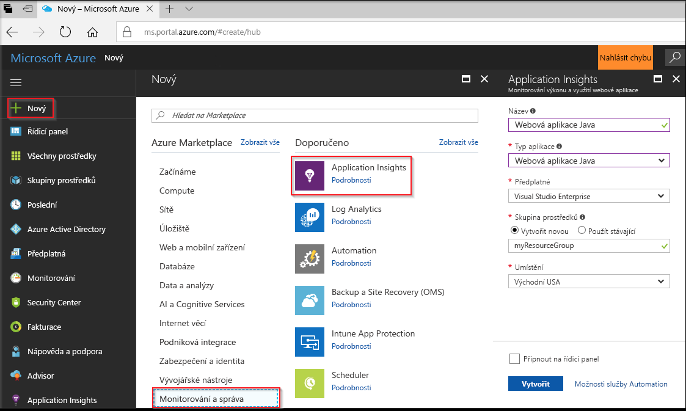
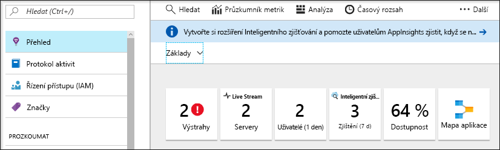
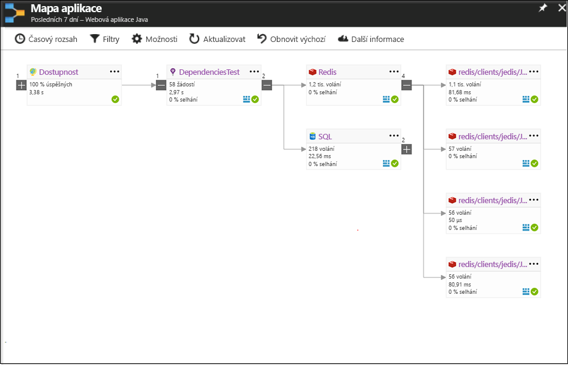
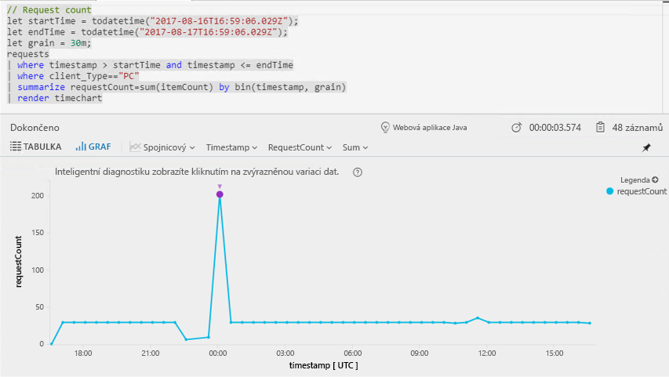
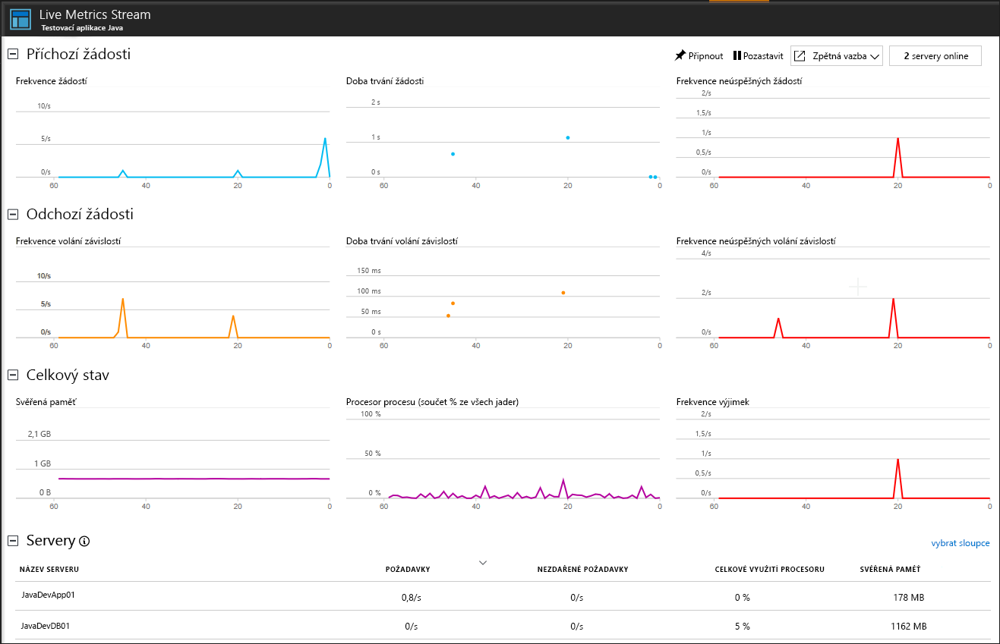

# <a name="start-monitoring-your-java-web-application"></a>Zahájení monitorování webové aplikace v Javě

Služba Azure Application Insights umožňuje monitorovat webové aplikace z hlediska dostupnosti, výkonu a využití. Můžete také rychle identifikovat a diagnostikovat chyby ve vaší aplikaci a nečekat na to, až je nahlásí uživatelé. Pomocí sady Application Insights Java SDK můžete monitorovat balíčky třetích stran, včetně MongoDB, MySQL a Redis.

Tento rychlý start vás provede přidáním sady Application Insights SDK do existujícího dynamického webového projektu v Javě.

## <a name="prerequisites"></a>Požadavky

K provedení kroků v tomto kurzu Rychlý start je potřeba:

- Nainstalujte si Oracle JRE 1.6 nebo novější nebo Zulu JRE 1.6 nebo novější.
- Nainstalujte si [integrované vývojové prostředí Eclipse pro vývojáře na platformě Java EE](http://www.eclipse.org/downloads/). Tento kurz Rychlý start používá Eclipse Oxygen (4.7).
- Budete potřebovat předplatné Azure a dynamický webový projekt v Javě.
 
Pokud dynamický webový projekt v Javě nemáte, můžete si ho vytvořit pomocí [rychlého startu pro vytvoření webové aplikace v Javě](https://docs.microsoft.com/azure/app-service-web/app-service-web-get-started-java).

Pokud ještě nemáte předplatné Azure, vytvořte si [bezplatný účet](https://azure.microsoft.com/free/) před tím, než začnete.

## <a name="log-in-to-the-azure-portal"></a>Přihlášení k portálu Azure Portal

Přihlaste se k portálu [Azure Portal](https://portal.azure.com/).

## <a name="enable-application-insights"></a>Povolení Application Insights

Application Insights může shromažďovat telemetrická data ze všech aplikací připojených k internetu bez ohledu na to, jestli jsou spuštěné místně nebo v cloudu. Pokud chcete tato data začít zobrazovat, použijte následující kroky.

1. Vyberte **Nový** > **Monitorování a správa** > **Application Insights**.

   

   Zobrazí se konfigurační pole. K vyplnění vstupních polí použijte následující tabulku.

    | Nastavení        | Hodnota           | Popis  |
   | ------------- |:-------------|:-----|
   | **Název**      | Globálně jedinečná hodnota | Název identifikující aplikaci, kterou monitorujete |
   | **typ aplikace** | Webová aplikace Java | Typ aplikace, kterou monitorujete |
   | **Skupina prostředků**     | myResourceGroup      | Název pro novou skupinu prostředků, která bude hostovat data App Insights |
   | **Umístění** | Východ USA | Vyberte umístění ve vaší blízkosti nebo v blízkosti místa, kde se vaše aplikace hostuje. |

2. Klikněte na možnost **Vytvořit**.

## <a name="install-app-insights-plugin"></a>Instalace modulu plug-in App Insights

1. Spusťte **Eclipse**, klikněte na **Nápověda** a vyberte **Instalovat nový software**.

   

2. Zkopírujte ```http://dl.microsoft.com/eclipse``` do pole Práce s. Zaškrtněte **Azure Toolkit for Java**, vyberte **Application Insights Plugin for Java** >  **a zrušte zaškrtnutí** Contact all update sites during install to find required software (Během instalace kontaktovat všechny weby aktualizace a zjistit požadovaný software).

3. Po dokončení instalace se zobrazí výzva k **restartování prostředí Eclipse**.

## <a name="configure-app-insights-plugin"></a>Konfigurace modulu plug-in App Insights

1. Spusťte **Eclipse** a otevřete příslušný **projekt**. V **prohlížeči projektu** klikněte pravým tlačítkem na název projektu. Vyberte **Azure** a klikněte na **Sign In** (Přihlásit se).

2. Vyberte **interaktivní**  metodu ověřování. Klikněte na **Přihlásit se** a po zobrazení výzvy zadejte **přihlašovací údaje Azure**. Vyberte **předplatné Azure**.

3. Klikněte pravým tlačítkem na název projektu v **prohlížeči projektu**, vyberte **Azure** a klikněte na **Nakonfigurovat Application Insights**.

4. Zaškrtněte **Enable telemetry with Application Insights** (Povolit telemetrii s Application Insights). Vyberte prostředek App Insights a přidružený **instrumentační klíč**, který chcete propojit k aplikaci v Javě.

   

> [!NOTE]
> Sada Application Insights SDK for Java dokáže zachycovat a vizualizovat živé metriky, ale když shromažďování telemetrických údajů povolíte poprvé, může to trvat několik minut, že se data začnou na portálu zobrazovat. Pokud používáte testovací aplikaci s nízkým provozem, nezapomínejte, že většina metrik se zachycuje, jenom když jsou nějaké aktivní požadavky nebo operace.

## <a name="start-monitoring-in-the-azure-portal"></a>Zahájení monitorování na webu Azure Portal

1. Teď můžete znovu otevřít stránku **Přehled** služby Application Insights na webu Azure Portal, kde jste získali svůj instrumentační klíč, a zobrazit podrobné informace o aktuálně spuštěné aplikaci.

   

2. Po kliknutí na **Mapa aplikace** se zobrazí rozložení vztahů závislosti mezi komponentami vaší aplikace. U každé komponenty se zobrazují klíčové ukazatele výkonu, jako je zatížení, výkon, selhání a upozornění.

   

3. Klikněte na ikonu **Analýza aplikace** . Otevře se **Application Insights – Analytics** s bohatým dotazovacím jazykem pro analýzu všech dat shromážděných službou Application Insights. V tomto případě jsme za vás vytvořili dotaz, který vykreslí počet požadavků ve formě grafu. Můžete psát své vlastní dotazy pro analýzu dalších dat.

   

4. Vraťte se na stránku **Přehled** a prozkoumejte **časovou osu přehledu stavu**.  Tento řídicí panel poskytuje statistické údaje o stavu vaší aplikace, včetně počtu příchozích požadavků, doby jejich trvání a všech chyb, ke kterým došlo.

   

   Pokud chcete povolit, aby se graf **Page View Load Time** naplnil **telemetrií na straně klienta**, na každou stránku, kterou chcete sledovat, přidejte následující skript:

   ```HTML
   <!-- 
   To collect end-user usage analytics about your application, 
   insert the following script into each page you want to track.
   Place this code immediately before the closing </head> tag,
   and before any other scripts. Your first data will appear 
   automatically in just a few seconds.
   -->
   <script type="text/javascript">
     var appInsights=window.appInsights||function(config){
     function i(config){t[config]=function(){var i=arguments;t.queue.push(function(){t[config].apply(t,i)})}}var t={config:config},u=document,e=window,o="script",s="AuthenticatedUserContext",h="start",c="stop",l="Track",a=l+"Event",v=l+"Page",y=u.createElement(o),r,f;y.src=config.url||"https://az416426.vo.msecnd.net/scripts/a/ai.0.js";u.getElementsByTagName(o)[0].parentNode.appendChild(y);try{t.cookie=u.cookie}catch(p){}for(t.queue=[],t.version="1.0",r=["Event","Exception","Metric","PageView","Trace","Dependency"];r.length;)i("track"+r.pop());return i("set"+s),i("clear"+s),i(h+a),i(c+a),i(h+v),i(c+v),i("flush"),config.disableExceptionTracking||(r="onerror",i("_"+r),f=e[r],e[r]=function(config,i,u,e,o){var s=f&&f(config,i,u,e,o);return s!==!0&&t["_"+r](config,i,u,e,o),s}),t
    }({
        instrumentationKey:"<instrumentation key>"
    });

    window.appInsights=appInsights;
    appInsights.trackPageView();
   </script>
    ```

5. Klikněte na **Live Stream**. Tady najdete živé metriky související s výkonem vaší webové aplikace v Javě. **Live Metrics Stream** zahrnuje údaje o počtu příchozích požadavků, době jejich trvání a všech chybách, ke kterým došlo. Nejdůležitější metriky výkonu, jako je procesor a paměť, můžete také monitorovat v reálném čase.

   

Pokud se chcete o monitorování Javy dozvědět víc, podívejte se na [další dokumentaci k Javě pro App Insights](.\app-insights-java-get-started.md).

## <a name="clean-up-resources"></a>Vyčištění prostředků

Pokud chcete pokračovat v práci s dalšími rychlými starty nebo kurzy, nevymazávejte prostředky vytvořené v rámci tohoto rychlého startu. Pokud pokračovat nechcete, pomocí následujících kroků odstraňte všechny prostředky vytvořené tímto rychlým startem na webu Azure Portal.

1. Na webu Azure Portal v nabídce vlevo klikněte na **Skupiny prostředků** a pak na **myResourceGroup**.
2. Na stránce skupiny prostředků klikněte na **Odstranit**, do textového pole zadejte **myResourceGroup** a pak klikněte na **Odstranit**.

## <a name="next-steps"></a>Další kroky

> [!div class="nextstepaction"]
> [Vyhledání a diagnostika potíží s výkonem](https://docs.microsoft.com/azure/application-insights/app-insights-analytics)