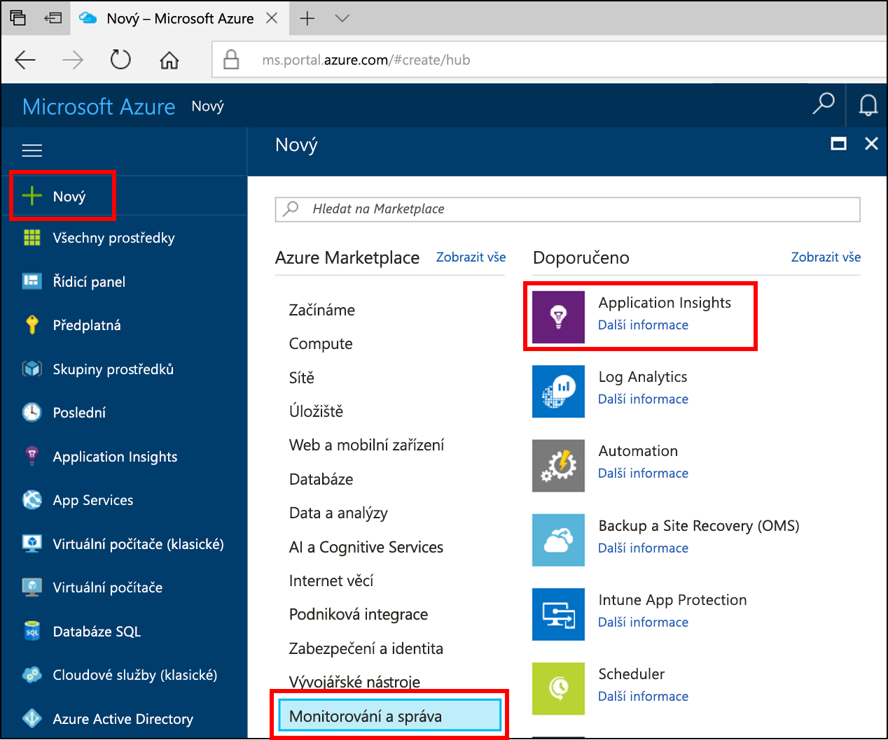
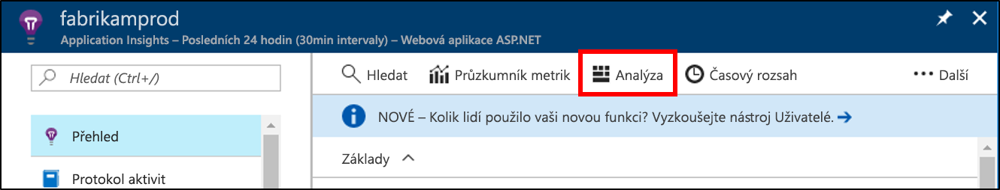
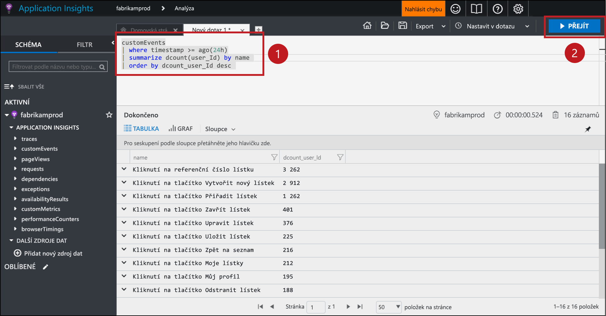
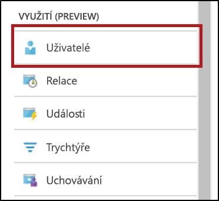
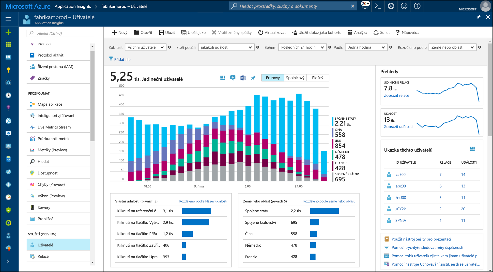
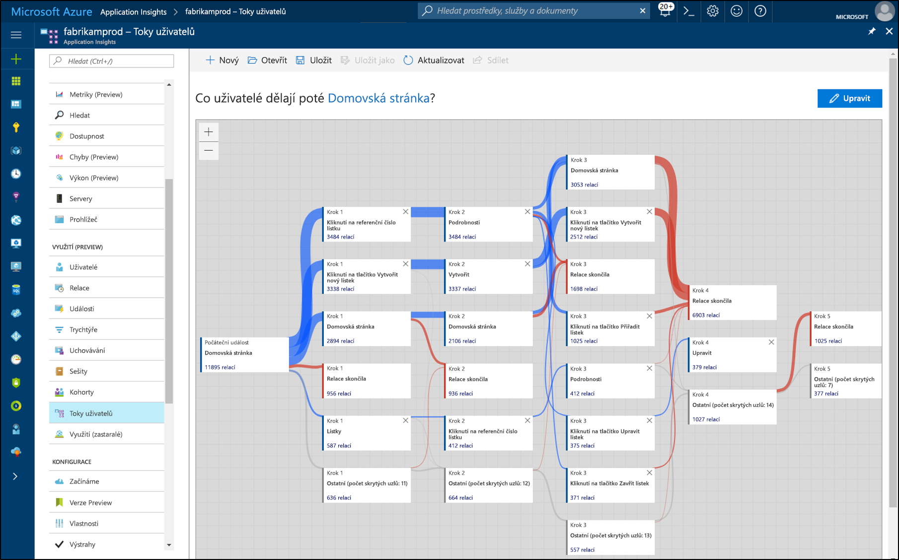

# <a name="start-analyzing-your-mobile-app-with-mobile-center-and-application-insights"></a>Začněte analyzovat mobilní aplikaci s Mobile Center a službu Application Insights

Tento rychlý start vás provede připojení instance Mobile Center vaší aplikace do služby Application Insights. S nástrojem Application Insights, můžete dotazovat, segmentovat, filtrovat a analyzovat telemetrie s více výkonné nástroje, než je k dispozici z [Analytics](https://docs.microsoft.com/mobile-center/analytics/) služby Mobile centra.

## <a name="prerequisites"></a>Požadavky

K dokončení tohoto rychlého startu je potřeba:

- Předplatné Azure.
- Aplikace iOS, Android, Xamarin, Universal Windows nebo reagovat nativní aplikaci.
 
Pokud ještě nemáte předplatné Azure, vytvořte si [bezplatný účet](https://azure.microsoft.com/free/) před tím, než začnete.

## <a name="onboard-to-mobile-center"></a>Zařadit do Mobile Center

Před Application Insights můžete použít s mobilní aplikace, budete muset připojit aplikaci [Mobile Center](https://docs.microsoft.com/mobile-center/). Application Insights neobdrží telemetrie ze své mobilní aplikace přímo. Místo toho vaše aplikace odesílá telemetrii vlastní události do centra Mobile. Pak Mobile Center nepřetržitě exportuje kopie těchto vlastních událostí do Application Insights, jako jsou přijaté události.

Zařadit do vaší aplikace využít postup rychlého spuštění Mobile Center pro každou platformu vaše aplikace podporuje. Vytvoření samostatné instance Mobile Center pro každou platformu:

* [iOS](https://docs.microsoft.com/mobile-center/sdk/getting-started/ios).
* [Android](https://docs.microsoft.com/mobile-center/sdk/getting-started/android).
* [Xamarin](https://docs.microsoft.com/mobile-center/sdk/getting-started/xamarin).
* [Universal Windows](https://docs.microsoft.com/mobile-center/sdk/getting-started/uwp).
* [Reagovat nativní](https://docs.microsoft.com/mobile-center/sdk/getting-started/react-native).

## <a name="track-events-in-your-app"></a>Sledování událostí v aplikaci

Po zařazený, nemá do centra mobilní aplikace se musí upravit tak, aby odeslání telemetrie vlastní události pomocí sady SDK Center Mobile. Vlastní události jsou pouze typ telemetrie Mobile Center, který je exportován do služby Application Insights.

Chcete-li odeslat vlastní události z aplikace pro iOS, použijte `trackEvent` nebo `trackEvent:withProperties` metody v sadě SDK Center Mobile. [Další informace o sledování událostí z aplikací pro iOS.](https://docs.microsoft.com/mobile-center/sdk/analytics/ios)

```Swift
MSAnalytics.trackEvent("Video clicked")
```

Chcete-li odeslat vlastní události z aplikace pro Android, použijte `trackEvent` metoda v sadě SDK Center Mobile. [Další informace o sledování událostí z aplikace pro Android.](https://docs.microsoft.com/mobile-center/sdk/analytics/android)

```Java
Analytics.trackEvent("Video clicked")
```

Chcete-li odeslat vlastních událostí z jiných platformách, aplikace, použijte `trackEvent` metody v jejich mobilních Center SDK.

Ujistěte se, přijímání vlastních událostí, přejděte na **události** v části **Analytics** oddílu v centru Mobile. Může trvat několik minut pro události se objeví z, když se odešlou z vaší aplikace.

## <a name="create-an-application-insights-resource"></a>Vytvořte prostředek Application Insights

Jakmile vaše aplikace odesílá vlastní události a tyto události jsou přijímá Mobile Center, musíte vytvořit prostředek typu Center Mobile Application Insights na portálu Azure:

1. Přihlaste se k portálu [Azure Portal](https://portal.azure.com/).
2. Vyberte **Nový** > **Monitorování a správa** > **Application Insights**.

    

    Zobrazí se pole konfigurace. Následující tabulku použijte k vyplnění vstupních polí.

    | Nastavení        |  Hodnota           | Popis  |
   | ------------- |:-------------|:-----|
   | **Název**      | Některé globálně jedinečná hodnota jako "Moje aplikace systému iOS" | Název identifikující aplikaci, kterou monitorujete |
   | **Typ aplikace** | Center mobilní aplikace | Typ aplikace, kterou monitorujete |
   | **Skupina prostředků**     | Novou skupinu prostředků nebo stávající z nabídky | Skupinu prostředků, ve které chcete vytvořit nový prostředek Application Insights |
   | **Umístění** | Umístění v nabídce | Vyberte umístění ve vaší blízkosti nebo v blízkosti místa, kde se vaše aplikace hostuje. |

3. Klikněte na možnost **Vytvořit**.

Pokud vaše aplikace podporuje víc platforem (iOS, Android, atd), je vhodné vytvořit samostatnou prostředky Application Insights, jeden pro každou platformu.

## <a name="export-to-application-insights"></a>Export do služby Application Insights

Ve vašem nový prostředek Application Insights na **přehled** stránku **Essentials** v horní části, zkopírujte klíč instrumentace pro tento prostředek.

V instanci Mobile Center pro aplikace:

1. Na **nastavení** klikněte na tlačítko **exportovat**.
2. Zvolte **nové exportovat**, vyberte **Application Insights**, pak klikněte na tlačítko **přizpůsobit**.
3. Vložte klíč instrumentace Application Insights do pole.
4. Zvýšení využití předplatného Azure obsahující prostředku Application Insights svůj souhlas. Každý prostředek Application Insights je zdarma pro první 1 GB dat přijatých za měsíc. [Další informace o cenách služby Application Insights.](https://azure.microsoft.com/pricing/details/application-insights/)

Nezapomeňte tento postup opakujte pro každou platformu vaše aplikace podporuje.

Jednou [exportovat](https://docs.microsoft.com/mobile-center/analytics/export) nastavena až, každý vlastní událostí přijatých Mobile Center zkopírován do Application Insights. Ho může trvat několik minut, aby události dosáhnout Application Insights, takže pokud nezobrazovaly okamžitě, čekat trochu další diagnostice.

Tak, abyste získali další data při prvním připojení, poslední 48 hodin vlastních událostí v centru Mobile exportují automaticky Application Insights.

## <a name="start-monitoring-your-app"></a>Spuštění monitorování aplikace

Application Insights můžete dotazovat, segmentovat, filtrovat a analyzovat vlastní události telemetrii z vašich aplikací, nad rámec nástroje analýzy, které poskytuje Mobile Center.

1. **Dotaz telemetrie vlastní události.** Ze služby Application Insights **přehled** vyberte **Analytics**. 

   

   Otevře se na portálu analýza Statistika aplikace přidružené k prostředku Application Insights. Na portálu analýza umožňuje přímo dotazování na data pomocí dotazu jazyka analýzy protokolů, takže libovolně komplexní dotazy můžete požádat o aplikaci a její uživatele.
   
   Otevřete novou kartu na portálu analýza potom vložte následující dotaz. Vrátí počet počet jedinečných uživatelů, kteří odeslali všechny vlastní události z vaší aplikace za posledních 24 hodin, seřazené podle tyto odlišné počty.

   ```AIQL
   customEvents
   | where timestamp >= ago(24h)
   | summarize dcount(user_Id) by name 
   | order by dcount_user_Id desc 
   ```

   

   1. Vyberte dotaz klepnutím na libovolné místo v dotazu v textovém editoru.
   2. Pak klikněte na tlačítko **přejděte** spusťte dotaz. 

   Další informace o [Application Insights Analytics](app-insights-analytics.md) a [analýzy protokolů dotazu jazyka](https://docs.loganalytics.io/docs/Language-Reference).


2. **Segment a filtrovat telemetrie vlastní události.** Ze služby Application Insights **přehled** vyberte **uživatelé** v obsahu.

   

   Nástroj Uživatelé ukazuje, kolik uživatelů vaší aplikace kliknutí na určité tlačítka, navštívené některé obrazovky nebo provést jiné akce, která jsou sledování jako událost s Mobile Center SDK. Pokud jste byla hledá způsob, jak segmentovat a filtrovat Mobile Center událostí, je nástroj Uživatelé je služba skvělou volbou.

    

   Například segmentovat vaše využití podle Geografie výběrem **zemi nebo oblast** v **rozdělit** rozevírací nabídce.

3. **Analýza vzory převodu, uchovávání a navigace ve vaší aplikaci.** Ze služby Application Insights **přehled** vyberte **uživatele toky** v obsahu.

   

   Nástroj uživatele toků vizualizuje události, které uživatelé posílat po některé počáteční události. Je vhodné pro získávání přehled o tom, jak uživatelé přecházejí mezi vaší aplikace. Může také odhalit míst, kde jsou mnoho uživatelů stloukání z vaší aplikace, nebo s opakováním stejné akce opakovaně.

   Kromě toků uživatele Application Insights obsahuje několik nástrojů analytics další využití zodpovědět konkrétní otázky:

   * **Nálevky** pro analýzu a převod sazby monitorování.
   * **Uchování** pro analýzu, jak dobře aplikace uchovává uživatele v čase.
   * **Sešity** pro kombinace vizualizace a text do sestavy ke sdílení.
   * **Kohorty** pro pojmenování a uložení konkrétních skupin uživatelů nebo události, může být snadno odkazován z dalších nástrojů analytics.

## <a name="clean-up-resources"></a>Vyčištění prostředků

Pokud nechcete pokračovat v používání Application Insights s Mobile Center, vypněte export centra mobilních a odstranit prostředek Application Insights. To vám zabrání v účtovány další pomocí Application Insights pro tento prostředek.

Chcete-li vypnout exportu v centru Mobile:

1. V centru Mobile, přejděte na **nastavení** a zvolte **exportovat**.
2. Klikněte na tlačítko Application Insights export, které chcete odstranit a pak klikněte na **odstranit export** v dolní části a potvrďte.

Odstranění prostředku Application Insights:

1. V levé nabídce portálu Azure, klikněte na tlačítko **skupiny prostředků** a potom vyberte skupinu prostředků, ve kterém byla vytvořena prostředku Application Insights.
2. Otevřete prostředek Application Insights, který chcete odstranit. Pak klikněte na tlačítko **odstranit** v horní nabídce prostředku a potvrďte. Tím se trvale odstraní kopii dat, který jste exportovali do Application Insights.

## <a name="next-steps"></a>Další kroky

> [!div class="nextstepaction"]
> [Pochopit, jak zákazníci používají vaši aplikaci](app-insights-usage-overview.md)