# Co je Application Insights?
Application Insights je rozšiřitelná služba pro správu výkonu aplikací (APM). Je určena webovým vývojářům na více platformách. Slouží k monitorování živé webové aplikace. Automaticky zjišťuje anomálie ve výkonu. Obsahuje výkonné analytické nástroje pro diagnostiku problémů a pomáhá porozumět, jak vlastně uživatelé vaši aplikaci používají.  Je navržená tak, aby pomáhala průběžně vylepšovat výkon a možnosti využití. Funguje u aplikací na široké škále platforem, jako jsou .NET, Node.js a J2EE, a to hostovaných lokálně i v cloudu. Integruje se s vaším procesem DevOps a obsahuje body připojení k celé řadě dalších vývojářských nástrojů. Díky integraci s Visual Studio App Center a HockeyApp může monitorovat a analyzovat telemetrii z mobilních aplikací.

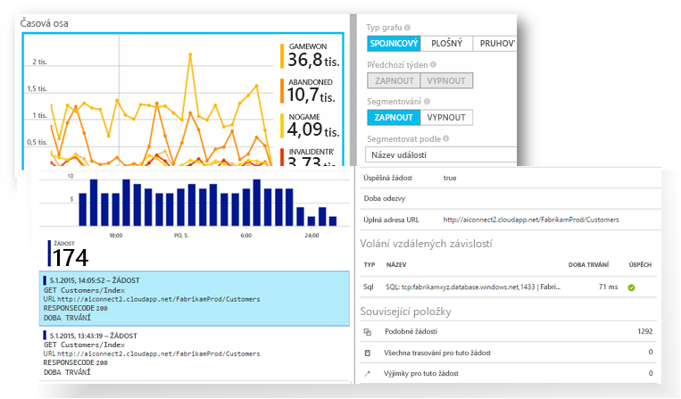

[Prohlédněte si úvod animace](https://www.youtube.com/watch?v=fX2NtGrh-Y0).

## Jak Application Insights funguje?
Do aplikace nainstalujete malý instrumentační balíček a vytvoříte prostředek Application Insights na webu Microsoft Azure Portal. Instrumentace monitoruje vaši aplikaci a odesílá telemetrická data na portál. (Aplikace se dá spustit kdekoli, nemusí být hostovaná v Azure.)

Instrumentovat můžete nejenom aplikaci webové služby, ale také libovolné komponenty na pozadí a JavaScript na samotných webových stránkách. 

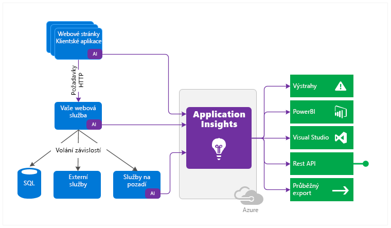

Kromě toho můžete využít telemetrii z hostitelských prostředí, jako jsou třeba čítače výkonu, diagnostika Azure nebo protokoly Dockeru. Můžete také nastavit webové testy, které webové službě pravidelně odesílají umělé požadavky.

Všechny tyto telemetrické datové proudy jsou integrované na webu Azure Portal, kde můžete nezpracovaná data využít výkonné analytické a vyhledávací nástroje.

### Jaká je s tím spojená režie?
Dopad na výkon vaší aplikace je velmi malý. Sledovací volání neblokují, spojují se do dávek a odesílají v samostatném vlákně.

## Co Application Insights monitoruje?

Služba Application Insights je zaměřená na vývojový tým. Pomáhá pochopit, jaký je výkon vaší aplikace a jak se využívá. Monitoruje tyto parametry:

* **Frekvence požadavků, doby odezvy a míra selhání** – Zjistěte, které stránky jsou nejoblíbenější a v kterou denní dobu a kde jsou vaši uživatelé. Zjistíte, která stránka si vede nejlépe. Pokud se při zvýšení počtu požadavků zvýší i doba odezvy a míra selhání, máte pravděpodobně potíže s prostředky. 
* **Míra závislosti, doby odezvy a míra selhání** – Zjistěte, jestli vás nezpomalují externí služby.
* **Výjimky** – Analyzuje souhrnné statistiky nebo vyberte konkrétní instance a přejděte k podrobným informacím o trasování zásobníku a souvisejících požadavcích. Hlásí se výjimky serveru i prohlížeče.
* **Zobrazení a načítání stránek** – Tyto informace hlásí prohlížeče uživatelů.
* **Volání AJAX** z webových stránek – frekvence, doby odezvy a míry selhání.
* **Počty uživatelů a relací**.
* **Čítače výkonu** ze serverových počítačů s Windows nebo Linuxem, jako je třeba CPU, paměť a využití sítě. 
* **Diagnostika hostitele** z Dockeru nebo Azure. 
* **Protokoly trasování diagnostiky** z vaší aplikace – umožňují zjistit korelaci mezi požadavky a událostmi trasování.
* **Vlastní události a metriky**, které napíšete sami v kódu klienta nebo serveru, ke sledování obchodních událostí, jako například jsou třeba prodané položky nebo vyhrané hry.

## Kde se zobrazuje telemetrie?

Data se dají prozkoumávat mnoha způsoby. Podívejte se na tyto články:

|  |  |
| --- | --- |
| [**Inteligentní zjišťování a ruční výstrahy**](app-insights-proactive-diagnostics.md) Automatické výstrahy se přizpůsobí běžným vzorům telemetrie vaší aplikace a aktivují se, když se stane něco neobvyklého. Můžete také [nastavit výstrahy](app-insights-alerts.md) pro konkrétní úrovně vlastních nebo standardních metrik. |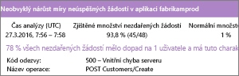 |
| [**Mapa aplikace**](app-insights-app-map.md) Komponenty vaší aplikace, včetně klíčových metrik a výstrah. |  |
| [**Profiler**](app-insights-profiler.md) Zkontrolujte profily spouštění u vzorků požadavků. |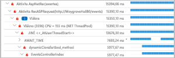 |
| [**Analýza využití**](app-insights-usage-overview.md) Analyzujte segmentaci a udržení uživatelů.| |
| [**Diagnostické vyhledávání dat instancí**](app-insights-diagnostic-search.md) Události vyhledávání a filtrování, jako jsou třeba požadavky, výjimky, volání závislosti, trasování protokolů a zobrazení stránek.  |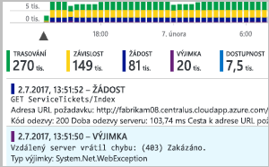 |
| [**Průzkumník metrik pro agregovaná data**](app-insights-metrics-explorer.md) Prozkoumání, filtrování a segmentace agregovaných dat, jako jsou třeba frekvence požadavků, selhání a výjimek, doby odezvy a časy načtení stránek. | |
| [**Řídicí panely**](app-insights-dashboards.md#dashboards) Propojení dat z různých zdrojů a jejich sdílení s ostatními. Ideální pro aplikace s více komponentami a pro nepřetržité zobrazení v týmové místnosti. | |
| [**Live Metrics Stream**](app-insights-live-stream.md) Při nasazování nového sestavení sledujte tyto ukazatele výkonu téměř v reálném čase, abyste se ujistili, že všechno funguje podle očekávání. |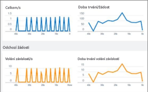 |
| [**Analýzy**](app-insights-analytics.md) Tento výkonný dotazovací jazyk umožňuje odpovědět na složité dotazy týkající se využití a výkonu vaší aplikace. |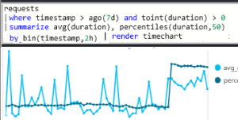 |
| [**Visual Studio**](app-insights-visual-studio.md) Viz údaje o výkonu v kódu. Ke kódu je možné přejít z trasování zásobníku.|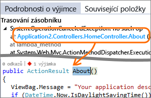 |
| [**Ladicí program snímků**](app-insights-snapshot-debugger.md) Laďte vzorky snímků z operací za provozu s hodnotami parametrů.|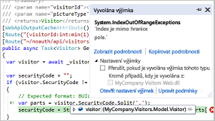 |
| [**Power BI**](app-insights-export-power-bi.md) Integrujte metriky využití s ostatními funkcemi business intelligence.| 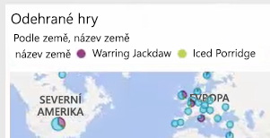|
| [**REST API**](https://dev.applicationinsights.io/) Napište kód pro spouštění dotazů nad daty metrik a nezpracovanými daty.|  |
| [**Průběžný export**](app-insights-export-telemetry.md) Nezpracovaná data se dají hromadně exportovat do úložiště, jakmile dorazí. |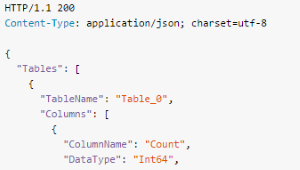 |

## Jak se Application Insights dá využít?

### Monitorování
Nainstalujte Application Insights ve vaší aplikaci, nastavte [webové testy dostupnosti](app-insights-monitor-web-app-availability.md) a:

* Vytvořte [řídicí panel](app-insights-dashboards.md) pro vaši týmovou místnost a sledujte zatížení, rychlost odezvy a výkon vašich závislostí, načtení stránek a volání AJAX.
* Zjistěte, které požadavky jsou nejpomalejší a u kterých nejčastěji dochází k selhání.
* Při nasazování nové verze sledujte [živý datový proud](app-insights-live-stream.md), abyste se o případném snížená výkonu dozvěděli okamžitě.

### Detekce a diagnostika
Když dostanete výstrahu nebo zjistíte problém:

* Posuďte, kolika uživatelů se top týká.
* Dejte selhání do souvislosti s výjimkami, voláními závislosti a trasováními.
* Prozkoumejte profiler, snímky, výpisy zásobníků a protokoly trasování.

### Vytváření, měření a učení
[Změřte efektivitu](app-insights-usage-overview.md) každé nové funkce, kterou nasadíte.

* Naplánujte měření toho, jak nové obchodní nebo UIX funkce využívají zákazníci.
* Napište do svého kódu vlastní telemetrii.
* Další vývojový cyklus založte na faktických důkazech z vaší telemetrie.

## Začínáme
Application Insights je jedna z mnoha služeb hostovaných v Microsoft Azure. Odesílá se do ní telemetrie pro účely analýzy a prezentace. Proto ještě než se pustíte do práce, budete potřebovat předplatné [Microsoft Azure](http://azure.com). Registrace je zdarma. Pokud zvolíte základní [cenový plán](https://azure.microsoft.com/pricing/details/application-insights/) služby Application Insights, nebudou se vám účtovat žádné poplatky, dokud se vaše aplikace nezačne významněji využívat. Pokud vaše organizace už předplatné má, je možné do něj přidat účet Microsoft.

Existuje několik způsobů, jak začít. Použijte ten, který vám nejvíce vyhovuje. K ostatním se můžete vrátit později.

* **Během spuštění: Instrumentujte vaši webové aplikace na serveru.** Vyhněte se jakýmkoli aktualizacím kódu. K serveru budete potřebovat přístup správce.
  * [**IIS místně nebo ve virtuálním počítači**](app-insights-monitor-performance-live-website-now.md)
  * [**Virtuální počítač nebo webová aplikace Azure**](app-insights-monitor-performance-live-website-now.md)
  * [**J2EE**](app-insights-java-live.md)
* **Během vývoje: Přidejte Application Insights do vašeho kódu.** Umožňuje napsat vlastní telemetrii a instrumentovat back-endové a desktopové aplikace.
  * [Visual Studio](app-insights-asp-net.md) 2013 s aktualizací Update 2 nebo novější.
  * Java v [Eclipse](app-insights-java-eclipse.md) nebo [jiné nástroje](app-insights-java-get-started.md)
  * [Node.js](app-insights-nodejs.md)
  * [Jiné platformy](app-insights-platforms.md)
* **[Instrumentace webových stránek](app-insights-javascript.md)** pro zobrazení stránek, AJAX a další telemetrii na straně klienta.
* **[Analýza využití mobilních aplikací](app-insights-mobile-center-quickstart.md)** díky integraci s Visual Studio App Center.
* **[Testy dostupnosti](app-insights-monitor-web-app-availability.md)** – Příkazem ping z našich serverů pravidelně testujte váš web.

## Další kroky
Začínáme při spuštění:

* [Server IIS](app-insights-monitor-performance-live-website-now.md)
* [Server J2EE](app-insights-java-live.md)

Začínáme při vývoji:

* [ASP.NET](app-insights-asp-net.md)
* [Java](app-insights-java-get-started.md)
* [Node.js](app-insights-nodejs.md)

## Podpora a zpětná vazba
* Otázky a problémy:
  * [Řešení potíží][qna]
  * [Fórum MSDN](https://social.msdn.microsoft.com/Forums/vstudio/home?forum=ApplicationInsights)
  * [StackOverflow](http://stackoverflow.com/questions/tagged/ms-application-insights)
* Vaše návrhy:
  * [UserVoice](https://visualstudio.uservoice.com/forums/357324)
* Blog:
  * [Blog Application Insights](https://azure.microsoft.com/blog/tag/application-insights)

## Videa

[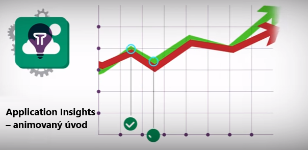](https://www.youtube.com/watch?v=fX2NtGrh-Y0)

> [!VIDEO https://channel9.msdn.com/events/Connect/2016/100/player] 

<!--Link references-->

[android]: https://github.com/Microsoft/ApplicationInsights-Android
[azure]: ../insights-perf-analytics.md
[client]: app-insights-javascript.md
[desktop]: app-insights-windows-desktop.md
[detect]: app-insights-detect-triage-diagnose.md
[greenbrown]: app-insights-asp-net.md
[ios]: https://github.com/Microsoft/ApplicationInsights-iOS
[java]: app-insights-java-get-started.md
[knowUsers]: app-insights-web-track-usage.md
[platforms]: app-insights-platforms.md
[portal]: http://portal.azure.com/
[qna]: app-insights-troubleshoot-faq.md
[redfield]: app-insights-monitor-performance-live-website-now.md
