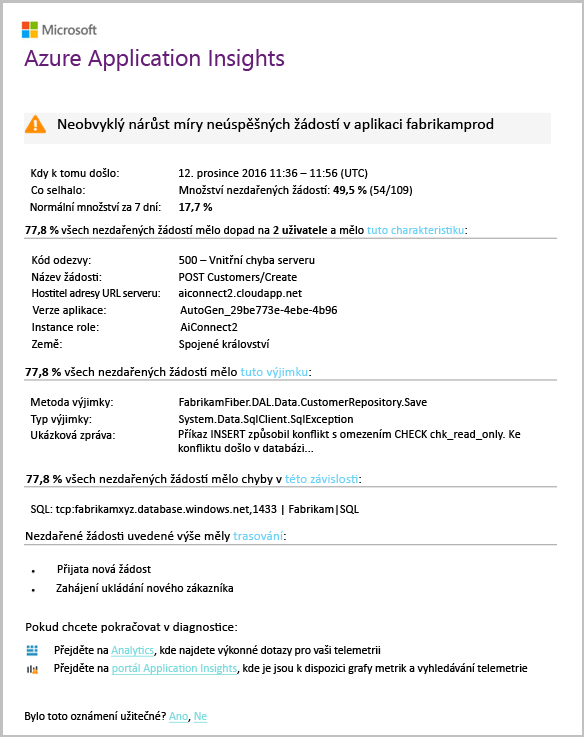

# Inteligentní detekce - anomálií selhání
[Application Insights](app-insights-overview.md) automaticky vás upozorní skoro v reálném čase, pokud dojde neobvyklé zvýšení počet neúspěšných žádostí vaší webové aplikace. Zjistí neobvyklého nárůstu počet požadavků HTTP nebo závislostí volání, které jsou hlášeny jako se nezdařilo. Pro žádosti neúspěšné požadavky jsou obvykle s kódy odpovědí 400 nebo vyšší. Můžete rychlou kontrolu a diagnostikovat problém, analýzu charakteristiky selhání a související telemetrii je součástí oznámení. Existují také odkazy na portálu služby Application Insights pro další diagnostiku. Tato funkce musí žádné nastavení ani konfigurace, protože využívá algoritmy strojového učení k předpovědi je míra selhání normální.

Tato funkce funguje pro Java a ASP.NET webové aplikace hostované v cloudu nebo na serverech. Taky funguje pro každou aplikaci, která generuje telemetrická žádost nebo závislost – například pokud máte role pracovního procesu, který volá [TrackRequest()](app-insights-api-custom-events-metrics.md#trackrequest) nebo [TrackDependency()](app-insights-api-custom-events-metrics.md#trackdependency).

Po nastavení [Application Insights pro svůj projekt](app-insights-overview.md), a pokud vaše aplikace generuje určité minimální množství telemetrie, inteligentní detekce anomálií selhání trvá další normální chování vaší aplikace, než je 24 hodin zapnout a může odesílat výstrahy.

Zde je ukázka výstraha.

> [!NOTE]
> Ve výchozím nastavení zobrazí kratší pošty formátu než v tomto příkladu. Ale můžete [přepnout na tento podrobný formát](#configure-alerts).
>
>

Všimněte si, že se dozvíte:

* Míra selhání ve srovnání s chování normální aplikace.
* Počet uživatelů, kteří jsou vliv – abyste věděli, kolik starat.
* Charakteristik vzor přidružené chyby. V tomto příkladu je kód konkrétní odpovědi, název požadavku (operace) a verzí v aplikaci. Které okamžitě sděluje, kde začít hledat v kódu. Další možnosti může být konkrétní operační systém prohlížeče nebo klienta.
* Výjimka, trasování protokolu a selhání závislosti (databáze nebo dalších externích součástí), zobrazí jako přidružen charakterizované selhání.
* Přímé odkazy na relevantní vyhledávání v telemetrii ve službě Application Insights.

## Výhody Inteligentní detekce
Obyčejnou [metriky výstrahy](app-insights-alerts.md) zjistíte, může se jednat o problém. Ale Inteligentní detekce spuštění diagnostiky pracovní pro vás, provádění mnoho analýzy, že byste jinak museli dělat sami. Můžete získat výsledky přehledně zabalené, což pomáhá rychle získat do kořenového adresáře problému.

## Jak to funguje
Inteligentní detekce monitoruje telemetrická data přijata z vaší aplikace, zejména selhání sazby. Toto pravidlo spočítá počet požadavků, pro kterou `Successful request` vlastnost má hodnotu false, a počet závislostí volání pro kterou `Successful call` vlastnost je false. Pro žádosti, ve výchozím nastavení `Successful request == (resultCode < 400)` (Pokud jste napsali vlastní kód pro [filtru](app-insights-api-filtering-sampling.md#filtering) nebo vygenerování vlastního [TrackRequest](app-insights-api-custom-events-metrics.md#trackrequest) volání). 

Výkon vaší aplikace má typický vzor chování. Některé požadavků nebo závislostí volání budou náchylnější k selhání než jiné; a celkové míra selhání může se stát, zatížením. Inteligentní detekce využívá strojové učení k vyhledání tyto anomálií.

Jako telemetrie dodává do Application Insights z vaší webové aplikace, inteligentní detekce porovná aktuální chování vzory vidět za posledních několik dnů. Pokud neobvyklý růst v míra selhání pozorovanou porovnáním s předchozí výkonu, analýzu se aktivuje.

Když se aktivuje analýzu službu analysis clusteru provádí chybných požadavků a pokouší se určit vzor hodnot, které charakterizovat chyby. V předchozím příkladu analýza zjistila, že většina selhání jsou o konkrétní výsledný kód, název požadavku, hostitele adresy URL serveru a role instance. Analýza naopak zjistila vlastnost operačního systému klienta v průběhu více hodnot, a proto není uveden.

Když služby je instrumentována pomocí těchto volání telemetrie, vyhledá analyzátoru výjimku a selhání závislostí, které jsou přidružené požadavky v clusteru, který má identifikuje, společně s příklady všech protokolů trasování, které jsou spojené s těmito požadavky.

Výsledný analysis vám bude zaslána jako výstrahu, pokud jste ji nakonfigurovali nikoli k.

Podobně jako [výstrahy, můžete nastavit ručně](app-insights-alerts.md), můžete zkontrolovat stav výstrahy a nakonfigurovat ho v okně výstrahy prostředku Application Insights. Ale na rozdíl od ostatních výstrah, nemusíte nastavení nebo konfigurace Inteligentní detekce. Pokud chcete, můžete zakázat nebo změnit jeho cíl e-mailové adresy.

## Konfigurace výstrah
Můžete zakázat Inteligentní detekce, změnit příjemců e-mailu, vytvořit webhook, jehož nebo vyjádřit výslovný souhlas pro podrobnější výstražné zprávy.

Otevřete stránku výstrahy. Selhání anomálie se dodává spolu s všechny výstrahy, které jste si nastavili ručně, a zobrazí se, zda právě probíhá její stav výstrahy.

Klikněte na výstrahu, kterou chcete nakonfigurovat ji.

Všimněte si, že můžete zakázat Inteligentní detekce, ale nelze ho proto odstranit (nebo vytvořte jiný).

#### Podrobné výstrahy
Pokud zvolíte možnost "Získat podrobnější Diagnostika" e-mailu, bude obsahovat další diagnostické informace. V některých případech budete moct diagnostikovat problém právě z dat v e-mailu.

Není lehké riziko, že podrobnější výstrahy můžou obsahovat citlivé informace, protože obsahuje výjimku a trasování zpráv. Však tomu by mohlo dojít pouze pokud váš kód by se mohl citlivých informací do těchto zpráv.

## Triaging a diagnostice výstrahu
Výstraha naznačuje, že byl zjištěn neobvyklý růst v frekvence neúspěšných požadavků. Je pravděpodobné, že je nějaký problém s vaší aplikace nebo jeho prostředí.

Z procento požadavky a počet ovlivněných uživatelů můžete rozhodnout, jak naléhavé problém. V příkladu nahoře je míra selhání 22,5 % porovná s normální rychlosti % 1, označuje, že něco chybný se děje. Na druhé straně byly ovlivněny pouze 11 uživatele. Pokud by měla aplikace, by mohli k vyhodnocení, jak závažná, je.

V mnoha případech bude moci diagnostikovat problém rychle z žádosti o název, výjimky, závislost selhání a trasování data poskytnutá.

Existují některé další různá vodítka. Například je míra selhání závislostí v tomto příkladu je stejný jako výjimka rychlost (89.3 %). To naznačuje, že nastane výjimka přímo z chyby závislosti - budete jasno, kde začít hledat v kódu.

Dále prozkoumat, odkazy v každé části vás nasměruje přímo do [stránky hledání](app-insights-diagnostic-search.md) filtruje tak, aby příslušné požadavky, výjimky, závislostí nebo trasování. Nebo můžete otevřít [portál Azure](https://portal.azure.com), přejděte do prostředku Application Insights pro vaši aplikaci a otevřete okno selhání.

V tomto příkladu kliknutím na odkaz 'Zobrazit podrobnosti selhání závislosti' otevře v okně hledání Application Insights. Zobrazí příkaz SQL, který obsahuje příklad příčiny: hodnoty Null byly poskytnuty v povinná pole a neprošel ověřením při ukládání operace.

## Nedávné výstrahy můžete zkontrolovat

Klikněte na tlačítko **Inteligentní detekce** získat nejnovější výstrahy:

## Jaký je rozdíl...
Inteligentní detekce anomálií selhání doplňuje jiné podobné avšak odlišné funkce Application Insights.

* [Metriky výstrahy](app-insights-alerts.md) jsou nastavené sami a můžete monitorovat řadu metrik, jako je například obsazení procesoru, požadavků, časů načtení stránky a tak dále. Můžete je používat k varovat, například pokud budete muset přidat další prostředky. Naopak Inteligentní detekce anomálií selhání obsahuje malé řadu důležitých metriky (aktuálně pouze chybných požadavků rychlost), navržená tak, aby oznámí, že jste v téměř v reálném čase způsobem po vaší webové aplikace se nezdařilo požadavku zvyšuje rychlost výrazně ve srovnání s webovou aplikaci normální chování.

    Inteligentní detekce automaticky upraví jeho prahovou hodnotu v odpovědi na běžné podmínky.

    Inteligentní zjišťování spustí diagnostiky práci za vás.
* [Inteligentní detekce anomálií výkonu](app-insights-proactive-performance-diagnostics.md) také používá počítač intelligence ke zjištění neobvyklé vzorců vaše metriky a není nutná žádná konfigurace vy. Ale na rozdíl od Inteligentní detekce anomálií selhání účelem Inteligentní detekce anomálií výkonu je najít segmenty vaší potrubí využití, který může být chybně zpracoval – například podle konkrétní stránky na určitý typ prohlížeče. Každý den provedení analýzy a pokud se nenajde žádný výsledek, bude nejspíš naléhavé mnohem menší než výstrahu. Naopak nepřetržitě provedení analýzy selhání anomálií na příchozích telemetrických dat, a budete informováni, minut Pokud sazby selhání serveru jsou větší, než se očekávalo.

## Pokud se zobrazí upozornění na inteligentní detekce
*Proč obdrželi tuto výstrahu?*

* Zjistili jsme neobvyklý růst v rychlost neúspěšných požadavků v porovnání s normální účaří úvodní tečky. Po dokončení analýzy selhání a související telemetrii myslíme si, že dojde k problému, který by měl vypadat do.

*Znamená oznámení, že jsou výborný problém?*

* Pokusíme se výstraha na přerušení aplikace nebo snížení výkonu, ale pouze můžete plně pochopit sémantiky a dopadu na aplikace nebo uživatele.

*Ano se možnost nepřetržitého podíváte na svá data?*

* Ne. Služba je plně automatická. Pouze zobrazí oznámení. Vaše data jsou [privátní](app-insights-data-retention-privacy.md).

*Je nutné k odběru Tato výstraha?*

* Ne. Každá aplikace, že odešle požadavek telemetrie má pravidlo výstrahy Inteligentní detekce.

*Můžete zrušit nebo dostávat oznámení, namísto toho odesílána kolegové?*

* Ano, pravidla v výstrah, klikněte na tlačítko pravidla inteligentního detekce jeho konfiguraci. Můžete zakázat výstrahy, nebo změnit příjemce pro výstrahy.

*Ztrátou e-mailu. Kde najdu oznámení na portálu*

* V protokolech aktivity. V Azure otevřete prostředek Application Insights pro vaši aplikaci a potom vyberte protokoly aktivity.

*Některé výstrahy jsou o známých problémech a není chcete přijímat.*

* Máme potlačení výstrahy na našem nevyřízených položek.

## Další kroky
Tyto diagnostické nástroje můžete zkontrolovat telemetrie z vaší aplikace:

* [Metriky explorer](app-insights-metrics-explorer.md)
* [Průzkumník služby Search](app-insights-diagnostic-search.md)
* [Analýza - účinný dotazovací jazyk](app-insights-analytics-tour.md)

Inteligentní detekce jsou zcela automatické. Ale možná chcete nastavit některé další výstrahy?

* [Ručně konfigurované metriky výstrahy](app-insights-alerts.md)
* [Testy dostupnosti webu](app-insights-monitor-web-app-availability.md)
