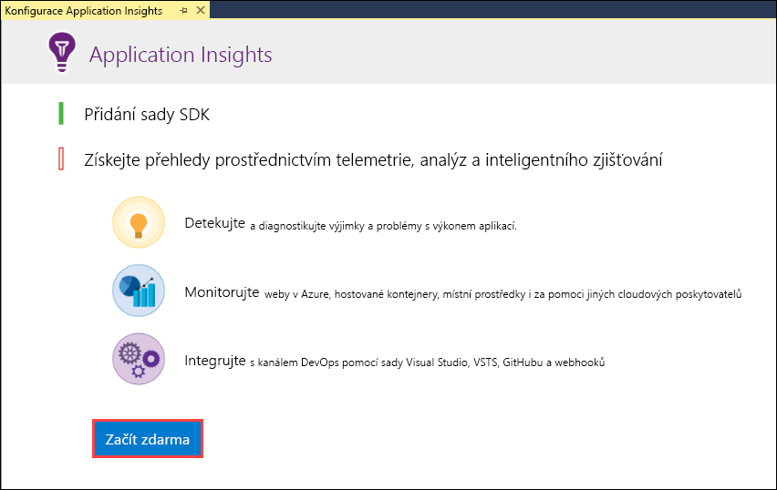
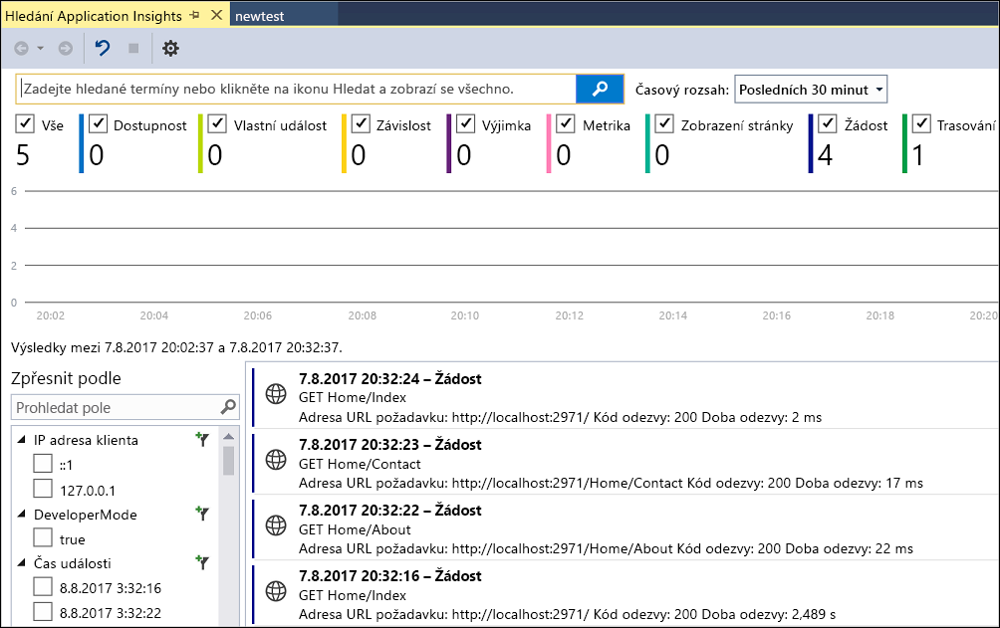
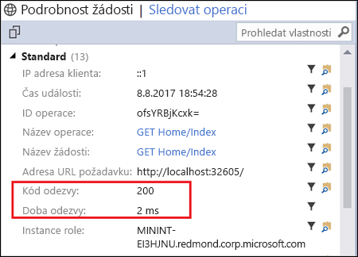
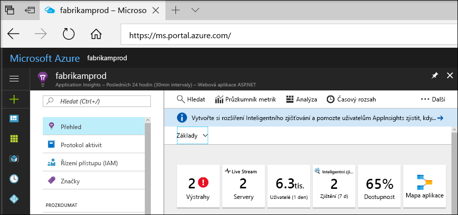
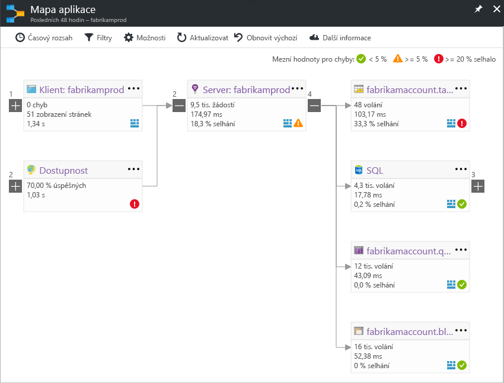
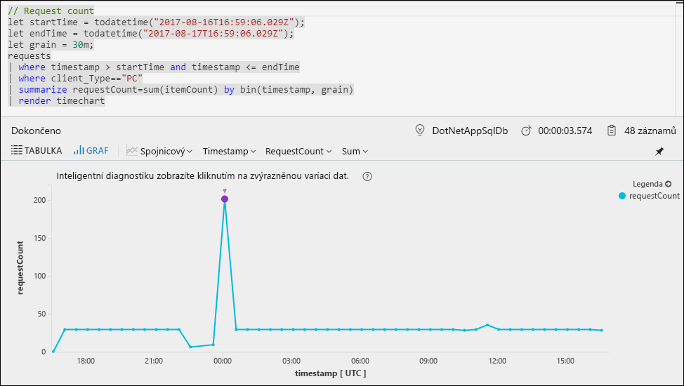
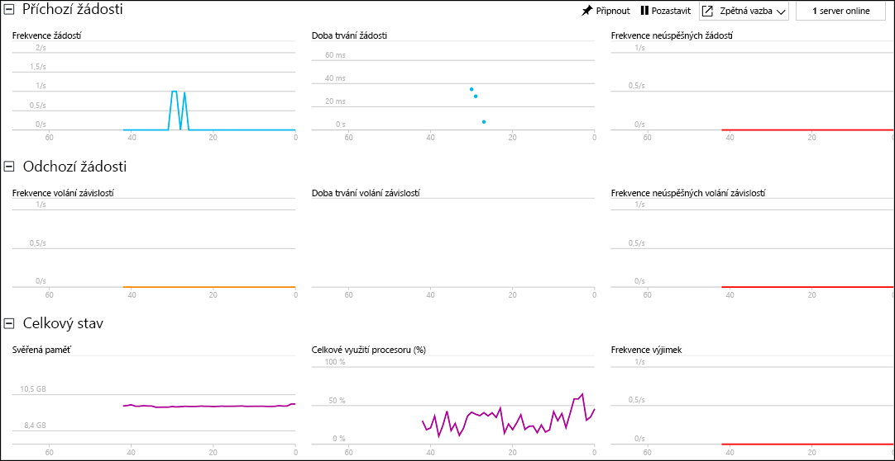

# Zahájení monitorování webové aplikace v ASP.NET

Služba Azure Application Insights umožňuje monitorovat webové aplikace z hlediska dostupnosti, výkonu a využití.  Můžete také rychle identifikovat a diagnostikovat chyby ve vaší aplikaci a nečekat na to, až je nahlásí uživatelé.  Na základě informací o výkonu a efektivitu vaší aplikace, které získáte ze služby Application Insights, můžete informovaně rozhodovat o údržbě a vylepšení vaší aplikace.

V tomto kurzu Rychlý start se dozvíte, jak přidat Application Insights do už existující webové aplikace v ASP.NET a začít analyzovat živé statistiky. Je to jedna z řady různých metod, které můžete využít k analýze vaší aplikace. Pokud webovou aplikaci v ASP.NET nemáte, můžete si ji vytvořit pomocí [kurzu Rychlý start pro vytvoření webové aplikace v ASP.NET](../app-service/app-service-web-get-started-dotnet.md).

## Požadavky
K provedení kroků v tomto kurzu Rychlý start je potřeba:

- Nainstalovat [Visual Studio 2017](https://www.visualstudio.com/downloads/) s následujícími sadami funkcí:
    - Vývoj pro ASP.NET a web
    - Vývoj pro Azure

Pokud ještě nemáte předplatné Azure, vytvořte si [bezplatný účet](https://azure.microsoft.com/free/) před tím, než začnete.

## Povolení Application Insights

1. Otevřete svůj projekt v sadě Visual Studio 2017.
2. V nabídce Projekt vyberte **Nakonfigurovat Application Insights**. Visual Studio přidá Application Insights SDK do vaší aplikace.
3. Klikněte na **Začít zdarma**, vyberte plán fakturace, kterému dáváte přednost, a klikněte na **Registrovat**.

    

4. Aplikaci spusťte výběrem příkazu **Spustit ladění** z nabídky **Ladit** nebo stisknutím klávesy F5.

## Potvrzení konfigurace aplikace

Application Insights shromažďuje telemetrická data pro vaši aplikaci bez ohledu na to, kde je spuštěná. Pokud chcete tato data začít zobrazovat, použijte následující kroky.

1. Otevřete Application Insights kliknutím na **Projekt** -> **Application Insights** -> **Hledat telemetrii relace ladění**.  Zobrazí se telemetrie z aktuální relace.  

2. Klikněte na první požadavek v seznamu list (v tomto příkladu GET Home/Index). Zobrazí se podrobné informace o tomto požadavku. Všimněte si, že se kromě dalších cenných informací o požadavku zobrazí také stavový kód a doba odezvy.  

## Zahájení monitorování na webu Azure Portal

Teď můžete otevřít Application Insights na webu Azure Portal a prohlédnout si různé podrobnosti o spuštěné aplikaci.

1. Klikněte pravým tlačítkem na složku **Connected Services Application Insights** v Průzkumníku řešení a klikněte na **Otevřít portál Application Insights**.  Zobrazí se informace o vaší aplikaci a řada různých možností.

    

2. Po kliknutí na **Mapa aplikace** se zobrazí rozložení vztahů závislosti mezi komponentami vaší aplikace.  U každé komponenty se zobrazují klíčové ukazatele výkonu, jako je zatížení, výkon, selhání a upozornění.

    

3. Klikněte na ikonu **App Analytics**  u jedné z komponent aplikace.  Otevře se **Application Insights – Analytics** s bohatým dotazovacím jazykem pro analýzu všech dat shromážděných službou Application Insights.  V tomto případě jsme za vás vytvořili dotaz, který vykreslí počet požadavků ve formě grafu.  Můžete psát své vlastní dotazy pro analýzu dalších dat.

    

4. Vraťte se na stránku s **přehledem** a klikněte na **Live Stream**.  Zobrazí se provozní statistika vaší aplikace, protože je spuštěná.  Zahrnují mimo jiné údaje o počtu příchozích požadavků, době jejich trvání a všech chybách, ke kterým došlo.  Můžete také prohlížet nejdůležitější metriky výkonu, jako je procesor a paměť.

    

Pokud jste připraveni hostovat vaši aplikace v Azure, můžete ji teď publikovat. Postupujte podle kroků popsaných v [kurzu Rychlý start pro vytvoření webové aplikace v ASP.NET](../app-service/app-service-web-get-started-dotnet.md#update-the-app-and-redeploy).

## Další kroky
V tomto kurzu Rychlý start jste povolili monitorování vaší aplikace pomocí služby Azure Application Insights.  Pokud chcete zjistit, jak ji používat k monitorování statistik a detekování potíží ve vaší aplikaci, přejděte k dalším kurzům.

> [!div class="nextstepaction"]
> [Kurzy k Azure Application Insights](app-insights-tutorial-runtime-exceptions.md)