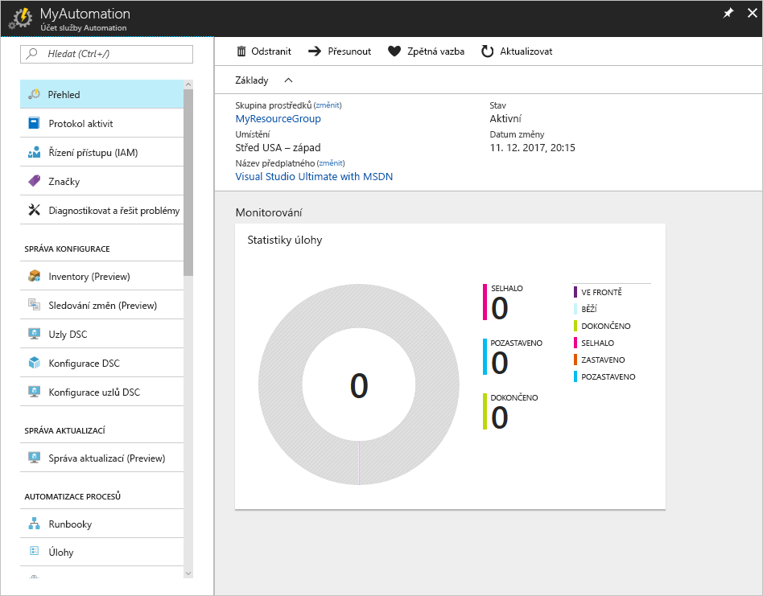
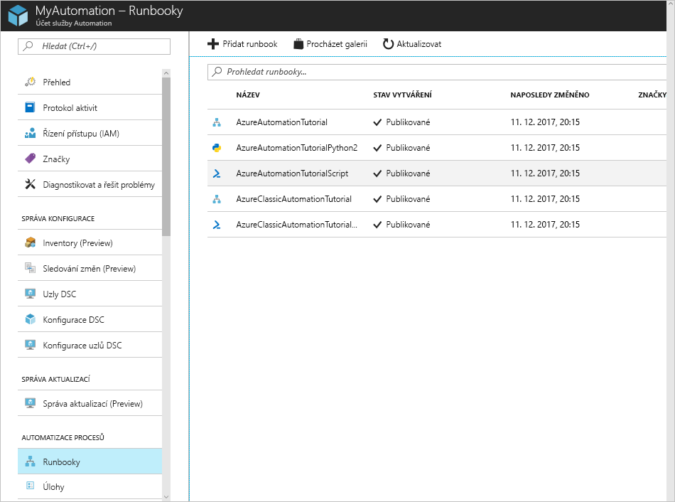
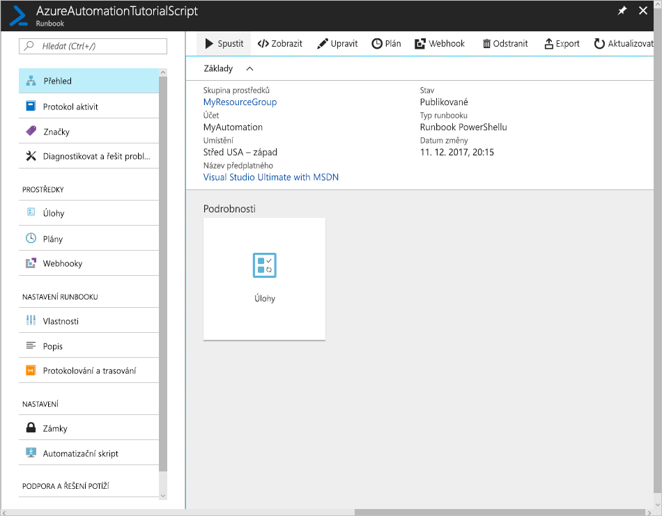
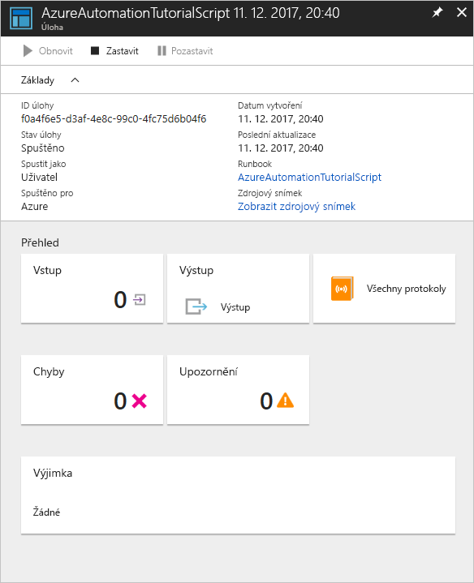

# Vytvoření účtu Azure Automation

Účty Azure Automation je možné vytvářet přes Azure. Tato metoda poskytuje uživatelské rozhraní v prohlížeči, pomocí kterého můžete vytvářet a konfigurovat účty Automation a související prostředky. Tento rychlý start prochází jednotlivé kroky k vytvoření účtu Automation a spuštění runbooku v tomto účtu.

Pokud ještě nemáte předplatné Azure, vytvořte si [bezplatný účet Azure](https://azure.microsoft.com/free/?WT.mc_id=A261C142F) před tím, než začnete.

## Přihlášení k Azure

Přihlaste se k Azure na adrese https://portal.azure.com.

## Vytvoření účtu Automation

1. Klikněte na tlačítko **Nový** v levém horním rohu Azure.

1. Vyberte **Monitorování a správa** a pak vyberte **Automation**.

1. Zadejte informace o účtu. U možnosti **Vytvořit účet Spustit v Azure jako** zvolte **Ano**, aby se automaticky povolily artefakty, které zjednoduší ověřování do Azure. Jakmile budete hotovi, klikněte na **Vytvořit** a spusťte nasazování účtu Automation.

      

1. Účet Automation se připne na řídicí panel Azure. Po dokončení nasazení se automaticky otevře přehled účtu Automation.

    

## Spuštění runbooku

Spusťte některý z runbooků pro tento kurz.

1. V části **AUTOMATIZACE PROCESŮ** klikněte na **Runbooky**. Zobrazí se seznam runbooků. Ve výchozím nastavení je v účtu povoleno několik cvičných runbooků.

    

1. Vyberte runbook **AzureAutomationTutorialScript**. Tato akce otevře stránku s přehledem runbooku.

    

1. Klikněte na **Spustit**, na stránce **Spustit Runbook** klikněte na **OK** a spusťte runbook.

    

1. Jakmile se **Stav úlohy** změní na **Spuštěno**, klikněte na **Výstup** nebo **Všechny protokoly** a zobrazte výstup úlohy runbooku. V případě tohoto cvičného runbooku je výstupem seznam vašich prostředků Azure.

## Vyčištění prostředků

Pokud už je nepotřebujete, odstraňte skupinu prostředků, účet Automation a všechny související prostředky. Provedete to tak, že vyberete skupinu prostředků účtu Automation a kliknete na **Odstranit**.

## Další kroky

V rámci tohoto rychlého startu jste nasadili účet Automation, spustili úlohu runbooku a zobrazili výsledky úlohy. Další informace o službě Azure Automation najdete v rychlém startu k vytvoření prvního runbooku.

> [!div class="nextstepaction"]
> [Rychlý start se službou Automation – Vytvoření runbooku](./automation-quickstart-create-runbook.md)
