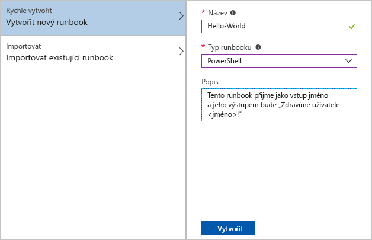
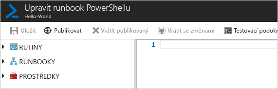
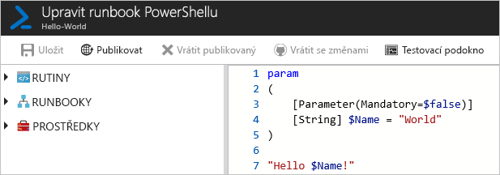
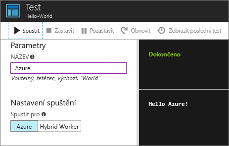
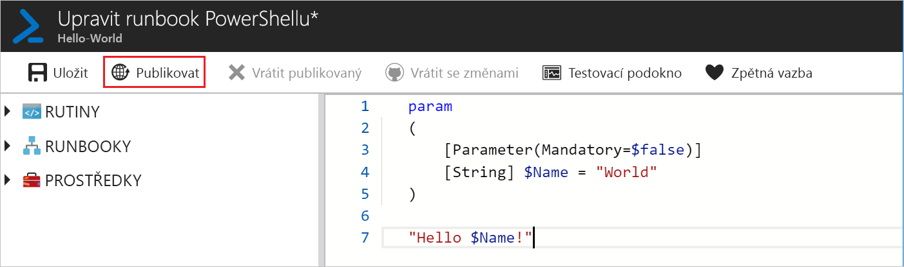
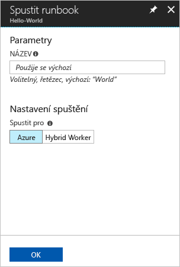
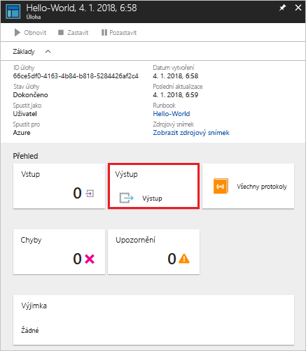
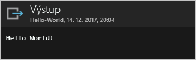

# <a name="create-an-azure-automation-runbook"></a>Vytvoření runbooku Azure Automation

Runbooky Azure Automation je možné vytvářet přes Azure. Tato metoda poskytuje uživatelské rozhraní v prohlížeči, pomocí kterého můžete vytvářet runbooky Automation. V tomto rychlém startu si projdete vytvořením, úpravou, testováním a publikováním powershellového runbooku Automation.

Pokud ještě nemáte předplatné Azure, vytvořte si [bezplatný účet Azure](https://azure.microsoft.com/free/?WT.mc_id=A261C142F) před tím, než začnete.

## <a name="log-in-to-azure"></a>Přihlášení k Azure

Přihlaste se k Azure na adrese https://portal.azure.com.

## <a name="create-runbook"></a>Vytvoření runbooku

Nejprve vytvořte runbook. Ukázkový runbook vytvářený v tomto rychlém startu ve výchozím nastavení vypisuje `Hello World`.

1. Otevřete váš účet služby Automation.

1. V části **AUTOMATIZACE PROCESŮ** klikněte na **Runbooky**. Zobrazí se seznam runbooků.

1. Klikněte na tlačítko **Přidat runbook** v horní části seznamu. Na stránce **Přidat runbook** vyberte **Rychlé vytvoření**.

1. Jako **Název** runbooku zadejte Hello World a jako **Typ runbooku** vyberte **PowerShell**. Klikněte na možnost **Vytvořit**.

   

1. Runbook se vytvoří a otevře se stránka **Upravit powershellový runbook**.

    

1. Zadejte nebo zkopírujte a vložte následující kód do podokna úprav. Tento kód vytvoří volitelný vstupní parametr Name (Název) s výchozí hodnotou World a vypíše řetězec, který používá tuto vstupní hodnotu:
   
   ```powershell-interactive
   param
   (
       [Parameter(Mandatory=$false)]
       [String] $Name = "World"
   )

   "Hello $Name!"
   ```

1. Klikněte na **Uložit** a uložte koncept tohoto runbooku.

    

## <a name="test-the-runbook"></a>Otestování runbooku

Po vytvoření runbooku ho otestujete, abyste ověřili, že funguje.

1. Kliknutím na **Testovací podokno** otevřete stránku **Test**.

1. Zadejte nějakou hodnotu parametru **Name** (Název) a klikněte na **Spustit**. Spustí se testovací úloha a zobrazí se stav úlohy a výstup.

    

1. Kliknutím na **X** v pravém horním rohu zavřete stránku **Test**. V automaticky otevřeném okně vyberte **OK**.

1. Na stránce **Upravit powershellový runbook** klikněte na **Publikovat** a publikujte runbook jako oficiální verzi runbooku v tomto účtu.

   

## <a name="run-the-runbook"></a>Spuštění runbooku

Po publikování runbooku se zobrazí stránka s přehledem.

1. Na stránce s přehledem runbooku kliknutím na **Spustit** otevřete stránku konfigurace **Spustit runbook** pro tento runbook.

   

1. Parametr **Name** (Název) nechte prázdný, aby se použila výchozí hodnota, a klikněte na **OK**. Úloha runbooku se odešle a zobrazí se stránka úlohy.

   

1. Až bude **Stav úlohy** hlásit **Spuštěno** nebo **Dokončeno**, kliknutím na **Výstup** otevřete podokno **Výstup** a zobrazte výstup runbooku.

   

## <a name="clean-up-resources"></a>Vyčištění prostředků

Pokud už runbook nepotřebujete, odstraňte ho. Provedete to tak, že v seznamu runbooků vyberete příslušný runbook a kliknete na **Odstranit**.

## <a name="next-steps"></a>Další kroky

V rámci tohoto rychlého startu jste vytvořili, upravili, otestovali a publikovali runbook a spustili úlohu runbooku. Další informace o runboocích Automation najdete v článku věnovaném různým typům runbooků, které můžete vytvářet a používat ve službě Automation.

> [!div class="nextstepaction"]
> [Návod pro službu Automation – Typy runbooků](./automation-runbook-types.md)
