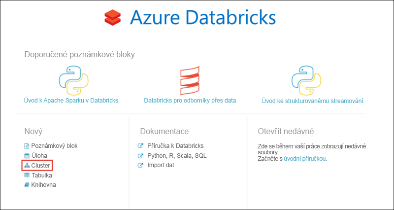
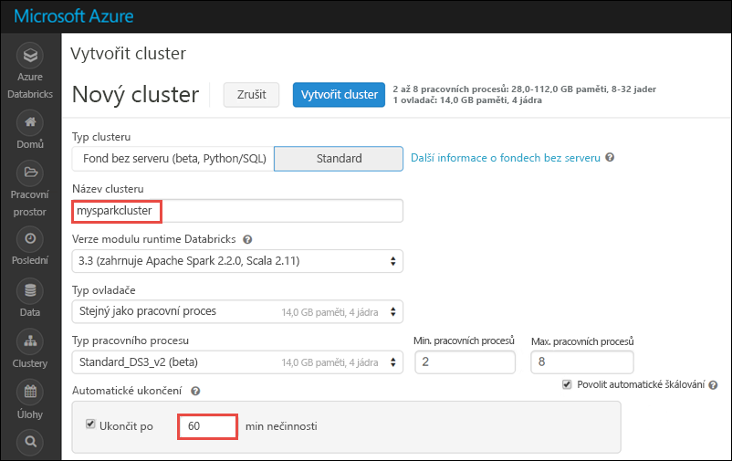
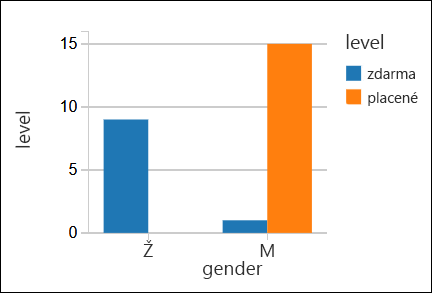

# <a name="quickstart-run-a-spark-job-on-azure-databricks-using-the-azure-portal"></a>Rychlý úvod: Spustit úlohu Spark v Azure Databricks pomocí portálu Azure

Tento rychlý start ukazuje, jak vytvořit pracovní prostor služby Azure Databricks a cluster Apache Spark v rámci tohoto pracovního prostoru. Nakonec zjistíte, jak spouštět úlohy Spark na Databricks clusteru. Další informace o Azure Databricks najdete v tématu [co je Azure Databricks?](what-is-azure-databricks.md)

## <a name="log-in-to-the-azure-portal"></a>Přihlášení k portálu Azure Portal

Přihlaste se k [portál Azure](https://portal.azure.com).

## <a name="create-a-databricks-workspace"></a>Vytvořit pracovní prostor Databricks

V této části můžete vytvořit pracovní prostor služby Azure Databricks pomocí portálu Azure. 

1. Na portálu Azure klikněte na tlačítko  **+** , klikněte na tlačítko **Data + analýzy**a potom klikněte na **Databricks Azure (Preview)**. 

    

2. V části **Databricks Azure (Preview)**, klikněte na tlačítko **vytvořit**.

    > [!NOTE]
    > Azure Databricks je aktuálně ve verzi preview omezené. Pokud chcete vašeho předplatného Azure, aby byla považována za pro vytvoření seznamu povolených ve verzi Preview, musíte vyplnit [registračního formuláře](https://databricks.azurewebsites.net/).

2. V části **Azure Databricks Service**, zadejte následující hodnoty:

    

    * Pro **název pracovního prostoru**, zadejte název pracovního prostoru Databricks.
    * Pro **předplatné**, z rozevíracího seznamu vyberte předplatné Azure.
    * Pro **skupiny prostředků**, zadejte, zda chcete vytvořit novou skupinu prostředků nebo použijte existující. Skupina prostředků je kontejner, který obsahuje související prostředky pro řešení s Azure. Další informace najdete v tématu [skupiny prostředků Azure přehled](../azure-resource-manager/resource-group-overview.md).
    * Pro **umístění**, vyberte **východní USA 2**. Další dostupné oblasti, najdete v části [služby Azure k dispozici podle oblasti](https://azure.microsoft.com/regions/services/).

3. Klikněte na možnost **Vytvořit**.

## <a name="create-a-spark-cluster-in-databricks"></a>Vytvořte Spark cluster v Databricks

1. Na portálu Azure přejděte do pracovního prostoru Databricks, kterou jste vytvořili a pak klikněte na tlačítko **inicializovat prostoru**.

2. Budete přesměrováni na portálu Azure Databricks. Z portálu, klikněte na tlačítko **clusteru**.

    

3. V **nového clusteru** stránky, zadejte hodnoty pro vytvoření clusteru.

    

    * Zadejte název pro cluster.
    * Zkontrolujte, zda jste vybrali **ukončit po minutách ___ aktivity** zaškrtávací políčko. Zadejte dobu (v minutách) ukončit clusteru, pokud není používán clusteru.
    * Přijměte ostatní výchozí hodnoty. 
    * Klikněte na tlačítko **vytvořit cluster**. Po v clusteru je spuštěn, můžete připojit ke clusteru poznámkových bloků a spouštění úloh Spark.

Další informace o vytváření clusterů najdete v tématu [vytvořte Spark cluster v Azure Databricks](https://docs.azuredatabricks.net/user-guide/clusters/create.html).

## <a name="run-a-spark-sql-job"></a>Spustit úlohu Spark SQL

Než začnete se v této části, je třeba provést následující:

* [Vytvoření účtu úložiště Azure](../storage/common/storage-create-storage-account.md#create-a-storage-account). 
* Stažení souboru JSON ukázka [z Githubu](https://github.com/Azure/usql/blob/master/Examples/Samples/Data/json/radiowebsite/small_radio_json.json). 
* Nahrajte ukázkový soubor JSON do účtu úložiště Azure, kterou jste vytvořili. Můžete použít [Microsoft Azure Storage Explorer](../vs-azure-tools-storage-manage-with-storage-explorer.md) k nahrání souborů.

Proveďte následující kroky pro vytvoření poznámkového bloku v Databricks, nastavte poznámkového bloku číst data z účtu úložiště objektů Blob v Azure a spusťte úlohu Spark SQL na data.

1. V levém podokně klikněte na **prostoru**. Z **prostoru** rozevíracího seznamu, klikněte na tlačítko **vytvořit**a potom klikněte na **poznámkového bloku**.

    

2. V **vytvoření poznámkového bloku** dialogové okno, zadejte název, vyberte **Scala** jako jazyk a vyberte cluster Spark, kterou jste vytvořili dříve.

    

    Klikněte na možnost **Vytvořit**.

3. V následující fragment kódu, nahraďte `{YOUR STORAGE ACCOUNT NAME}` s názvem účtu úložiště Azure jste vytvořili a `{YOUR STORAGE ACCOUNT ACCESS KEY}` se přístupový klíč účtu úložiště. Vložte fragment do prázdné buňky v poznámkovém bloku a stiskněte klávesu SHIFT + ENTER ke spuštění buňky kódu. Tento fragment kódu nakonfiguruje poznámkového bloku číst data z Azure blob storage.

       spark.conf.set("fs.azure.account.key.{YOUR STORAGE ACCOUNT NAME}.blob.core.windows.net", "{YOUR STORAGE ACCOUNT ACCESS KEY}")
    
    Pokyny o tom, jak načíst klíč účtu úložiště najdete v tématu [Správa přístupových klíčů k úložišti](../storage/common/storage-create-storage-account.md#manage-your-storage-account)

    > [!NOTE]
    > Můžete také použít Azure Data Lake Store s clusterem Spark v Azure Databricks. Pokyny najdete v tématu [použití Data Lake Store s Azure Databricks](https://docs.azuredatabricks.net/spark/latest/data-sources/azure/azure-storage.html#azure-data-lake-store).

4. Spuštění příkazu jazyka SQL a vytvořte dočasnou tabulku pomocí dat z ukázkový soubor dat JSON **small_radio_json.json**. V následující fragment kódu nahraďte zástupné hodnoty název kontejneru a název účtu úložiště. Vložte fragment v buňce kódu v poznámkovém bloku a stiskněte klávesu SHIFT + ENTER. V tomto fragmentu kódu `path` označuje umístění souboru JSON vzorku, který jste nahráli do účtu úložiště Azure.

    ```sql
    %sql 
    CREATE TEMPORARY TABLE radio_sample_data
    USING json
    OPTIONS (
     path "wasbs://{YOUR CONTAINER NAME}@{YOUR STORAGE ACCOUNT NAME}.blob.core.windows.net/small_radio_json.json"
    )
    ```

    Po úspěšném dokončení příkazu mít jako tabulku v clusteru Databricks všechna data ze souboru JSON.

    `%sql` Magic příkaz jazyka umožňuje spustit kód SQL z poznámkového bloku, i když poznámkového bloku je jiného typu. Další informace najdete v tématu [kombinování jazyky v poznámkovém bloku](https://docs.azuredatabricks.net/user-guide/notebooks/index.html#mixing-languages-in-a-notebook).

5. Podívejme se na snímek ukázková data JSON lépe pochopit dotaz, který jsme spustit. Vložte následující fragment kódu buňky a stiskněte klávesu **SHIFT + ENTER**.

    ```sql
    %sql 
    SELECT * from radio_sample_data
    ```

6. Zobrazí tabulkový výstup jako ukazuje následující snímek obrazovky (jenom některé sloupce jsou uvedené):

    

    Mezi další podrobnosti zachycuje ukázkových dat pohlaví cílové skupiny přepínačů kanálu (název sloupce, **pohlaví**) a jestli je svoje předplatné volné nebo placené (název sloupce, **úroveň**).

7. Teď vytvoříte vizuální reprezentace tato data zobrazení pro každý pohlaví, počet uživatelů, kteří mají bezplatné účty a kolik jsou placené odběratele. V dolní části tabulkový výstup, klikněte na **pruhový graf** ikonu a pak klikněte na tlačítko **vykreslení možnosti**.

    

8. V **přizpůsobit vykreslení**, přetažení myší hodnoty, jak je znázorněno na snímku obrazovky.

    

    * Nastavit **klíče** k **pohlaví**.
    * Nastavit **existuje seskupení řady** k **úroveň**.
    * Nastavit **hodnoty** k **úroveň**.
    * Nastavit **agregace** k **počet**.

    Klikněte na tlačítko **Použít**.

9. Výstup ukazuje vizuální znázornění, jak je znázorněno na následujícím snímku obrazovky:

     

## <a name="clean-up-resources"></a>Vyčištění prostředků

Při vytváření clusteru Spark, pokud jste vybrali políčka **ukončit po minutách ___ aktivity**, cluster se automaticky ukončí, pokud byla neaktivní po zadanou dobu.

Pokud jste nezaškrtli políčko, musí ručně ukončit clusteru. Chcete-li učinit, v pracovním prostoru Azure Databricks, v levém podokně klikněte na tlačítko **clustery**. Pro cluster, který chcete ukončit, přesuňte kurzor se třemi tečkami v části **akce** sloupce a kliknutím **ukončit** ikonu.


## <a name="next-steps"></a>Další kroky

V tomto článku vytvořit Spark cluster v Azure Databricks a spustil úlohu Spark pomocí dat v úložišti Azure. Můžete také prohlédnout [Spark zdroje dat](https://docs.azuredatabricks.net/spark/latest/data-sources/index.html) se dozvíte, jak k importu dat z jiných zdrojů dat do Azure Databricks. Přechodu na další článku se dozvíte, jak používat Azure Data Lake Store s Azure Databricks.

> [!div class="nextstepaction"]
>[Použití Data Lake Store s Azure Databricks](https://docs.azuredatabricks.net/spark/latest/data-sources/azure/azure-storage.html#azure-data-lake-store)