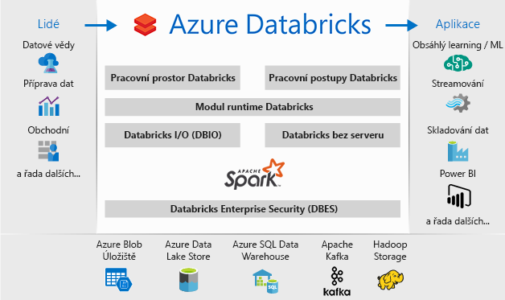

# Co je Azure Databricks?

Azure Databricks je analytická platforma založená na Apache Spark a optimalizovaná pro platformu cloudových služeb Microsoft Azure. Platforma Databricks je navržená ve spolupráci se zakladateli Apache Spark a díky integraci s Azure poskytuje nastavení jedním kliknutím, zjednodušené pracovní postupy a interaktivní pracovní prostor, který umožňuje spolupráci mezi datovými vědci, odborníky přes data a obchodními analytiky.

## Analytická platforma založená na Apache Sparku

Azure Databricks zahrnuje kompletní opensourcové možnosti a technologie clusteru Apache Spark. Spark v Azure Databricks zahrnuje následující komponenty:

* **Spark SQL a DataFrames:** Spark SQL je modul Sparku pro práci se strukturovanými daty. DataFrame je distribuovaná kolekce dat uspořádaných do pojmenovaných sloupců. Je koncepčním ekvivalentem tabulky v relační databázi nebo datového rámce v R nebo Pythonu.

* **Streamování:** Zpracování dat a analýzy v reálném čase pro analytické a interaktivní aplikace. Integruje se s HDFS, Flume a Kafka.

* **MLib:** Knihovna Machine Learning, která se skládá z běžných algoritmů a nástrojů strojového učení, včetně klasifikace, regrese, clusteringu, filtrování založeného na spolupráci, snížení počtu dimenzí a také základních primitiv optimalizace.

* **GraphX:** Grafy a grafické výpočetní funkce pro širokou škálu případů použití od kognitivních analýz až po zkoumání dat.

* **Spark Core API:** Zahrnuje podporu pro R, SQL, Python, Scalu a Javu.

## Apache Spark na platformě Azure Databricks

Azure Databricks staví na možnostech Sparku a poskytuje cloudovou platformu s nulovou správou, která zahrnuje:

- Plně spravované clustery Spark
- Interaktivní pracovní prostor pro zkoumání a vizualizace
- Platformu pro vaše oblíbené aplikace založené na Sparku

### Plně spravované clustery Apache Spark v cloudu

Azure Databricks má zabezpečené a spolehlivé produkční prostředí v cloudu, spravované a podporované odborníky na Spark. Můžete:

* Vytvářet clustery během několik sekund.
* Dynamicky automaticky vertikálně navyšovat nebo snižovat kapacitu clusterů, včetně clusterů bez serveru, a sdílet je napříč týmy. 
* Využívat clustery v kódu programu pomocí rozhraní REST API. 
* Využívat možnosti zabezpečené integrace dat postavené na Sparku, které umožňují unifikovat vaše data bez nutnosti centralizace. 
* Prostřednictvím jednotlivých verzí získat okamžitý přístup k nejnovějším funkcím Apache Sparku.

### Modul runtime Databricks
Modul runtime Databricks je postavený na Apache Sparku a nativně sestavený pro cloud Azure. 

Prostřednictvím možnosti **bez serveru** Azure Databricks při nastavení a konfiguraci infrastruktury dat kompletně abstrahuje od složitosti infrastruktury a potřeby specializovaných odborností. Možnost bez serveru pomáhá odborníkům přes data rychle iterovat jako tým.

Datovým technikům, pro které je důležitý výkon produkčních úloh, Azure Databricks poskytuje sparkový modul, který je rychlejší a výkonnější při zpracování různých optimalizací na vstupně-výstupní vrstvě a vrstvě zpracování (vstupně-výstupní operace Databricks).

### Pracovní prostor pro spolupráci

Prostřednictvím integrovaného prostředí založeného na spolupráci Azure Databricks zjednodušuje proces zkoumání dat, vytváření prototypů a spouštění datových aplikací ve Sparku.

* Snadné zkoumání dat umožňuje určit způsob jejich využití.
* K dokumentování průběhu můžete využít poznámkové bloky v R, Python, Scale nebo SQL.
* K vizualizaci dat stačí několik kliknutí a je možné využít oblíbené nástroje, jako je Matplotlib, ggplot nebo d3.
* Pomocí interaktivních řídicích panelů můžete vytvářet dynamické sestavy.
* Můžete využít Spark a interagovat s daty současně.

## Podnikové zabezpečení

Azure Databricks poskytuje zabezpečení Azure na podnikové úrovni, včetně integrace služby Azure Active Directory, řízení na základě rolí a smluv SLA, které chrání vaše data a vaši firmu.

* Integrace s Azure Active Directory umožňuje provozovat kompletní řešení založená na Azure s využitím Azure Databricks.
* Přístup na základě rolí v Azure Databricks umožňuje využívat jemně odstupňovaná uživatelská oprávnění pro poznámkové bloky, clustery, úlohy a data.
* Smlouvy SLA na podnikové úrovni. 

## Integrace se službami Azure

Azure Databricks se úzce integruje s úložišti a databázemi Azure: SQL Data Warehouse, Cosmos DB, Data Lake Store a Blob Storage. 

## Integrace s Power BI
Díky bohaté integraci s Power BI vám Azure Databricks umožňuje rychle a snadno sdílet důležité nové poznatky. Prostřednictvím koncových bodů clusteru JDBC/ODBC můžete také využívat další nástroje BI, jako je třeba Tableau Software.

## Další kroky

* [Rychlý start: Spuštění úlohy Sparku na platformě Azure Databricks](quickstart-create-databricks-workspace-portal.md)
* [Práce s clustery Spark](https://docs.azuredatabricks.net/user-guide/clusters/index.html)
* [Práce s poznámkovými bloky](https://docs.azuredatabricks.net/user-guide/notebooks/index.html)
* [Vytvoření sparkových úloh](https://docs.azuredatabricks.net/user-guide/jobs.html)

 

