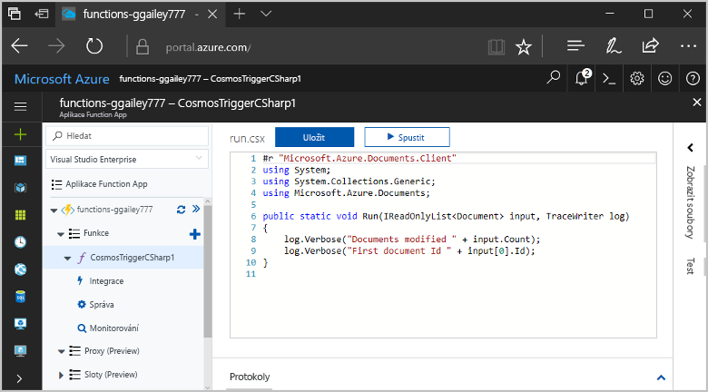
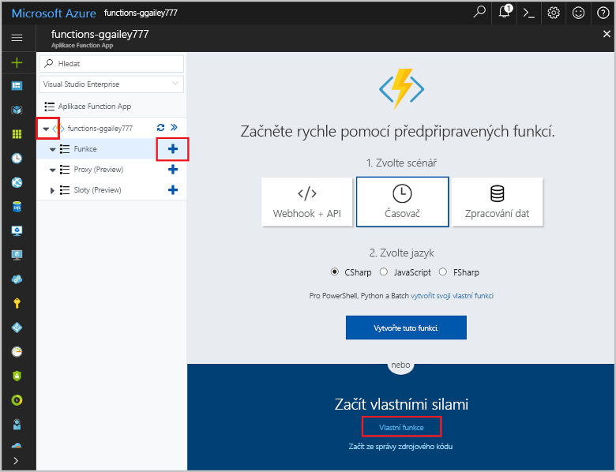
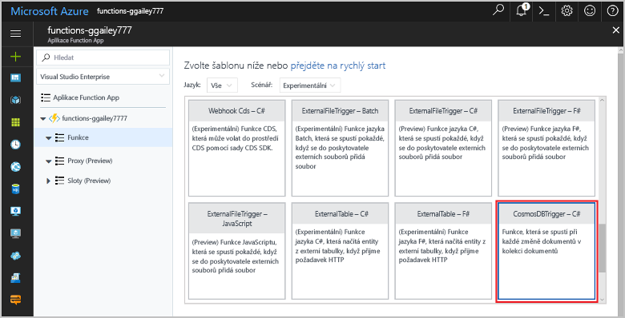
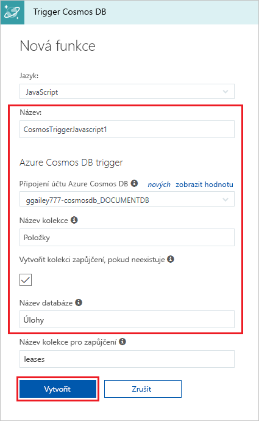
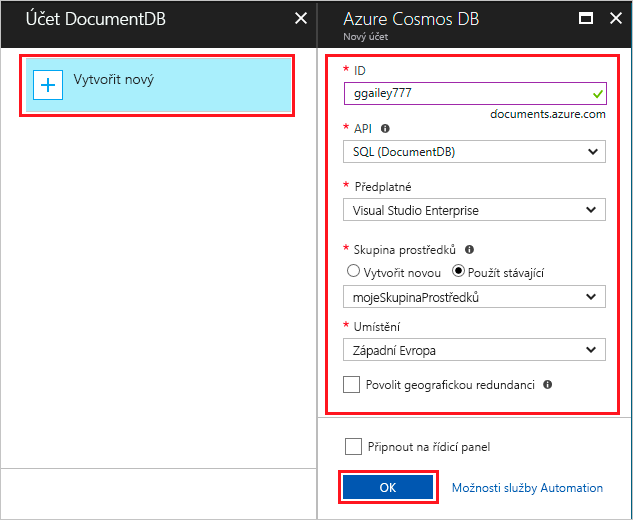
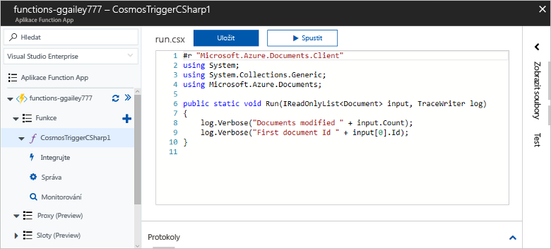
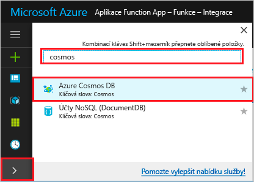
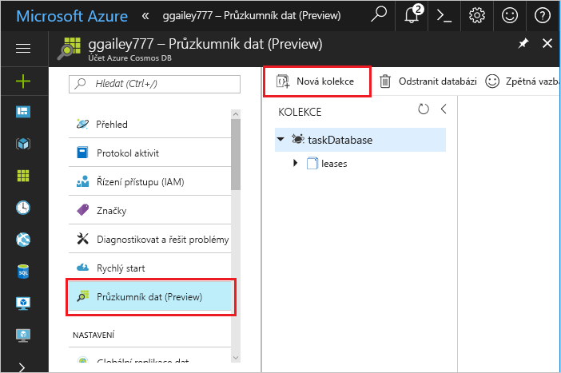
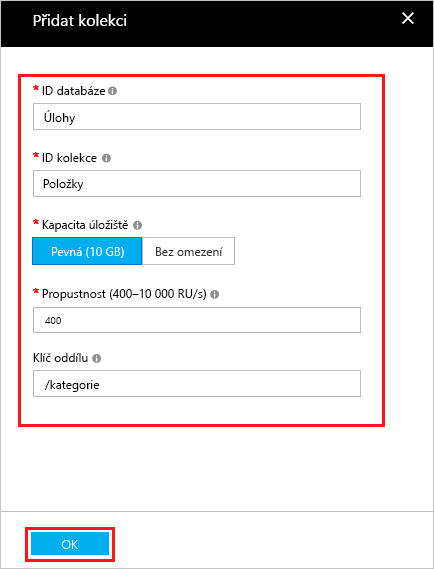
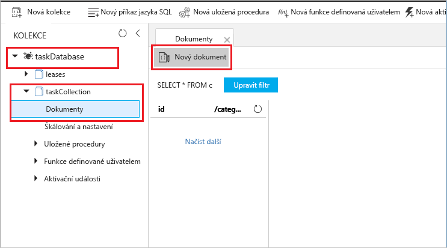

# Vytvoření funkce aktivované službou Azure Cosmos DB

Zjistěte, jak vytvořit funkci aktivovanou při přidání nebo změně dat ve službě Azure Cosmos DB. Další informace o službě Azure Cosmos DB najdete v tématu [Azure Cosmos DB: Databázové výpočetní prostředí bez serveru využívající Azure Functions](..\cosmos-db\serverless-computing-database.md).

## Požadavky

K provedení kroků v tomto kurzu je potřeba:

+ Pokud ještě nemáte předplatné Azure, vytvořte si [bezplatný účet](https://azure.microsoft.com/free/?WT.mc_id=A261C142F) před tím, než začnete.

[!INCLUDE [functions-portal-favorite-function-apps](../../includes/functions-portal-favorite-function-apps.md)]

## Vytvoření aplikace Azure Function App

[!INCLUDE [Create function app Azure portal](../../includes/functions-create-function-app-portal.md)]

Dál vytvoříte v nové aplikaci Function App funkci.

## Vytvoření triggeru služby Azure Cosmos DB

1. Rozbalte aplikaci Function App a klikněte na tlačítko **+** vedle položky **Funkce**. Pokud jde o první funkci ve vaší aplikaci Function App, vyberte možnost **Vlastní funkce**. Zobrazí se kompletní sada šablon funkcí.

    

2. Vyhledejte a vyberte šablonu **Azure CosmosDBTrigger** pro vámi požadovaný jazyk.

    

3. Nakonfigurujte nový trigger s nastaveními uvedenými v tabulce pod obrázkem.

    
    
    | Nastavení      | Navrhovaná hodnota  | Popis                                |
    | ------------ | ---------------- | ------------------------------------------ |
    | **Pojmenujte svoji funkci** | Výchozí | Použijte výchozí název funkce navrhovaný šablonou. |
    | **Název databáze** | Úlohy | Název databáze s kolekcí, která se má monitorovat. |
    | **Název kolekce** | Items | Název kolekce, která se má monitorovat. |
    | **Vytvořit kolekci zapůjčení, pokud neexistuje** | Zaškrtnuté | Kolekce ještě neexistuje, takže ji vytvořte. |

4. Vedle popisku **Připojení účtu služby Azure Cosmos DB** vyberte **Nový** a zvolte existující účet služby Cosmos DB nebo vyberte možnost **+ Vytvořit nový**. 
 
    

6. Při vytváření nového účtu služby Cosmos DB použijte nastavení pro **Nový účet** uvedená v tabulce.

    | Nastavení      | Navrhovaná hodnota  | Popis                                |
    | ------------ | ---------------- | ------------------------------------------ |
    | **ID** | Název databáze | Jedinečné ID databáze Azure Cosmos DB  |
    | **Rozhraní API** | SQL (DocumentDB) | Toto téma používá rozhraní API databáze dokumentů.  |
    | **Předplatné** | předplatné Azure | předplatné Azure  |
    | **Skupina prostředků** | myResourceGroup |  Použijte existující skupinu prostředků, která obsahuje vaši aplikací funkcí. |
    | **Umístění**  | WestEurope | Vyberte umístění blízko vaší aplikaci funkcí nebo jiným aplikacím, které používají uložené dokumenty.  |

6. Kliknutím na **OK** vytvořte databázi. Vytvoření databáze může trvat několik minut. Po vytvoření databáze se připojovací řetězec databáze uloží jako nastavení aplikace funkcí. Název tohoto nastavení aplikace se vloží do **Připojení účtu služby Azure Cosmos DB**. 

7. Kliknutím na **Vytvořit** vytvořte funkci aktivovanou službou Azure Cosmos DB. Po vytvoření funkce se zobrazí kód funkce založené na šabloně.  

    

    Tato šablona funkce zapíše do protokolů počet dokumentů a ID prvního dokumentu. 

Dále se připojíte ke svému účtu služby Azure Cosmos DB a vytvoříte v databázi kolekci **Úlohy**. 

## Vytvoření kolekce Items (Položky)

1. Na nové kartě prohlížeče otevřete druhou instanci webu [Azure Portal](https://portal.azure.com). 

2. Na levé straně portálu rozbalte pruh ikon, do vyhledávacího pole zadejte `cosmos` a vyberte **Azure Cosmos DB**.

    

2. Zvolte váš účet služby Azure Cosmos DB a vyberte **Průzkumník dat**. 
 
3. V části **Kolekce** zvolte **taskDatabase** a vyberte **Nová kolekce**.

    

4. V části **Přidat kolekci** použijte nastavení uvedená v tabulce pod obrázkem. 
 
    
 
    | Nastavení|Navrhovaná hodnota|Popis |
    | ---|---|--- |
    | **ID databáze** | Úlohy |Název nové databáze. Musí se shodovat s názvem definovaným ve vazbě vaší funkce. |
    | **ID kolekce** | Items | Název nové kolekce. Musí se shodovat s názvem definovaným ve vazbě vaší funkce.  |
    | **Kapacita úložiště** | Pevná (10 GB)|Použijte výchozí hodnotu. Tato hodnota je kapacita úložiště databáze. |
    | **Propustnost** |400 RU| Použijte výchozí hodnotu. Pokud budete chtít snížit latenci, můžete propustnost později navýšit. |
    | **[Klíč oddílu](../cosmos-db/partition-data.md#design-for-partitioning)** | /kategorie|Klíč oddílu, který rovnoměrně distribuuje data do jednotlivých oddílů. Výběr správného klíče oddílu je důležitý pro vytvoření výkonné kolekce. | 

1. Kliknutím na **OK** vytvořte kolekci **Úlohy**. Vytvoření kolekce může chvíli trvat.

Jakmile bude existovat kolekce definovaná ve vazbě funkce, můžete funkci otestovat přidáním dokumentů do této nové kolekce.

## Testování funkce

1. V Průzkumníku dat rozbalte novou kolekci **taskCollection**, zvolte **Dokumenty** a vyberte **Nový dokument**.

    

2. Nahraďte obsah nového dokumentu následujícím obsahem a pak zvolte **Uložit**.

        {
            "id": "task1",
            "category": "general",
            "description": "some task"
        }

1. Přepněte na první kartu prohlížeče, která obsahuje vaši funkci na portálu. Rozbalte protokoly funkce a ověřte, že nový dokument aktivoval funkci. Všimněte si, že se do protokolů zapsala hodnota ID dokumentu `task1`. 

    

4. (Volitelné) Vraťte se ke svému dokumentu, proveďte nějakou změnu a klikněte na **Aktualizovat**. Pak přejděte zpět do protokolů funkce a ověřte, že aktualizace také aktivovala funkci.

## Vyčištění prostředků

[!INCLUDE [Next steps note](../../includes/functions-quickstart-cleanup.md)]

## Další kroky

Vytvořili jste funkci, která se spouští při přidání nebo úpravě dokumentu ve službě Azure Cosmos DB.

[!INCLUDE [Next steps note](../../includes/functions-quickstart-next-steps.md)]

Další informace o aktivačních událostech fronty úložiště najdete v tématu [Vazby front úložiště služby Azure Functions](functions-bindings-storage-queue.md).
