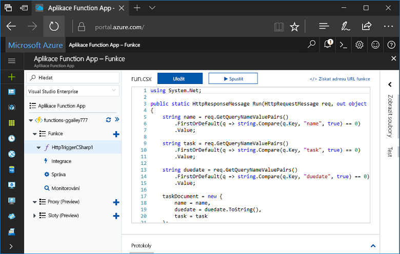
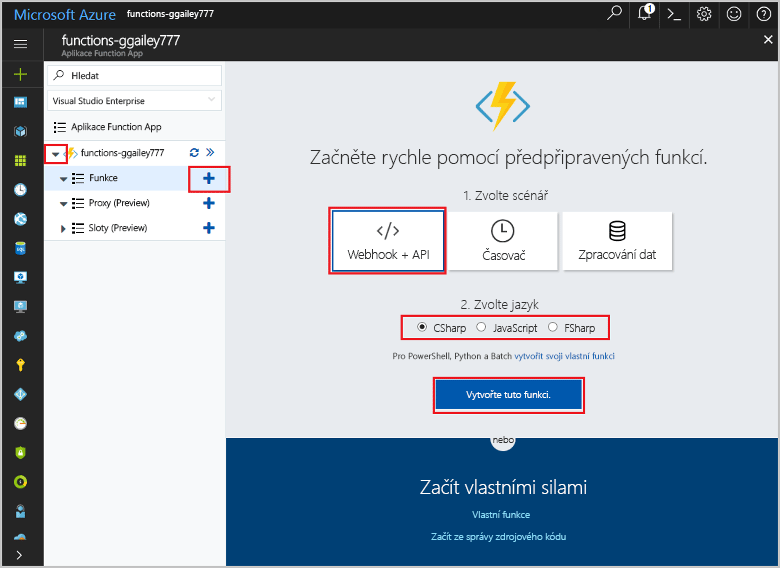
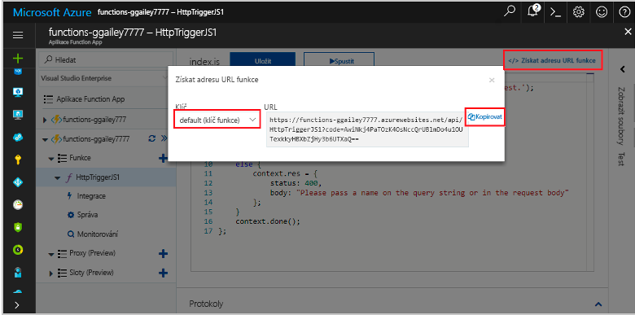
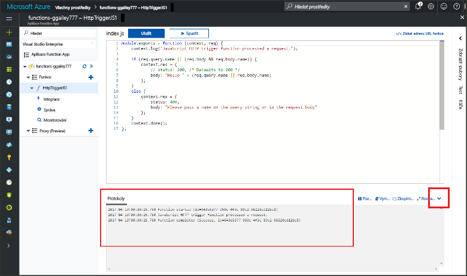

# Vytvoření první funkce na webu Azure Portal

Služba Azure Functions umožňuje spuštění kódu v prostředí [bez serveru](https://azure.microsoft.com/overview/serverless-computing/), aniž byste nejdřív museli vytvořit virtuální počítač nebo publikovat webovou aplikaci. V tomto tématu se dozvíte, jak pomocí služby Functions vytvořit na webu Azure Portal funkci Hello World.

[!INCLUDE [quickstarts-free-trial-note](../../includes/quickstarts-free-trial-note.md)]

## Přihlášení k Azure

Přihlaste se k webu Azure Portal na adrese <http://portal.azure.com> pomocí svého účtu Azure.

## Vytvoření Function App

K hostování provádění funkcí musíte mít aplikaci Function App. Aplikace Function App umožňuje seskupit funkce jako logickou jednotku pro snadnější správu, nasazování a sdílení prostředků. 

[!INCLUDE [Create function app Azure portal](../../includes/functions-create-function-app-portal-experiment.md)]

Dál vytvoříte v nové aplikaci Function App funkci.

## Vytvoření funkce aktivované protokolem HTTP

1. Rozbalte novou aplikaci Function App a potom klikněte na tlačítko  **+**  vedle položky **Funkce**.

2.  Na stránce **Začněte rychle** vyberte **Webhook + API**, **Zvolte jazyk** funkce a klikněte na **Vytvořit tuto funkci**. 
   
    

Funkce ve vybraném jazyce se vytvoří pomocí šablony funkce aktivované protokolem HTTP. Toto téma ukazuje funkci skriptu jazyka C# na portálu, ale můžete vytvořit funkci v libovolném [podporovaném jazyku](supported-languages.md). 

Novou funkci můžete spustit odesláním požadavku HTTP.

## Testování funkce

1. V nové funkci klikněte vpravo nahoře na **</> Získat adresu URL funkce**, vyberte **výchozí (klíč funkce)** a potom klikněte na **Kopírovat**. 

    

2. Vložte adresu URL funkce do panelu Adresa vašeho prohlížeče. Na konec této adresy URL připojte hodnotu řetězce dotazu `&name=<yourname>` a stisknutím klávesy `Enter` na klávesnici požadavek proveďte. V prohlížeči by se měla zobrazit odpověď, kterou funkce vrátila.  

    Následující příklad ukazuje odpověď v prohlížeči Edge (ostatní prohlížeče můžou zahrnovat zobrazený kód XML):

    

    Adresa URL požadavku obsahuje klíč, který je ve výchozím nastavení nezbytný pro přístup k funkci přes protokol HTTP.   

3. Při spuštění funkce se do protokolů zaznamenávají informace o trasování. Pokud chcete zobrazit výstup trasování z předchozího zpracování, vraťte se k funkci na portálu a kliknutím na šipku ve spodní části obrazovky rozbalte položku **Protokoly**. 

   

## Vyčištění prostředků

[!INCLUDE [Clean-up resources](../../includes/functions-quickstart-cleanup.md)]

## Další kroky

Vytvořili jste aplikaci Function App s jednoduchou funkcí aktivovanou protokolem HTTP.  

[!INCLUDE [Next steps note](../../includes/functions-quickstart-next-steps.md)]

Další informace najdete v tématu [Vazby protokolu HTTP služby Azure Functions a vazby webhooku](functions-bindings-http-webhook.md).

