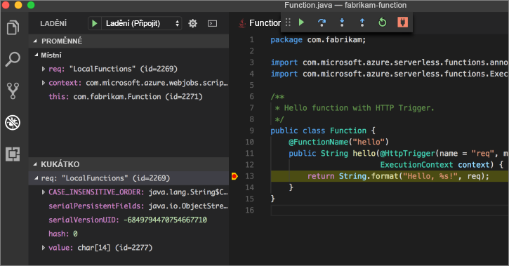

# <a name="create-your-first-function-with-java-and-maven-preview"></a>Vytvoření první funkce s Java a Maven (Preview)

Tento rychlý start provede procesem vytvoření [bez serveru](https://azure.microsoft.com/overview/serverless-computing/) funkce projektu s Maven, místní testování a nasazení do Azure Functions. Když jste hotovi, máte funkce aktivované protokolem HTTP aplikace spuštěná v Azure.

 

[!INCLUDE [quickstarts-free-trial-note](../../includes/quickstarts-free-trial-note.md)]

## <a name="prerequisites"></a>Požadavky
K vývoji funkce aplikaci Java, musíte mít nainstalované tyto položky:

-  [.NET core](https://www.microsoft.com/net/core), nejnovější verzi.
-  [Sady pro vývojáře Java](https://www.azul.com/downloads/zulu/), verze 1.8.
-  [Azure CLI](https://docs.microsoft.com/cli/azure)
-  [Apache Maven](https://maven.apache.org), verze 3.0 nebo vyšší.
-  [Node.js](https://nodejs.org/download/), verze 8,6 nebo vyšší.

> [!IMPORTANT] 
> Proměnná prostředí JAVA_HOME musí být nastavena umístění instalovat sadu JDK dokončete tento rychlý start.

## <a name="install-the-azure-functions-core-tools"></a>Instalace nástroje Azure Functions jádra

[Azure funkce jádra nástroje 2.0](https://www.npmjs.com/package/azure-functions-core-tools) poskytnout místní vývojové prostředí pro psaní, spouštění a ladění funkcí Azure. Nainstalujte nástroje s [npm](https://www.npmjs.com/), součástí [Node.js](https://nodejs.org/).

```
npm install -g azure-functions-core-tools@core
```

> [!NOTE]
> Pokud máte potíže s instalací nástroje Azure funkce základní verze 2.0, přečtěte si téma [runtime verze 2.x](/azure/azure-functions/functions-run-local#version-2x-runtime).

## <a name="generate-a-new-functions-project"></a>Vygenerovat nový projekt funkce

V prázdné složky, spusťte následující příkaz pro vytvoření projektu funkce z [Maven archetype](https://maven.apache.org/guides/introduction/introduction-to-archetypes.html).

### <a name="linuxmacos"></a>Linux/systému MacOS

```bash
mvn archetype:generate \
    -DarchetypeGroupId=com.microsoft.azure \
    -DarchetypeArtifactId=azure-functions-archetype 
```

### <a name="windows-cmd"></a>Windows (CMD)
```cmd
mvn archetype:generate ^
    -DarchetypeGroupId=com.microsoft.azure ^
    -DarchetypeArtifactId=azure-functions-archetype
```

Maven vás vyzve k zadání hodnoty, které jsou potřebné k dokončení generování projektu. Pro _groupId_, _artifactId_, a _verze_ hodnoty, najdete v článku [Maven zásady vytváření názvů](https://maven.apache.org/guides/mini/guide-naming-conventions.html) odkaz. _AppName_ hodnota musí být jedinečná napříč Azure, takže Maven vygeneruje název aplikaci podle dříve zadané _artifactId_ jako výchozí. _PackageName_ hodnota určuje Java balíčku pro kód vygenerovaný funkce.

```Output
Define value for property 'groupId': com.fabrikam.functions
Define value for property 'artifactId' : fabrikam-functions
Define value for property 'version' 1.0-SNAPSHOT : 
Define value for property 'package': com.fabrikam.functions
Define value for property 'appName' fabrikam-functions-20170927220323382:
Confirm properties configuration: Y
```

Maven vytvoří soubory projektu do nové složky s názvem _artifactId_. Generovaného kódu v projektu je jednoduchý [HTTP aktivované](/azure/azure-functions/functions-bindings-http-webhook) funkce, která vrátí text žádosti:

```java
public class Function {
    @FunctionName("hello")
    public String hello(@HttpTrigger(name = "req", methods = {"get", "post"}, authLevel = AuthorizationLevel.ANONYMOUS) String req,
                        ExecutionContext context) {
        return String.format("Hello, %s!", req);
    }
}
```

## <a name="run-the-function-locally"></a>Místní spuštění funkce

Změnit adresář, do složky nově vytvořený projekt sestavit a spustit funkci s Maven:

```
cd fabrikam-function
mvn clean package 
mvn azure-functions:run
```

Tento výstup zobrazí, když je spuštěna funkce:

```Output
Listening on http://localhost:7071
Hit CTRL-C to exit...

Http Functions:

   hello: http://localhost:7071/api/hello
```

Aktivovat funkci z příkazového řádku pomocí curl v nové zařízení:

```
curl -w '\n' -d LocalFunction http://localhost:7071/api/hello
```

```Output
Hello LocalFunction!
```

Použití `Ctrl-C` v terminálu zastavit kód funkce.

## <a name="deploy-the-function-to-azure"></a>Nasazení funkce do Azure

Proces nasazení na Azure Functions využívá přihlašovací údaje účtu z příkazového řádku Azure. [Přihlaste se pomocí rozhraní příkazového řádku Azure](/cli/azure/authenticate-azure-cli?view=azure-cli-latest) a pak nasadíte tak svůj kód do nové aplikace funkce pomocí `azure-functions:deploy` Maven cíl.

```
az login
mvn azure-functions:deploy
```

Po dokončení nasadit zobrazí adresu URL můžete použít pro přístup k vaší aplikaci Azure funkce:

```output
[INFO] Successfully deployed Function App with package.
[INFO] Deleting deployment package from Azure Storage...
[INFO] Successfully deleted deployment package fabrikam-function-20170920120101928.20170920143621915.zip
[INFO] Successfully deployed Function App at https://fabrikam-function-20170920120101928.azurewebsites.net
[INFO] ------------------------------------------------------------------------
```

Testování funkce aplikace spuštěné v Azure pomocí curl:

```
curl -w '\n' https://fabrikam-function-20170920120101928.azurewebsites.net/api/hello -d AzureFunctions
```

```Output
Hello AzureFunctions!
```

## <a name="next-steps"></a>Další kroky

Vytvoření funkce aplikace v jazyce Java pomocí jednoduchého triggeru protokolu HTTP a nasazené na Azure Functions.

- Zkontrolujte [Příručka pro vývojáře Java funkce](functions-reference-java.md) pro další informace o vývoji funkce Java.
- Přidat další funkce s jinou aktivační události na váš projekt pomocí `azure-functions:add` Maven cíl.
- Ladění funkcí místně s kódem jazyka Visual Studio. S [pack rozšíření Java](https://marketplace.visualstudio.com/items?itemName=vscjava.vscode-java-pack) nainstalován a s projektem funkce Otevřít v sadě Visual Studio Code [připojit ladicí program](https://code.visualstudio.com/Docs/editor/debugging#_launch-configurations) na port 5005. Potom nastavte zarážky v editoru a aktivovat funkci, když běží místně: 


