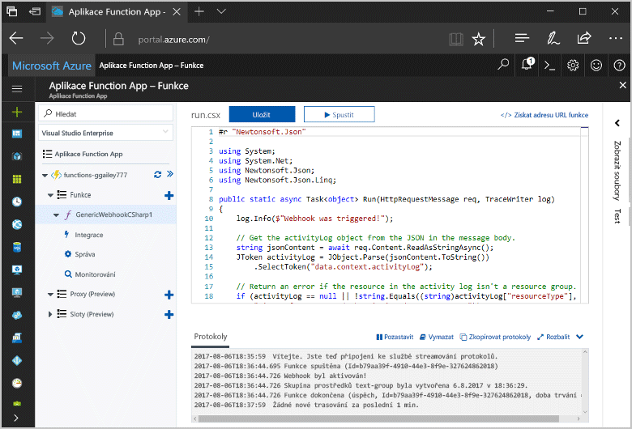
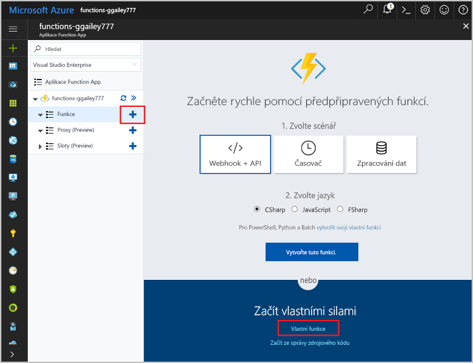
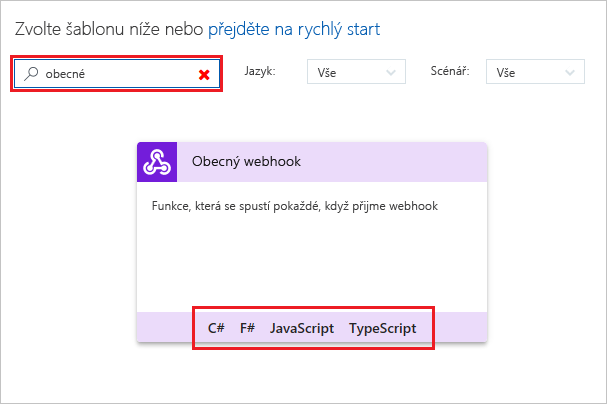
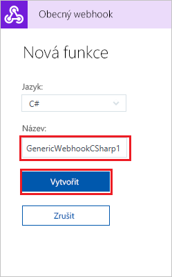
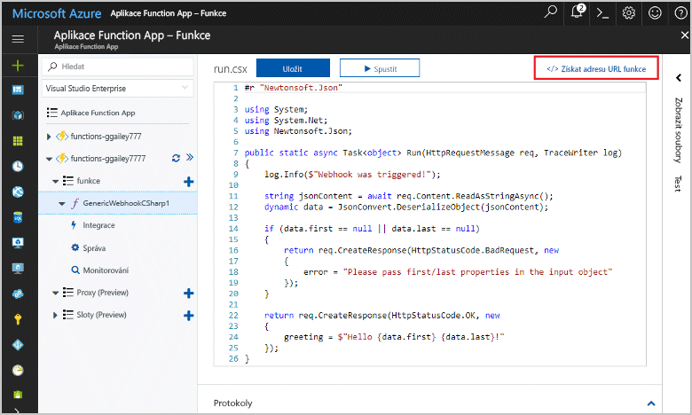
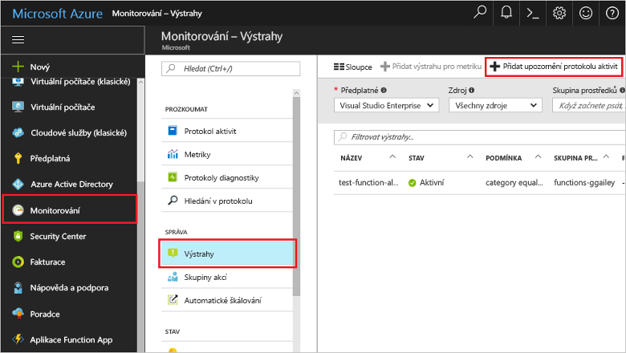
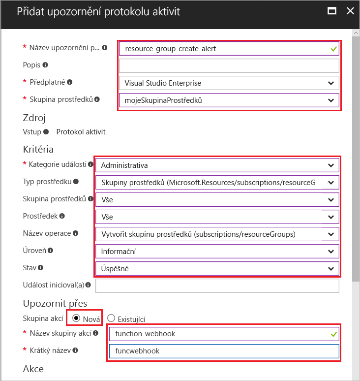
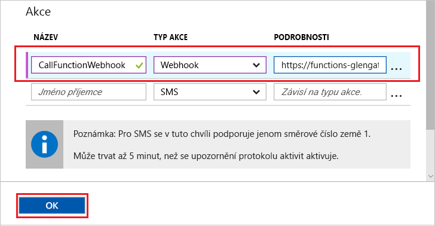
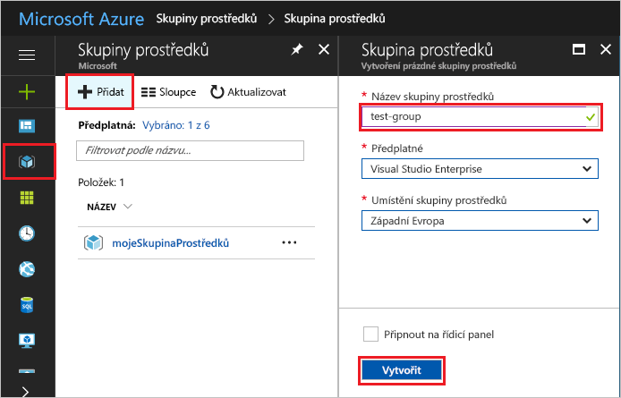

# <a name="create-a-function-triggered-by-a-generic-webhook"></a>Vytvoření funkce aktivované obecným webhookem

Služba Azure Functions umožňuje spuštění kódu v prostředí bez serveru, aniž byste nejdřív museli vytvořit virtuální počítač nebo publikovat webovou aplikaci. Můžete například vytvořit funkci, kterou bude aktivovat upozornění vyvolané službou Azure Monitor. Toto téma ukazuje, jak spustit kód jazyka C# při přidání skupiny prostředků do vašeho předplatného.   



## <a name="prerequisites"></a>Požadavky 

Pro absolvování tohoto kurzu potřebujete:

+ Pokud ještě nemáte předplatné Azure, vytvořte si [bezplatný účet](https://azure.microsoft.com/free/?WT.mc_id=A261C142F) před tím, než začnete.

[!INCLUDE [functions-portal-favorite-function-apps](../../includes/functions-portal-favorite-function-apps.md)]

## <a name="create-an-azure-function-app"></a>Vytvoření aplikace Azure Function App

[!INCLUDE [Create function app Azure portal](../../includes/functions-create-function-app-portal.md)]

Dál vytvoříte v nové aplikaci Function App funkci.

## <a name="create-function"></a>Vytvoření funkce aktivované obecným webhookem

1. Rozbalte aplikaci Function App a klikněte na tlačítko **+** vedle položky **Funkce**. Pokud jde o první funkci ve vaší aplikaci funkcí, vyberte možnost **Vlastní funkce**. Zobrazí se kompletní sada šablon funkcí.

    

2. Do vyhledávacího pole zadejte `generic` a zvolte jazyk požadovaný pro šablonu funkce aktivované obecným webhookem. Toto téma používá funkci v jazyce C#.

     

2. Zadejte **Název** funkce a pak vyberte **Vytvořit**. 

      

2. V nové funkci klikněte na **</> Získat adresu URL funkce** a potom zkopírujte a uložte příslušnou hodnotu. Tuto hodnotu použijete ke konfiguraci webhooku. 

    
         
Dále vytvoříte koncový bod webhooku v upozornění protokolu aktivit ve službě Azure Monitor. 

## <a name="create-an-activity-log-alert"></a>Vytvoření upozornění protokolu aktivit

1. Na webu Azure Portal přejděte do služby **Monitor**, vyberte **Upozornění** a klikněte na **Přidat upozornění protokolu aktivit**.   

    

2. Použijte nastavení uvedená v tabulce:

    

    | Nastavení      |  Navrhovaná hodnota   | Popis                              |
    | ------------ |  ------- | -------------------------------------------------- |
    | **Název upozornění protokolu aktivit** | resource-group-create-alert | Název upozornění protokolu aktivit. |
    | **Předplatné** | Vaše předplatné | Předplatné, které používáte pro účely tohoto kurzu. | 
    |  **Skupina prostředků** | myResourceGroup | Skupina prostředků, do které jsou nasazené prostředky upozornění. Použití stejné skupiny prostředků jako pro aplikaci funkcí vám usnadní vyčištění po dokončení kurzu. |
    | **Kategorie události** | Správa | Tato kategorie zahrnuje změny provedené u prostředků Azure.  |
    | **Typ prostředku** | Skupiny prostředků | Filtruje upozornění na aktivity skupiny prostředků. |
    | **Skupina prostředků**<br/>a **Prostředek** | Vše | Monitoruje všechny prostředky. |
    | **Název operace** | Vytvoření skupiny prostředků | Filtruje upozornění na operace vytvoření. |
    | **Úroveň** | Informační | Zahrnuje upozornění na informační úrovni. | 
    | **Stav** | Úspěch | Filtruje upozornění na akce, které se úspěšně dokončily. |
    | **Skupina akcí** | Nová | Vytvořte novou skupinu akcí, která definuje, jaká akce se provede při vyvolání upozornění. |
    | **Název skupiny akcí** | function-webhook | Název pro identifikaci této skupiny akcí.  | 
    | **Krátký název** | funcwebhook | Krátký název skupiny akcí. |  

3. V části **Akce** přidejte akci s použitím nastavení uvedených v tabulce: 

    

    | Nastavení      |  Navrhovaná hodnota   | Popis                              |
    | ------------ |  ------- | -------------------------------------------------- |
    | **Název** | CallFunctionWebhook | Název akce. |
    | **Typ akce** | Webhook | Reakcí na upozornění je volání adresy URL webhooku. |
    | **Podrobnosti** | Adresa URL funkce | Vložte adresu URL webhooku funkce, kterou jste si zkopírovali dříve. |v

4. Kliknutím na **OK** vytvořte upozornění a skupinu akcí.  

Webhook se teď volá při vytvoření skupiny prostředků ve vašem předplatném. Dále aktualizujete kód vaší funkce tak, aby zpracovávala data protokolu ve formátu JSON v textu žádosti.   

## <a name="update-the-function-code"></a>Aktualizace kódu funkce

1. Na portálu přejděte zpět k vaší aplikaci funkcí a rozbalte vaši funkci. 

2. Kód skriptu jazyka C# ve funkci na portálu nahraďte následujícím kódem:

    ```csharp
    #r "Newtonsoft.Json"
    
    using System;
    using System.Net;
    using Newtonsoft.Json;
    using Newtonsoft.Json.Linq;
    
    public static async Task<object> Run(HttpRequestMessage req, TraceWriter log)
    {
        log.Info($"Webhook was triggered!");
    
        // Get the activityLog object from the JSON in the message body.
        string jsonContent = await req.Content.ReadAsStringAsync();
        JToken activityLog = JObject.Parse(jsonContent.ToString())
            .SelectToken("data.context.activityLog");
    
        // Return an error if the resource in the activity log isn't a resource group. 
        if (activityLog == null || !string.Equals((string)activityLog["resourceType"], 
            "Microsoft.Resources/subscriptions/resourcegroups"))
        {
            log.Error("An error occurred");
            return req.CreateResponse(HttpStatusCode.BadRequest, new
            {
                error = "Unexpected message payload or wrong alert received."
            });
        }
    
        // Write information about the created resource group to the streaming log.
        log.Info(string.Format("Resource group '{0}' was {1} on {2}.",
            (string)activityLog["resourceGroupName"],
            ((string)activityLog["subStatus"]).ToLower(), 
            (DateTime)activityLog["submissionTimestamp"]));
    
        return req.CreateResponse(HttpStatusCode.OK);    
    }
    ```

Nyní můžete funkci otestovat vytvořením nové skupiny prostředků ve vašem předplatném.

## <a name="test-the-function"></a>Testování funkce

1. Klikněte na ikonu skupiny prostředků v levé části webu Azure Portal, vyberte **+ Přidat**, zadejte **Název skupiny prostředků** a vyberte **Vytvořit**. Vytvoří se prázdná skupina prostředků.
    
    

2. Přejděte zpět k vaší funkci a rozbalte okno **Protokoly**. Po vytvoření skupiny prostředků aktivuje upozornění protokolu aktivit webhook a provede se příslušná funkce. V protokolech se zobrazí název nové skupiny prostředků.  

    

3. (Volitelné) Vraťte se a odstraňte skupinu prostředků, kterou jste vytvořili. Všimněte si, že tato aktivita funkci neaktivuje. Důvodem je to, že upozornění vyfiltruje operace odstranění. 

## <a name="clean-up-resources"></a>Vyčištění prostředků

[!INCLUDE [Next steps note](../../includes/functions-quickstart-cleanup.md)]

## <a name="next-steps"></a>Další kroky

Vytvořili jste funkci, která se spustí při přijetí požadavku z obecného webhooku. 

[!INCLUDE [Next steps note](../../includes/functions-quickstart-next-steps.md)]

Další informace o aktivačních událostech webhooků najdete v tématu [Vazby protokolu HTTP služby Azure Functions a vazby webhooku](functions-bindings-http-webhook.md). Další informace o vývoji funkcí v jazyce C# najdete v tématu [Referenční informace pro vývojáře skriptů jazyka C# pro Azure Functions](functions-reference-csharp.md).

