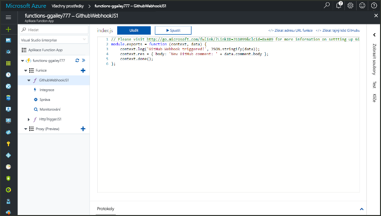
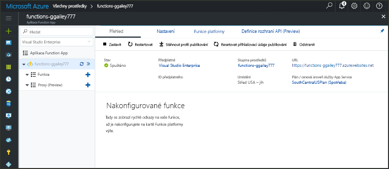
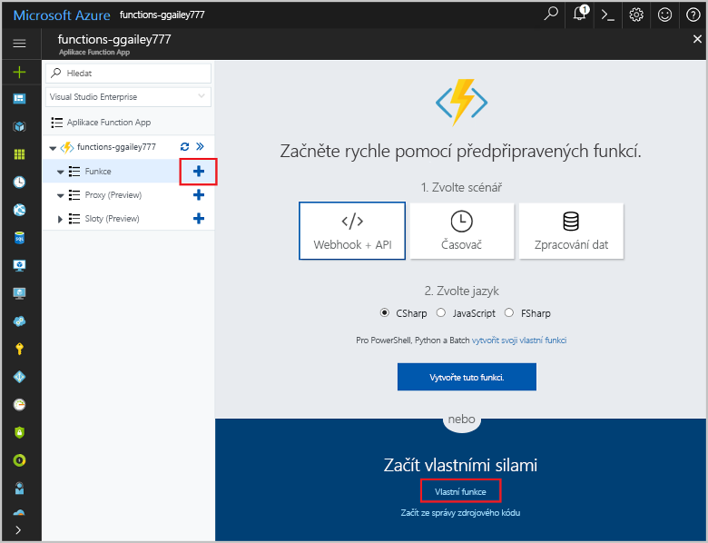
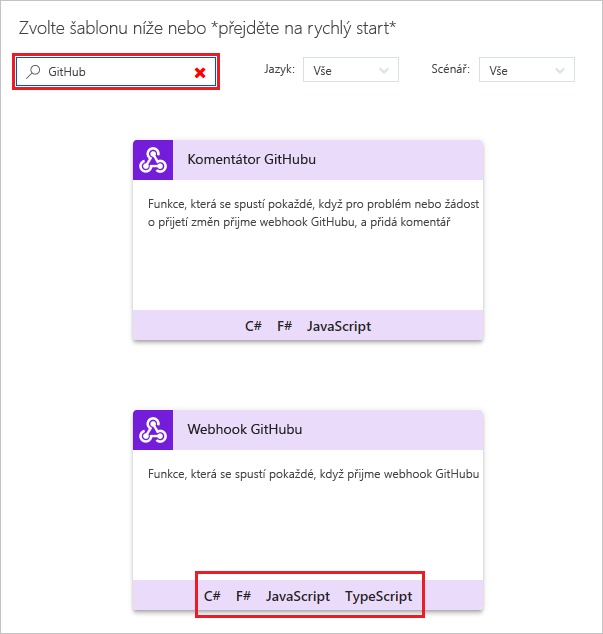
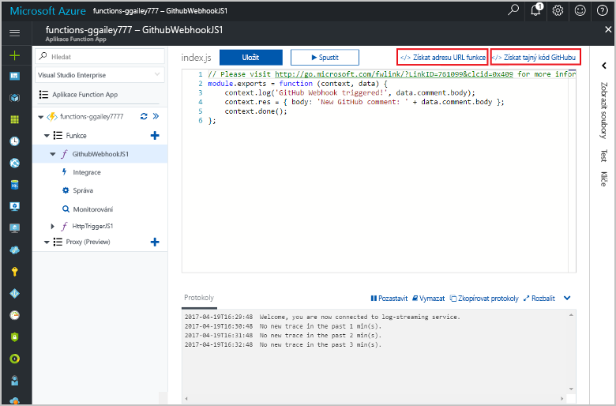
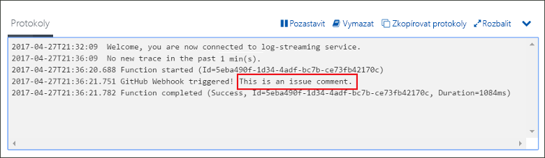

# Vytvoření funkce aktivované webhookem GitHubu

Naučte se vytvořit funkci, která se aktivuje požadavkem webhooku HTTP s datovou částí specifickou pro GitHub.

## Požadavky

+ Účet GitHubu s alespoň jedním projektem.
+ Předplatné Azure. Pokud ho nemáte, než začnete, vytvořte si [bezplatný účet](https://azure.microsoft.com/free/?WT.mc_id=A261C142F).

[!INCLUDE [functions-portal-favorite-function-apps](../../includes/functions-portal-favorite-function-apps.md)]

## Vytvoření aplikace Azure Function App

[!INCLUDE [Create function app Azure portal](../../includes/functions-create-function-app-portal.md)]

Dál vytvoříte v nové aplikaci Function App funkci.

## Vytvoření funkce aktivované webhookem GitHubu

1. Rozbalte aplikaci Function App a klikněte na tlačítko **+** vedle položky **Funkce**. Pokud jde o první funkci ve vaší aplikaci Function App, vyberte možnost **Vlastní funkce**. Zobrazí se kompletní sada šablon funkcí.

    

2. Vyberte **WebHook Githubu** šablonu pro požadovaný jazyk. **Pojmenujte funkci** a pak vyberte **Vytvořit**.

      

3. V nové funkci klikněte na **</> Získat adresu URL funkce** a potom zkopírujte a uložte příslušné hodnoty. To samé udělejte s možností **</> Získat tajný klíč GitHubu**. Tyto hodnoty použijete ke konfiguraci webhooku na GitHubu.

    

Dále vytvoříte webhook ve vašem úložišti GitHub.

## Konfigurace webhooku

1. V GitHubu přejděte do úložiště, které vlastníte. Můžete také použít libovolné úložiště, které máte rozvětvené. Pokud potřebujete úložiště rozvětvit, použijte stránku <https://github.com/Azure-Samples/functions-quickstart>.

1. Klikněte na **Settings** (Nastavení), pak na **Webhooks** (Webhooky) a **Add webhook** (Přidat webhook).

    

1. Použijte nastavení uvedené v tabulce a potom klikněte na **Přidat webhook**.

    

| Nastavení | Navrhovaná hodnota | Popis |
|---|---|---|
| **Datová část adresy URL** | Zkopírovaná hodnota | Použijte hodnotu vrácenou příkazem **</> Získat adresu URL funkce**. |
| **Tajný kód**   | Zkopírovaná hodnota | Použijte hodnotu vrácenou příkazem **</> Získat tajný kód GitHubu**. |
| **Typ obsahu** | application/json | Funkce očekává datovou část JSON. |
| Aktivační události | Nechat mě vybrat jednotlivé události | Chceme provést aktivaci jenom při událostech komentářů k problémům.  |
| | Komentář k problému |  |

Teď je webhook nakonfigurován tak, aby aktivoval vaši funkci v případě, že dojde k přidání nového komentáře k problému.

## Testování funkce

1. Ve vašem úložišti GitHub otevřete kartu **Issues** (Problémy) v novém okně prohlížeče.

1. V novém okně klikněte na **New Issue** (Nový problém), zadejte název a klikněte na **Submit new issue** (Odeslat nový problém).

1. U problému zadejte komentář a klikněte na tlačítko **Comment** (Komentář).

    

1. Vraťte se na portál a podívejte se do protokolů. Měli byste vidět položku trasování s textem nového komentáře.

     

## Vyčištění prostředků

[!INCLUDE [Next steps note](../../includes/functions-quickstart-cleanup.md)]

## Další kroky

Vytvořili jste funkci, která se spustí při přijetí požadavku z webhooku Githubu.

[!INCLUDE [Next steps note](../../includes/functions-quickstart-next-steps.md)]

Další informace o aktivačních událostech webhooků najdete v tématu [Vazby protokolu HTTP služby Azure Functions a vazby webhooku](functions-bindings-http-webhook.md).
