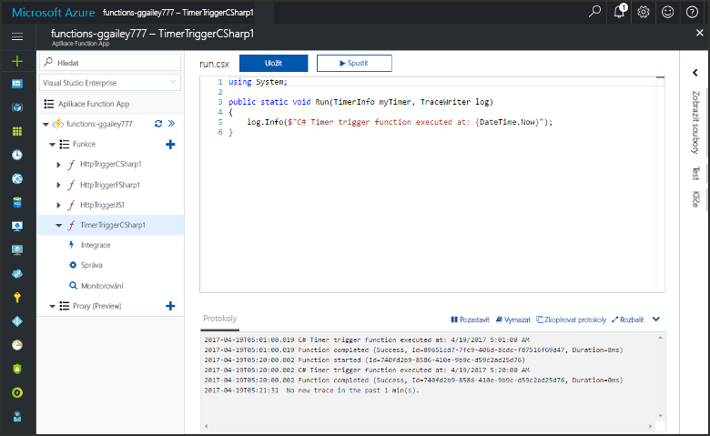
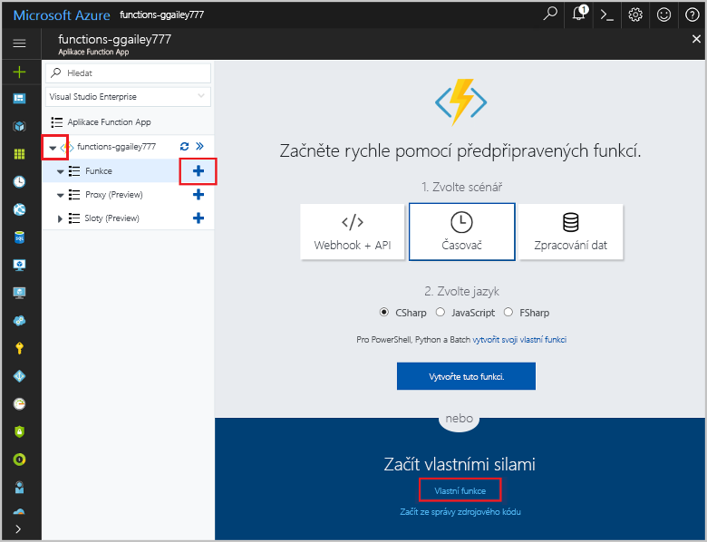
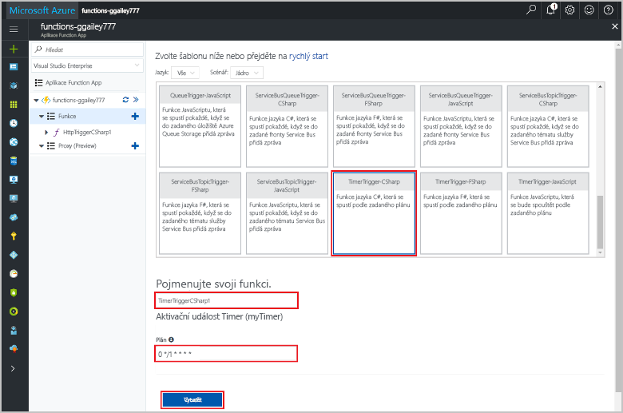
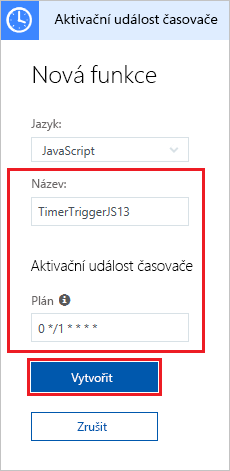
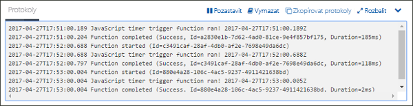
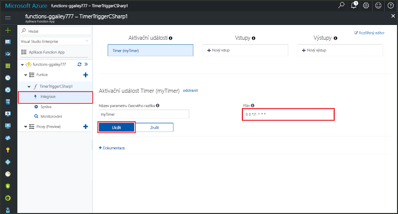

# Vytvoření funkce v Azure aktivované časovačem

Zjistěte, jak ve službě Azure Functions vytvořit funkci, která se spouští na základě vámi definovaného plánu.

## Požadavky

K provedení kroků v tomto kurzu je potřeba:

+ Pokud ještě nemáte předplatné Azure, vytvořte si [bezplatný účet](https://azure.microsoft.com/free/?WT.mc_id=A261C142F) před tím, než začnete.

[!INCLUDE [functions-portal-favorite-function-apps](../../includes/functions-portal-favorite-function-apps.md)]

## Vytvoření aplikace Azure Function App

[!INCLUDE [Create function app Azure portal](../../includes/functions-create-function-app-portal.md)]

Dál vytvoříte v nové aplikaci Function App funkci.

## Vytvoření funkce aktivované časovačem

1. Rozbalte aplikaci Function App a klikněte na tlačítko **+** vedle položky **Funkce**. Pokud jde o první funkci ve vaší aplikaci Function App, vyberte možnost **Vlastní funkce**. Zobrazí se kompletní sada šablon funkcí.

    

2. Do vyhledávacího pole zadejte `timer` a zvolte jazyk požadovaný pro šablonu funkce aktivované časovačem. 

    

3. Nakonfigurujte novou aktivační událost s nastaveními uvedenými v tabulce pod obrázkem.

    

    | Nastavení | Navrhovaná hodnota | Popis |
    |---|---|---|
    | **Název** | Výchozí | Určuje název funkce aktivované časovačem. |
    | **[Plán](http://en.wikipedia.org/wiki/Cron#CRON_expression)** | 0 \*/1 \* \* \* \* | Pole [Výraz CRON](http://en.wikipedia.org/wiki/Cron#CRON_expression) v šestkové soustavě, ve kterém naplánujete spouštění funkce každou minutu. |

2. Klikněte na možnost **Vytvořit**. Ve zvoleném jazyce se vytvoří funkce, která se bude spouštět každou minutu.

3. Podívejte se na informace o trasování zaznamenané v protokolech a ověřte provedení.

    

Teď můžete změnit plán funkce tak, aby se funkce spouštěla méně často, třeba jednou za hodinu. 

## Aktualizace plánu časovače

1. Rozbalte funkci a klikněte na **Integrace**. Tady se určují vstupní a výstupní vazby funkce a nastavuje plán. 

2. V poli **Plán** zadejte novou hodnotu `0 0 */1 * * *` a potom klikněte na **Uložit**.  

Teď máte funkci, která se spouští jednou za hodinu. 

## Vyčištění prostředků

[!INCLUDE [Next steps note](../../includes/functions-quickstart-cleanup.md)]

## Další kroky

Vytvořili jste funkci, která se spouští na základě plánu.

[!INCLUDE [Next steps note](../../includes/functions-quickstart-next-steps.md)]

Další informace o aktivačních časovačích najdete v tématu [Plánování spouštění kódu v Azure Functions](functions-bindings-timer.md).