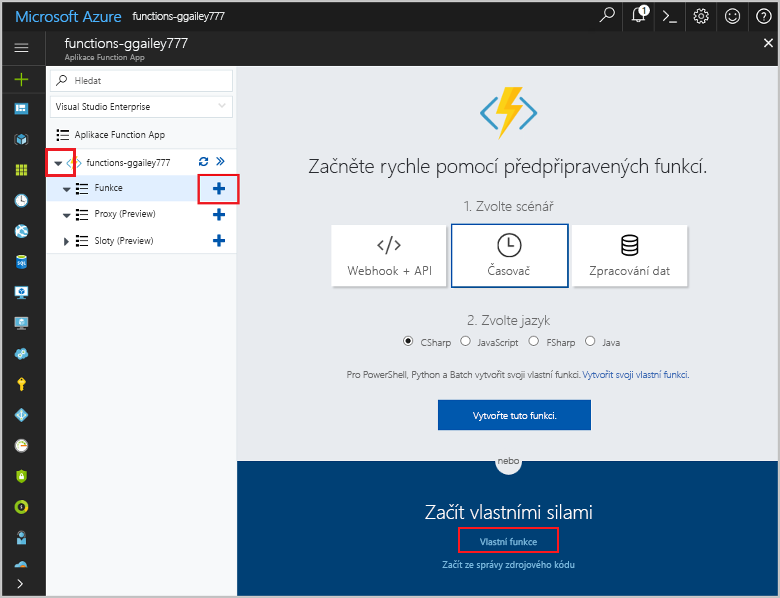
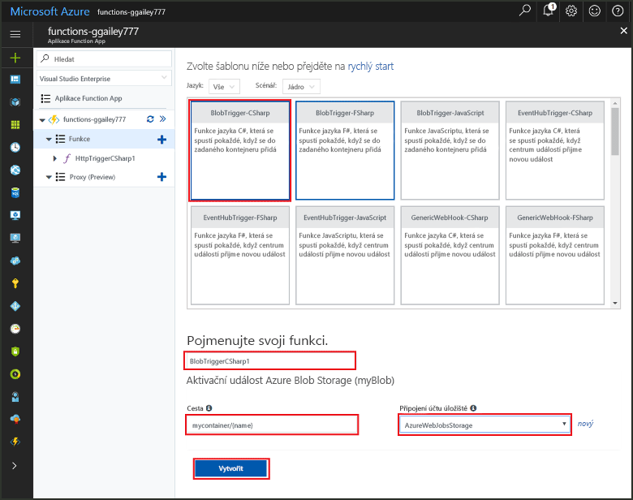
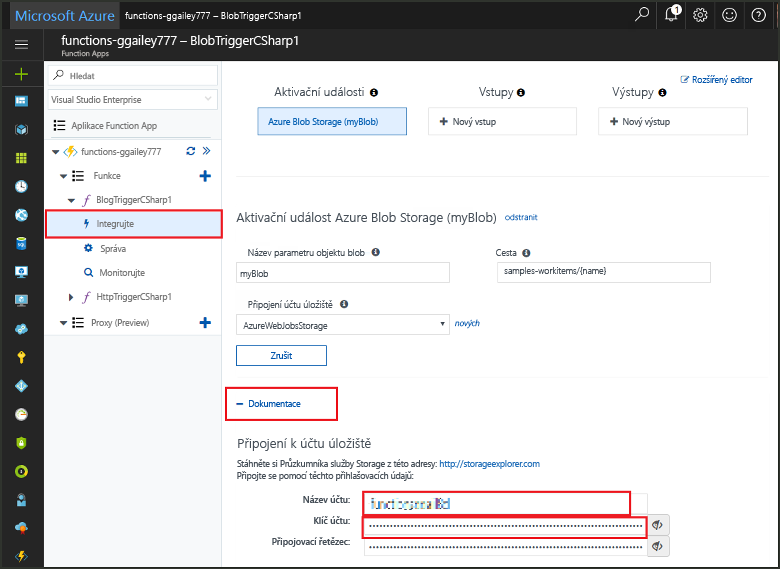
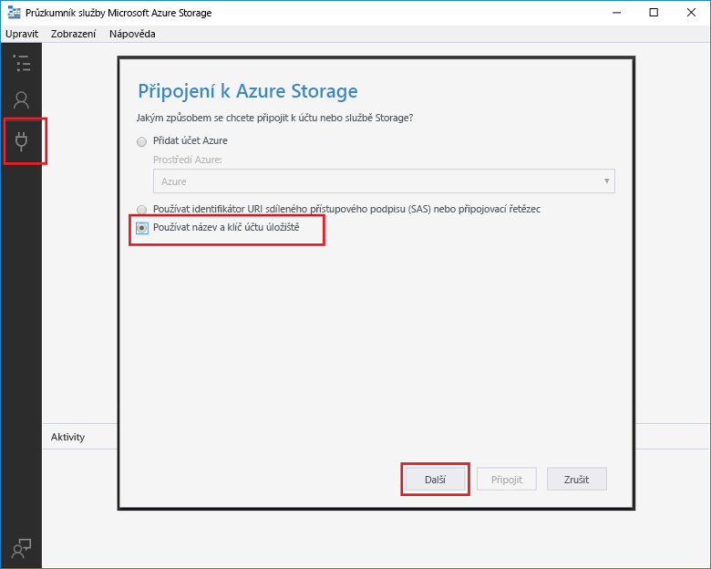
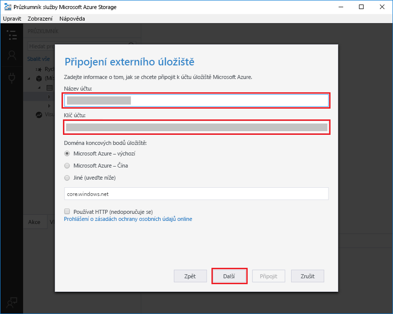
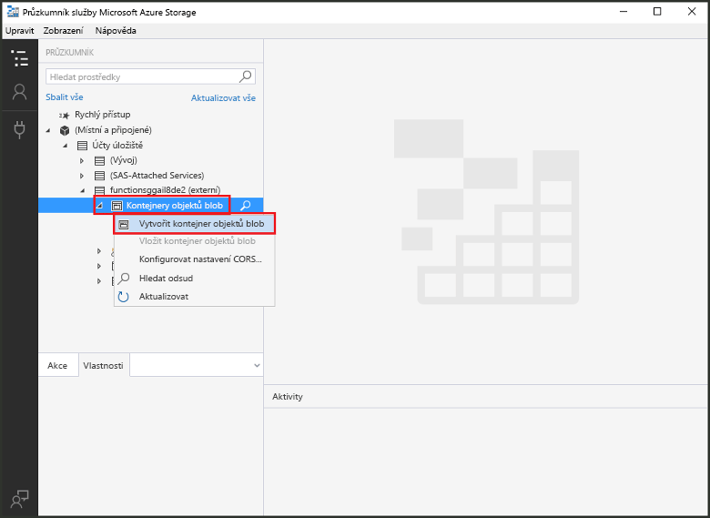
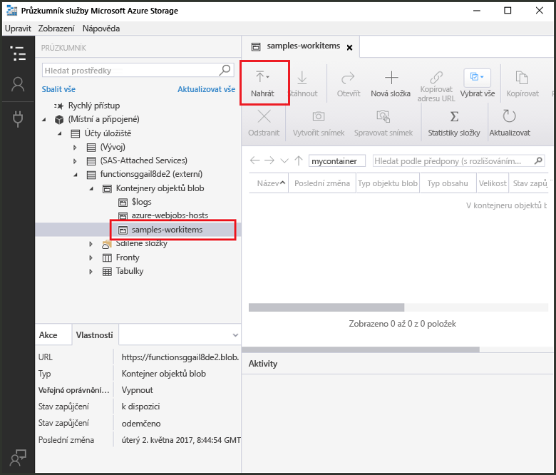
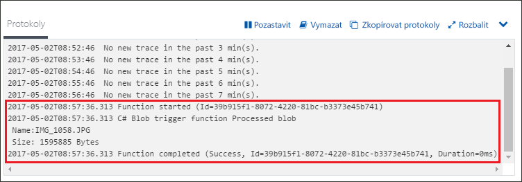

# Vytvoření funkce aktivované službou Azure Blob Storage

Dozvíte se, jak vytvořit funkci, která se aktivuje při odesílání souborů do služby Azure Blob Storage nebo při jejich aktualizaci v této službě.

## Požadavky

+ Stáhnout a nainstalovat [Microsoft Azure Storage Explorer](http://storageexplorer.com/).
+ Předplatné Azure. Pokud ho nemáte, než začnete, vytvořte si [bezplatný účet](https://azure.microsoft.com/free/?WT.mc_id=A261C142F).

[!INCLUDE [functions-portal-favorite-function-apps](../../includes/functions-portal-favorite-function-apps.md)]

## Vytvoření aplikace Azure Function App

[!INCLUDE [Create function app Azure portal](../../includes/functions-create-function-app-portal.md)]

Dál vytvoříte v nové aplikaci Function App funkci.

## Vytvoření funkce aktivované službou Blob Storage

1. Rozbalte aplikaci Function App a klikněte na tlačítko **+** vedle položky **Funkce**. Pokud jde o první funkci ve vaší aplikaci Function App, vyberte možnost **Vlastní funkce**. Zobrazí se kompletní sada šablon funkcí.

    

2. Vyberte šablonu **BlobTrigger** pro požadovaný jazyk a potom použijte nastavení uvedené v tabulce.

    

    | Nastavení | Navrhovaná hodnota | Popis |
    |---|---|---|
    | **Cesta**   | mycontainer/{name}    | Monitorované umístění ve službě Blob Storage. Název souboru objektu blob se předává v rámci vazby jako parametr _název_.  |
    | **Připojení k účtu úložiště** | AzureWebJobStorage | Můžete použít připojení k účtu úložiště, které už používá vaše aplikace Function App, nebo můžete vytvořit nové.  |
    | **Pojmenujte svoji funkci** | Jedinečný název v rámci aplikace Function App | Název této funkce aktivované objektem blob. |

3. Funkci vytvoříte kliknutím na **Vytvořit**.

Teď se připojíte ke svému účtu služby Azure Storage a vytvoříte kontejner **mycontainer**.

## Vytvoření kontejneru

1. Ve funkci klikněte na **Integrace**, rozbalte položku **Dokumentace**a zkopírujte údaje **Název účtu** a **Klíč účtu**. Tyto přihlašovací údaje použijte k připojení k účtu úložiště. Pokud jste se už ke svému účtu úložiště připojili, přejděte ke kroku 4.

    

1. Spusťte nástroj [Microsoft Azure Storage Explorer](http://storageexplorer.com/), vlevo klikněte na ikonu připojení, zvolte **Use a storage account name and key** (Použít název a klíč účtu úložiště) a klikněte na **Next** (Další).

    

1. Zadejte **Název účtu** a **Klíč účtu** z kroku 1, klikněte na **Další** a potom klikněte na **Připojit**. 

    

1. Rozbalte připojený účet úložiště, klikněte pravým tlačítkem na **Kontejnery objektů blob**, klikněte na **Vytvořit kontejner objektů blob**, zadejte `mycontainer` a potom stiskněte Enter.

    

Teď když máte kontejner objektů blob a můžete funkci otestovat tím, že do kontejneru odešlete soubor.

## Testování funkce

1. Zpátky na webu Azure Portal přejděte na svoji funkci, ve spodní části stránky rozbalte **Protokoly** a ujistěte se, že není pozastavené streamování protokolů.

1. V Průzkumníku úložišť rozbalte účet úložiště, položku **Kontejnery objektů blob** a potom položku **mycontainer**. Klikněte na **Odeslat** a potom na **Nahrát soubory…**.

    

1. V dialogovém okně **Nahrát soubory** klikněte na pole **Soubory**. Přejděte na soubor v místním počítači, třeba na soubor obrázku, vyberte ho, klikněte na **Otevřít** a potom na **Odeslat**.

1. Vraťte se k protokolům funkce a zkontrolujte, jestli proběhlo čtení objektu blob.

   

    >[!NOTE]
    > Pokud vaše Function App běží ve výchozím plánu Consumption, může mezi přidáním nebo aktualizací objektu blob a aktivací funkce dojít až k několikaminutové prodlevě. Pokud u funkcí aktivovaných objekty blob potřebujete nízkou latenci, zvažte spuštění aplikace Function App v rámci plánu služby App Service.

## Vyčištění prostředků

[!INCLUDE [Next steps note](../../includes/functions-quickstart-cleanup.md)]

## Další kroky

Vytvořili jste funkci, která se spustí při přidání nebo aktualizaci objektu blob ve službě Blob Storage. 

[!INCLUDE [Next steps note](../../includes/functions-quickstart-next-steps.md)]

Další informace o aktivačních událostech služby Blob Storage najdete v tématu [Vazby služby Azure Functions Blob Storage](functions-bindings-storage-blob.md).

