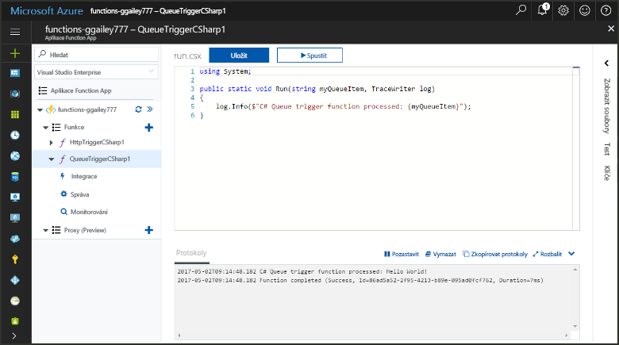
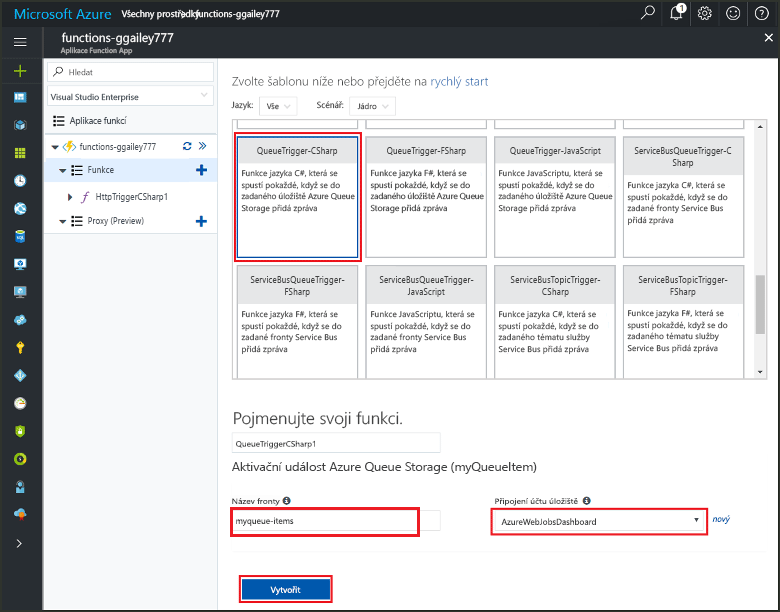
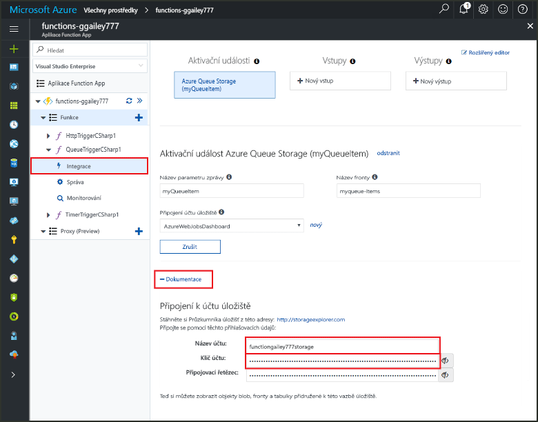
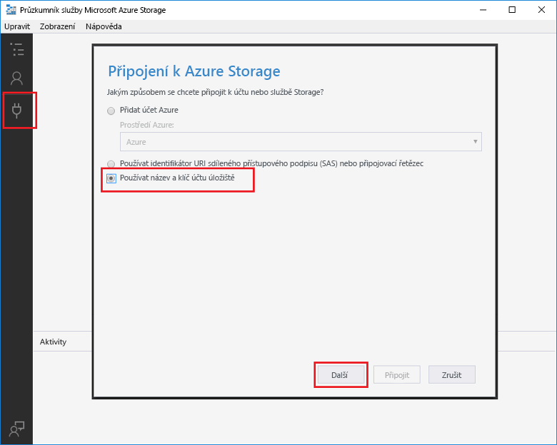
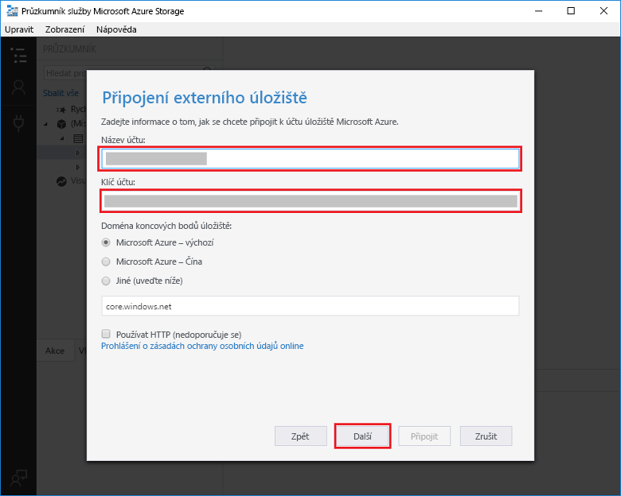
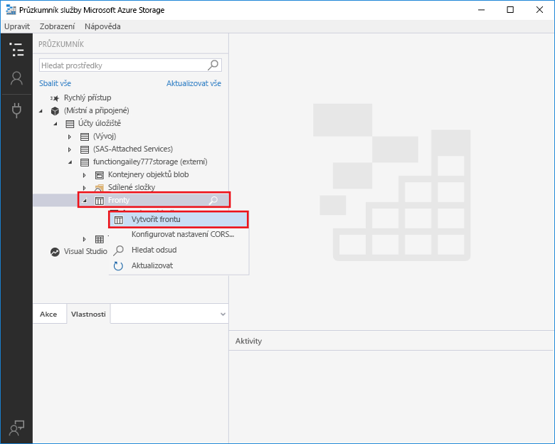
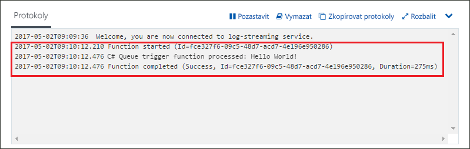

# Vytvoření funkce aktivované službou Azure Queue Storage

Zjistíte, jak vytvořit funkci, která se aktivuje při odeslání zpráv do fronty služby Azure Storage.

## Požadavky

- Stáhnout a nainstalovat [Microsoft Azure Storage Explorer](http://storageexplorer.com/).

- Předplatné Azure. Pokud ho nemáte, než začnete, vytvořte si [bezplatný účet](https://azure.microsoft.com/free/?WT.mc_id=A261C142F).

[!INCLUDE [functions-portal-favorite-function-apps](../../includes/functions-portal-favorite-function-apps.md)]

## Vytvoření aplikace Azure Function App

[!INCLUDE [Create function app Azure portal](../../includes/functions-create-function-app-portal.md)]

Dál vytvoříte v nové aplikaci Function App funkci.

## Vytvoření funkce aktivované frontou

1. Rozbalte aplikaci Function App a klikněte na tlačítko **+** vedle položky **Funkce**. Pokud jde o první funkci ve vaší aplikaci Function App, vyberte možnost **Vlastní funkce**. Zobrazí se kompletní sada šablon funkcí.

    

2. Vyberte šablonu **QueueTrigger** pro požadovaný jazyk a potom použijte nastavení uvedené v tabulce.

    
    
    | Nastavení | Navrhovaná hodnota | Popis |
    |---|---|---|
    | **Název fronty**   | myqueue-items    | Název fronty, ke které se připojíte ve svém účtu úložiště. |
    | **Připojení k účtu úložiště** | AzureWebJobStorage | Můžete použít připojení k účtu úložiště, které už používá vaše aplikace Function App, nebo můžete vytvořit nové.  |
    | **Pojmenujte svoji funkci** | Jedinečný název v rámci aplikace Function App | Název této funkce aktivované frontou. |

3. Funkci vytvoříte kliknutím na **Vytvořit**.

Teď se připojíte ke svému účtu služby Azure Storage a vytvoříte frontu úložiště **myqueue-items**.

## Vytvoření fronty

1. Ve funkci klikněte na **Integrace**, rozbalte položku **Dokumentace**a zkopírujte údaje **Název účtu** a **Klíč účtu**. Tyto přihlašovací údaje použijte k připojení k účtu úložiště. Pokud jste se už ke svému účtu úložiště připojili, přejděte ke kroku 4.

    v

1. Spusťte nástroj [Microsoft Azure Storage Explorer](http://storageexplorer.com/), vlevo klikněte na ikonu připojení, zvolte **Use a storage account name and key** (Použít název a klíč účtu úložiště) a klikněte na **Next** (Další).

    

1. Zadejte **Název účtu** a **Klíč účtu** z kroku 1, klikněte na **Další** a potom klikněte na **Připojit**.

    

1. Rozbalte připojený účet úložiště, klikněte pravým tlačítkem na **Fronty**, klikněte na **Vytvořit frontu**, zadejte`myqueue-items` a potom stiskněte Enter.

    

Teď máte frontu úložiště a můžete funkci otestovat přidáním zprávy do fronty.

## Testování funkce

1. Zpátky na webu Azure Portal přejděte na svoji funkci, ve spodní části stránky rozbalte **Protokoly** a ujistěte se, že není pozastavené streamování protokolů.

1. V Storage Exploreru rozbalte svůj účet úložiště, možnosti **Queues** (Fornty), a **myqueue-items** a potom klikněte na **Add message** (Přidat zprávu).

    

1. Zadejte zprávu „Hello World!“ do pole **Text zprávy** a klikněte na **OK**.

1. Několik sekund počkejte, potom se vraťte k protokolům funkce a zkontrolujte, jestli se nová zpráva z fronty přečetla.

    

1. Zpátky v Storage Exploreru klikněte na **Refresh** (Aktualizovat) a zkontrolujte, jestli proběhlo zpracování zprávy a jestli zpráva zmizela z fronty.

## Vyčištění prostředků

[!INCLUDE [Next steps note](../../includes/functions-quickstart-cleanup.md)]

## Další kroky

Vytvořili jste funkci, která se spustí při přidání zprávy do fronty úložiště.

[!INCLUDE [Next steps note](../../includes/functions-quickstart-next-steps.md)]

Další informace o aktivačních událostech fronty úložiště najdete v tématu [Vazby front úložiště služby Azure Functions](functions-bindings-storage-queue.md).
