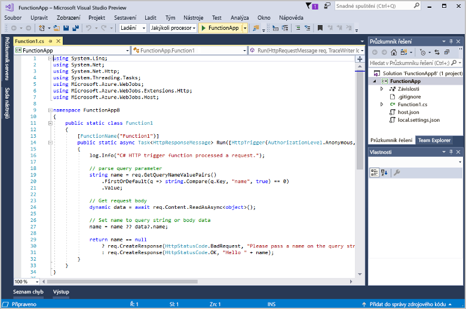

# Vytvoření první funkce pomocí sady Visual Studio

Služba Azure Functions umožňuje spuštění kódu v prostředí [bez serveru](https://azure.microsoft.com/overview/serverless-computing/), aniž byste nejdřív museli vytvořit virtuální počítač nebo publikovat webovou aplikaci.

V tomto tématu zjistíte, jak pomocí nástrojů sady Visual Studio 2017 pro Azure Functions místně vytvořit a otestovat funkci Hello World. Kód funkce potom budete publikovat do Azure. Tyto nástroje jsou dostupné jako součást sady funkcí Vývoj pro Azure v sadě Visual Studio 2017 verze 15.3 nebo novější.

Pokud chcete, můžete se místo toho [podívat na video](#watch-the-video).

## Požadavky

Pro absolvování tohoto kurzu nainstalujte:

* [Visual Studio 2017 verze 15.4](https://www.visualstudio.com/vs/) nebo novější, včetně sady funkcí **Vývoj pro Azure**.

    
    
[!INCLUDE [quickstarts-free-trial-note](../../includes/quickstarts-free-trial-note.md)] 

## Vytvoření projektu Azure Functions v sadě Visual Studio

[!INCLUDE [Create a project using the Azure Functions template](../../includes/functions-vstools-create.md)]

Teď, když jste vytvořili projekt, můžete vytvořit svou první funkci.

## Vytvoření funkce

1. V **Průzkumníku řešení** klikněte pravým tlačítkem na uzel projektu a vyberte **Přidat** > **Nová položka**. Vyberte **Funkce Azure Functions**, jako **Název** zadejte `HttpTriggerCSharp.cs` a klikněte na **Přidat**.

2. Vyberte **HttpTrigger**, jako **Přístupová práva** vyberte **Anonymní** a klikněte na **OK**. Vytvořená funkce je přístupná prostřednictvím požadavku HTTP z jakéhokoli klienta. 

    

    Do vašeho projektu se přidá soubor s kódem, který obsahuje třídu implementující kód vaší funkce. Tento kód je založený na šabloně, která přijímá hodnotu názvu a vrací ji zpět. Atribut **FunctionName** nastavuje název vaší funkce. Atribut **HttpTrigger** určuje zprávu, která funkci aktivuje. 

    

Teď máte vytvořenou funkci aktivovanou protokolem HTTP a můžete ji otestovat na místním počítači.

## Místní testování funkce

Nástroje Azure Functions Core umožňují spouštět projekt Azure Functions na místním počítači pro vývoj. K instalaci těchto nástrojů budete vyzváni při prvním spuštění funkce ze sady Visual Studio.  

1. Pokud chcete funkci otestovat, stiskněte F5. Po výzvě přijměte požadavek ze sady Visual Studio na stažení a instalaci nástrojů Azure Functions Core (CLI).  Může být také potřeba povolit výjimku brány firewall, aby nástroje mohly zpracovávat požadavky HTTP.

2. Zkopírujte adresu URL vaší funkce z výstupu modulu runtime služby Azure Functions.  

    

3. Vložte adresu URL pro požadavek HTTP do panelu adresy prohlížeče. K této adrese URL připojte řetězec dotazu `?name=<yourname>` a proveďte požadavek. Následuje ukázka odezvy na místní požadavek GET vrácené funkcí v prohlížeči: 

    

4. Pokud chcete zastavit ladění, klikněte na tlačítko **Zastavit** na panelu nástrojů sady Visual Studio.

Po ověření správného fungování funkce na místním počítači je na čase publikovat projekt do Azure.

## Publikování projektu do Azure

Před publikováním projektu musíte mít v předplatném Azure aplikaci funkcí. Aplikaci funkcí můžete vytvořit přímo v sadě Visual Studio.

[!INCLUDE [Publish the project to Azure](../../includes/functions-vstools-publish.md)]

## Testování funkce v Azure

1. Zkopírujte základní adresu URL aplikace funkcí ze stránky Publikovat profil. Nahraďte část adresy URL použité při místním testování funkce, která obsahuje `localhost:port`, novou základní adresou URL. Stejně jako dříve nezapomeňte k této adrese URL připojit řetězec dotazu `?name=<yourname>` a provést požadavek.

    Adresa URL, která volá vaši funkci aktivovanou protokolem HTTP, vypadá nějak takto:

        http://<functionappname>.azurewebsites.net/api/<functionname>?name=<yourname> 

2. Vložte tuto novou adresu URL pro požadavek HTTP do panelu Adresa prohlížeče. Následuje ukázka odezvy na vzdálený požadavek GET vrácené funkcí v prohlížeči: 

    

## Přehrát video

> [!VIDEO https://www.youtube-nocookie.com/embed/DrhG-Rdm80k]

## Další kroky

Pomocí sady Visual Studio jste vytvořili aplikaci funkcí jazyka C# s jednoduchou funkcí aktivovanou protokolem HTTP. 

+ Pokud chcete zjistit, jak nakonfigurovat projekt tak, aby podporoval další typy triggerů a vazeb, přečtěte si část [Konfigurace projektu pro místní vývoj](functions-develop-vs.md#configure-the-project-for-local-development) v tématu [Azure Functions Tools for Visual Studio](functions-develop-vs.md).
+ Další informace o místním testování a ladění pomocí základních funkcí služby Azure Functions najdete v tématu [Místní kódování a testování služby Azure Functions](functions-run-local.md). 
+ Další informace o vývoji funkcí jako knihoven tříd .NET najdete v tématu [Použití knihoven tříd .NET se službou Azure Functions](functions-dotnet-class-library.md). 

