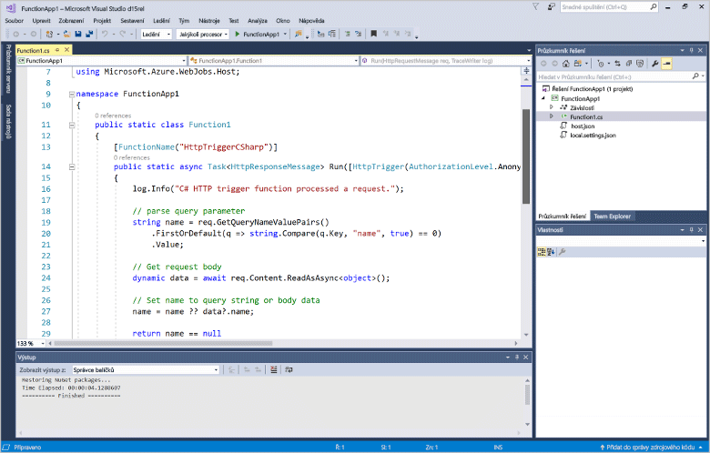
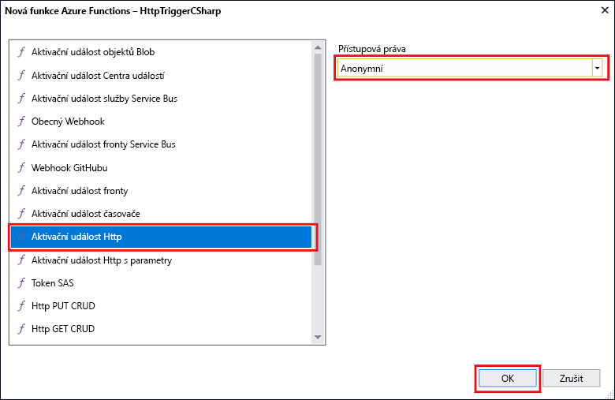
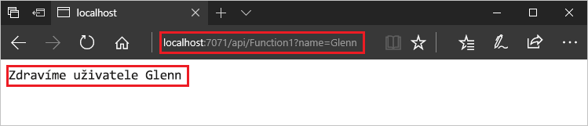
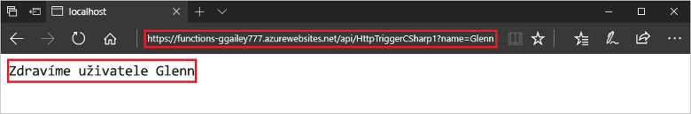

# Vytvoření první funkce pomocí sady Visual Studio

Služba Azure Functions umožňuje spuštění kódu v prostředí bez serveru, aniž byste nejdřív museli vytvořit virtuální počítač nebo publikovat webovou aplikaci.

> [!IMPORTANT]
> K dokončení kroků v tomto tématu se používá verze Preview sady Visual Studio. Než budete pokračovat, zkontrolujte, že máte nainstalovanou sadu [Visual Studio 2017 verze Preview 15.3](https://www.visualstudio.com/vs/preview/).

V tomto tématu zjistíte, jak pomocí Azure Functions Tools for Visual Studio 2017 místně vytvořit a otestovat funkci Hello World. Kód funkce potom budete publikovat do Azure.

## Požadavky

Pro absolvování tohoto kurzu nainstalujte:

* [Visual Studio 2017 Preview verze 15.3](https://www.visualstudio.com/vs/preview/), včetně sady funkcí **Vývoj pro Azure**.

    

[!INCLUDE [quickstarts-free-trial-note](../../includes/quickstarts-free-trial-note.md)]

## Instalace Azure Functions Tools for Visual Studio 2017

Než začnete, musíte stáhnout a nainstalovat Azure Functions Tools for Visual Studio 2017. Tyto nástroje je možné použít pouze se sadou Visual Studio 2017 Preview verze 15.3 nebo novější. Pokud jste už Azure Functions Tools nainstalovali, můžete tuto část přeskočit.

[!INCLUDE [Install the Azure Functions Tools for Visual Studio](../../includes/functions-install-vstools.md)]   

## Vytvoření projektu Azure Functions v sadě Visual Studio

[!INCLUDE [Create a project using the Azure Functions template](../../includes/functions-vstools-create.md)]

Teď, když jste vytvořili projekt, můžete vytvořit svou první funkci.

## Vytvoření funkce

V **Průzkumníku řešení** klikněte pravým tlačítkem na uzel projektu a vyberte **Přidat** > **Nová položka**. Vyberte **Funkce Azure Functions** a klikněte na **Přidat**.

Vyberte **HttpTrigger**, zadejte **Název funkce**, jako **Přístupová práva** vyberte **Anonymní** a klikněte na **Vytvořit**. Vytvořená funkce je přístupná prostřednictvím požadavku HTTP z jakéhokoli klienta. 

Teď máte vytvořenou funkci aktivovanou protokolem HTTP a můžete ji otestovat na místním počítači.

## Místní testování funkce

[!INCLUDE [Test the function locally](../../includes/functions-vstools-test.md)]

Zkopírujte adresu URL vaší funkce z výstupu modulu runtime služby Azure Functions.  

 Vložte adresu URL pro požadavek HTTP do panelu adresy prohlížeče. K této adrese URL připojte řetězec dotazu `&name=<yourname>` a proveďte požadavek. Následuje ukázka odezvy na místní požadavek GET vrácené funkcí v prohlížeči: 

Pokud chcete zastavit ladění, klikněte na tlačítko **Zastavit** na panelu nástrojů sady Visual Studio.

Po ověření správného fungování funkce na místním počítači je na čase publikovat projekt do Azure.

## Publikování projektu do Azure

Před publikováním projektu musíte mít v předplatném Azure aplikaci funkcí. Aplikaci funkcí můžete vytvořit přímo v sadě Visual Studio.

[!INCLUDE [Publish the project to Azure](../../includes/functions-vstools-publish.md)]

## Testování funkce v Azure

Zkopírujte základní adresu URL aplikace funkcí ze stránky Publikovat profil. Nahraďte část adresy URL použité při místním testování funkce, která obsahuje `localhost:port`, novou základní adresou URL. Stejně jako dříve nezapomeňte k této adrese URL připojit řetězec dotazu `&name=<yourname>` a provést požadavek.

Adresa URL, která volá vaši funkci aktivovanou protokolem HTTP, vypadá nějak takto:

    http://<functionappname>.azurewebsites.net/api/<functionname>?name=<yourname> 

Vložte tuto novou adresu URL pro požadavek HTTP do panelu Adresa prohlížeče. Následuje ukázka odezvy na vzdálený požadavek GET vrácené funkcí v prohlížeči: 

 
## Další kroky

Pomocí sady Visual Studio jste vytvořili aplikaci funkcí jazyka C# s jednoduchou funkcí aktivovanou protokolem HTTP. 

[!INCLUDE [functions-quickstart-next-steps](../../includes/functions-quickstart-next-steps.md)]

Další informace o místním testování a ladění pomocí základních funkcí služby Azure Functions najdete v tématu [Místní kódování a testování služby Azure Functions](functions-run-local.md). Další informace o vývoji funkcí jako knihoven tříd .NET najdete v tématu [Použití knihoven tříd .NET se službou Azure Functions](functions-dotnet-class-library.md). 

