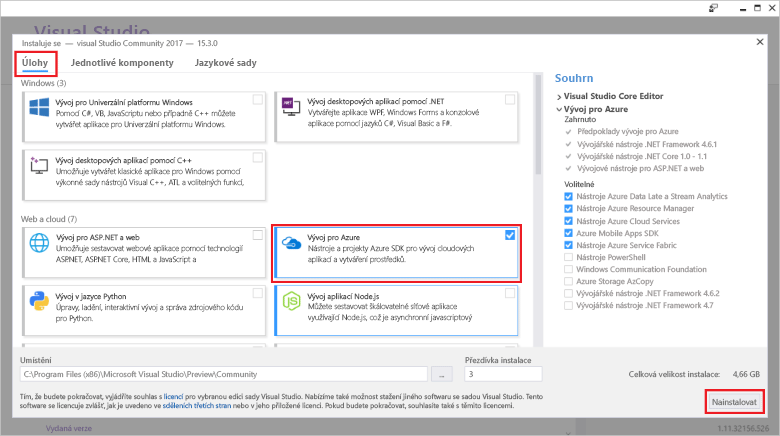

# <a name="azure-functions-tools-for-visual-studio"></a>Azure Functions Tools pro Visual Studio  

Azure funkce Tools for Visual Studio 2017 představuje rozšíření pro Visual Studio, která umožňuje vývoj, testování a nasazení funkce jazyka C# do Azure. Pokud toto prostředí je první díky Azure Functions, další informace najdete v [Úvod do Azure Functions](functions-overview.md).

Funkce nástroje Azure poskytuje následující výhody: 

* Upravit, sestavte a spusťte funkce ve svém místním vývojovém počítači. 
* Publikování projektu Azure Functions přímo do Azure. 
* Pomocí atributů WebJobs deklarovat vazby funkcí přímo v kódu jazyka C# místo zachování samostatné function.json pro vazby definice.
* Vývoj a nasazení předem kompilované funkce jazyka C#. Předem dodržela funkce zajistit lepší studený start výkonu než založených na skriptech funkcí jazyka C#. 
* Přitom má všechny výhody vývoje v sadě Visual Studio Code funkcí v jazyce C#. 

Toto téma ukazuje, jak pomocí nástroje Azure funkce pro Visual Studio 2017 vyvíjet funkcí v jazyce C#. Také zjistíte, jak publikovat projekt do Azure jako sestavení rozhraní .NET.

> [!IMPORTANT]
> Nekombinujte místní vývoj pomocí portálu vývoj v aplikaci stejné funkce. Při publikování z místní projektu do aplikace pro funkce procesu nasazení přepíše všechny funkce, které jste vytvořili v portálu.

## <a name="prerequisites"></a>Požadavky

Nástroje Azure funkce je součástí Azure development zatížení [Visual Studio 2017 verzi 15.4](https://www.visualstudio.com/vs/), nebo novější. Zajistěte, aby zahrnete **Azure development** zatížení v instalaci sady Visual Studio 2017:



Pokud chcete vytvořit a nasadit funkce, budete potřebovat:

* Aktivní předplatné Azure. Pokud nemáte předplatné Azure, [volné účty](https://azure.microsoft.com/free/?WT.mc_id=A261C142F) jsou k dispozici.

* Účet úložiště Azure. Pokud chcete vytvořit účet úložiště, najdete v části [vytvořit účet úložiště](../storage/common/storage-create-storage-account.md#create-a-storage-account).

## <a name="create-an-azure-functions-project"></a>Vytvoření projektu Azure Functions 

[!INCLUDE [Create a project using the Azure Functions](../../includes/functions-vstools-create.md)]


## <a name="configure-the-project-for-local-development"></a>Konfigurace projektu pro místní vývoj

Když vytvoříte nový projekt pomocí šablony Azure Functions, zobrazí prázdné C# projekt, který obsahuje následující soubory:

* **Host.JSON**: vám umožní nakonfigurovat funkce hostitele. Toto nastavení se týká i při spuštění místně a v Azure. Další informace najdete v tématu [host.json odkaz](functions-host-json.md).
    
* **Local.Settings.JSON**: udržuje nastavení používané při místním spuštění funkce. Tato nastavení nejsou používány nástrojem Azure, jsou používány [nástroje základní funkce Azure](functions-run-local.md). Tento soubor lze použijte k určení nastavení, jako jsou třeba řetězce připojení k jiným službám Azure. Přidejte nový klíč k **hodnoty** pole pro každé připojení vyžaduje funkce ve vašem projektu. Další informace najdete v tématu [nastavení místního souboru](functions-run-local.md#local-settings-file) v tématu nástroje základní funkce Azure.

Modul runtime funkce interně používá účet úložiště Azure. Pro všechny aktivovat jiného typu než HTTP a pomocí webhooků, musíte nastavit **Values.AzureWebJobsStorage** klíče na platný připojovací řetězec účet úložiště Azure. 

[!INCLUDE [Note on local storage](../../includes/functions-local-settings-note.md)]

 Nastavení připojovacího řetězce pro účet úložiště:

1. V sadě Visual Studio otevřete **Průzkumník cloudu**, rozbalte položku **účet úložiště** > **váš účet úložiště**, pak vyberte **vlastnosti** a zkopírujte **primární připojovací řetězec** hodnotu.   

2. V projektu, otevřete soubor local.settings.json a nastavte hodnotu **AzureWebJobsStorage** zkopírovanou klíče připojovací řetězec.

3. Opakujte předchozí krok pro přidání jedinečné klíče **hodnoty** pole pro všechna připojení, které vyžadují funkcí.  

## <a name="create-a-function"></a>Vytvoření funkce

V předem kompilované funkce jsou definovány vazby používané funkce použití atributů v kódu. Když pomocí funkce nástroje Azure vytvářet funkce ze zadaného šablon, použijí se tyto atributy pro vás. 

1. V **Průzkumníku řešení** klikněte pravým tlačítkem na uzel projektu a vyberte **Přidat** > **Nová položka**. Vyberte **funkce Azure**, zadejte **název** pro třídu a klikněte na tlačítko **přidat**.

2. Zvolte aktivační událost, nastavte vlastnosti vazby a klikněte na **vytvořit**. Následující příklad ukazuje nastavení při vytváření Queue storage aktivaci funkce. 

    
    
    Tento příklad aktivační událost používá připojovací řetězec s klíč s názvem **QueueStorage**. Tato nastavení připojovacího řetězce musí být definovány v souboru local.settings.json. 
 
3. Zkontrolujte nově přidané třídy. Zobrazí statického **spustit** metody s atributem **%{FunctionName/** atribut. Tento atribut označuje, že metoda je vstupní bod pro funkci. 

    Například následující třídy jazyka C# představuje základní funkce úložiště aktivuje fronty:

    ````csharp
    using System;
    using Microsoft.Azure.WebJobs;
    using Microsoft.Azure.WebJobs.Host;
    
    namespace FunctionApp1
    {
        public static class Function1
        {
            [FunctionName("QueueTriggerCSharp")]        
            public static void Run([QueueTrigger("myqueue-items", Connection = "QueueStorage")]string myQueueItem, TraceWriter log)
            {
                log.Info($"C# Queue trigger function processed: {myQueueItem}");
            }
        }
    } 
    ````
 
    Atribut specifické pro vazbu se použije pro každý zadaný pro vstupní bod metody parametr vazby. Atribut načítá informace o vazbě jako parametry. V předchozím příkladu má první parametr **QueueTrigger** atribut použité, s označením fronty aktivuje funkce. Název fronty a název nastavení připojovacího řetězce jsou předány jako parametry, které **QueueTrigger** atribut.

## <a name="testing-functions"></a>Testování funkcí

Nástroje Azure Functions Core umožňují spouštět projekt Azure Functions na místním počítači pro vývoj. K instalaci těchto nástrojů budete vyzváni při prvním spuštění funkce ze sady Visual Studio.  

Pokud chcete funkci otestovat, stiskněte F5. Po výzvě přijměte požadavek ze sady Visual Studio na stažení a instalaci nástrojů Azure Functions Core (CLI). Může být také potřeba povolit výjimku brány firewall, aby nástroje mohly zpracovávat požadavky HTTP.

S projektem systémem můžete otestovat váš kód by při testování nasazené funkce. Další informace najdete v tématu [strategie pro testování kódu v Azure Functions](functions-test-a-function.md). Při spuštění v režimu ladění, jsou zarážky v sadě Visual Studio podle očekávání. 

Příklad fronty aktivuje funkci otestovat, najdete v článku [fronty aktivuje funkce Rychlý úvodní kurz](functions-create-storage-queue-triggered-function.md#test-the-function).  

Další informace o použití nástrojů pro základní funkce Azure, najdete v části [kód a testovat místně na Azure functions](functions-run-local.md).

## <a name="publish-to-azure"></a>Publikování aplikací do Azure

[!INCLUDE [Publish the project to Azure](../../includes/functions-vstools-publish.md)]

## <a name="function-app-settings"></a>Nastavení Function App   

Všechna nastavení, které jste přidali v local.settings.json je nutné také přidat do funkce aplikace v Azure. Tato nastavení nejsou uloženy automaticky při publikování tohoto projektu. 

Nejjednodušší způsob, jak nahrát požadovaná nastavení pro funkce aplikace v Azure je použití **spravovat nastavení aplikace...**  odkaz, který se zobrazí po úspěšném publikování projektu. 


Zobrazí se **nastavení aplikace** dialogové okno pro funkce aplikace, kde můžete přidat nové nastavení aplikace nebo upravit existující.


Můžete také spravovat nastavení aplikace v jednom z těchto dalších způsobů:

* [Pomocí portálu Azure](functions-how-to-use-azure-function-app-settings.md#settings).
* [Pomocí `--publish-local-settings` možnost publikování v nástrojích pro základní funkce Azure](functions-run-local.md#publish).
* [Použití Azure CLI](/cli/azure/functionapp/config/appsettings#set). 

## <a name="next-steps"></a>Další postup

Další informace o nástrojích funkce Azure, najdete v části Nejčastější dotazy [2017 nástroje sady Visual Studio pro Azure Functions](https://blogs.msdn.microsoft.com/webdev/2017/05/10/azure-function-tools-for-visual-studio-2017/) příspěvku na blogu.

Další informace o nástrojích základní funkce Azure najdete v tématu [kód a testovat místně na Azure functions](functions-run-local.md).  
Další informace o vývoji funkce jako knihovny tříd rozhraní .NET najdete v tématu [Azure funkcí jazyka C# referenční informace pro vývojáře](functions-dotnet-class-library.md). Toto téma obsahuje také odkazy na příklady, jak použít atributy deklarovat různé typy vazeb Azure Functions podporuje.    
