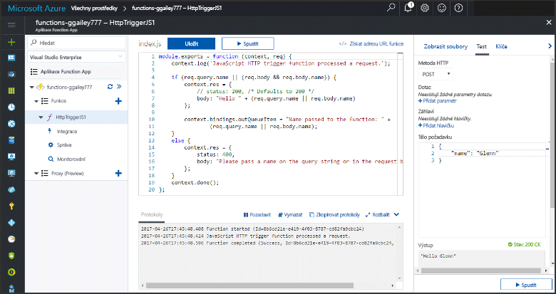
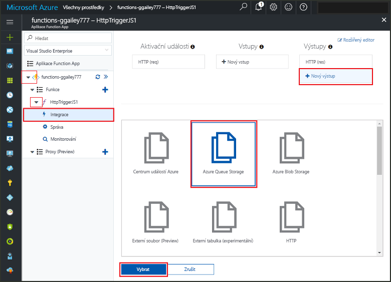
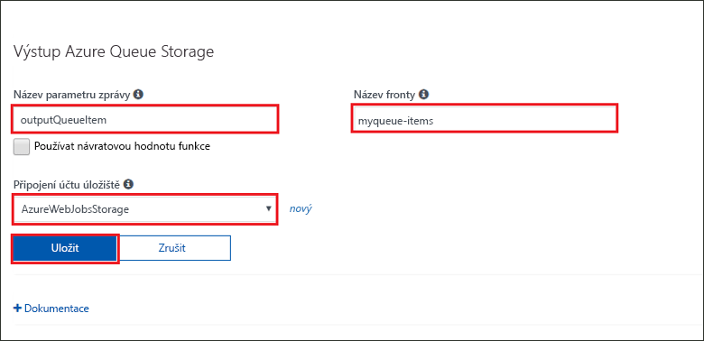
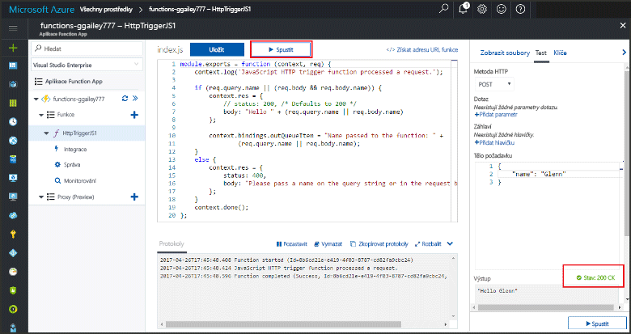
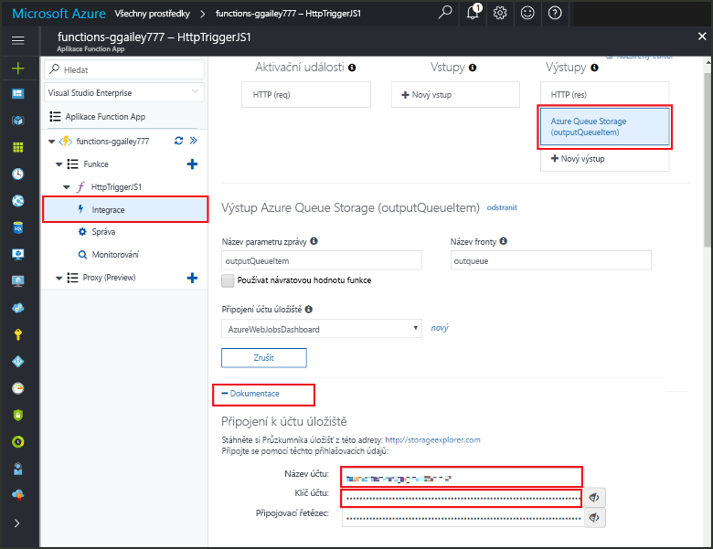
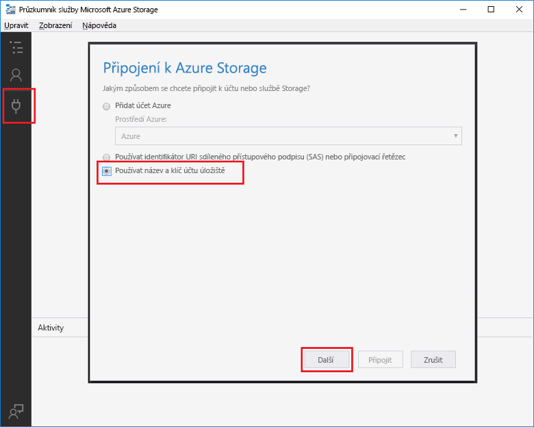
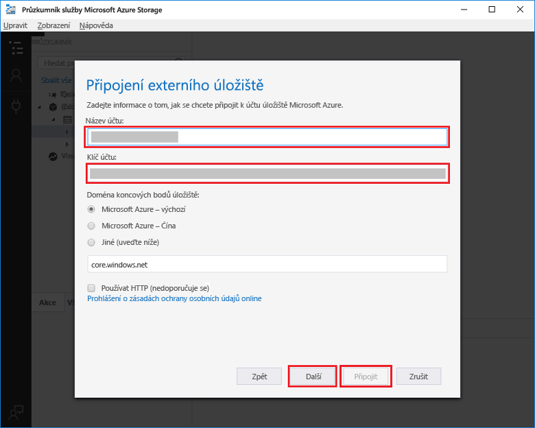
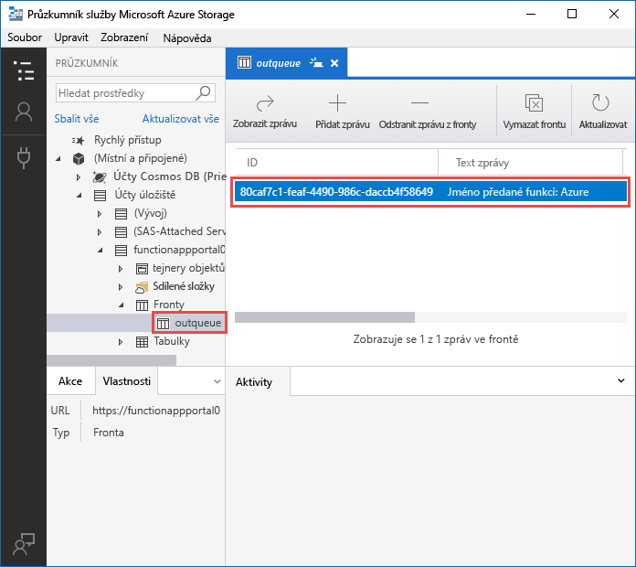

# Přidání zpráv do fronty Azure Storage pomocí funkcí
<a id="add-messages-to-an-azure-storage-queue-using-functions" class="xliff"></a>

Ve službě Azure Functions poskytují vstupní a výstupní vazby deklarativní způsob připojení k datům externí služby z funkce. V tomto tématu zjistíte, jak aktualizovat existující funkci přidáním výstupní vazby, která odesílá zprávy do Azure Queue Storage.  



## Požadavky
<a id="prerequisites" class="xliff"></a> 

[!INCLUDE [Previous topics](../../includes/functions-quickstart-previous-topics.md)]

* Nainstalujte [Microsoft Azure Storage Explorer](http://storageexplorer.com/).

[!INCLUDE [functions-portal-favorite-function-apps](../../includes/functions-portal-favorite-function-apps.md)] 

## <a name="add-binding"></a>Přidání výstupní vazby
 
1. Rozbalte aplikaci Function App i funkci.

2. Vyberte možnost **Integrace** a **+ Nový výstup**, pak vyberte **Azure Queue Storage** a **Vybrat**.
    
    

3. Použijte nastavení uvedené v tabulce a potom vyberte **Uložit**: 

    

    | Nastavení      |  Navrhovaná hodnota   | Popis                              |
    | ------------ |  ------- | -------------------------------------------------- |
    | **Název fronty**   | myqueue-items    | Název fronty, ke které se připojíte ve svém účtu úložiště. |
    | **Připojení k účtu úložiště** | AzureWebJobStorage | Můžete použít připojení k účtu úložiště, které už používá vaše aplikace Function App, nebo můžete vytvořit nové.  |
    | **Název parametru zprávy** | outQueueItem | Název výstupního parametru vazby. | 

Teď máte definovanou výstupní vazbu a je potřeba aktualizovat kód tak, aby tuto vazbu využíval k přidávání zpráv do fronty.  

## Aktualizace kódu funkce
<a id="update-the-function-code" class="xliff"></a>

1. Vybráním určité funkce zobrazíte kód této funkce v editoru. 

2. V případě funkce v jazyce C# následujícím způsobem aktualizujte definici funkce, aby obsahovala parametr vazby úložiště **outQueueItem**. V případě funkce v jazyce JavaScript tento krok přeskočte.

    ```cs   
    public static async Task<HttpResponseMessage> Run(HttpRequestMessage req, 
        ICollector<string> outQueueItem, TraceWriter log)
    {
        ....
    }
    ```

3. Těsně před vrácením hodnoty touto metodou přidejte do funkce následující kód. Použijte fragment kódu odpovídající jazyku vaší funkce.

    ```javascript
    context.bindings.outQueueItem = "Name passed to the function: " + 
                (req.query.name || req.body.name);
    ```

    ```cs
    outQueueItem.Add("Name passed to the function: " + name);     
    ```

4. Změny uložíte tak, že vyberete **Uložit**.

Hodnota předaná aktivační události HTTP je součástí zprávy přidané do fronty.
 
## Testování funkce
<a id="test-the-function" class="xliff"></a> 

1. Po uložení změn kódu vyberte **Spustit**. 

    

2. Zkontrolujte protokoly a zkontrolujte, jestli se spuštění funkce zdařilo. Při prvním použití výstupní vazby vytvoří modul runtime Functions v účtu úložiště novou frontu s názvem **outqueue**.

Teď se můžete připojit ke svému účtu úložiště a zkontrolovat novou frontu i zprávy, které jste do ní přidali. 

## Připojení k frontě
<a id="connect-to-the-queue" class="xliff"></a>

Pokud jste už nainstalovali Storage Explorer a připojili ho ke svému účtu úložiště, přeskočte první tři kroky.    

1. Ve své funkci vyberte možnost **Integrace** a novou výstupní vazbu **Azure Queue Storage** a potom rozbalte položku **Dokumentace**. Zkopírujte nastavení **Název účtu** i **Klíč účtu**. Tyto přihlašovací údaje použijte k připojení k účtu úložiště.
 
    

2. Spusťte [Microsoft Azure Storage Explorer](http://storageexplorer.com/), vlevo vyberte ikonu připojení, zvolte **Použít název a klíč účtu úložiště** a vyberte **Další**.

    
    
3. Do příslušných polí vložte **Název účtu** a **Klíč účtu** z kroku 1 a pak vyberte **Další** a **Připojit**. 
  
    

4. Rozbalte připojený účet úložiště, klikněte pravým tlačítkem na **Fronty** a zkontrolujte, jestli existuje fronta s názvem **myqueue-items**. Fronta už by taky měla obsahovat zprávu.  
 
    
 

## Vyčištění prostředků
<a id="clean-up-resources" class="xliff"></a>

[!INCLUDE [Next steps note](../../includes/functions-quickstart-cleanup.md)]

## Další kroky
<a id="next-steps" class="xliff"></a>

Přidali jste k existující funkci výstupní vazbu. 

[!INCLUDE [Next steps note](../../includes/functions-quickstart-next-steps.md)]

Další informace o vazbách do úložiště front najdete v tématu [Vazby front úložiště služby Azure Functions](functions-bindings-storage-queue.md). 


