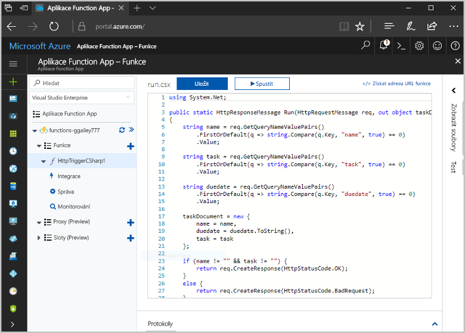
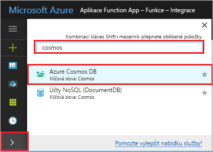

# <a name="store-unstructured-data-using-azure-functions-and-azure-cosmos-db"></a>Ukládání nestrukturovaných dat pomocí služeb Azure Functions a Azure Cosmos DB

[Azure Cosmos DB](https://azure.microsoft.com/services/cosmos-db/) nabízí skvělou možnost pro ukládání nestrukturovaných dat a dat JSON. Spolu s Azure Functions urychluje a zjednodušuje ukládání dat – ve srovnání s ukládáním dat v relační databáze budete potřebovat méně kódování.

Ve službě Azure Functions poskytují vstupní a výstupní vazby deklarativní způsob připojení k datům externí služby z funkce. V tomto tématu se dozvíte, jak aktualizovat stávající funkci jazyka C# pro přidání výstupní vazby, která ukládá nestrukturovaná data v dokumentu Cosmos DB. 



## <a name="prerequisites"></a>Požadavky

Pro absolvování tohoto kurzu potřebujete:

[!INCLUDE [Previous quickstart note](../../includes/functions-quickstart-previous-topics.md)]

## <a name="add-an-output-binding"></a>Přidání výstupní vazby

1. Rozbalte aplikaci Function App i funkci.

1. Vyberte **Integrace** a v pravém horním rohu stránky **+ Nový výstup**. Zvolte **Azure Cosmos DB** a klikněte na **Vybrat**.

    

3. Použijte nastavení pro **Výstup služby Azure Cosmos DB** uvedená v tabulce: 

    

    | Nastavení      | Navrhovaná hodnota  | Popis                                |
    | ------------ | ---------------- | ------------------------------------------ |
    | **Název parametru dokumentu** | taskDocument | Název, který odkazuje na objekt Cosmos DB v kódu. |
    | **Název databáze** | taskDatabase | Název databáze pro uložení dokumentů. |
    | **Název kolekce** | TaskCollection | Název kolekce databáze. |
    | **Je-li nastavená hodnota true, vytvoří se databáze a kolekce Cosmos DB** | Zaškrtnuté | Kolekce ještě neexistuje, takže ji vytvořte. |

4. Vedle popisku **Připojení dokumentu Azure Cosmos DB** vyberte **Nové** a potom vyberte **+ Vytvořit nové**. 

5. Použijte nastavení pro **Nový účet** uvedená v tabulce: 

    

    | Nastavení      | Navrhovaná hodnota  | Popis                                |
    | ------------ | ---------------- | ------------------------------------------ |
    | **ID** | Název databáze | Jedinečné ID databáze Azure Cosmos DB  |
    | **Rozhraní API** | SQL (DocumentDB) | Vyberte rozhraní API databáze dokumentů.  |
    | **Předplatné** | předplatné Azure | předplatné Azure  |
    | **Skupina prostředků** | myResourceGroup |  Použijte existující skupinu prostředků, která obsahuje vaši aplikací funkcí. |
    | **Umístění**  | WestEurope | Vyberte umístění blízko vaší aplikaci funkcí nebo jiným aplikacím, které používají uložené dokumenty.  |

6. Kliknutím na **OK** vytvořte databázi. Vytvoření databáze může trvat několik minut. Po vytvoření databáze se připojovací řetězec databáze uloží jako nastavení aplikace funkcí. Název tohoto nastavení aplikace se vloží do **Připojení účtu služby Azure Cosmos DB**. 
 
8. Po nastavení připojovacího řetězce vyberte **Uložit** a vytvořte vazbu.

## <a name="update-the-function-code"></a>Aktualizace kódu funkce

Nahraďte stávající kód funkce jazyka C# následujícím kódem:

```csharp
using System.Net;

public static HttpResponseMessage Run(HttpRequestMessage req, out object taskDocument, TraceWriter log)
{
    string name = req.GetQueryNameValuePairs()
        .FirstOrDefault(q => string.Compare(q.Key, "name", true) == 0)
        .Value;

    string task = req.GetQueryNameValuePairs()
        .FirstOrDefault(q => string.Compare(q.Key, "task", true) == 0)
        .Value;

    string duedate = req.GetQueryNameValuePairs()
        .FirstOrDefault(q => string.Compare(q.Key, "duedate", true) == 0)
        .Value;

    taskDocument = new {
        name = name,
        duedate = duedate.ToString(),
        task = task
    };

    if (name != "" && task != "") {
        return req.CreateResponse(HttpStatusCode.OK);
    }
    else {
        return req.CreateResponse(HttpStatusCode.BadRequest);
    }
}

```
Tento vzorový kód přečte řetězce dotazů požadavků HTTP a přiřadí je do polí v objektu `taskDocument`. Vazba `taskDocument` odešle data objektu z tohoto parametru vazby k uložení ve vázané databázi dokumentů. Tato databáze se vytvoří při prvním spuštění funkce.

## <a name="test-the-function-and-database"></a>Testování funkce a databáze

1. Rozbalte okno vpravo a vyberte **Test**. V části **Dotaz** klikněte na **+ Přidat parametr** a přidejte do řetězce dotazu následující parametry:

    + `name`
    + `task`
    + `duedate`

2. Klikněte na **Spustit** a ověřte, že se vrátí stavový kód 200.

    

1. Na levé straně webu Azure Portal rozbalte pruh ikon, do vyhledávacího pole zadejte `cosmos` a vyberte **Azure Cosmos DB**.

    

2. Zvolte váš účet služby Azure Cosmos DB a vyberte **Průzkumník dat**. 

3. Rozbalte uzly **Kolekce**, vyberte nový dokument a potvrďte, že dokument obsahuje vaše hodnoty řetězce dotazu spolu s dalšími metadaty. 

    

Úspěšně jste přidali vazbu na váš trigger HTTP, který ukládá nestrukturovaná data ve službě Azure Cosmos DB.

[!INCLUDE [Clean-up section](../../includes/clean-up-section-portal.md)]

## <a name="next-steps"></a>Další kroky

[!INCLUDE [functions-quickstart-next-steps](../../includes/functions-quickstart-next-steps.md)]

Další informace o vazbách na databázi Cosmos DB najdete v tématu [Vazby Cosmos DB ve službě Azure Functions](functions-bindings-documentdb.md).
