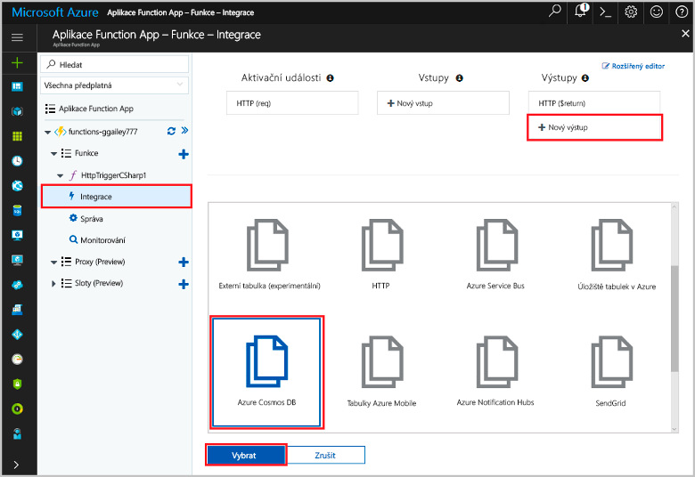
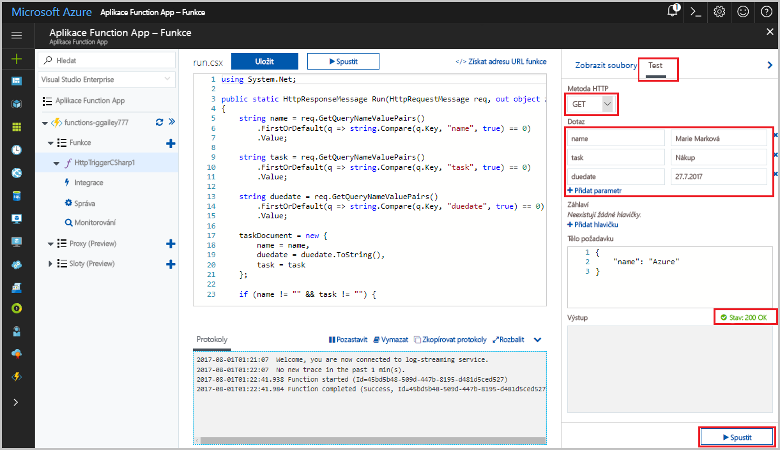
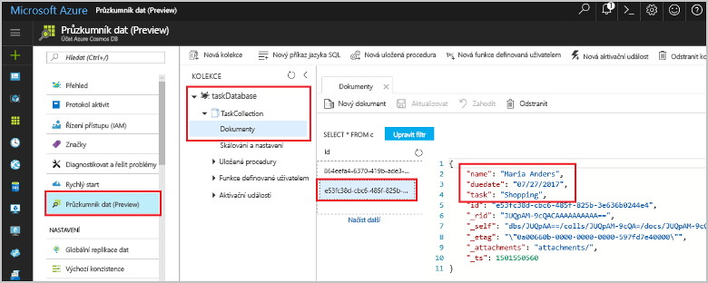

# <a name="store-unstructured-data-using-azure-functions-and-cosmos-db"></a>Ukládání nestrukturovaných dat pomocí Azure Functions a databáze Cosmos DB

Databáze Azure Cosmos DB nabízí skvělou možnost pro ukládání nestrukturovaných dat a dat JSON. Spolu s Azure Functions urychluje a zjednodušuje ukládání dat – ve srovnání s ukládáním dat v relační databáze budete potřebovat méně kódování.

V tomto kurzu se dozvíte, jak pomocí portálu Azure Portal vytvořit funkci Azure, která bude ukládat nestrukturovaná data do dokumentu databáze Cosmos DB. 

## <a name="prerequisites"></a>Požadavky

[!INCLUDE [Previous quickstart note](../../includes/functions-quickstart-previous-topics.md)]

[!INCLUDE [functions-portal-favorite-function-apps](../../includes/functions-portal-favorite-function-apps.md)]

## <a name="create-a-function"></a>Vytvoření funkce

Vytvořte nový obecný webhook jazyka C#, který pojmenujete `MyTaskList`.

1. Rozbalte seznam existujících funkcí a kliknutím na symbol + vytvořte novou funkci.
1. Vyberte možnost GenericWebHook-CSharp a webhook pojmenujte `MyTaskList`.


## <a name="add-an-output-binding"></a>Přidání výstupní vazby

Funkce Azure může mít jednu aktivační událost a libovolný počet vstupních nebo výstupních vazeb. V tomto příkladu použijeme jako aktivační událost Požadavek HTTP a jako výstupní vazbu dokument databáze Cosmos DB.

1. Kliknutím na kartu *Integrace* této funkce můžete zobrazit nebo upravit její aktivační událost a vazby.
1. V pravém horním rohu stránky vyberte odkaz *Nový výstup*.

Poznámka: Aktivační událost Požadavek HTTP je už nakonfigurovaná, ale musíte přidat vazbu s dokumentem databáze Cosmos DB.



1. Zadejte požadované informace pro vytvoření vazby. Hodnoty určete pomocí níže uvedené tabulky.


|  Pole | Hodnota  |
|---|---|
| Název parametru dokumentu | Název, který odkazuje na objekt Cosmos DB v kódu |
| Název databáze | Název databáze pro uložení dokumentů |
| Název kolekce | Název seskupení databází Cosmos DB |
| Chcete vytvořit databázi Cosmos DB a kolekci? | Ano nebo Ne |
| Připojení účtu databáze Cosmos DB | Připojovací řetězec odkazující na databázi Cosmos DB |

Musíte také nakonfigurovat připojení k databázi Cosmos DB.

1. Vedle popisku „Připojení dokumentu databáze Cosmos DB“ klikněte na odkaz „Nové“.
1. Vyplňte pole a vyberte příslušné možnosti pro vytvoření dokumentu databáze Cosmos DB.


|  Pole | Hodnota  |
|---|---|
| ID | Jedinečné ID databáze Cosmos DB  |
| NoSQL API | Cosmos DB nebo MongoDB  |
| Předplatné | Předplatné MSDN  |
| Skupina prostředků  | Vytvořte novou skupinu, nebo vyberte existující.  |
| Umístění  | WestEurope  |

1. Klikněte na tlačítko *OK*. Možná budete muset počkat několik minut, než Azure vytvoří potřebné prostředky.
1. Klikněte na tlačítko *Uložit*.

## <a name="update-the-function-code"></a>Aktualizace kódu funkce

Kód šablony funkce nahraďte následujícím:

Upozorňujeme, že kód v této ukázce je pouze v jazyce C#.

```csharp
using System.Net;

public static HttpResponseMessage Run(HttpRequestMessage req, out object taskDocument, TraceWriter log)
{
    string name = req.GetQueryNameValuePairs()
        .FirstOrDefault(q => string.Compare(q.Key, "name", true) == 0)
        .Value;

    string task = req.GetQueryNameValuePairs()
        .FirstOrDefault(q => string.Compare(q.Key, "task", true) == 0)
        .Value;

    string duedate = req.GetQueryNameValuePairs()
        .FirstOrDefault(q => string.Compare(q.Key, "duedate", true) == 0)
        .Value;

    taskDocument = new {
        name = name,
        duedate = duedate.ToString(),
        task = task
    };

    if (name != "" && task != "") {
        return req.CreateResponse(HttpStatusCode.OK);
    }
    else {
        return req.CreateResponse(HttpStatusCode.BadRequest);
    }
}

```

Tento vzorový kód přečte řetězce dotazu na požadavek HTTP a přiřadí je jako členy objektu `taskDocument`. Objekt `taskDocument` automaticky uloží data do databáze Cosmos DB a databázi dokonce vytvoří při prvním použití.

## <a name="test-the-function-and-database"></a>Testování funkce a databáze

1. Na kartě funkce klikněte vpravo na portále na dokaz *Test* a zadejte následující řetězce dotazu na HTTP:

| Řetězec dotazu | Hodnota |
|---|---|
| jméno | Jan Slanina |
| úkol | Vyrobit BLT sendvič |
| termín | 05/12/2017 |

1. Klikněte na odkaz *Spustit*.
1. Zkontrolujte, jestli funkce vrátila kód odpovědi *HTTP 200 OK*.



Zkontrolujte, jestli se do databáze Cosmos DB uložil záznam.

1. Na portálu Azure Portal vyhledejte svou databázi a vyberte ji.
1. Vyberte možnost *Průzkumník dat*.
1. Rozbalte potřebné uzly, dokud se nedostanete k záznamům dokumentu.
1. Zkontrolujte položky databáze. V databázi budou kromě vašich dat také další metadata.



Pokud se data nachází v dokumentu, podařilo se vám vytvořit funkci Azure, která ukládá nestrukturovaná data do databáze Cosmos DB.

## <a name="clean-up-resources"></a>Vyčištění prostředků

[!INCLUDE [Next steps note](../../includes/functions-quickstart-cleanup.md)]

## <a name="next-steps"></a>Další kroky

[!INCLUDE [functions-quickstart-next-steps](../../includes/functions-quickstart-next-steps.md)]

Další informace o vazbách na databázi Cosmos DB najdete v tématu [Vazby Cosmos DB ve službě Azure Functions](functions-bindings-documentdb.md).

