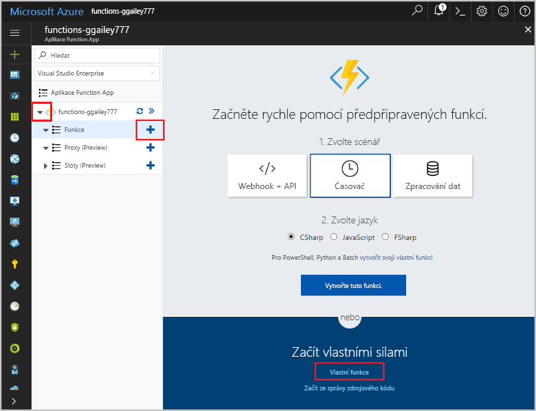

# <a name="create-a-function-that-integrates-with-azure-logic-apps"></a>Vytvoří funkci, která se integruje se službou Azure Logic Apps

Azure Functions se integruje se službou Azure Logic Apps v Návrháři logiku aplikace. Tato integrace umožňuje využívat výpočetní výkon funkcí v orchestrations s jinými Azure a služby třetích stran. 

V tomto kurzu se dozvíte, jak použít funkce s Logic Apps a kognitivní služeb společnosti Microsoft v Azure k analýze postojích z příspěvky služby Twitter. Funkce protokolu HTTP aktivované rozděluje tweetů jako zelené, žluté nebo červené podle skóre postojích. E-mail je odeslán, když je zjištěna nízký postojích. 


V tomto kurzu se naučíte:

> [!div class="checklist"]
> * Vytvořte prostředek kognitivní služeb rozhraní API.
> * Vytvoří funkci, která rozděluje tweet postojích.
> * Vytvoření aplikace logiky, která se připojuje ke službě Twitter.
> * Detekce postojích přidáte do aplikace logiky. 
> * Připojení aplikace logiky funkce.
> * Odešlete e-mail podle odpověď z funkce.

## <a name="prerequisites"></a>Požadavky

+ Aktivní [Twitter](https://twitter.com/) účtu. 
+ [Outlook.com](https://outlook.com/) účet (pro posílání oznámení).
+ Toto téma používá jako výchozí bod prostředky, které jste vytvořili v kroku [Vytvoření první funkce na portálu Azure Portal](functions-create-first-azure-function.md).  
Pokud jste tak již neučinili, dokončete tyto kroky teď k vytvoření aplikace funkce.

## <a name="create-a-cognitive-services-resource"></a>Vytvořte prostředek kognitivní služby

Kognitivní rozhraní API služby jsou dostupné v Azure jako jednotlivé prostředky. Rozhraní API Analytics Text použijte k detekci myšlenkou tweetů monitorovány.

1. Přihlaste se k webu [Azure Portal](https://portal.azure.com/).

2. Klikněte na tlačítko **Nový** v levém horním rohu portálu Azure Portal.

3. Klikněte na tlačítko **AI + analýzy** > **Analýza textu rozhraní API**. Pak používat nastavení zadané v tabulce, přijměte podmínky a zkontrolujte **připnout na řídicí panel**.

    

    | Nastavení      |  Navrhovaná hodnota   | Popis                                        |
    | --- | --- | --- |
    | **Název** | MyCognitiveServicesAccnt | Zvolte název jedinečný účet. |
    | **Umístění** | Západní USA | Umístění nejbližší můžete použijte. |
    | **Cenová úroveň** | F0 | Začněte s nejnižší úroveň. Pokud spustíte z volání, škálovat na vyšší úroveň.|
    | **Skupina prostředků** | myResourceGroup | Používejte stejnou skupinu prostředků pro všechny služby v tomto kurzu.|

4. Klikněte na tlačítko **vytvořit** k vytvoření prostředku. Po vytvoření, vyberte nového prostředku kognitivní služby připnuli k řídicímu panelu. 

5. Ve sloupci levém navigačním panelu klikněte na tlačítko **klíče**a poté zkopírujte hodnotu **klíč 1** a uložte ho. Tento klíč použijete k připojení aplikace logiky k vašemu kognitivní rozhraní API služby. 
 
    

[!INCLUDE [functions-portal-favorite-function-apps](../../includes/functions-portal-favorite-function-apps.md)]

## <a name="create-the-function-app"></a>Vytvoření aplikace – funkce

Funkce nabízí skvělý způsob, jak přesměrování zpracování úloh zpracování v pracovním postupu logiku aplikace. Tento kurz používá funkce protokolu HTTP aktivované ke zpracování tweet postojích skóre z kognitivní služeb a vrátit hodnotu kategorie.  

[!INCLUDE [Create function app Azure portal](../../includes/functions-create-function-app-portal.md)]

## <a name="create-an-http-triggered-function"></a>Vytvoření funkce protokolu HTTP aktivované  

1. Rozbalte aplikaci Function App a klikněte na tlačítko **+** vedle položky **Funkce**. Pokud jde o první funkci ve vaší aplikaci Function App, vyberte možnost **Vlastní funkce**. Zobrazí se kompletní sada šablon funkcí.

    

2. Do pole hledání zadejte `http` a potom zvolte **C#** šablony aktivace protokolu HTTP. 

    

3. Zadejte **název** pro funkce, vyberte `Function` pro  **[úroveň ověřování](functions-bindings-http-webhook.md#http-auth)**a potom vyberte **vytvořit**. 

    

    Tím se vytvoří skript funkce jazyka C# pomocí šablony triggeru protokolu HTTP. Kód zobrazí se v novém okně jako `run.csx`.

4. Nahraďte obsah `run.csx` soubor s následujícím kódem a pak klikněte na **Uložit**:

    ```csharp
    using System.Net;
    
    public static async Task<HttpResponseMessage> Run(HttpRequestMessage req, TraceWriter log)
    {
        // The sentiment category defaults to 'GREEN'. 
        string category = "GREEN";
    
        // Get the sentiment score from the request body.
        double score = await req.Content.ReadAsAsync<double>();
        log.Info(string.Format("The sentiment score received is '{0}'.",
                    score.ToString()));
    
        // Set the category based on the sentiment score.
        if (score < .3)
        {
            category = "RED";
        }
        else if (score < .6)
        {
            category = "YELLOW";
        }
        return req.CreateResponse(HttpStatusCode.OK, category);
    }
    ```
    Tento kód funkce vrátí barevné kategorie podle skóre postojích přijaté v požadavku. 

4. Chcete-li otestovat funkci, klikněte na tlačítko **testování** na pravém rozbalte karta testu. Zadejte hodnotu `0.2` pro **text žádosti**a potom klikněte na **spustit**. Hodnota **RED** je vrácený v textu odpovědi. 

    

Nyní máte funkci, která rozděluje postojích skóre. Dále vytvoříte aplikaci logiky, která integruje funkce pomocí Twitteru a kognitivní rozhraní API služby. 

## <a name="create-a-logic-app"></a>Vytvoření aplikace logiky   

1. Na portálu Azure klikněte **nový** nalezeno tlačítko v levém horním rohu portálu Azure.

2. Klikněte na tlačítko **Enterprise integrace** > **aplikace logiky**. Pak používat nastavení zadané v tabulce, zkontrolujte **připnout na řídicí panel**a klikněte na tlačítko **vytvořit**.
 
4. Poté zadejte **název** jako `TweetSentiment`používat nastavení zadané v tabulce, přijměte podmínky a zkontrolujte **připnout na řídicí panel**.

    

    | Nastavení      |  Navrhovaná hodnota   | Popis                                        |
    | ----------------- | ------------ | ------------- |
    | **Název** | TweetSentiment | Vyberte vhodný název pro vaši aplikaci. |
    | **Skupina prostředků** | myResourceGroup | Zvolte stejné existující skupinu prostředků, jako před. |
    | **Umístění** | Východ USA | Vyberte umístění blízko vás. |    

4. Zvolte **připnout na řídicí panel**a potom klikněte na **vytvořit** k vytvoření aplikace logiky. 

5. Po vytvoření aplikace, klikněte na nové aplikace logiky připnuli k řídicímu panelu. Potom v návrháři aplikace logiky, přejděte dolů a kliknutím **prázdné aplikace logiky** šablony. 

    

Návrhář aplikace logiky teď můžete přidat do aplikace služeb a aktivační události.

## <a name="connect-to-twitter"></a>Připojení k Twitteru

Nejprve vytvořte připojení ke svému účtu služby Twitter. Aplikace logiky se dotazuje na tweetů, které aktivují aplikaci spustit.

1. V návrháři, klikněte na tlačítko **Twitter** služby a klikněte na tlačítko **při odeslání nové tweet** aktivační události. Přihlaste se k účtu služby Twitter a autorizaci Logic Apps, abyste používat svůj účet.

2. Použijte nastavení aktivační události služby Twitter jako zadaný v tabulce. 

    

    | Nastavení      |  Navrhovaná hodnota   | Popis                                        |
    | ----------------- | ------------ | ------------- |
    | **Hledaný text** | #Azure | Použijte hashtagu, který je dostatečně oblíbených generovat nové tweetů zvolené intervalu. Při použití úroveň Free a vaše hashtag je příliš oblíbených, můžete rychle použít až kvótu transakce v kognitivní rozhraní API služby. |
    | **Frekvence** | Minuta | Frekvence jednotka použít pro cyklické dotazování služby Twitter.  |
    | **Interval** | 15 | Uplynulý čas mezi požadavků služby Twitter, v jednotkách frekvence. |

3.  Klikněte na tlačítko **Uložit** pro připojení k účtu služby Twitter. 

Aplikace je teď připojený k Twitter. V dalším kroku připojíte k Analýza textu k detekci myšlenkou shromážděných tweetů.

## <a name="add-sentiment-detection"></a>Přidat postojích detekce

1. Klikněte na tlačítko **nový krok**a potom **přidat akci**.

    

2. V **vybrat akci**, klikněte na tlačítko **Analýza textu**a pak klikněte na tlačítko **zjistit postojích** akce.

    

3. Zadejte například název připojení `MyCognitiveServicesConnection`, vložte klíč pro vaše kognitivní rozhraní API služby, který jste uložili a klikněte na **vytvořit**.  

4. Klikněte na tlačítko **Text k analýze** > **Tweet text**a potom klikněte na **Uložit**.  

    

Teď, když je nakonfigurovaná postojích detekce, můžete přidat připojení k vaší funkci, která spotřebovává výstup postojích skóre.

## <a name="connect-sentiment-output-to-your-function"></a>Připojení k vaší funkci postojích výstup

1. V návrháři aplikace logiky, klikněte na tlačítko **nový krok** > **přidat akci**a potom klikněte na **Azure Functions**. 

2. Klikněte na tlačítko **zvolte Azure funkce**, vyberte **CategorizeSentiment** funkce, které jste vytvořili dříve.  

    

3. V **text žádosti**, klikněte na tlačítko **skóre** a potom **Uložit**.

    

Nyní funkce se aktivuje, když postojích skóre se odesílá z aplikace logiky. Barevně kategorie je do aplikace logiky vráceným funkcí. Dál přidejte e-mailové oznámení, odeslaný při hodnotu postojích **RED** se vrátí z funkce. 

## <a name="add-email-notifications"></a>Přidání e-mailových oznámení

Poslední část pracovního postupu je pro aktivaci e-mailu, když myšlenkou skóre pro magnitudu jako _RED_. Toto téma používá konektor Outlook.com. Abyste mohli provést podobné kroky k používání konektoru z Gmailu nebo Office 365 Outlook.   

1. V návrháři aplikace logiky, klikněte na tlačítko **nový krok** > **přidat podmínku**. 

2. Klikněte na tlačítko **zvolte hodnotu**, pak klikněte na tlačítko **textu**. Vyberte **rovná**, klikněte na tlačítko **zvolte hodnotu** a typ `RED`a klikněte na tlačítko **Uložit**. 

    

3. V **hodnotu TRUE Pokud**, klikněte na tlačítko **přidat akci**, vyhledejte `outlook.com`, klikněte na tlačítko **e-mailovou zprávu**a přihlaste se ke svému účtu Outlook.com.
    
    

    > [!NOTE]
    > Pokud nemáte účet Outlook.com, můžete vybrat jiný konektor, třeba z Gmailu nebo Office 365 Outlook

4. V **e-mailovou zprávu** akce, použijte nastavení e-mailu jako zadané v tabulce. 

    

    | Nastavení      |  Navrhovaná hodnota   | Popis  |
    | ----------------- | ------------ | ------------- |
    | **Komu** | Zadejte e-mailovou adresu | E-mailovou adresu, která bude přijímat oznámení. |
    | **Předmět** | Záporné tweet postojích zjistil  | Předmět e-mailové oznámení.  |
    | **Text** | Text tweet, umístění | Klikněte **Tweet text** a **umístění** parametry. |

5.  Klikněte na **Uložit**.

Teď, když je dokončení pracovního postupu, můžete povolit aplikaci logiky a najdete v části funkce v práci.

## <a name="test-the-workflow"></a>Testování pracovního postupu

1. V návrháři aplikace logiky, klikněte na tlačítko **spustit** a spusťte aplikaci.

2. V levém sloupci klikněte na tlačítko **přehled** zobrazíte stav aplikace logiky. 
 
    

3. (Volitelné) Klikněte na jednu z spuštění pro podrobné informace o provádění.

4. Přejděte na funkce, protokoly a ověřte, že postojích hodnoty byly přijme a zpracuje.
 
    

5. Když se zjistí potenciálně záporné postojích, obdržíte e-mail. Pokud jste neobdrželi e-mailu, můžete změnit kód funkce vrátit RED pokaždé, když:

        return req.CreateResponse(HttpStatusCode.OK, "RED");

    Po ověření e-mailová oznámení, změňte zpátky na původní kód:

        return req.CreateResponse(HttpStatusCode.OK, category);

    > [!IMPORTANT]
    > Po dokončení tohoto kurzu, měli byste zakázat aplikaci logiky. Zakázáním aplikace se vyhnout se účtovat pro spuštění a pomocí transakce v kognitivní rozhraní API služby.

Nyní jste viděli, jak je snadné pro integraci funkcí do pracovního postupu Logic Apps.

## <a name="disable-the-logic-app"></a>Vypnout aplikaci logiky

Chcete-li zakázat aplikaci logiky, klikněte na tlačítko **přehled** a pak klikněte na **zakázat** v horní části obrazovky. To zastaví aplikace logiky spuštěná a nabíhání poplatků za bez odstranění aplikace. 


## <a name="next-steps"></a>Další postup

V tomto kurzu jste se naučili:

> [!div class="checklist"]
> * Vytvořte prostředek kognitivní služeb rozhraní API.
> * Vytvoří funkci, která rozděluje tweet postojích.
> * Vytvoření aplikace logiky, která se připojuje ke službě Twitter.
> * Detekce postojích přidáte do aplikace logiky. 
> * Připojení aplikace logiky funkce.
> * Odešlete e-mail podle odpověď z funkce.

Přechodu na v dalším kurzu se dozvíte, jak vytvořit bez serveru rozhraní API pro funkce.

> [!div class="nextstepaction"] 
> [Vytvoření rozhraní API bez serveru pomocí služby Azure Functions](functions-create-serverless-api.md)

Další informace o Logic Apps najdete v tématu [Azure Logic Apps](../logic-apps/logic-apps-overview.md).

