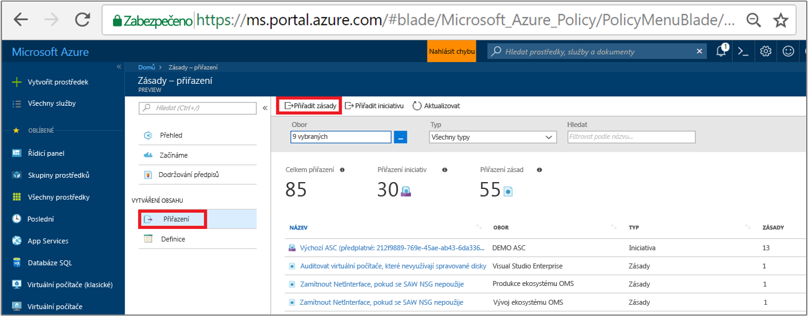
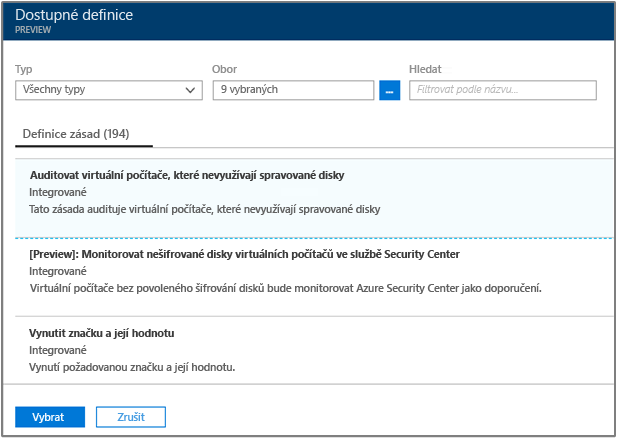
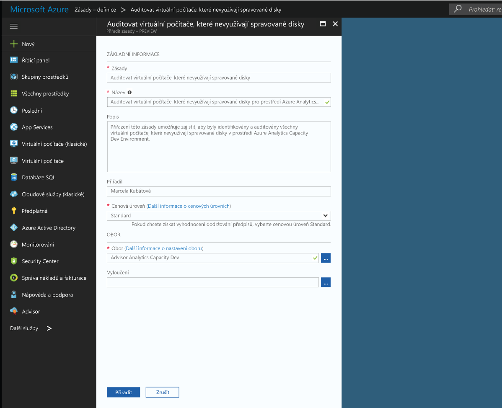
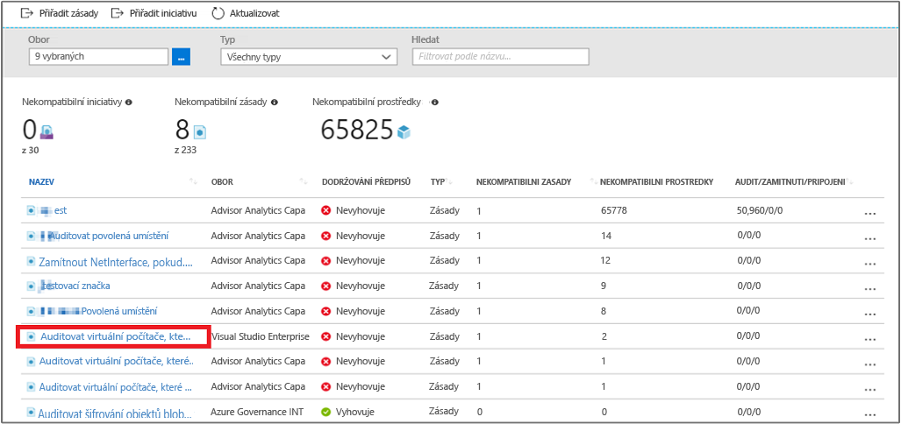
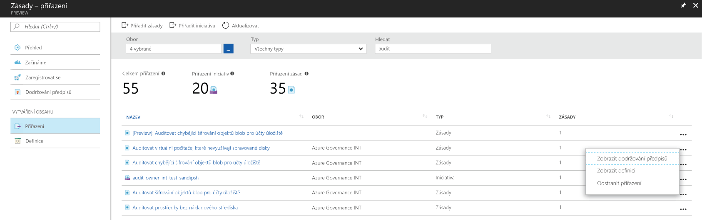

# Vytvoření přiřazení zásady k identifikaci nekompatibilní prostředky v prostředí Azure
Prvním krokem při pochopení dodržování předpisů v Azure je zároveň budete vědět, kde stát s aktuální prostředky. Tento rychlý start vás provede procesem vytvoření přiřazení zásady můžete identifikovat virtuální počítače, které nepoužívají spravované disky.

Na konci tohoto procesu se úspěšně určili jste virtuálních počítačů, které nepoužíváte spravované disky a jsou tedy *nevyhovující*.

Pokud ještě nemáte předplatné Azure, vytvořte si [bezplatný účet](https://azure.microsoft.com/free/?WT.mc_id=A261C142F) před tím, než začnete.

## Vyjádřit výslovný souhlas Azure zásad

Azure zásad je nyní k dispozici ve verzi Public Preview a je nutné zaregistrovat k požádat o přístup.

1. Přejděte do zásad Azure v https://aka.ms/getpolicy a vyberte **zaregistrovat** v levém podokně.

   

2. Přihlásit k Azure zásady tak, že vyberete odběry ve **předplatné** seznamu chcete pracovat. Potom vyberte **zaregistrovat**.

   

   Vaše žádost je automaticky schváleny pro verzi Preview. Může trvat až 30 minut pro systém ke zpracování registrace.

## Vytvoření přiřazení zásady

V tento rychlý start, vytvoření přiřazení zásady a přiřadit *auditu virtuální počítače bez spravované disků* definice zásady.

1. Vyberte **přiřazení** v levém podokně stránky zásad Azure.
2. Vyberte **přiřadit zásady** z horní části **přiřazení** podokně.

   

3. Na **přiřadit zásady** klikněte na tlačítko  vedle **zásad** pole otevřete seznam dostupných definice.

   

   Azure zásad se dodává s již vytvořené v definicích zásady můžete použít. Viz definice předdefinovaných zásad, jako:

   - Vynutit značku a její hodnota
   - Použít značku a její hodnota
   - Vyžadovat verze serveru SQL 12.0

4. Hledání prostřednictvím definic zásad najít *auditu virtuální počítače, který nepoužívejte spravované disky* definice. Kliknutím na tuto zásadu a klikněte na tlačítko **přiřadit**.

   

5. Slouží k zobrazení **název** pro přiřazení zásad. V tomto případě použijeme *auditu virtuální počítače, který nepoužívejte spravované disky*. Můžete také přidat volitelný **popis**. Popis poskytuje podrobnosti o tom, jak toto přiřazení zásad identifikuje všechny virtuální počítače vytvořené v tomto prostředí, které nepoužívají spravované disky.
6. Změnit cenovou úroveň na **standardní** zajistit, že získá zásada se stávajícími prostředky.

   Existují dvě cenové úrovně v rámci zásad Azure – *volné* a *standardní*. S úroveň Free, můžete pouze vynutit zásady na budoucí prostředky, zatímco s Standard, můžete taky vynutit je na stávajících prostředcích pro lepší pochopení vašeho stavu dodržování předpisů. Jsme jsou umístěny v omezené Preview, jsme ještě uvolněny cenový model, takže nebudete dostávat faktury pro výběr *standardní*. Další informace o cenách, podívejte se na: [zásad Azure ceny](https://acom-milestone-ignite.azurewebsites.net/pricing/details/azure-policy/).

7. Vyberte **oboru** chcete zásady použije.  Obor určuje, jaké prostředky nebo seskupení prostředků v získá vynucena přiřazení zásad. Může rozsahu z odběru do skupiny prostředků.
8. Vyberte předplatné (nebo skupinu prostředků) dříve registrován, když jste se rozhodli do zásad Azure. V tomto příkladu používáme toto předplatné - **Azure analýzy kapacity Dev**, ale vaše možnosti se budou lišit.

   

9. Vyberte **přiřadit**.

Nyní jste připraveni určete nekompatibilní prostředky pro informace o stavu dodržování předpisů vašeho prostředí.

## Určete nekompatibilní prostředky

Vyberte **dodržování předpisů** v levém podokně a vyhledejte přiřazení zásady, které jste vytvořili.

Pokud jsou všechny existující prostředky, které nejsou kompatibilní s toto přiřazení nové, budou se zobrazí na **nekompatibilní prostředky** kartě.

Pokud podmínka je vyhodnocován v rámci existujících prostředků a dodává se hodnotu true pro některé z nich, tyto prostředky jsou označeny jako nevyhovující se zásadami. Zde je tabulku fungování různé akce, které máte k dispozici dnes s výsledek vyhodnocení stavu a stavu dodržování předpisů vašich prostředků.

|Prostředek  |Pokud je podmínka v zásadách vyhodnocen  |Akce v zásadách   |Stav dodržování předpisů  |
|-----------|---------|---------|---------|
|Existuje     |True     |Odepřít     |Nekompatibilní |
|Existuje     |False    |Odepřít     |V souladu s předpisy     |
|Existuje     |True     |Připojit   |Nekompatibilní |
|Existuje     |False    |Připojit   |V souladu s předpisy     |
|Existuje     |True     |Auditování    |Nekompatibilní |
|Existuje     |False    |Auditování    |Nekompatibilní |

## Vyčištění prostředků

V této kolekci dalších příručkách stavět na tento rychlý start. Pokud budete chtít pokračovat v práci s další kurzy, neprovádí vyčištění prostředky vytvořené v tento rychlý start. Pokud pokračovat nechcete, pomocí následujících kroků odstraňte všechny prostředky vytvořené tímto rychlým startem na portálu Azure Portal.
1. Vyberte **přiřazení** v levém podokně.
2. Vyhledávání pro přiřazení, který jste právě vytvořili.

   

3.  Vyberte **odstranit přiřazení**.

## Další kroky

V tento rychlý start přiřazen obor, ujistěte se, že všechny prostředky v tomto oboru splňují předpisy a identifikujte ty, které nejsou definici zásady.

Další informace o přiřazení zásad zajistit, aby **budoucí** prostředky, které jsou vytvářeny předpisům, pokračovat v kurzu pro:

> [!div class="nextstepaction"]
> [Vytváření a Správa zásad](./create-manage-policy.md)
