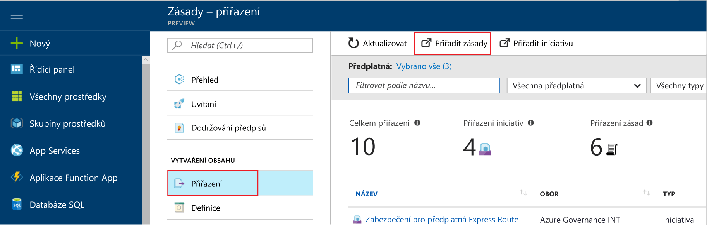
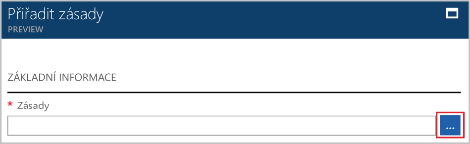

# <a name="create-and-manage-policies-to-enforce-compliance"></a>Vytvořit a spravovat zásady na vynucování dodržování shody

Vědět, jak vytvořit a spravovat zásady v Azure je důležité pro zachování kompatibilní s firemními standardy a smlouvy o úrovni služeb. V tomto kurzu se dozvíte, jak provést některé běžné úlohy související s vytváření, přiřazování a správě zásad v organizaci, například pomocí zásad Azure:

> [!div class="checklist"]
> * Přiřadit zásady vynutit podmínku pro prostředky, které vytvoříte v budoucnosti
> * Vytvořit a přiřadit iniciativy definice ke sledování dodržování předpisů pro více zdrojů
> * Vyřešte nevyhovující nebo odepření prostředek
> * Implementovat novou zásadu celé organizaci

Pokud ještě nemáte předplatné Azure, vytvořte si [bezplatný účet](https://azure.microsoft.com/free/?WT.mc_id=A261C142F) před tím, než začnete.

## <a name="opt-in-to-azure-policy"></a>Vyjádřit výslovný souhlas Azure zásad

Azure zásad je teď dostupná ve verzi Preview omezené, je nutné zaregistrovat k požádat o přístup.

1. Přejděte do zásad Azure v https://aka.ms/getpolicy a vyberte **zaregistrovat** v levém podokně.

   

2. Přihlásit k Azure zásady tak, že vyberete odběry ve **předplatné** seznamu chcete pracovat. Potom vyberte **zaregistrovat**.

   Seznam odběrů obsahuje všechny předplatné Azure.

   

   V závislosti na vyžádání může trvat do několika dní, abychom mohli přijmout vaši žádost o registraci. Jakmile vaši žádost o získá přijatá, budete informováni prostřednictvím e-mailu, můžete začít používat službu.

## <a name="assign-a-policy"></a>Přiřadit zásady

Prvním krokem při vynucování souladu se zásadami Azure je přiřadit definici zásady. Definuje definici zásady v jaké podmínky a zásady se nevynutí a jaká opatření se mají provést. V tomto příkladu jsme přiřadit definici předdefinované zásady názvem *vyžadují SQL Server verze 12.0*, vynutit podmínky, že všechny databáze systému SQL Server musí být v12.0 tak, aby vyhovoval.

1. Spusťte službu zásad Azure na portálu Azure hledání a výběrem **zásad** v levém podokně.

   

2. Vyberte **přiřazení** v levém podokně stránky zásad Azure. Přiřazení je zásadu, která byla přiřazena proběhla v rámci konkrétní obor.
3. Vyberte **přiřadit zásady** z horní části **přiřazení** podokně.

   

4. Na **přiřadit zásady** klikněte na tlačítko  vedle **zásad** pole otevřete seznam dostupných definice.

   

5. Vyberte **vyžadují SQL Server verze 12.0**.

   

6. Slouží k zobrazení **název** pro přiřazení zásad. V tomto případě použijeme *vyžadují SQL Server verze 12.0*. Můžete také přidat volitelný **popis**. Popis poskytuje podrobnosti o tom, jak toto přiřazení zásad zajistí všechny servery SQL, které jsou vytvořené v tomto prostředí jsou verze 12.0.
7. Změnit cenovou úroveň na **standardní** zajistit, že získá zásada se stávajícími prostředky.

   Existují dvě cenové úrovně v rámci zásad Azure – *volné* a *standardní*. S úroveň Free, můžete pouze vynutit zásady na budoucí prostředky, zatímco s Standard, můžete taky vynutit je na stávajících prostředcích pro lepší pochopení vašeho stavu dodržování předpisů. Jsme jsou umístěny v omezené Preview, jsme ještě uvolněny cenový model, takže nebudete dostávat faktury pro výběr *standardní*. Další informace o cenách, podívejte se na: [zásad Azure ceny](https://acom-milestone-ignite.azurewebsites.net/pricing/details/azure-policy/).

8. Vyberte **oboru** -předplatné (nebo skupinu prostředků) můžete dříve registrován když jste se rozhodli do zásad Azure. Obor určuje, jaké prostředky nebo seskupení prostředků v získá vynucena přiřazení zásad. Může rozsahu z odběru do skupiny prostředků.

   V tomto příkladu používáme toto předplatné - **Azure analýzy kapacity Dev**. Vaše předplatné se budou lišit.

10. Vyberte **přiřadit**.

## <a name="implement-a-new-custom-policy"></a>Implementovat nové vlastní zásady

Teď, když přiřadili jsme definice zásady, vytvoříme k vytvoření nové zásady, abyste ušetřili náklady zajištěním, které virtuální počítače vytvořené ve vašem prostředí nelze v této sérii G. Tímto způsobem pokaždé, když uživatel ve vaší organizace pokusí o vytvoření virtuálního počítače v řadě G, požadavek bude získat odmítne.

1. Vyberte **definice** pod **vytváření** v levém podokně.

   

2. Vyberte **+ definice zásady**.
3. Zadejte následující příkaz:

   - Název definice zásady - *vyžadují virtuálních počítačů SKU menší než G řady*
   - Popis definice zásady cílem – tuto definici zásady vynutí, že všechny virtuální počítače vytvořené v tomto rozsahu mají SKU menší než řady G na snížení nákladů.
   - Předplatné, ve kterém bude live definice zásady – v takovém případě bude live naše definice zásady **Advisor analýzy kapacity Dev**. Seznam odběrů se budou lišit.
   - Psaní kódu json s:
      - Parametry zásad.
      - Zásady pravidla nebo podmínky, v takovém případě – velikost virtuálního počítače SKU rovna G řady
      - Účinek zásady, v takovém případě – **Odepřít**.

   Zde je, jak by měla vypadat json

```json
{
    "policyRule": {
      "if": {
        "allOf": [
          {
            "field": "type",
            "equals": "Microsoft.Compute/virtualMachines"
          },
          {
            "field": "Microsoft.Compute/virtualMachines/sku.name",
            "like": "Standard_G*"
          }
        ]
      },
      "then": {
        "effect": "deny"
      }
    }
}
```

<!-- Update the following link to the top level samples page
-->
   Chcete-li zobrazit ukázky kódu json, podívejte se na tento článek - [přehled zásad prostředků](../azure-resource-manager/resource-manager-policy.md)

4. Vyberte **Uložit**.

## <a name="create-a-policy-definition-with-rest-api"></a>Vytvoří definici zásady pomocí rozhraní REST API

Zásady můžete vytvořit pomocí rozhraní REST API pro definice zásady. Rozhraní REST API umožňuje vytvářet a odstraňovat definice zásady a získat informace o existující definice.
K vytvoření definice zásady, použijte následující příklad:

```
PUT https://management.azure.com/subscriptions/{subscription-id}/providers/Microsoft.authorization/policydefinitions/{policyDefinitionName}?api-version={api-version}

```
Zahrnout obsah žádosti podobně jako v následujícím příkladu:

```
{
  "properties": {
    "parameters": {
      "allowedLocations": {
        "type": "array",
        "metadata": {
          "description": "The list of locations that can be specified when deploying resources",
          "strongType": "location",
          "displayName": "Allowed locations"
        }
      }
    },
    "displayName": "Allowed locations",
    "description": "This policy enables you to restrict the locations your organization can specify when deploying resources.",
    "policyRule": {
      "if": {
        "not": {
          "field": "location",
          "in": "[parameters('allowedLocations')]"
        }
      },
      "then": {
        "effect": "deny"
      }
    }
  }
}
```

## <a name="create-a-policy-definition-with-powershell"></a>Vytvoří definici zásady v prostředí PowerShell

Před pokračováním v příkladu prostředí PowerShell, zkontrolujte, zda že jste nainstalovali nejnovější verzi prostředí Azure PowerShell. Ve verzi 3.6.0 byly přidány zásady parametry. Pokud máte starší verzi, příklady vrátí chybu oznamující, že parametr nebyl nalezen.

Můžete vytvořit pomocí definice zásady `New-AzureRmPolicyDefinition` rutiny.

K vytvoření definice zásad ze souboru, předejte cestu k souboru. Pro externí soubor použijte následující příklad:

```
$definition = New-AzureRmPolicyDefinition `
    -Name denyCoolTiering `
    -DisplayName "Deny cool access tiering for storage" `
    -Policy 'https://raw.githubusercontent.com/Azure/azure-policy-samples/master/samples/Storage/storage-account-access-tier/azurepolicy.rules.json'
```

Pro použití místního souboru použijte následující příklad:

```
$definition = New-AzureRmPolicyDefinition `
    -Name denyCoolTiering `
    -Description "Deny cool access tiering for storage" `
    -Policy "c:\policies\coolAccessTier.json"
```

K vytvoření definice zásady s vložené pravidlo, použijte následující příklad:

```
$definition = New-AzureRmPolicyDefinition -Name denyCoolTiering -Description "Deny cool access tiering for storage" -Policy '{
  "if": {
    "allOf": [
      {
        "field": "type",
        "equals": "Microsoft.Storage/storageAccounts"
      },
      {
        "field": "kind",
        "equals": "BlobStorage"
      },
      {
        "not": {
          "field": "Microsoft.Storage/storageAccounts/accessTier",
          "equals": "cool"
        }
      }
    ]
  },
  "then": {
    "effect": "deny"
  }
}'
```

Výstup je uložen v `$definition` objekt, který se používá při přiřazování zásady.
Následující příklad vytvoří definici zásady, který obsahuje parametry:

```
$policy = '{
    "if": {
        "allOf": [
            {
                "field": "type",
                "equals": "Microsoft.Storage/storageAccounts"
            },
            {
                "not": {
                    "field": "location",
                    "in": "[parameters(''allowedLocations'')]"
                }
            }
        ]
    },
    "then": {
        "effect": "Deny"
    }
}'

$parameters = '{
    "allowedLocations": {
        "type": "array",
        "metadata": {
          "description": "The list of locations that can be specified when deploying storage accounts.",
          "strongType": "location",
          "displayName": "Allowed locations"
        }
    }
}'

$definition = New-AzureRmPolicyDefinition -Name storageLocations -Description "Policy to specify locations for storage accounts." -Policy $policy -Parameter $parameters
```

## <a name="view-policy-definitions"></a>Definice zásad zobrazení

Pokud chcete zobrazit všechny definice zásady v rámci vašeho předplatného, použijte následující příkaz:

```
Get-AzureRmPolicyDefinition
```

Vrátí všechny dostupné zásady definice, včetně integrovaných zásad. Každá zásada se vrátí v následujícím formátu:

```
Name               : e56962a6-4747-49cd-b67b-bf8b01975c4c
ResourceId         : /providers/Microsoft.Authorization/policyDefinitions/e56962a6-4747-49cd-b67b-bf8b01975c4c
ResourceName       : e56962a6-4747-49cd-b67b-bf8b01975c4c
ResourceType       : Microsoft.Authorization/policyDefinitions
Properties         : @{displayName=Allowed locations; policyType=BuiltIn; description=This policy enables you to
                     restrict the locations your organization can specify when deploying resources. Use to enforce
                     your geo-compliance requirements.; parameters=; policyRule=}
PolicyDefinitionId : /providers/Microsoft.Authorization/policyDefinitions/e56962a6-4747-49cd-b67b-bf8b01975c4c
```

## <a name="create-a-policy-definition-with-azure-cli"></a>Vytvoří definici zásady pomocí rozhraní příkazového řádku Azure

Můžete vytvořit definici zásady pomocí rozhraní příkazového řádku Azure pomocí příkazu definice zásady.
K vytvoření definice zásady s vložené pravidlo, použijte následující příklad:

```
az policy definition create --name denyCoolTiering --description "Deny cool access tiering for storage" --rules '{
  "if": {
    "allOf": [
      {
        "field": "type",
        "equals": "Microsoft.Storage/storageAccounts"
      },
      {
        "field": "kind",
        "equals": "BlobStorage"
      },
      {
        "not": {
          "field": "Microsoft.Storage/storageAccounts/accessTier",
          "equals": "cool"
        }
      }
    ]
  },
  "then": {
    "effect": "deny"
  }
}'
```

## <a name="view-policy-definitions"></a>Definice zásad zobrazení

Pokud chcete zobrazit všechny definice zásady v rámci vašeho předplatného, použijte následující příkaz:

```
az policy definition list
```

Vrátí všechny dostupné zásady definice, včetně integrovaných zásad. Každá zásada se vrátí v následujícím formátu:

```
{                                                            
  "description": "This policy enables you to restrict the locations your organization can specify when deploying resources. Use to enforce your geo-compliance requirements.",                      
  "displayName": "Allowed locations",
  "id": "/providers/Microsoft.Authorization/policyDefinitions/e56962a6-4747-49cd-b67b-bf8b01975c4c",
  "name": "e56962a6-4747-49cd-b67b-bf8b01975c4c",
  "policyRule": {
    "if": {
      "not": {
        "field": "location",
        "in": "[parameters('listOfAllowedLocations')]"
      }
    },
    "then": {
      "effect": "Deny"
    }
  },
  "policyType": "BuiltIn"
}
```

## <a name="create-and-assign-an-initiative-definition"></a>Vytvořte a přiřaďte iniciativy definice

Iniciativy definicí můžete seskupit několik definice zásady pro dosažení jeden zastřešující cíle. Můžete vytvořit definici iniciativy zajistit, že prostředky v rámci oboru definice zůstat kompatibilní s definice zásady, které tvoří definici iniciativy.  Najdete v článku [přehled zásad Azure](./azure-policy-introduction.md) Další informace o iniciativy definice.

### <a name="create-an-initiative-definition"></a>Vytvoření iniciativy definice

1. Vyberte **definice** pod **vytváření** v levém podokně.

   

2. Vyberte **Initiative definice** v horní části stránky, trvá tento výběr vám **Initiative definice** formuláře.
3. Zadejte název a popis dané iniciativy.

   V tomto příkladu chceme zkontrolujte, zda jsou v souladu s definice zásady o získání zabezpečené prostředky, název iniciativy by měl být **získat zabezpečený**, a bude popis: **byl tento initiative k vytvoření, která zpracovává všechny definice zásady, které jsou přidružené k zabezpečení prostředků**.

   

4. Procházet seznam **dostupné definice** a vyberte definice zásad chcete přidat do této initiative. Pro naše **získat zabezpečený** iniciativa, přidejte následující součástí definice zásady:
   - Vyžaduje systém SQL Server verze 12.0
   - Monitorujte nechráněné webové aplikace v Centru zabezpečení.
   - Monitorovat projektovou síť mezi ve službě Security Center.
   - Monitorování aplikace povolených v Centru zabezpečení.
   - Monitorování bez šifrování disky virtuálních počítačů ve službě Security Center.

   

   Po výběru definice zásad ze seznamu se zobrazí v části **zásady a parametry**, jak je uvedeno výše.

5. Vyberte **Vytvořit**.

### <a name="assign-an-initiative-definition"></a>Přiřadit iniciativy definice

1. Přejděte na **definice** v části **vytváření**.
2. Vyhledejte **získat zabezpečený** iniciativy definice, které jste vytvořili.
3. Vyberte definici iniciativy a pak vyberte **přiřadit**.

   

4. Vyplňte **přiřazení** formuláře zadáním:
   - Název: získat zabezpečený přiřazení
   - Popis: Tento iniciativy přiřazení je přizpůsobit formou vynucování této skupiny definice zásady v **Azure Advisor kapacity Dev** předplatného
   - cenová úroveň: standardní
   - Chcete toto přiřazení u oboru: **Azure Advisor kapacity vývojářů**

5. Vyberte **přiřadit**.

## <a name="resolve-a-non-compliant-or-denied-resource"></a>Vyřešte nevyhovující nebo odepření prostředek

V následujícím příkladu výše, po přiřazení definice zásady tak, aby vyžadovala SQL server verze 12.0 by získat odepřena vytvořen v jiné verzi systému SQL server. V této části jsme se s návodem řešení odepření pokusu vytvořit jiné verzi systému SQL server.

1. Vyberte **přiřazení** v levém podokně.
2. Procházet všechna přiřazení zásad a spusťte *vyžadují SQL Server verze 12.0* přiřazení.
3. Požádat o výjimku pro skupiny prostředků, ve kterých chcete vytvořit systému SQL server. V takovém případě jsme se s výjimkou Microsoft.Sql/servers/databases: *baconandbeer/Cheetos* a *baconandbeer/Chorizo*.

   

   Jiné způsoby může vyřešit odepření prostředek patří: oslovit kontakt přidružených k zásadě, pokud máte pro systém SQL server vytvořil, která potřebuje a přímo upravovat zásady, pokud máte přístup k silné zarovnání do bloku.

4. Vyberte **Uložit**.

V této části přeložit odmítnutí pokusu o vytvoření systému SQL server s verzí 12.0, tím, že požádá vyloučení k prostředkům.

## <a name="clean-up-resources"></a>Vyčištění prostředků

Pokud budete chtít pokračovat v práci s další kurzy, neprovádí vyčištění prostředky vytvořené v této příručce. Pokud neplánujete, chcete-li pokračovat, použijte následující postup k odstranění některého ze přiřazení nebo definice vytvořili výše:

1. Vyberte **definice** (nebo **přiřazení** Pokud se pokoušíte odstranit přiřazení) v levém podokně.
2. Hledání pro nové initiative nebo zásady definice (nebo přiřazení), který jste právě vytvořili.
3. Vyberte tři tečky na konci definice nebo přiřazení a vyberte **odstranit definice** (nebo **odstranit přiřazení**).

## <a name="next-steps"></a>Další kroky

V tomto kurzu jste úspěšně provést následující:

> [!div class="checklist"]
> * Přiřazené zásady vynutit podmínku pro prostředky, které vytvoříte v budoucnosti
> * Vytvořit a přiřadit iniciativy definice ke sledování dodržování předpisů pro více zdrojů
> * Vyřešit nevyhovující nebo odepření prostředek
> * Implementovat novou zásadu celé organizaci

Další informace o struktury definice zásady, podívejte se na tomto článku:

> [!div class="nextstepaction"]
> [Azure definice strukturu zásad.](policy-definition.md)
