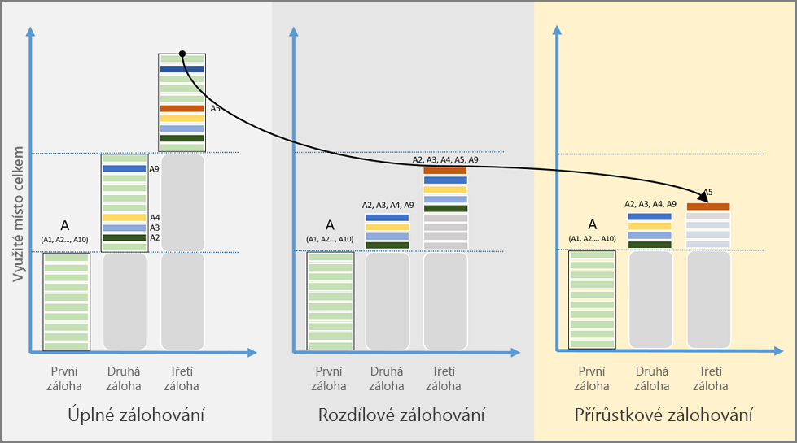

# Přehled funkcí ve službě Azure Backup
Azure Backup je služba Azure, kterou můžete využívat k zálohování (ochraně) a obnovování vašich dat v Microsoft Cloudu. Azure Backup nahrazuje současná řešení místního nebo odlehlého zálohování spolehlivým, bezpečným a cenově konkurenceschopným cloudovým řešením. Azure Backup nabízí několik komponent, které můžete stáhnout a nasadit na vhodném počítači, na serveru, nebo v cloudu. Nasazená komponenta nebo agent závisí na tom, co chcete chránit. Všechny komponenty služby Azure Backup (bez ohledu na to, jestli chráníte data v místním nebo cloudovém úložišti) je možné použít k zálohování dat do trezoru služby Recovery Services v Azure. Informace o tom, kterou komponentu použít pro ochranu konkrétních data, aplikací nebo úloh, najdete v [tabulce komponent Azure Backup](backup-introduction-to-azure-backup.md#which-azure-backup-components-should-i-use) (dále v tomto článku).

[Podívejte se na video s přehledem Azure Backup](https://azure.microsoft.com/documentation/videos/what-is-azure-backup/)

## Proč používat Azure Backup?
Tradiční řešení zálohování se vyvinula tak, že cloud považují za koncový bod nebo cíl statického úložiště podobně jako disky nebo pásky. Tento přístup je sice jednoduchý, ale je omezený a neumožňuje úplné využívání základní cloudové platformy, takže se jedná o nákladné a neefektivní řešení. Jiná řešení jsou nákladná, protože nakonec platíte za nesprávný typ úložiště nebo za úložiště, které nepotřebujete. Jiná řešení jsou často neefektivní, protože vám nenabízejí typ nebo objem úložiště, který potřebujete, nebo úlohy správy vyžadují příliš mnoho času. Azure Backup naopak nabízí tyto klíčové výhody:

**Automatická správa úložiště** – Hybridní prostředí často vyžadují heterogenní úložiště – některá místní a některá cloudová. Azure Backup neznamená žádné náklady na používání místních zařízení úložiště. Azure Backup automaticky přiděluje a spravuje úložiště záloh a používá model založený na průběžných platbách. Průběžné platby znamenají, že platíte jen za úložný prostor, který spotřebujete. Další informace najdete v [článku o cenách Azure](https://azure.microsoft.com/pricing/details/backup).

**Neomezené škálování** – Azure Backup používá základní výkon a neomezený rozsah cloudu Azure k zajištění vysoké dostupnosti, a to bez jakékoli režie s údržbou nebo monitorováním. Můžete nastavit výstrahy pro poskytování informací o událostech, ale nemusíte se starat o vysokou dostupnost svých dat v cloudu.

**Více možností úložiště** – Jedním z aspektů vysoké dostupnosti je replikace úložiště. Azure Backup nabízí dva typy replikace: [místně redundantní úložiště](../storage/common/storage-redundancy.md#locally-redundant-storage) a [geograficky redundantní úložiště](../storage/common/storage-redundancy.md#geo-redundant-storage). Možnost úložiště pro zálohování zvolte podle potřeby:

* Místně redundantní úložiště (LRS) replikuje vaše data třikrát (vytváří tři kopie dat) ve spárovaném datovém centru ve stejné oblasti. Místně redundantní úložiště nabízí cenově úsporný způsob ochrany dat před selháním místního hardwaru.

* Geograficky redundantní úložiště (GRS) replikuje vaše data do sekundární oblasti (vzdálené stovky kilometrů od primárního umístění zdrojových dat). Geograficky redundantní úložiště je nákladnější než místně redundantní úložiště, ale nabízí vyšší úroveň odolnosti dat i v případě regionálního výpadku.

**Neomezené přenosy dat** – Azure Backup neomezuje množství příchozích ani odchozích dat, která přenesete. V rámci Azure Backup se přenesená data neúčtují. Pokud ale použijete službu importu/exportu v Azure k importu velkého množství dat, účtují se náklady související s příchozími daty. Další informace o těchto nákladech najdete v části [Pracovní postup zálohování offline v Azure Backup](backup-azure-backup-import-export.md). Odchozí data označují data přenášená z trezoru služby Recovery Services během operace obnovení.

**Šifrování dat** – Šifrování dat umožňuje bezpečný přenos a ukládání vašich dat ve veřejném cloudu. Šifrovací heslo máte uložené v místním úložišti a do Azure se nikdy nepřenáší ani se tam neukládá. Pokud je nutné obnovit některá data, máte šifrovací heslo (klíč) k dispozici jen vy.

**Zálohování konzistentní s aplikací** – Bez ohledu na to, jestli zálohujete souborový server, virtuální počítač nebo databázi SQL, si potřebujete být jistí, že bod obnovení obsahuje veškerá požadovaná data pro obnovení záložní kopie. Azure Backup poskytuje zálohy konzistentní s aplikací, a tím je zajištěno, že pro obnovení dat nejsou potřebné další opravy. Obnovování dat konzistentních s aplikací zkracuje čas obnovení, což vám umožní rychle se vrátit do funkčního stavu.

**Dlouhodobé uchovávání** – Namísto převádění záložní kopie z disku na pásku a přemístění pásky na místo mimo pracoviště můžete využít krátkodobé a dlouhodobé uchovávání v Azure. Azure neomezuje dobu, po kterou data zůstanou v trezoru služby Backup nebo Recovery Services. Data můžete v trezoru ponechat, jak dlouho chcete. Služba Azure Backup má omezení 9999 bodů obnovení na chráněnou instanci. Přečtěte si oddíl [Zálohování a uchovávání](backup-introduction-to-azure-backup.md#backup-and-retention) v tomto článku, kde najdete vysvětlení, jak může toto omezení ovlivnit vaše potřeby zálohování.  

## Které komponenty Azure Backup mám použít?
Pokud si nejste jisti, která komponenta Azure Backup splňuje vaše potřeby, najdete v následující tabulce informace o tom, co můžete chránit pomocí jednotlivých komponent. Na portálu Azure Portal je k dispozici průvodce, který je integrovaný v portálu a provede vás výběrem komponenty ke stažení a nasazení. Průvodce, který je součástí vytváření trezoru služby Recovery Services, vás provede kroky výběru cíle zálohování a výběru dat nebo aplikace, kterou chcete chránit.

| Komponenta | Výhody | Omezení | Co se chrání? | Kde jsou zálohy uložené? |
| --- | --- | --- | --- | --- |
| Agent Azure Backup (MARS) |<li>Zálohování souborů a složek ve fyzickém nebo virtuálním operačním systému Windows (virtuální počítač může být místní nebo v Azure)<li>Není vyžadován samostatný záložní server. |<li>Zálohování 3x denně <li>Nerozpoznávají se aplikace; obnovování pouze na úrovni souboru, složky nebo svazku. <li>  Bez podpory Linux |<li>Soubory <li>Složky |Trezor služby Recovery Services |
| System Center DPM |<li>Snímky schopné rozeznávat aplikace (VSS)<li>Úplná flexibilita času zálohování<li>Členitost obnovení (všechny)<li>Může použít trezor služby Recovery Services<li>Podpora Linuxu ve virtuálních počítačích Hyper-V a VMware <li>Zálohování a obnovení virtuálních počítačů VMware pomocí DPM 2012 R2 |Nejde zálohovat úlohu Oracle.|<li>Soubory <li>Složky<li> Svazky <li>Virtuální počítače<li> Aplikace<li> Úlohy |<li>Trezor služby Recovery Services,<li> Místně připojený disk,<li>  Páska (pouze místní) |
| Server Azure Backup |<li>Snímky schopné rozeznávat aplikace (VSS)<li>Úplná flexibilita času zálohování<li>Členitost obnovení (všechny)<li>Může použít trezor služby Recovery Services<li>Podpora Linuxu ve virtuálních počítačích Hyper-V a VMware<li>Zálohování a obnovení virtuálních počítačů VMware <li>Nevyžaduje licenci produktu System Center |<li>Nejde zálohovat úlohu Oracle.<li>Vždy vyžaduje živé předplatné Azure<li>Nepodporuje zálohování na pásku |<li>Soubory <li>Složky<li> Svazky <li>Virtuální počítače<li> Aplikace<li> Úlohy |<li>Trezor služby Recovery Services,<li> Místně připojený disk |
| Zálohování virtuálních počítačů Azure IaaS |<li>Nativní zálohy pro Windows a Linux<li>Bez nutnosti instalace konkrétního agenta<li>Zálohování na úrovni prostředků infrastruktury bez potřeby infrastruktury zálohování |<li>Zálohování virtuálních počítačů jednou denně <li>Obnovení virtuálních počítačů pouze na úrovni disku<li>Nemožnost místního zálohování |<li>Virtuální počítače <li>Všechny disky (pomocí PowerShellu) |
Trezor služby Recovery Services
 |

## Jaké jsou scénáře nasazení pro jednotlivé komponenty?
| Komponenta | Lze nasadit v Azure? | Lze nasadit místně? | Podpora cílového úložiště |
| --- | --- | --- | --- |
| Agent Azure Backup (MARS) |
**Ano**
 
Agenta Azure Backup lze nasadit na jakýkoli virtuální počítač s Windows Serverem, který běží v Azure.
 |
**Ano**
 
Agenta služby Backup lze nasadit na jakýkoli virtuální nebo fyzický počítač s Windows Serverem.
 |
Trezor služby Recovery Services
 |
| System Center DPM |
**Ano**

Další informace o tom, [jak chránit úlohy v Azure pomocí aplikace System Center DPM](backup-azure-dpm-introduction.md).
 |
**Ano**
 
Další informace o tom, [jak chránit úlohy a virtuální počítače ve vašem datovém centru](https://technet.microsoft.com/system-center-docs/dpm/data-protection-manager).
 |
Místně připojený disk,
 
Trezor služby Recovery Services,
 
páska (pouze místní)
 |
| Server Azure Backup |
**Ano**

Další informace o tom, [jak chránit úlohy v Azure pomocí Serveru Azure Backup](backup-azure-microsoft-azure-backup.md).
 |
**Ano**
 
Další informace o tom, [jak chránit úlohy v Azure pomocí Serveru Azure Backup](backup-azure-microsoft-azure-backup.md).
 |
Místně připojený disk,
 
Trezor služby Recovery Services
 |
| Zálohování virtuálních počítačů Azure IaaS |
**Ano**

Součást prostředků infrastruktury Azure

Specializované pro [zálohování virtuálních počítačů Azure IaaS (infrastruktura jako služba)](backup-azure-vms-introduction.md).
 |
**Ne**
 
Pro zálohování virtuálních počítačů ve svém datovém centru použijte aplikaci System Center DPM.
 |
Trezor služby Recovery Services
 |

## Které aplikace a úlohy lze zálohovat?
Následující tabulka obsahuje matici dat a úloh, které se dají chránit s použitím Azure Backup. Sloupec řešení Azure Backup obsahuje odkazy na dokumentaci k nasazení pro příslušné řešení. Každou komponentu Azure Backup je možné nasadit v prostředí Classic (nasazení v Service Manageru) nebo v prostředí modelu nasazení Resource Manageru.

[!INCLUDE [learn-about-deployment-models](../../includes/learn-about-deployment-models-include.md)]

| Data nebo úloha | Zdrojové prostředí | Řešení Azure Backup |
| --- | --- | --- |
| Soubory a složky |Windows Server |
[Agent Azure Backup](backup-configure-vault.md),
 
[System Center DPM](backup-azure-dpm-introduction.md) (+ agent Azure Backup),
 
[Server Azure Backup](backup-azure-microsoft-azure-backup.md) (zahrnuje agenta Azure Backup)
 |
| Soubory a složky |Počítač s Windows |
[Agent Azure Backup](backup-configure-vault.md),
 
[System Center DPM](backup-azure-dpm-introduction.md) (+ agent Azure Backup),
 
[Server Azure Backup](backup-azure-microsoft-azure-backup.md) (zahrnuje agenta Azure Backup)
 |
| Virtuální počítač s technologií Hyper-V (Windows) |Windows Server |
[System Center DPM](backup-azure-backup-sql.md) (+ agent Azure Backup),
 
[Server Azure Backup](backup-azure-microsoft-azure-backup.md) (zahrnuje agenta Azure Backup)
 |
| Virtuální počítač s technologií Hyper-V (Linux) |Windows Server |
[System Center DPM](backup-azure-backup-sql.md) (+ agent Azure Backup),
 
[Server Azure Backup](backup-azure-microsoft-azure-backup.md) (zahrnuje agenta Azure Backup)
 |
| Microsoft SQL Server |Windows Server |
[System Center DPM](backup-azure-backup-sql.md) (+ agent Azure Backup),
 
[Server Azure Backup](backup-azure-microsoft-azure-backup.md) (zahrnuje agenta Azure Backup)
 |
| Microsoft SharePoint |Windows Server |
[System Center DPM](backup-azure-backup-sql.md) (+ agent Azure Backup),
 
[Server Azure Backup](backup-azure-microsoft-azure-backup.md) (zahrnuje agenta Azure Backup)
 |
| Microsoft Exchange |Windows Server |
[System Center DPM](backup-azure-backup-sql.md) (+ agent Azure Backup),
 
[Server Azure Backup](backup-azure-microsoft-azure-backup.md) (zahrnuje agenta Azure Backup)
 |
| Virtuální počítače Azure IaaS (Windows) |spuštěno v Azure |[Azure Backup (rozšíření virtuálního počítače)](backup-azure-vms-introduction.md) |
| Virtuální počítače Azure IaaS (Linux) |spuštěno v Azure |[Azure Backup (rozšíření virtuálního počítače)](backup-azure-vms-introduction.md) |

## Podpora Linuxu
Následující tabulka uvádí komponenty Azure Backup s podporou pro Linux.  

| Komponenta | Podpora Linuxu (schváleného Azure) |
| --- | --- |
| Agent Azure Backup (MARS) |Ne (pouze agent založený na Windows) |
| System Center DPM |<li> Záloha s konzistentními soubory virtuálních počítačů hosta s Linuxem v Hyper-V a VMWaru  <li> Obnovení virtuálního počítače pro virtuální počítače hosta s Linuxem v Hyper-V a VMwaru      *Zálohování s konzistentními soubory není dostupné pro virtuální počítače Azure*   |
| Server Azure Backup |<li>Záloha s konzistentními soubory virtuálních počítačů hosta s Linuxem v Hyper-V a VMWaru  <li> Obnovení virtuálního počítače pro virtuální počítače hosta s Linuxem v Hyper-V a VMwaru    *Zálohování s konzistentními soubory není dostupné pro virtuální počítače Azure*  |
| Zálohování virtuálních počítačů Azure IaaS |Zálohování konzistentní s aplikací pomocí [rozhraní s předzálohovacími a pozálohovacími skripty](backup-azure-linux-app-consistent.md)  [Detailní obnovení souborů](backup-azure-restore-files-from-vm.md)  [Obnovení všech disků virtuálního počítače](backup-azure-arm-restore-vms.md#restore-backed-up-disks)  [Obnovení virtuálního počítače](backup-azure-arm-restore-vms.md#create-a-new-vm-from-restore-point) |

## Použití virtuálních počítačů služby Storage úrovně Premium s Azure Backup
Azure Backup chrání virtuální počítače služby Storage úrovně Premium. Azure Premium Storage představuje úložiště využívající disky SSD (solid-state drive) určené pro podporu úloh náročných na množství vstupně-výstupních operací. Služba Storage úrovně Premium je zajímavá pro úlohy virtuálních počítačů. Další informace o službě Storage úrovně Premium najdete v článku [Premium Storage: vysoce výkonné úložiště pro úlohy virtuálních počítačů Azure](../storage/common/storage-premium-storage.md).

### Zálohování virtuálních počítačů služby Storage úrovně Premium
Během zálohování virtuálních počítačů služby Storage úrovně Premium vytvoří služba Backup v účtu Storage úrovně Premium dočasné pracovní umístění s názvem „AzureBackup-“. Velikost pracovního umístění odpovídá velikosti snímku bodu obnovení. Ujistěte se, že je v účtu služby Storage úrovně Premium dostatek volného místa pro toto dočasné pracovní umístění. Další informace najdete v článku věnovaném [omezení služby Storage úrovně Premium](../storage/common/storage-premium-storage.md#scalability-and-performance-targets). Po dokončení úlohy zálohování je pracovní umístění odstraněno. Cena úložiště použitého pro pracovní umístění je konzistentní s [Cenami Storage úrovně Premium](../storage/common/storage-premium-storage.md#pricing-and-billing).

> [!NOTE]
> Pracovní umístění neměňte, ani neupravujte.
>
>

### Obnovení virtuálních počítačů služby Storage úrovně Premium
Virtuální počítače služby Storage úrovně Premium je možné obnovit do úložiště Storage úrovně Premium nebo do normálního úložiště. Typickým procesem obnovení je obnovení bodu zotavení virtuálního počítače služby Storage úrovně Premium do služby Storage úrovně Premium. Nicméně obnovení bodu zotavení virtuálního počítače služby Storage úrovně Premium do standardního úložiště může být cenově výhodnější. Tento typ obnovení lze použít, pokud potřebujete podmnožinu souborů z virtuálního počítače.

## Používání virtuálních počítačů se spravovanými disky se službou Azure Backup
Azure Backup chrání virtuální počítače se spravovanými disky. Díky zpravovaným diskům už nemusíte spravovat účty úložiště virtuálních počítačů a zřizování virtuálních počítačů je výrazně zjednodušené.

### Zálohování virtuálních počítačů se spravovanými disky
Zálohování virtuálních počítačů na spravovaných discích se nijak neliší od zálohování virtuálních počítačů vytvořených pomocí Resource Manageru. Na webu Azure Portal můžete úlohu zálohování konfigurovat přímo ze zobrazení virtuálního počítače nebo ze zobrazení trezoru služby Recovery Services. Virtuální počítače na spravovaných discích můžete zálohovat prostřednictvím kolekcí RestorePoint postavených na spravovaných discích. Azure Backup podporuje také zálohování virtuálních počítačů se spravovanými disky, které jsou šifrované pomocí služby Azure Disk Encryption (ADE).

### Obnovení virtuálních počítačů se spravovanými disky
Azure Backup umožňuje kompletní obnovení virtuálního počítače se spravovanými disky nebo obnovení spravovaných disků do účtu úložiště. Azure během procesu obnovení spravuje spravované disky. Vy (zákazník) spravujete účet úložiště vytvořený jako součást procesu obnovení. Při obnovování spravovaných šifrovaných virtuálních počítačů existují klíče a tajné kódy daného virtuálního počítače v trezoru klíčů ještě před spuštěním operace obnovení.

## Jaké jsou funkce jednotlivých komponent služby Backup?
Následující části obsahují tabulky, které shrnují dostupnost nebo podporu různých funkcí v jednotlivých komponentách Azure Backup. Informace o další podpoře nebo podrobnosti najdete pod jednotlivými tabulkami.

### Úložiště
| Funkce | Agent Azure Backup | System Center DPM | Server Azure Backup | Zálohování virtuálních počítačů Azure IaaS |
| --- | --- | --- | --- | --- |
| Trezor služby Recovery Services |![Ano][green] |![Ano][green] |![Ano][green] |![Ano][green] |
| Diskové úložiště | |![Ano][green] |![Ano][green] | |
| Páskové úložiště | |![Ano][green] | | |
| Komprese  (v trezoru služby Recovery Services) |![Ano][green] |![Ano][green] |![Ano][green] | |
| Přírůstkové zálohování |![Ano][green] |![Ano][green] |![Ano][green] |![Ano][green] |
| Odstranění duplicit disku | |![Částečně][yellow] |![Částečně][yellow] | | |

Trezor služby Recovery Services je upřednostňovaným cílem úložiště napříč všemi komponentami. Aplikace System Center DPM a Azure Backup Server také poskytují možnost kopie místního disku. Pouze System Center DPM však nabízí možnost zápisu dat na zařízení páskového úložiště.

#### Komprese
Díky komprimování záloh dochází ke zmenšení potřebného prostoru úložiště. Jedinou komponentou, která nepoužívá komprimaci, je rozšíření virtuálního počítače. Rozšíření virtuálního počítače kopíruje veškerá zálohovaná data z vašeho účtu úložiště do trezoru služby Recovery Services ve stejné oblasti. Při přenosu dat se nepoužívá žádná komprese. Přenosem dat bez komprese se mírně zvýší využití úložiště. Ukládání dat bez komprese však umožňuje rychlejší obnovení v případě, že potřebujete tento bod obnovení.

#### Odstranění duplicit disku
Výhody odstranění duplicit můžete využívat při nasazení aplikace System Center DPM nebo Azure Backup Serveru [na virtuálním počítači Hyper-V](http://blogs.technet.com/b/dpm/archive/2015/01/06/deduplication-of-dpm-storage-reduce-dpm-storage-consumption.aspx). Windows Server odstraňuje duplicity disku (na úrovni hostitele) na virtuálních pevných discích (VHD), které jsou k virtuálnímu počítači připojené jako úložiště pro zálohu.

> [!NOTE]
> Odstranění duplicit není v Azure k dispozici pro žádné komponenty služby Backup. Jsou-li aplikace System Center DPM a Server Backup nasazené v Azure, nelze na discích úložiště, připojených k virtuálnímu počítači, provést odstranění duplicit.
>
>

### Vysvětlení přírůstkového zálohování
Všechny komponenty služby Azure Backup podporují přírůstkové zálohování bez ohledu na typ cílového úložiště (disk, páska, trezor služby Recovery Services). Přírůstkové zálohování díky přenášení pouze změn od poslední zálohy zajišťuje efektivitu zálohování z hlediska úložiště a času.

#### Porovnání úplného, rozdílového a přírůstkového zálohování

Využití úložiště, plánovaná doba obnovení (RTO) a využití sítě se liší u každého způsobu zálohování. Pokud chcete, aby celkové náklady na vlastnictví (TCO) byly co nejnižší, musíte vědět, jak zvolit nejlepší řešení zálohování. Následující obrázek porovnává úplné zálohování, rozdílové zálohování a přírůstkové zálohování. Na obrázku se zdroj dat A skládá z 10 bloků úložiště A1–A10, které se zálohují každý měsíc. Bloky A2, A3, A4 a A9 se mění první měsíc a blok A5 se mění následující měsíc.

U **úplného zálohování** každá záložní kopie obsahuje celý zdroj dat. Úplné zálohování při každém přenosu záložní kopie spotřebovává velkou část úložiště a šířky pásma sítě.

**Rozdílové zálohování** ukládá pouze bloky, které se změnily od prvotní úplné zálohy, a tak spotřebovává menší část úložiště a šířky pásma sítě. Rozdílové zálohování neuchovává redundantní kopie nezměněných dat. Protože se však přenáší a ukládají bloky dat, které se nezměnily mezi dalšími zálohami, je rozdílové zálohování neefektivní. Druhý měsíc se zálohují změněné bloky A2, A3, A4 a A9. Třetí měsíc se znovu zálohují tyto stejné bloky, společně se změněným blokem A5. Změněné bloky se budou zálohovat až do doby, kdy dojde k dalšímu úplnému zálohování.

**Přírůstkové zálohování** dosahuje vysoké efektivity využití úložiště a sítě díky tomu, že ukládá pouze bloky dat, které se změnily od předchozí zálohy. S přírůstkovým zálohováním není nutné pravidelně vytvářet úplné zálohy. V tomto příkladu se po vytvoření úplné zálohy v prvním měsíci označí bloky A2, A3, A4 a A9 jako změněné a přenesou se další měsíc. Třetí měsíc se označí a přenese pouze změněný blok A5. Přenos menšího objemu dat šetří prostředky úložiště a sítě a snižuje tak celkové náklady na vlastnictví.   

### Zabezpečení
| Funkce | Agent Azure Backup | System Center DPM | Server Azure Backup | Zálohování virtuálních počítačů Azure IaaS |
| --- | --- | --- | --- | --- |
| Zabezpečení sítě  (do Azure) |![Ano][green] |![Ano][green] |![Ano][green] |![Částečně][yellow] |
| Zabezpečení dat  (v Azure) |![Ano][green] |![Ano][green] |![Ano][green] |![Částečně][yellow] |

#### Zabezpečení sítě
Veškerý provoz zálohování z vašich serverů do trezoru služby Recovery Services je šifrován pomocí standardu AES (Advanced Encryption Standard) 256. Data zálohy se odesílají prostřednictvím zabezpečeného spojení HTTPS. Zálohovaná data jsou uložena v šifrované podobě i v trezoru služby Recovery Services. Heslo k odemknutí těchto dat má k dispozici pouze příslušný zákazník Azure. Microsoft za žádných okolností nemůže zálohovaná data dešifrovat.

> [!WARNING]
> Po vytvoření trezoru služby Recovery Services máte k šifrovacímu klíči přístup jen vy. Microsoft nikdy neuchovává kopii vašeho šifrovacího klíče a nemá ke klíči přístup. Pokud dojde ke ztrátě klíče, Microsoft nemůže zálohovaná data obnovit.
>
>

#### Zabezpečení dat
Zálohování virtuálních počítačů Azure vyžaduje nastavení šifrování *v rámci* virtuálního počítače. Na virtuálních počítačích se systémem Windows použijte BitLocker a na virtuálních počítačích s Linuxem použijte **dm-crypt**. Azure Backup neprovádí automatické šifrování zálohovaných dat, která přicházejí touto cestou.

### Síť
| Funkce | Agent Azure Backup | System Center DPM | Server Azure Backup | Zálohování virtuálních počítačů Azure IaaS |
| --- | --- | --- | --- | --- |
| Komprese sítě  (na **záložní server**) | |![Ano][green] |![Ano][green] | |
| Komprese sítě  (do **trezoru služby Recovery Services**) |![Ano][green] |![Ano][green] |![Ano][green] | |
| Síťový protokol  (na **záložní server**) | |TCP |TCP | |
| Síťový protokol  (do **trezoru služby Recovery Services**) |HTTPS |HTTPS |HTTPS |HTTPS |

Rozšíření virtuálního počítače (ve virtuálním počítači IaaS) čte data přímo z účtu úložiště Azure přes síť úložiště, takže není potřeba tento provoz komprimovat.

Pokud jako sekundární záložní server používáte server System Center DPM nebo Azure Backup Server, komprimujte data přenášená z primárního serveru na záložní server. Komprese dat před jejich zálohováním do DPM nebo na Azure Backup Server šetří šířku pásma.

#### Omezování šířky pásma sítě
Agent Azure Backup nabízí možnost omezování šířky pásma sítě, která vám umožňuje kontrolu využití šířky pásma sítě během přenosu dat. Omezování může být užitečné, pokud potřebujete zálohovat data v pracovní době, ale nechcete, aby proces zálohování narušoval ostatní internetový provoz. Omezování pro přenos dat platí pro činnosti zálohování a obnovení.

## Zálohování a uchovávání

Azure Backup má limit 9999 bodů obnovení (označovaných také jako záložní kopie nebo snímky) na jednu *chráněnou instanci*. Chráněná instance je počítač, server (fyzický nebo virtuální) nebo úloha nakonfigurovaná pro zálohování dat do Azure. Další informace najdete v části [Co je chráněná instance](backup-introduction-to-azure-backup.md#what-is-a-protected-instance). Instance je chráněná, jakmile se uloží záložní kopie dat. Ochranou je právě tato záložní kopie dat. Pokud dojde ke ztrátě nebo poškození zdrojových dat, je možné je obnovit ze záložní kopie. V následující tabulce jsou uvedené maximální frekvence zálohování pro jednotlivé komponenty. Konfigurace zásady zálohování určuje, jak rychle se spotřebovávají body obnovení. Pokud například vytváříte bod obnovení každý den, můžete zachovat body obnovení 27 let, teprve potom vám dojdou. Pokud vytváříte bod obnovení každý měsíc, můžete zachovat body obnovení 833 let, teprve potom vám dojdou. Služba Backup pro body obnovení nenastavuje omezení času vypršení platnosti.

|  | Agent Azure Backup | System Center DPM | Server Azure Backup | Zálohování virtuálních počítačů Azure IaaS |
| --- | --- | --- | --- | --- |
| Frekvence zálohování  (do trezoru služby Recovery Services) |Tři zálohy za den |Dvě zálohy za den |Dvě zálohy za den |Jedna záloha za den |
| Frekvence zálohování  (na disk) |Neuvedeno |<li>Každých 15 minut pro SQL Server <li>Každou hodinu pro ostatní úlohy |<li>Každých 15 minut pro SQL Server <li>Každou hodinu pro ostatní úlohy
 |Neuvedeno |
| Možnosti uchovávání |Denně, týdně, měsíčně, ročně |Denně, týdně, měsíčně, ročně |Denně, týdně, měsíčně, ročně |Denně, týdně, měsíčně, ročně |
| Maximální počet bodů obnovení na chráněnou instanci |9999|9999|9999|9999|
| Maximální doba uchovávání |Závisí na četnosti zálohování |Závisí na četnosti zálohování |Závisí na četnosti zálohování |Závisí na četnosti zálohování |
| Body obnovení na místním disku |Neuvedeno |<li>64 pro souborové servery,<li>448 pro aplikační servery |<li>64 pro souborové servery,<li>448 pro aplikační servery |Neuvedeno |
| Body obnovení na pásku |Neuvedeno |Unlimited |Neuvedeno |Neuvedeno |

## Co je chráněná instance
Chráněná instance je obecný odkaz na počítač se systémem Windows, server (fyzický nebo virtuální) nebo databázi SQL, která byla nakonfigurovaná pro zálohování do Azure. Instance je chráněná v okamžiku, kdy pro příslušný počítač, server nebo databázi nakonfigurujete zásady zálohování a vytvoříte záložní kopii dat. Další kopie záložních dat pro tuto chráněnou instanci (používá se pro ně označení body obnovení) zvyšují objem využitého úložiště. Pro chráněnou instanci je možné vytvořit až 9999 bodů obnovení. Pokud bod obnovení odstraníte z úložiště, nebude se do celkového počtu 9999 bodů obnovení započítávat.
Mezi běžné příklady chráněných instancí patří virtuální počítače, aplikační servery, databáze a osobní počítače s operačním systémem Windows. Například:

* Virtuální počítač se spuštěnými prostředky infrastruktury hypervisoru Azure IaaS nebo Hyper-V. Hostovanými operačními systémy pro virtuální počítač může být Windows Server nebo Linux.
* Aplikační server: Aplikačním serverem může být fyzický nebo virtuální počítač se systémem Windows Server a úlohy s daty, která je potřeba zálohovat. Mezi běžné úlohy patří Microsoft SQL Server, server Microsoft Exchange, server Microsoft SharePoint a role souborového serveru ve Windows Serveru. K zálohování těchto úloh potřebujete System Center Data Protection Manager (DPM) nebo Azure Backup Server.
* Osobní počítač, pracovní stanice nebo přenosný počítač s operačním systémem Windows.

## Co je trezor služby Recovery Services?
Trezor služby Recovery Services je entita online úložiště v Azure, která slouží k uchovávání dat, jako jsou záložní kopie, body obnovení a zásady zálohování. Trezory služby Recovery Services můžete používat pro uchovávání dat záloh u služeb Azure a místních serverů a pracovních stanic. Trezory služby Recovery Services usnadňují uspořádání dat záloh a současně minimalizují režii spojenou s jejich správou. V rámci předplatného můžete podle potřeby vytvořit libovolný počet trezorů služby Recovery Services.

Trezory služby Backup, které jsou založené na správci Azure Service Manager, byly první verzí trezorů. Trezory služby Recovery Services, které přidávají modelové funkce správce Azure Resource Manager, jsou druhou verzí trezorů. Úplný popis rozdílů funkcí najdete v článku [Přehled trezoru služby Recovery Services](backup-azure-recovery-services-vault-overview.md). Pomocí portálu už nemůžete trezory služby Backup vytvářet, ale trezory služby Backup jsou i nadále podporovány.

> [!IMPORTANT]
> Nyní můžete trezory služby Backup upgradovat na trezory služby Recovery Services. Podrobnosti najdete v článku [Upgrade trezoru služby Backup na trezor služby Recovery Services](backup-azure-upgrade-backup-to-recovery-services.md). Microsoft doporučuje, abyste upgradovali své trezory služby Backup na trezory služby Recovery Services.  Od **15. října 2017** už nebude možné pomocí PowerShellu vytvářet trezory služby Backup.   **Do 1. listopadu 2017:**
>- Všechny zbývající trezory služby Backup budou automaticky upgradovány na trezory služby Recovery Services.
>- Nebudete mít přístup k datům záloh na portálu Classic. Pro přístup k datům záloh v trezorech služby Recovery Services místo toho použijte Azure Portal.
>

## Čím se liší Azure Backup od Azure Site Recovery?
Služby Azure Backup a Azure Site Recovery spolu souvisí v tom smyslu, že obě služby zálohují data a můžou tato data obnovit. Tyto služby však v podniku slouží k jiným účelům, co se týče zajištění kontinuity podnikových procesů a zotavení po havárii. Pomocí služby Azure Backup můžete chránit a obnovovat data na podrobnější úrovni. Pokud se například poškodí prezentace na přenosném počítači, pomocí služby Azure Backup můžete tuto prezentaci obnovit. Pokud chcete replikovat konfiguraci a data virtuálního počítače do jiného datacentra, použijte službu Azure Site Recovery.

Azure Backup chrání data v místním a cloudovém úložišti. Azure Site Recovery koordinuje replikaci, převzetí služeb při selhání a navrácení služeb po obnovení mezi virtuálním počítačem a fyzickým serverem. Obě služby jsou důležité, protože je třeba, aby řešení zotavení po havárii zachovalo vaše data zabezpečená a obnovitelná (služba Backup) *a* aby vaše úlohy byly dostupné (služba Site Recovery) i v případě výpadku.

Následující koncepty vám mohou pomoct při rozhodování ohledně zálohování a zotavení po havárii.

| Koncept | Podrobnosti | Zálohování | Zotavení po havárii (DR) |
| --- | --- | --- | --- |
| Cíl bodu obnovení (RPO) |Přijatelná míra ztráty dat v případě potřeby provedení obnovení. |Řešení pro zálohování jsou velmi variabilní ohledně přijatelného RPO. Zálohy virtuálních počítačů obvykle mají RPO jeden den, zatímco zálohy databází mají RPO nižší, až 15 minut. |Řešení zotavení po havárii mají nízké RPO. Kopie DR může být o několik sekund až minut pozadu. |
| Plánovaná doba obnovení (RTO) |Množství času potřebného k dokončení obnovení nebo zotavení. |Z důvodu vyššího RPO je množství dat, které musí řešení zálohování zpracovat, typicky mnohem vyšší, což vede k delším RTO. Například obnovení dat z pásků může trvat i dny v závislosti na tom, jak dlouho trvá přenos pásku z odlehlého umístění. |Řešení zotavení po havárii mají nižší RTO, protože k jejich synchronizaci se zdrojem dochází častěji. Je tedy třeba zpracovat méně změn. |
| Uchovávání |Jak dlouho mají být data uložená |Pro scénáře, které vyžadují provozní obnovení (poškození dat, neúmyslné odstranění souborů, selhání operačního systému), se zálohovaná data obvykle uchovávají po dobu 30 dnů nebo méně. Z hlediska dodržování předpisů může být nutné uchování dat po dobu několika měsíců nebo i let. V takovém případě jsou pro archivaci ideální zálohovaná data. |Zotavení po havárii vyžaduje pouze provozní data obnovení, která obvykle zabírají několik hodin nebo až den. Z důvodu zaznamenávání jemně odstupňovaných dat v řešeních zotavení po havárii nedoporučujeme používání dat zotavení po havárii pro dlouhodobé uchovávání.  |

## Další kroky
Podrobné pokyny pro ochranu dat na Windows Serveru nebo pro ochranu virtuálního počítače v Azure najdete v jednom z následujících kurzů:

* [Zálohování souborů a složek](backup-try-azure-backup-in-10-mins.md)
* [Zálohování virtuálních počítačů Azure](backup-azure-vms-first-look-arm.md)

Podrobnosti o ochraně jiných úloh můžete zkusit najít v některém z těchto článků:

* [Zálohování Windows Serveru](backup-configure-vault.md)
* [Zálohování úloh aplikací](backup-azure-microsoft-azure-backup.md)
* [Zálohování virtuálních počítačů Azure IaaS](backup-azure-vms-prepare.md)

[green]: ./media/backup-introduction-to-azure-backup/green.png
[yellow]: ./media/backup-introduction-to-azure-backup/yellow.png
[red]: ./media/backup-introduction-to-azure-backup/red.png

