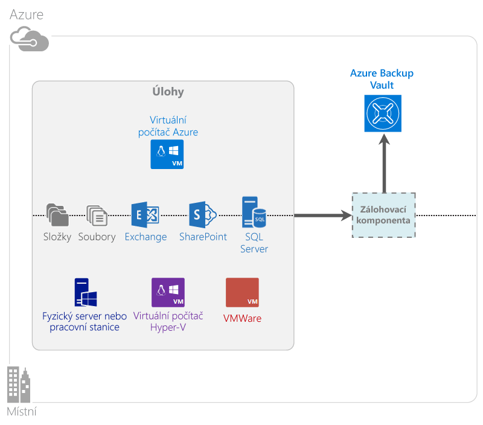

<properties
    pageTitle="Co je Azure Backup? | Microsoft Azure"
    description="Pomocí Azure Backup a Služeb zotavení můžete zálohovat a obnovovat data a aplikace Windows Serverů, klientských počítačů Windows, serverů System Center DPM a virtuálních počítačů Azure."
    services="backup"
    documentationCenter=""
    authors="markgalioto"
    manager="cfreeman"
    editor="tysonn"
    keywords="zálohování a obnovení; recovery services; řešení zálohování"/>

<tags
    ms.service="backup"
    ms.workload="storage-backup-recovery"
    ms.tgt_pltfrm="na"
    ms.devlang="na"
    ms.topic="get-started-article"
    ms.date="07/21/2016"
    ms.author="jimpark; trinadhk"/>

# Co je Azure Backup?
Azure Backup je služba, která slouží k zálohování a obnovování vašich dat v Microsoft Cloudu. Nahrazuje současná řešení místního nebo odlehlého zálohování spolehlivým, bezpečným a cenově konkurenceschopným cloudovým řešením. Také pomáhá chránit prostředky, které běží v cloudu. Azure Backup poskytuje služby zotavení postavené na škálovatelné, odolné a vysoce dostupné infrastruktuře světové úrovně.

[Podívejte se na video s přehledem Azure Backup](https://azure.microsoft.com/documentation/videos/what-is-azure-backup/)

## Proč používat Azure Backup?
Tradiční řešení zálohování se vyvinuly a cloud jako koncový bod považují za podobný diskům nebo páskům. Tento přístup je jednoduchý, ale zároveň omezený. Nevyužívá naplno základní cloudovou platformu a tak se stává neefektivním a drahým řešením.
Azure Backup naproti tomu přináší veškeré výhody výkonného a dostupného řešení cloudového zálohování. Zde jsou některé klíčové výhody, které poskytuje Azure Backup.

| Funkce | Výhoda |
| ------- | ------- |
| Automatická správa úložiště | Není potřeba velkých výdajů na místní úložná zařízení. Azure Backup automaticky přiděluje a spravuje úložiště záloh a používá model spotřeby založený na průběžných platbách. |
| Neomezené škálování | Využijte výhody garance vysoké dostupnosti bez nutnosti starat se o údržbu a monitorování. Azure Backup používá základní sílu a škálování cloudu Azure spolu s nerušivými možnostmi automatického škálování. |
| Více možností úložiště | Zvolte úložiště záloh podle vašich potřeb:<li>Objekt blob bloku místně redundantního úložiště je ideální pro zákazníky, kteří hledí na cenu, a přesto pomáhá chránit data před selháním místního hardwaru. <li>Objekt blob bloku geografické replikace úložiště poskytuje další tři kopie ve spárovaném datovém centru. Tyto další kopie pomáhají zajistit vysokou dostupnost vašich dat i v případě havárie Azure na úrovni webu. |
| Neomezený přenos dat | Výchozí přenos dat během operace obnovení z trezoru služby Backup není nijak zpoplatněn. Příchozí data do Azure jsou rovněž bezplatná. Funguje se službou import, pokud je k dispozici. |
| Šifrování dat | Šifrování dat umožňuje bezpečný přenos a ukládání dat zákazníka ve veřejném cloudu. Šifrovací heslo je uloženo na zdroji a do Azure se nikdy nepřenáší ani neukládá. Šifrovací klíč je vyžadován k obnovení dat a pouze zákazník má úplný přístup k datům ve službě. |  
| Zálohování konzistentní s aplikací | Zálohování konzistentní s aplikací ve Windows pomáhá zajistit, že během obnovení nejsou potřebné opravy, což snižuje plánovanou dobu obnovení. To umožňuje zákazníkům rychlejší návrat k běžícímu stavu. |
| Dlouhodobé uchovávání | Místo placení za řešení zálohování na pásku odlehlého pracoviště mohou zákazníci zálohovat do Azure, které poskytuje za poutavé řešení podobné pásku za nízkou cenu. |

## Komponenty služby Azure Backup
Protože je služba Backup hybridním řešením zálohování, skládá se z několika komponent, které společně umožňují pracovní postupy koncového zálohování a obnovení.

### Scénáře nasazení

| Komponenta | Lze nasadit v Azure? | Lze nasadit místně? | Podpora cílového úložiště|
| --- | --- | --- | --- |
| Agent Azure Backup | 
**Ano**
 
Agenta Azure Backup lze nasadit na jakýkoli virtuální počítač s Windows Serverem, který běží v Azure.
 | 
**Ano**
 
Agenta služby Backup lze nasadit na jakýkoli virtuální nebo fyzický počítač s Windows Serverem.
 | 
Trezor služby Azure Backup
 |
| System Center Data Protection Manager (DPM) | 
**Ano**

Další informace o tom, [jak chránit úlohy v Azure pomocí aplikace System Center DPM](http://blogs.technet.com/b/dpm/archive/2014/09/02/azure-iaas-workload-protection-using-data-protection-manager.aspx).
 | 
**Ano**
 
Další informace o tom, [jak chránit úlohy a virtuální počítače ve vašem datovém centru](https://technet.microsoft.com/library/hh758173.aspx).
 | 
Místně připojený disk,
 
Trezor služby Azure Backup,
 
páska (pouze místní)
 |
| Server Azure Backup | 
**Ano**

Další informace o tom, [jak chránit úlohy v Azure pomocí Serveru Azure Backup](backup-azure-microsoft-azure-backup.md).
 | 
**Ano**
 
Další informace o tom, [jak chránit úlohy v Azure pomocí Serveru Azure Backup](backup-azure-microsoft-azure-backup.md).
 | 
Místně připojený disk,
 
Trezor služby Azure Backup
 |
| Azure Backup (rozšíření virtuálního počítače) | 
**Ano**

Součást prostředků infrastruktury Azure

Specializované pro [zálohování virtuálních počítačů Azure IaaS (infrastruktura jako služba)](backup-azure-vms-introduction.md).
 | 
**Ne**
 
Pro zálohování virtuálních počítačů ve svém datovém centru použijte aplikaci System Center DPM.
 | 
Trezor služby Azure Backup
 |

### Výhody a omezení na úrovni komponent

| Komponenta | Výhody | Omezení | Členitost obnovení |
| --- | --- | --- | --- |
| Agent Azure Backup (MARS) | <li>Může zálohovat soubory a složky na virtuálním i fyzickém počítači s operačním systémem Windows (virtuální počítače mohou být místní nebo v Azure)<li>Není vyžadován samostatný záložní server<li>Používá trezor služby Azure Backup | <li>Zálohování nebo obnovení na úrovni souborů třikrát za den<li>Obnovení pouze na úrovni soubor/složka/svazek, není schopné rozeznávat aplikace<li>Nepodporuje Linux | soubory/složky/svazky |
| System Center Data Protection Manager | <li>Snímky schopné rozeznávat aplikace (VSS)<li>Úplná flexibilita času zálohování<li>Členitost obnovení (všechny)<li>Může používat trezor služby Azure Backup<li>Podpora Linuxu (je-li hostovaný na Hyper-V) | <li>Chybí heterogenní podpora (zálohování virtuálních počítačů VMWare, zálohování úloh Oracle).  | soubory/složky/svazky /virtuální počítače/aplikace |
| Server Microsoft Azure Backup | <li>Snímky schopné rozeznávat aplikace (VSS)<li>Úplná flexibilita času zálohování<li>Členitost obnovení (všechny)<li>Může používat trezor služby Azure Backup<li>Podpora Linuxu (je-li hostovaný na Hyper-V)<li>Nevyžaduje licenci produktu System Center | <li>Chybí heterogenní podpora (zálohování virtuálních počítačů VMWare, zálohování úloh Oracle).<li>Vždy vyžaduje živé předplatné Azure<li>Nepodporuje zálohování na pásku | soubory/složky/svazky /virtuální počítače/aplikace |
| Zálohování virtuálních počítačů Azure IaaS | <li>Nativní zálohy pro Windows a Linux<li>Bez nutnosti instalace konkrétního agenta<li>Zálohování na úrovni prostředků infrastruktury bez potřeby infrastruktury zálohování | <li>Zálohování a obnovení na úrovni disku pouze jednou za den<li>Nemožnost místního zálohování | Virtuální počítače Všechny disky (pomocí PowerShellu) |

## Které aplikace a úlohy lze zálohovat?

| Úloha | Zdrojový počítač | Řešení Azure Backup |
| --- | --- |---|
| Soubory a složky | Windows Server | 
[Agent Azure Backup](backup-configure-vault.md),
 
[System Center DPM](backup-azure-dpm-introduction.md) (+ agent Azure Backup),
 
[Server Azure Backup](backup-azure-microsoft-azure-backup.md) (zahrnuje agenta Azure Backup)
  |
| Soubory a složky | Klient Windows | 
[Agent Azure Backup](backup-configure-vault.md),
 
[System Center DPM](backup-azure-dpm-introduction.md) (+ agent Azure Backup),
 
[Server Azure Backup](backup-azure-microsoft-azure-backup.md) (zahrnuje agenta Azure Backup)
  |
| Virtuální počítač s technologií Hyper-V (Windows) | Windows Server | 
[System Center DPM](backup-azure-backup-sql.md) (+ agent Azure Backup),
 
[Server Azure Backup](backup-azure-microsoft-azure-backup.md) (zahrnuje agenta Azure Backup)
 |
| Virtuální počítač s technologií Hyper-V (Linux) | Windows Server | 
[System Center DPM](backup-azure-backup-sql.md) (+ agent Azure Backup),
 
[Server Azure Backup](backup-azure-microsoft-azure-backup.md) (zahrnuje agenta Azure Backup)
  |
| Microsoft SQL Server | Windows Server | 
[System Center DPM](backup-azure-backup-sql.md) (+ agent Azure Backup),
 
[Server Azure Backup](backup-azure-microsoft-azure-backup.md) (zahrnuje agenta Azure Backup)
  |
| Microsoft SharePoint | Windows Server | 
[System Center DPM](backup-azure-backup-sql.md) (+ agent Azure Backup),
 
[Server Azure Backup](backup-azure-microsoft-azure-backup.md) (zahrnuje agenta Azure Backup)
   |
| Microsoft Exchange |  Windows Server | 
[System Center DPM](backup-azure-backup-sql.md) (+ agent Azure Backup),
 
[Server Azure Backup](backup-azure-microsoft-azure-backup.md) (zahrnuje agenta Azure Backup)
   |
| Virtuální počítače Azure IaaS (Windows) | - | [Azure Backup (rozšíření virtuálního počítače)](backup-azure-vms-introduction.md) |
| Virtuální počítače Azure IaaS (Linux) | - | [Azure Backup (rozšíření virtuálního počítače)](backup-azure-vms-introduction.md) |

## Podpora ARM a Linuxu

| Komponenta | Podpora ARM | Podpora Linuxu (schváleného Azure) |
| --- | --- | --- |
| Agent Azure Backup (MARS) | Ano | Ne (pouze agent založený na Windows) |
| System Center Data Protection Manager | Ano (agent u hosta) | Pouze Hyper-V (ne virtuální počítač Azure) Možné pouze zálohování s konzistentními soubory |
| Server Azure Backup (MABS) | Ano (agent u hosta) | Pouze Hyper-V (ne virtuální počítač Azure) Možné pouze zálohování s konzistentními soubory (stejně jako u DPM) |
| Zálohování virtuálních počítačů Azure IaaS | Ano | Ano |

[AZURE.INCLUDE [learn-about-deployment-models](../../includes/learn-about-deployment-models-include.md)]

## Zálohování a obnovení virtuálních počítačů služby Storage úrovně Premium

Služba Azure Backup nyní chrání virtuální počítače služby Storage úrovně Premium.

### Zálohování virtuálních počítačů služby Storage úrovně Premium

Během zálohování virtuálních počítačů služby Storage úrovně Premium vytvoří služba Backup v účtu Storage úrovně Premium dočasné pracovní umístění. Pracovní umístění s názvem „AzureBackup-“ odpovídá celkové velikosti dat na prémiových discích připojených k virtuálnímu počítači.

>[AZURE.NOTE] Pracovní umístění neměňte, ani neupravujte.

Po dokončení úlohy zálohování je pracovní umístění odstraněno. Cena úložiště použitého pro pracovní umístění je konzistentní s [Cenami Storage úrovně Premium](../storage/storage-premium-storage.md#pricing-and-billing).

### Obnovení virtuálních počítačů služby Storage úrovně Premium

Virtuální počítač Storage úrovně Premium je možné obnovit do úložiště Storage úrovně Premium nebo do normálního úložiště. Typickým procesem obnovení je obnovení bodu zotavení virtuálního počítače služby Storage úrovně Premium do služby Storage úrovně Premium. Nicméně obnovení bodu zotavení virtuálního počítače služby Storage úrovně Premium do standardního úložiště může být cenově výhodnější. Tento typ obnovení lze použít, pokud potřebujete podmnožinu souborů z virtuálního počítače.

## Funkce
Těchto pět tabulek shrnuje, jak se zpracovávají funkce zálohování v jednotlivých komponentách.

### Úložiště

| Funkce | Agent Azure Backup | System Center DPM | Server Azure Backup | Azure Backup (rozšíření virtuálního počítače) |
| ------- | --- | --- | --- | ---- |
| Trezor služby Azure Backup | ![Ano][green] | ![Ano][green] | ![Ano][green] | ![Ano][green] |
| Diskové úložiště | | ![Ano][green] | ![Ano][green] |  |
| Páskové úložiště | | ![Ano][green] |  | |
| Komprese (v trezoru záloh) | ![Ano][green] | ![Ano][green]| ![Ano][green] | |
| Přírůstkové zálohování | ![Ano][green] | ![Ano][green] | ![Ano][green] | ![Ano][green] |
| Odstranění duplicit disku | | ![Částečně][yellow] | ![Částečně][yellow]| | |

Trezor záloh je upřednostňovaným cílem úložiště napříč všemi komponentami. Aplikace System Center DPM a Server Backup také poskytují možnost kopie místního disku. Pouze System Center DPM však nabízí možnost zápisu dat na zařízení páskového úložiště.

#### Přírůstkové zálohování
Všechny komponenty podporují přírůstkové zálohování bez ohledu na typ cílového úložiště (disk, páska, trezor záloh). Přírůstkové zálohování díky přenášení pouze změn od poslední zálohy zajišťuje efektivitu zálohování z hlediska úložiště a času.

#### Komprese
Díky komprimování záloh dochází ke zmenšení potřebného prostoru úložiště. Jedinou komponentou, která nepoužívá komprimaci, je rozšíření virtuálního počítače. U rozšíření virtuálního počítače se veškerá zálohovaná data zkopírují bez komprese z účtu úložiště uživatele do trezoru záloh ve stejné oblasti. Ačkoli tento přístup mírně zvyšuje velikost použitého úložiště, obnovování nekomprimovaných dat vede ke kratší době obnovení.

#### Odstranění duplicit
Odstranění duplicit je podporováno pro aplikaci System Center DPM a pro Server Backup, pokud je [nasazený ve virtuálním počítači s technologií Hyper-V](http://blogs.technet.com/b/dpm/archive/2015/01/06/deduplication-of-dpm-storage-reduce-dpm-storage-consumption.aspx). Odstranění duplicit se provádí na úrovni hosta pomocí funkce odstranění duplicit Windows Serveru na virtuálních pevných discích (VHD), které jsou k virtuálnímu počítači připojené jako úložiště pro zálohu.

>[AZURE.WARNING] Odstranění duplicit není v Azure k dispozici pro žádné komponenty služby Backup. Jsou-li aplikace System Center DPM a Server Backup nasazené v Azure, nelze na discích úložiště, připojených k virtuálnímu počítači, provést odstranění duplicit.

### Zabezpečení

| Funkce | Agent Azure Backup | System Center DPM | Server Azure Backup | Azure Backup (rozšíření virtuálního počítače) |
| ------- | --- | --- | --- | ---- |
| Zabezpečení sítě (do Azure) | ![Ano][green] |![Ano][green] | ![Ano][green] | ![Částečně][yellow]|
| Zabezpečení dat (v Azure) | ![Ano][green] |![Ano][green] | ![Ano][green] | ![Částečně][yellow]|

Veškerý provoz zálohování z vašeho serveru do trezoru služby Backup je šifrován pomocí standardu AES (Advanced Encryption Standard) 256. Data se odesílají prostřednictvím zabezpečeného spojení HTTPS. Zálohovaná data jsou i v trezoru služby Backup uložena v šifrovaném tvaru. Heslo k odemknutí těchto dat vlastní pouze zákazník. Microsoft za žádných okolností nemůže zálohovaná data dešifrovat.

>[AZURE.WARNING] Klíč, pomocí kterého se šifrují zálohovaná data, je přítomen pouze u zákazníka. Microsoft neudržuje jeho kopii v Azure a nemá ke klíči žádný přístup. Pokud dojde ke ztrátě klíče, Microsoft nemůže zálohovaná data obnovit.

Zálohování virtuálních počítačů Azure vyžaduje nastavení šifrování *v rámci* virtuálního počítače. Na virtuálních počítačích se systémem Windows použijte BitLocker a na virtuálních počítačích s Linuxem použijte **dm-crypt**. Azure Backup neprovádí automatické šifrování zálohovaných dat, která přicházejí touto cestou.

### Podporované úlohy

| Funkce | Agent Azure Backup | System Center DPM | Server Azure Backup | Azure Backup (rozšíření virtuálního počítače) |
| ------- | --- | --- | --- | ---- |
| Počítač s Windows Serverem – soubory a složky | ![Ano][green] | ![Ano][green] | ![Ano][green] | |
| Klientský počítač systému Windows – soubory a složky | ![Ano][green] | ![Ano][green] | ![Ano][green] | |
| Virtuální počítač s technologií Hyper-V (Windows) | | ![Ano][green] | ![Ano][green] | |
| Virtuální počítač s technologií Hyper-V (Linux) | | ![Ano][green] | ![Ano][green] | |
| Microsoft SQL Server | | ![Ano][green] | ![Ano][green] | |
| Microsoft SharePoint | | ![Ano][green] | ![Ano][green] | |
| Microsoft Exchange  | | ![Ano][green] | ![Ano][green] | |
| Virtuální počítače Azure (Windows) | | | | ![Ano][green] |
| Virtuální počítače Azure (Linux) | | | | ![Ano][green] |

### Síť

| Funkce | Agent Azure Backup | System Center DPM | Server Azure Backup | Azure Backup (rozšíření virtuálního počítače) |
| ------- | --- | --- | --- | ---- |
| Komprese sítě (do záložního serveru) | | ![Ano][green] | ![Ano][green] | |
| Komprese sítě (do trezoru záloh) | ![Ano][green] | ![Ano][green] | ![Ano][green] | |
| Síťový protokol (do záložního serveru) | | TCP | TCP | |
| Síťový protokol (do trezoru záloh) | HTTPS | HTTPS | HTTPS | HTTPS |

Vzhledem k tomu, že rozšíření virtuálního počítače čte data přímo z účtu úložiště Azure přes síť úložiště, není potřeba tento provoz optimalizovat. Provoz probíhá přes síť místního úložiště v datovém centru Azure, takže komprimování kvůli šířce pásma není nutné. 

Pokud svá data zálohujete na záložní server (DPM nebo Server Backup), provoz z primárního na záložní server lze komprimovat pro snížení šířky pásma.

#### Omezování šířky pásma sítě
Agent Azure Backup poskytuje schopnost omezování, která vám umožňuje kontrolu využití šířky pásma sítě během přenosu dat. Omezování může být užitečné, pokud potřebujete zálohovat data v pracovní době, ale nechcete, aby proces zálohování narušoval ostatní internetový provoz. Omezování pro přenos dat platí pro činnosti zálohování a obnovení.

### Zálohování a uchovávání

|  | Agent Azure Backup | System Center DPM | Server Azure Backup | Azure Backup (rozšíření virtuálního počítače) |
| --- | --- | --- | --- | --- |
| Frekvence zálohování (do trezoru záloh) | Tři zálohy za den | Dvě zálohy za den |Dvě zálohy za den | Jedna záloha za den |
| Frekvence zálohování (na disk) | Neuvedeno | 
Každých 15 minut pro SQL Server
 
Každou hodinu pro ostatní úlohy
 | 
Každých 15 minut pro SQL Server
 
Každou hodinu pro ostatní úlohy
 |Neuvedeno |
| Možnosti uchovávání | Denně, týdně, měsíčně, ročně | Denně, týdně, měsíčně, ročně | Denně, týdně, měsíčně, ročně |Denně, týdně, měsíčně, ročně |
| Doba uchovávání | Až 99 let | Až 99 let | Až 99 let | Až 99 let |
| Body obnovení v trezoru služby Backup | Neomezeno | Unlimited | Unlimited | Unlimited |
| Body obnovení na místním disku | Neuvedeno | 64 pro souborové servery,  448 pro aplikační servery | 64 pro souborové servery,  448 pro aplikační servery |Neuvedeno |
| Body obnovení na pásku | Neuvedeno | Unlimited | Neuvedeno | Neuvedeno |

## Co je soubor s přihlašovacími údaji trezoru?

Soubor s přihlašovacími údaji trezoru je certifikát vytvořený portál pro každý trezor záloh. Portál poté odešle veřejný klíč do Access Control Service (ACS). Privátní klíč je uživateli poskytnutý při stahování přihlašovacích údajů a poté je zadaný během registrace počítače. Privátní klíč ověřuje počítač pro odesílání zálohovaných dat do identifikovaného trezoru ve službě Azure Backup.

Přihlašovací údajů úložiště se používají pouze během pracovního postupu registrace. Je vaší povinností ujistit se, že nedošlo k ohrožení bezpečnosti souboru s přihlašovacími údaji. Padne-li soubor s přihlašovacími údaji do rukou neautorizovaného uživatele, může být použitý k registraci dalších počítačů ke stejnému trezoru. Nicméně díky tomu, že jsou zálohovaná data šifrovaná pomocí hesla, které zná pouze zákazník, nemůže dojít k ohrožení bezpečnosti stávajících zálohovaných dat.  Pro snížení tohoto rizika přihlašovací údaje trezoru za 48 hodin vyprší. Ačkoli si můžete přihlašovací údaje trezoru stáhnout kolikrát chcete, během pracovního postupu registrace lze použít pouze nejnovější soubor.

## Čím se liší Azure Backup od Azure Site Recovery?
Mnoho zákazníků zaměňuje obnovení ze zálohy a zotavení po havárii. Obojí zaznamenává data a poskytuje sémantiku obnovení, ale jimi navrhované základní hodnoty se liší.

Azure Backup zálohuje data do místního a cloudového úložiště. Azure Site Recovery koordinuje replikaci, převzetí služeb při selhání a navrácení služeb po obnovení mezi virtuálním počítačem a fyzickým serverem. Obě služby jsou důležité, protože je třeba, aby řešení zotavení po havárii zachovalo vaše data zabezpečená a obnovitelná (služba Backup) *a* aby vaše úlohy byly dostupné (služba Site Recovery) i v případě výpadku.

Následující koncepty vám pomohou při rozhodování ohledně zálohování a zotavení po havárii.

| Koncept | Podrobnosti | Zálohování | Zotavení po havárii (DR) |
| ------- | ------- | ------ | ----------------- |
| Cíl bodu obnovení (RPO) | Přijatelná míra ztráty dat v případě potřeby provedení obnovení. | Řešení pro zálohování jsou velmi variabilní ohledně přijatelného RPO. Zálohy virtuálních počítačů obvykle mají RPO jeden den, zatímco zálohy databází mají RPO nižší, až 15 minut. | Řešení zotavení po havárii mají nízké RPO. Kopie DR může být o několik sekund až minut pozadu. |
| Plánovaná doba obnovení (RTO) | Množství času potřebného k dokončení obnovení nebo zotavení. | Z důvodu vyššího RPO je množství dat, které musí řešení zálohování zpracovat, typicky mnohem vyšší, což vede k delším RTO. Například obnovení dat z pásků může trvat i dny v závislosti na tom, jak dlouho trvá přenos pásku z odlehlého umístění. | Řešení zotavení po havárii mají nižší RTO, protože k jejich synchronizaci se zdrojem dochází častěji. Je tedy třeba zpracovat méně změn. |
| Uchovávání | Jak dlouho mají být data uložená | Pro scénáře, které vyžadují provozní obnovení (poškození dat, neúmyslné odstranění souborů, selhání operačního systému), se zálohovaná data obvykle uchovávají po dobu 30 dnů nebo méně. Z hlediska dodržování předpisů může být nutné uchování dat po dobu několika měsíců nebo i let. V takovém případě jsou pro archivaci ideální zálohovaná data. | Zotavení po havárii vyžaduje pouze provozní data obnovení, která obvykle zabírají několik hodin nebo až den. Z důvodu zaznamenávání jemně odstupňovaných dat v řešeních zotavení po havárii nedoporučujeme používání dat zotavení po havárii pro dlouhodobé uchovávání.  |

## Další kroky

Vyzkoušejte si jednoduché zálohování Azure. Pokyny naleznete v následujících kurzech:

- [Vyzkoušejte zálohování Azure](backup-try-azure-backup-in-10-mins.md)
- [Vyzkoušejte zálohování virtuálních počítačů Azure](backup-azure-vms-first-look.md)

Tyto kurzy vám pomohou rychle zálohovat a proto ukazují pouze ten nejpřímější postup zálohování vašich dat. Pro další informace o typu zálohy, který chcete provést, pokračujte na:

- [Zálohování počítače se systémem Windows](backup-configure-vault.md)
- [Zálohování úloh aplikací](backup-azure-microsoft-azure-backup.md)
- [Zálohování virtuálních počítačů Azure IaaS](backup-azure-vms-prepare.md)

[green]: ./media/backup-introduction-to-azure-backup/green.png
[yellow]: ./media/backup-introduction-to-azure-backup/yellow.png
[červená]: ./media/backup-introduction-to-azure-backup/red.png

<!---HONumber=Aug16_HO4-->

