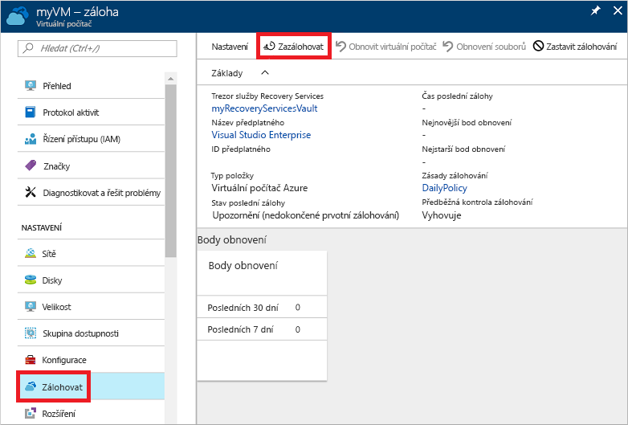
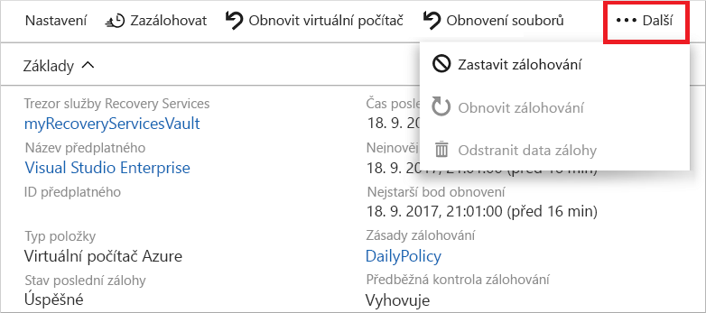

# Zálohování virtuálního počítače v Azure
Zálohy Azure je možné vytvářet na webu Azure Portal. Tato metoda poskytuje uživatelské rozhraní v prohlížeči, pomocí kterého můžete vytvářet a konfigurovat zálohy Azure a všechny související prostředky. Svá data můžete chránit prováděním záloh v pravidelných intervalech. Azure Backup vytváří body obnovení, které je možné uchovávat v geograficky redundantních trezorech obnovení. Tento článek podrobně popisuje, jak zálohovat virtuální počítač pomocí webu Azure Portal. 

V tomto rychlém startu se povolí zálohování na existujícím virtuálním počítači Azure. Pokud potřebujete vytvořit virtuální počítač, můžete [vytvořit virtuální počítač pomocí webu Azure Portal](../virtual-machines/windows/quick-create-portal.md).

## Přihlaste se k Azure.

Přihlaste se k webu Azure Portal na adrese http://portal.azure.com.

## Výběr virtuálního počítače k zálohování
Vytvořte jednoduché plánované denní zálohování do trezoru služby Recovery Services. 

1. V nabídce na levé straně vyberte **Virtuální počítače**. 
2. V seznamu zvolte virtuální počítač, který chcete zálohovat. Pokud jste použili ukázkové příkazy z rychlého úvodu k virtuálním počítačům, virtuální počítač má název *myVM* a je ve skupině prostředků *myResourceGroup*.
3. V části **Nastavení** zvolte **Zálohování**. Otevře se okno **Povolit zálohování**.

## Povolení zálohování na virtuálním počítači
Trezor služby Recovery Services je logický kontejner, který uchovává zálohovaná data pro každý chráněný prostředek, například virtuální počítače Azure. Úloha zálohování pro chráněný prostředek při spuštění vytvoří uvnitř trezoru služby Recovery Services bod obnovení. Pomocí některého z těchto bodů obnovení pak můžete obnovit data k danému bodu v čase.

1. Vyberte **Vytvořit nový** a zadejte název nového trezoru, například **myRecoveryServicesVault**.
2. Pokud ještě není vybraná, zvolte možnost **Použít existující** a pak z rozevírací nabídky vyberte skupinu prostředků vašeho virtuálního počítače.

    

    Ve výchozím nastavení je trezor nastavený pro geograficky redundantní úložiště. Tato úroveň redundance úložiště vaše data chrání ještě více tím, že zajišťuje replikaci zálohovaných dat do sekundární oblasti Azure, která je od primární oblasti vzdálená stovky kilometrů.

    K definování, kdy se spouští úloha zálohování a jak dlouho se uchovávají body obnovení, vytváříte a používáte zásady. Výchozí zásada ochrany spouští úlohu zálohování každý den a uchovává body obnovení po dobu 30 dnů. Tyto výchozí hodnoty zásady můžete použít k rychlému zajištění ochrany vašeho virtuálního počítače. 

3. Pokud chcete přijmout hodnoty výchozí zásady zálohování, vyberte **Povolit zálohování**.

## Spuštění úlohy zálohování
Zálohování můžete spustit ihned a nečekat na spuštění úlohy výchozí zásadou v naplánovaném čase. Tato první úloha zálohování vytvoří úplný bod obnovení. Každá úloha zálohování po tomto prvotním zálohování vytváří přírůstkové body obnovení. Přírůstkové body obnovení jsou efektivní z hlediska úložiště a času, protože přenášejí pouze změny provedené od posledního zálohování.

1. V okně **Zálohování** pro váš virtuální počítač vyberte **Zálohovat nyní**.

    

2. Pokud chcete přijmout zásadu uchovávání záloh po dobu 30 dnů, ponechte výchozí **Datum, do kterého má být záloha zachována**. Pokud chcete úlohu spustit, vyberte **Zálohovat**.

## Monitorování úlohy zálohování
V okně **Zálohování** pro váš virtuální počítač je zobrazený stav zálohování a počet dokončených bodů obnovení. Po dokončení úlohy zálohování virtuálního počítače se na pravé straně okna **Přehled** zobrazí informace uvádějící **Čas poslední zálohy**, **Poslední bod obnovení** a **Nejstarší bod obnovení**.

## Vyčištění nasazení
Pokud už ochrana virtuálního počítače není potřeba, můžete ji vypnout, odebrat body obnovení a trezor služby Recovery Services a pak odstranit skupinu prostředků a související prostředky virtuálního počítače.

Pokud se chystáte pokračovat ke kurzu služby Backup, který vysvětluje postup obnovení dat virtuálního počítače, přeskočte kroky v této části a přejděte na [Další kroky](#next-steps).

1. Vyberte možnost **Zálohování** pro váš virtuální počítač.

2. Výběrem **... Další** zobrazte další možnosti a pak zvolte **Zastavit zálohování**.

    

3. Z rozevírací nabídky vyberte **Odstranit zálohovaná data**.

4. V dialogovém okně **Zadejte název zálohované položky** zadejte název vašeho virtuálního počítače, například *myVM*. Vyberte **Zastavit zálohování**.

    Jakmile je zálohování virtuálního počítače zastaveno a body obnovení jsou odebrány, můžete odstranit skupinu prostředků. Pokud jste použili existující virtuální počítač, možná budete chtít zachovat skupinu prostředků a virtuální počítač.

5. V nabídce na levé straně vyberte **Skupiny prostředků**. 
6. V seznamu zvolte vaši skupinu prostředků. Pokud jste použili ukázkové příkazy z rychlého úvodu k virtuálním počítačům, skupina prostředků má název *myResourceGroup*.
7. Vyberte **Odstranit skupinu prostředků**. Pro potvrzení zadejte název skupiny prostředků a pak vyberte **Odstranit**.

    

## Další kroky
V tomto rychlém startu jste vytvořili trezor služby Recovery Services, povolili ochranu virtuálního počítače a vytvořili prvotní bod obnovení. Pokud se chcete o službách Azure Backup a Recovery Services dozvědět více, pokračujte ke kurzům.

> [!div class="nextstepaction"]
> [Zálohování několika virtuálních počítačů Azure](./tutorial-backup-vm-at-scale.md)

