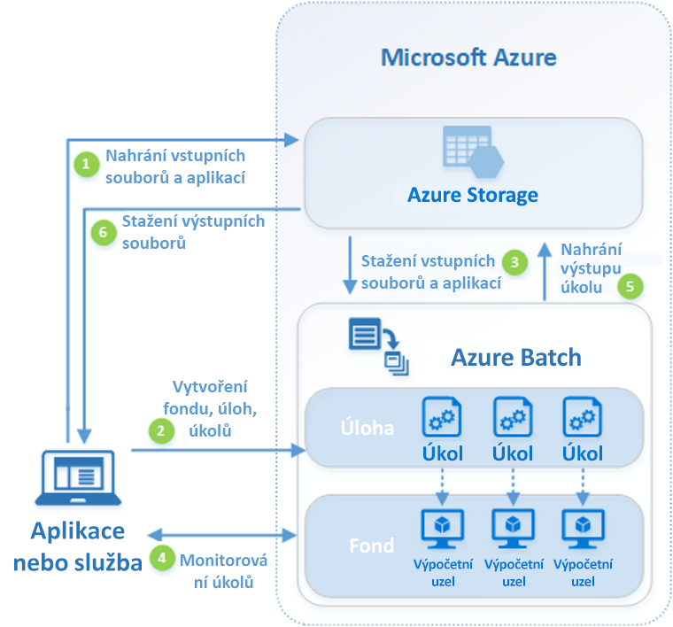

# Co je Azure Batch?

Azure Batch umožňuje efektivně spouštět v Azure rozsáhlé paralelní dávkové úlohy a úlohy vysokovýkonného výpočetního prostředí (HPC). Azure Batch vytvoří a spravuje fond výpočetních uzlů (virtuálních počítačů), nainstaluje aplikace, které chcete spouštět, a naplánuje spouštění úloh v uzlech. Nemusíte instalovat, spravovat ani škálovat žádný cluster ani software pro plánování úloh. Místo toho ke konfiguraci, správě a monitorování úloh použijete [rozhraní API a nástroje služby Batch](batch-apis-tools.md), skripty příkazového řádku nebo web Azure Portal. 

Vývojáři můžou službu Batch používat jako službu platformy k sestavování aplikací SaaS nebo klientských aplikací, které vyžadují provádění ve velkém měřítku. Můžete třeba v Batch sestavit službu, která bude pro společnost poskytující finanční služby spouštět simulaci rizik Monte Carlo, nebo službu pro zpracování velkého množství obrázků.

Za používání služby Batch se neúčtují žádné další poplatky. Platíte jenom za spotřebované základní prostředky, jako jsou virtuální počítače, úložiště a sítě.

Porovnání mezi službou Batch a dalšími možnostmi řešení prostředí HCP v Azure najdete v tématu [Řešení prostředí HPC, Batch a Big Compute](../virtual-machines/linux/high-performance-computing.md).

## Spouštění paralelních úloh
Služba Batch pracuje s vnitřně paralelními aplikacemi úlohami (také známé jako „jednoduše paralelně zpracovatelné“). Vnitřně paralelní úlohy jsou ty, u kterých můžou aplikace pracovat odděleně a každá instance odvede určitou část práce. Při provádění můžou aplikace získávat přístup k některým společným datům, ale nekomunikují s jinými instancemi aplikace. Vnitřně paralelní úlohy proto můžou běžet ve velkém měřítku, které závisí na množství výpočetních prostředků dostupných pro souběžné spouštění aplikací.

Některé příklady vnitřně paralelních úloh, které můžete použít ve službě Batch:

* Modelování finančních rizik pomocí simulací Monte Carlo
* Vykreslování vizuálních efektů a 3D obrázků
* Analýza a zpracování obrázků
* Překódování médií
* Genetická sekvenční analýza
* Optické rozpoznávání znaků (OCR)
* Příjem dat, zpracování a operace extrakce, transformace a načítání (ETL)
* Provádění testů softwaru

Pomocí služby Batch můžete také [spouštět vysoce provázané úlohy](batch-mpi.md). Jedná se o úlohy, ve kterých spouštěné aplikace neběží nezávisle na sobě, ale potřebují spolu komunikovat. Vysoce provázané aplikace běžně používají rozhraní API MPI (Message Passing Interface). Ve službě Batch můžete spouštět vysoce provázané úlohy s využitím rozhraní [Microsoft MPI](https://msdn.microsoft.com/library/bb524831(v=vs.85).aspx) nebo Intel MPI. Velikosti virtuálních počítačů specializované pro [vysokovýkonné výpočetní prostředí (HPC)](../virtual-machines/linux/sizes-hpc.md) a [GPU](../virtual-machines/linux/sizes-gpu.md) umožňují zvýšit výkon aplikací.

Některé příklady vysoce propojených úloh:
* Analýza konečných prvků
* Dynamika tekutin
* Trénování AI ve více uzlech

Řada vysoce propojených úloh může při použití služby Batch běžet paralelně. Můžete třeba provést několik simulací kapaliny proudící potrubím při různých šířkách potrubí.

## Další možnosti služby Batch

Služba Azure Batch nabízí také funkce vyšší úrovně pro specifické úlohy:
* Batch podporuje [úlohy vykreslování](batch-rendering-service.md) ve větším měřítku v nástrojích, jako jsou Autodesk Maya, 3ds Max, Arnold a V-Ray. 
* Uživatelé jazyka R si můžou nainstalovat [balíček doAzureParallel jazyka R](https://github.com/Azure/doAzureParallel), který umožňuje snadné horizontální navýšení kapacity provádění algoritmů jazyka R ve fondech Batch.

Úlohy služby Batch můžete také spouštět v rámci rozsáhlejšího pracovního postupu transformace dat v Azure spravovaného nástroji, jako je [Azure Data Factory](../data-factory/v1/data-factory-data-processing-using-batch.md).

## Jak to funguje
Běžný scénář využití služby Batch zahrnuje horizontální navýšení kapacity vnitřně paralelních úloh, jako je vykreslování obrázků ve 3D scénách, ve fondu výpočetních uzlů. Tento fond výpočetních uzlů může být vaší „vykreslovací farmou“, která bude zajišťovat desítky, stovky nebo i tisíce jader pro vaši úlohu vykreslování.

Následující diagram znázorňuje kroky v běžném pracovním postupu služby Batch s klientskou aplikací nebo hostovanou službou, která službu Batch používá ke spouštění paralelních úloh.

|Krok  |Popis  |
|---------|---------|
|1.  Nahrajte **vstupní soubory** a **aplikace**, které je budou zpracovávat, do účtu Azure Storage.     |Vstupní soubory mohou být jakákoli data, která vaše aplikace zpracuje, třeba data finančního modelování nebo videosoubory k převodu. Soubory aplikací můžou zahrnovat skripty nebo aplikace zpracovávající data, třeba převaděč médií.|
|2.  Vytvořte ve svém účtu Batch **fond** výpočetních uzlů služby Batch, **úlohu** pro spuštění ve fondu a **úkoly** v této úloze.     | Uzly fondu jsou virtuální počítače, které budou provádět vaše úkoly. Zadejte vlastnosti, jako je počet a velikost uzlů, image virtuálních počítačů s Windows nebo Linuxem a potom aplikaci, která se má nainstalovat, když se uzly připojí k fondu. Náklady na fond a jeho velikost můžete omezit použitím [virtuálních počítačů s nízkou prioritou](batch-low-pri-vms.md) nebo [automatického škálování](batch-automatic-scaling.md) počtu uzlů v závislosti na změnách zatížení.   Když do úlohy přidáte úkoly, služba Batch automaticky naplánuje úkoly k provedení ve výpočetních uzlech ve fondu. Každý úkol používá aplikaci, kterou jste nahráli, ke zpracování vstupních souborů. |
|3.  Stáhněte do služby Batch **vstupní soubory** a **aplikace**.     |Každý úkol může před spuštěním stáhnout vstupní data, která bude zpracovávat v přiřazeném výpočetním uzlu. Pokud ještě není aplikace v daných uzlech fondu nainstalovaná, může se stáhnout v této fázi. Po dokončení stahování ze služby Azure Storage se v přiřazeném uzlu spustí příslušný úkol.|
|4.  Monitorujte **provádění úkolů**.     |Když se úkoly spouštějí, můžete ve službě Batch zadat dotaz na monitorování postupu úloh a jejich úkolů. Vaše klientská aplikace nebo služba komunikuje se službou Batch přes HTTPS. Vzhledem k tomu, že můžete monitorovat tisíce úloh spuštěných v tisících výpočetních uzlů, ujistěte se, že [se služby Batch dotazujete efektivně](batch-efficient-list-queries.md).|
|5.  Nahrajte **výstup úkolu**.     |Úkoly mohou po dokončení nahrát data svých výsledků do služby Azure Storage. Soubory můžete také načíst přímo ze systému souborů na výpočetním uzlu.|
|6.  Stáhněte **výstupní soubory**.     |Když funkce monitorování zjistí, že jsou úkoly ve vaší úloze dokončené, klientská aplikace nebo služba může stáhnout výstupní data k dalšímu zpracování.|

Mějte na paměti, že toto je jenom jeden ze způsobů použití služby Batch a že tento scénář popisuje jen některé z jejích funkcí. Například můžete v každém výpočetním uzlu [paralelně provádět několik úkolů](batch-parallel-node-tasks.md). Nebo můžete pomocí [úkolů přípravy a dokončení úlohy](batch-job-prep-release.md) připravit uzly na úlohy a potom je zase vyčistit. 

Podrobnější informace o prostředcích služby fondech, uzlech a úlohách a mnoha funkcích rozhraní API, které můžete používat při sestavování aplikace služby Batch, najdete v článku [Přehled funkcí Batch pro vývojáře](batch-api-basics.md). 

## Další kroky

Začněte pracovat se službou Azure Batch pomocí jedné z těchto šablon Rychlý start:
* [Spuštění první úlohy služby Batch pomocí rozhraní příkazového řádku Azure](quick-create-cli.md)
* [Spuštění první úlohy služby Batch pomocí webu Azure Portal](quick-create-portal.md)
* [Spuštění první úlohy služby Batch pomocí rozhraní API .NET](quick-run-dotnet.md)
* [Spuštění první úlohy služby Batch pomocí rozhraní API Python](quick-run-python.md)

