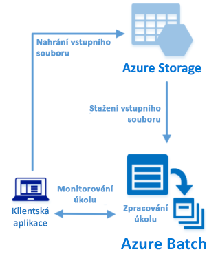

# <a name="quickstart-run-your-first-azure-batch-job-with-the-net-api"></a>Rychlý start: Spuštění první úlohy služby Azure Batch pomocí rozhraní API .NET

V rámci tohoto rychlého startu spustíte úlohu služby Azure Batch z aplikace C# sestavené pomocí rozhraní API .NET služby Azure Batch. Aplikace odešle několik vstupních datových souborů do služby Azure Storage a potom vytvoří *fond* výpočetních uzlů služby Batch (virtuálních počítačů). Potom vytvoří ukázkovou *úlohu*, která pomocí základního příkazu spouští *úkoly* pro zpracování jednotlivých vstupních souborů ve fondu. Po dokončení tohoto rychlého startu budete rozumět klíčovým konceptům služby Batch a budete moct službu Batch vyzkoušet ve větším měřítku s úlohami, které víc odpovídají realitě.



[!INCLUDE [quickstarts-free-trial-note.md](../../includes/quickstarts-free-trial-note.md)]

## <a name="prerequisites"></a>Požadavky

* [Visual Studio IDE](https://www.visualstudio.com/vs) (Visual Studio 2015 nebo novější verze). 

* Účet služby Batch a účet propojeného úložiště pro obecné účely. Informace o vytvoření těchto účtů prostřednictvím [webu Azure Portal](quick-create-portal.md) nebo [rozhraní Azure CLI](quick-create-cli.md) najdete v rychlém startu služby Batch. 

## <a name="sign-in-to-azure"></a>Přihlášení k Azure

Přihlaste se k webu Azure Portal na adrese [https://portal.azure.com](https://portal.azure.com).

[!INCLUDE [batch-common-credentials](../../includes/batch-common-credentials.md)]

## <a name="download-the-sample"></a>Stažení ukázky

[Stáhněte nebo naklonujte ukázkovou aplikaci](https://github.com/Azure-Samples/batch-dotnet-quickstart) z GitHubu. K naklonování úložiště ukázkové aplikace pomocí klienta Git použijte následující příkaz:

```
git clone https://github.com/Azure-Samples/batch-dotnet-quickstart.git
```

Přejděte do adresáře, který obsahuje soubor řešení sady Visual Studio `BatchDotNetQuickstart.sln`.

Otevřete soubor řešení v sadě Visual Studio a aktualizujte řetězce přihlašovacích údajů v souboru `program.cs` pomocí hodnot, které jste získali pro své účty. Příklad:

```csharp
// Batch account credentials
private const string BatchAccountName = "mybatchaccount";
private const string BatchAccountKey  = "xxxxxxxxxxxxxxxxE+yXrRvJAqT9BlXwwo1CwF+SwAYOxxxxxxxxxxxxxxxx43pXi/gdiATkvbpLRl3x14pcEQ==";
private const string BatchAccountUrl  = "https://mybatchaccount.mybatchregion.batch.azure.com";

// Storage account credentials
private const string StorageAccountName = "mystorageaccount";
private const string StorageAccountKey  = "xxxxxxxxxxxxxxxxy4/xxxxxxxxxxxxxxxxfwpbIC5aAWA8wDu+AFXZB827Mt9lybZB1nUcQbQiUrkPtilK5BQ==";
```

## <a name="build-and-run-the-app"></a>Sestavení a spuštění aplikace

Pokud chcete sledovat pracovní postup služby Batch v akci, sestavte a spusťte aplikaci. Po spuštění aplikace se podívejte do kódu a najděte si, co jednotlivé části aplikace dělají. 

* Klikněte na řešení pravým tlačítkem myši v Průzkumníku řešení a klikněte na **Sestavit řešení**. 

* Pokud se zobrazí výzva, potvrďte obnovení všech balíčků NuGet. Pokud potřebujete stáhnout chybějící balíčky, ujistěte se, že máte nainstalovaného [Správce balíčků NuGet](https://docs.nuget.org/consume/installing-nuget).

Potom aplikaci spusťte. Po spuštění ukázkové aplikace vypadá výstup konzoly zhruba následovně. Během provádění dojde k pozastavení na řádku `Monitoring all tasks for 'Completed' state, timeout in 00:30:00...` a mezitím se spustí výpočetní uzly fondu. Jakmile se spustí první výpočetní uzel, úkoly se zařadí do fronty ke spuštění. Fond, výpočetní uzly, úlohy a úkoly můžete sledovat ve svém účtu služby Batch na [webu Azure Portal](https://portal.azure.com).

```
Sample start: 12/4/2017 4:02:54 PM

Container [input] created.
Uploading file taskdata0.txt to container [input]...
Uploading file taskdata1.txt to container [input]...
Uploading file taskdata2.txt to container [input]...
Creating pool [DotNetQuickstartPool]...
Creating job [DotNetQuickstartJob]...
Adding 3 tasks to job [DotNetQuickstartJob]...
Monitoring all tasks for 'Completed' state, timeout in 00:30:00...
```

Po dokončení úkolů se pro každý úkol zobrazí výstup podobný tomu následujícímu:

```
Printing task output.
Task: Task0
Node: tvm-2850684224_3-20171205t000401z
Standard out:
Batch processing began with mainframe computers and punch cards. Today it still plays a central role in business, engineering, science, and other pursuits that require running lots of automated tasks....
stderr:
...
```

Typická doba provádění je přibližně 5 minut, když aplikaci spouštíte ve výchozí konfiguraci. Nejdelší dobu trvá počáteční vytvoření fondu. Pokud chcete úlohu znovu spustit, odstraňte úlohu z předchozího spuštění, ale neodstraňujte fond. Ve fondu, který je už nakonfigurovaný, se úloha dokončí za pár sekund.


## <a name="review-the-code"></a>Kontrola kódu

Aplikace .NET v tomto rychlém startu provádí tyto kroky:

* Odešle tři malé textové soubory do kontejneru objektů blob ve vašem účtu služby Azure Storage. Tyto soubory představují vstup pro zpracování službou Batch.
* Vytvoří fond výpočetních uzlů se systémem Windows Server.
* Vytvoří úlohu a tři úkoly ke spuštění v uzlech. Každý úkol zpracovává pomocí příkazového řádku Windows jeden vstupní soubor. 
* Zobrazí soubory vrácené úkoly.

Podrobnosti najdete v souboru `Program.cs` a v následujících částech. 

### <a name="preliminaries"></a>Nezbytné úkony

Za účelem práce s účtem úložiště aplikace použije klientskou knihovnu služby Azure Storage pro .NET. Vytvoří odkaz na účet pomocí třídy [CloudStorageAccount](/dotnet/api/microsoft.windowsazure.storage.cloudstorageaccount) a z té vytvoří třídu [CloudBlobClient](/dotnet/api/microsoft.windowsazure.storage.blob.cloudblobclient).

```csharp
CloudBlobClient blobClient = storageAccount.CreateCloudBlobClient();
```

Odkaz `blobClient` slouží aplikaci k vytvoření kontejneru v účtu úložiště a k nahrání datových souborů do tohoto kontejneru. Soubory v úložišti jsou definované jako objekty [ResourceFile](/dotnet/api/microsoft.azure.batch.resourcefile) služby Batch, které může služba Batch později stáhnout do výpočetních uzlů.

```csharp
List<string> inputFilePaths = new List<string>
{
    @"..\..\taskdata0.txt",
    @"..\..\taskdata1.txt",
    @"..\..\taskdata2.txt"
};

List<ResourceFile> inputFiles = new List<ResourceFile>();

foreach (string filePath in inputFilePaths)
{
    inputFiles.Add(UploadFileToContainer(blobClient, inputContainerName, filePath));
}
```

K vytváření a správě fondů, úloh a úkolů ve službě Batch aplikace vytvoří objekt [BatchClient](/dotnet/api/microsoft.azure.batch.batchclient). Klient služby Batch v ukázce používá ověření pomocí sdíleného klíče. (Batch podporuje také ověřování pomocí Azure Active Directory.)

```csharp
BatchSharedKeyCredentials cred = new BatchSharedKeyCredentials(BatchAccountUrl, BatchAccountName, BatchAccountKey);

using (BatchClient batchClient = BatchClient.Open(cred))
...    
```

### <a name="create-a-pool-of-compute-nodes"></a>Vytvoření fondu výpočetních uzlů

K vytvoření fondu služby Batch aplikace používá metodu [BatchClient.PoolOperations.CreatePool](/dotnet/api/microsoft.azure.batch.pooloperations.createpool), která nastavuje počet uzlů, velikost virtuálních počítačů a konfiguraci fondu. Tady objekt [VirtualMachineConfiguration](/dotnet/api/microsoft.azure.batch.virtualmachineconfiguration) určuje odkaz [ImageReference](/dotnet/api/microsoft.azure.batch.imagereference) na image Windows Serveru publikovanou v Azure Marketplace. Batch podporuje široké spektrum imagí Linuxu a Windows Serveru v Azure Marketplace, ale i vlastní image virtuálních počítačů.

Počet uzlů (`PoolNodeCount`) a velikost virtuálního počítače (`PoolVMSize`) jsou definované konstanty. Ukázka ve výchozím nastavení vytvoří fond se 2 uzly velikosti *Standard_A1_v2*. Navržená velikost nabízí pro tento rychlý příklad dobrou rovnováhu mezi výkonem a náklady. 

Metoda [Commit](/dotnet/api/microsoft.azure.batch.cloudpool.commit) odešle fond do služby Batch.

```csharp
ImageReference imageReference = new ImageReference(
    publisher: "MicrosoftWindowsServer",
    offer: "WindowsServer",
    sku: "2012-R2-Datacenter-smalldisk",
    version: "latest");

VirtualMachineConfiguration virtualMachineConfiguration =
new VirtualMachineConfiguration(
   imageReference: imageReference,
   nodeAgentSkuId: "batch.node.windows amd64");

try
{
    CloudPool pool = batchClient.PoolOperations.CreatePool(
    poolId: PoolId,
    targetDedicatedComputeNodes: PoolNodeCount,
    virtualMachineSize: PoolVMSize,
    virtualMachineConfiguration: virtualMachineConfiguration);

    pool.Commit();
}
...

```
### <a name="create-a-batch-job"></a>Vytvoření úlohy Batch

Úloha služby Batch je logická skupina jednoho nebo víc úkolů. Úloha zahrnuje nastavení společná všem úkolům, jako je priorita a fond, ve kterém se mají úkoly spouštět. Aplikace vytvoří úlohu ve vašem fondu pomocí metody [BatchClient.JobOperations.CreateJob](/dotnet/api/microsoft.azure.batch.joboperations.createjob). 

Metoda [Commit](/dotnet/api/microsoft.azure.batch.cloudjob.commit) odešle úlohu do služby Batch. Na začátku úloha neobsahuje žádné úkoly.

```csharp
try
{
    CloudJob job = batchClient.JobOperations.CreateJob();
    job.Id = JobId;
    job.PoolInformation = new PoolInformation { PoolId = PoolId };

    job.Commit(); 
}
...       
```

### <a name="create-tasks"></a>Vytvoření úkolů
Aplikace vytvoří seznam objektů [CloudTask](/dotnet/api/microsoft.azure.batch.cloudtask). Každý úkol zpracovává vstupní objekt `ResourceFile` pomocí vlastnosti [CommandLine](/dotnet/api/microsoft.azure.batch.cloudtask.commandline). Příkazový řádek v ukázce spustí příkaz Windows `type`, který zobrazí vstupní soubor. Tento příkaz představuje jednoduchý příklad pro demonstrační účely. Při použití služby Batch se aplikace nebo skript zadávají právě na příkazovém řádku. Služba Batch poskytuje několik způsobů, jak nasazovat aplikace a skripty do výpočetních uzlů.

Potom aplikace přidá úkoly do úlohy pomocí metody [AddTask](/dotnet/api/microsoft.azure.batch.joboperations.addtask) a ta je zařadí do fronty ke spuštění ve výpočetních uzlech. 

```csharp
for (int i = 0; i < inputFiles.Count; i++)
{
    string taskId = String.Format("Task{0}", i);
    string inputFilename = inputFiles[i].FilePath;
    string taskCommandLine = String.Format("cmd /c type {0}", inputFilename);

    CloudTask task = new CloudTask(taskId, taskCommandLine);
    task.ResourceFiles = new List<ResourceFile> { inputFiles[i] };
    tasks.Add(task);
}

batchClient.JobOperations.AddTask(JobId, tasks);
```
 
### <a name="view-task-output"></a>Zobrazení výstupu úkolu

Aplikace vytvoří položku [TaskStateMonitor](/dotnet/api/microsoft.azure.batch.taskstatemonitor), která monitoruje úkoly a jejich dokončení. Potom aplikace s využitím vlastnosti [CloudTask.ComputeNodeInformation](/dotnet/api/microsoft.azure.batch.cloudtask.computenodeinformation) zobrazí soubor `stdout.txt` vygenerovaný jednotlivými dokončenými úkoly. V případě úspěšného spuštění úkolu se výstup příkazu úkolu zapíše do souboru `stdout.txt`:

```csharp
foreach (CloudTask task in completedtasks)
{
    string nodeId = String.Format(task.ComputeNodeInformation.ComputeNodeId);
    Console.WriteLine("Task: {0}", task.Id);
    Console.WriteLine("Node: {0}", nodeId);
    Console.WriteLine("Standard out:");
    Console.WriteLine(task.GetNodeFile(Constants.StandardOutFileName).ReadAsString());
}
```

## <a name="clean-up-resources"></a>Vyčištění prostředků

Aplikace automaticky odstraní kontejner úložiště, který vytvoří, a dá vám možnost odstranit fond a úlohu služby Batch. Za fond, ve kterém jsou spuštěné uzly, se účtují poplatky, i když nejsou naplánované žádné úlohy. Až fond nebudete potřebovat, odstraňte ho. Při odstranění fondu se odstraní veškeré výstupy úkolů v uzlech.

Pokud už je nepotřebujete, odstraňte skupinu prostředků, účet Batch a účet úložiště. Na webu Azure Portal to provedete tak, že vyberete skupinu prostředků účtu Batch a kliknete na **Odstranit skupinu prostředků**.

## <a name="next-steps"></a>Další kroky

V tomto rychlém startu jste spustili malou aplikaci sestavenou pomocí rozhraní API .NET služby Batch a ta vytvořila fond a úlohu služby Batch. Úloha spustila ukázkové úkoly a stáhla výstup vytvořený v uzlech. Teď chápete klíčové koncepty služby Batch a můžete službu Batch vyzkoušet ve větším měřítku s úlohami, které víc odpovídají realitě. Další informace o službě Azure Batch a vysvětlení paralelních úloh v reálné aplikaci najdete v kurzu o rozhraní .NET služby Batch.


> [!div class="nextstepaction"]
> [Zpracování paralelních úloh pomocí rozhraní .NET](tutorial-parallel-dotnet.md)
