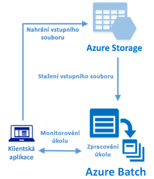

# <a name="quickstart-run-your-first-batch-job-with-the-python-api"></a>Rychlý start: Spuštění první úlohy služby Batch pomocí rozhraní Python API

V rámci tohoto rychlého startu spustíte úlohu služby Azure Batch z aplikace sestavené pomocí rozhraní Python API služby Azure Batch. Aplikace odešle několik vstupních datových souborů do služby Azure Storage a potom vytvoří *fond* výpočetních uzlů služby Batch (virtuálních počítačů). Potom vytvoří ukázkovou *úlohu*, která pomocí základního příkazu spouští *úkoly* pro zpracování jednotlivých vstupních souborů ve fondu. Po dokončení tohoto rychlého startu budete rozumět klíčovým konceptům služby Batch a budete moct službu Batch vyzkoušet ve větším měřítku s úlohami, které víc odpovídají realitě.
 


[!INCLUDE [quickstarts-free-trial-note.md](../../includes/quickstarts-free-trial-note.md)]

## <a name="prerequisites"></a>Požadavky

* [Python verze 2.7 nebo 3.3 nebo novější](https://www.python.org/downloads/)

* Správce balíčků [pip](https://pip.pypa.io/en/stable/installing/)

* Účet služby Azure Batch a propojený účet služby Azure Storage pro obecné účely. Informace o vytvoření těchto účtů prostřednictvím [webu Azure Portal](quick-create-portal.md) nebo [rozhraní Azure CLI](quick-create-cli.md) najdete v rychlém startu služby Batch. 

## <a name="sign-in-to-azure"></a>Přihlášení k Azure

Přihlaste se k webu Azure Portal na adrese [https://portal.azure.com](https://portal.azure.com).

[!INCLUDE [batch-common-credentials](../../includes/batch-common-credentials.md)]

## <a name="download-the-sample"></a>Stažení ukázky

[Stáhněte nebo naklonujte ukázkovou aplikaci](https://github.com/Azure-Samples/batch-python-quickstart) z GitHubu. K naklonování úložiště ukázkové aplikace pomocí klienta Git použijte následující příkaz:

```
git clone https://github.com/Azure-Samples/batch-python-quickstart.git
```

Přejděte do adresáře, který obsahuje skript Pythonu `python_quickstart_client.py`.

Ve vývojovém prostředí Pythonu nainstalujte vyžadované balíčky pomocí `pip`.

```bash
pip install -r requirements.txt
```

Otevřete soubor `python_quickstart_client.py`. Aktualizujte řetězce přihlašovacích údajů účtu Batch a účtu úložiště s hodnotami získanými pro účty. Příklad:


```Python
_BATCH_ACCOUNT_NAME = 'mybatchaccount'
_BATCH_ACCOUNT_KEY = 'xxxxxxxxxxxxxxxxE+yXrRvJAqT9BlXwwo1CwF+SwAYOxxxxxxxxxxxxxxxx43pXi/gdiATkvbpLRl3x14pcEQ=='
_BATCH_ACCOUNT_URL = 'https://mybatchaccount.mybatchregion.batch.azure.com'
_STORAGE_ACCOUNT_NAME = 'mystorageaccount'
_STORAGE_ACCOUNT_KEY = 'xxxxxxxxxxxxxxxxy4/xxxxxxxxxxxxxxxxfwpbIC5aAWA8wDu+AFXZB827Mt9lybZB1nUcQbQiUrkPtilK5BQ=='
```

## <a name="run-the-app"></a>Spuštění aplikace

Pokud chcete vidět pracovní postup Batch v akci, spusťte skript:

```
python python_quickstart_client.py
```

Po spuštění skriptu se podívejte do kódu a najděte si, co jednotlivé části aplikace dělají. 

Po spuštění ukázkové aplikace vypadá výstup konzoly zhruba následovně. Během provádění dojde k pozastavení na řádku `Monitoring all tasks for 'Completed' state, timeout in 00:30:00...` a mezitím se spustí výpočetní uzly fondu. Jakmile se spustí první výpočetní uzel, úkoly se zařadí do fronty ke spuštění. Fond, výpočetní uzly, úlohy a úkoly můžete sledovat ve svém účtu Batch na webu [Azure Portal](https://portal.azure.com).

```
Sample start: 12/4/2017 4:02:54 PM

Container [input] created.
Uploading file taskdata0.txt to container [input]...
Uploading file taskdata1.txt to container [input]...
Uploading file taskdata2.txt to container [input]...
Creating pool [PythonQuickstartPool]...
Creating job [PythonQuickstartJob]...
Adding 3 tasks to job [PythonQuickstartJob]...
Monitoring all tasks for 'Completed' state, timeout in 00:30:00...
```

Po dokončení úkolů se pro každý úkol zobrazí výstup podobný tomu následujícímu:

```
Printing task output...
Task: Task0
Node: tvm-2850684224_3-20171205t000401z
Standard out:
Batch processing began with mainframe computers and punch cards. Today it still plays a central role in business, engineering, science, and other pursuits that require running lots of automated tasks....
...
```

Když aplikaci spouštíte v její výchozí konfiguraci, je obvyklá doba provádění přibližně 3 minuty. Nejdelší dobu trvá počáteční vytvoření fondu.

## <a name="review-the-code"></a>Kontrola kódu

Aplikace Python v tomto rychlém startu provádí tyto kroky:

* Odešle tři malé textové soubory do kontejneru objektů blob ve vašem účtu služby Azure Storage. Tyto soubory představují vstup pro zpracování úlohami služby Batch.
* Vytvoří fond dvou výpočetních uzlů se systémem Ubuntu 16.04 LTS.
* Vytvoří úlohu a tři úkoly ke spuštění v uzlech. Každý úkol zpracovává pomocí příkazového řádku prostředí Bash jeden vstupní soubor.
* Zobrazí soubory vrácené úkoly.

Podrobnosti najdete v souboru `python_quickstart_client.py` a v následujících částech. 

### <a name="preliminaries"></a>Nezbytné úkony

K práci s účtem úložiště aplikace používá balíček [azure-storage-blob](https://pypi.python.org/pypi/azure-storage-blob) k vytvoření objektu [BlockBlobService](/python/api/azure.storage.blob.blockblobservice.blockblobservice).

```python
blob_client = azureblob.BlockBlobService(
    account_name=_STORAGE_ACCOUNT_NAME,
    account_key=_STORAGE_ACCOUNT_KEY)
```

Odkaz `blob_client` slouží aplikaci k vytvoření kontejneru v účtu úložiště a k nahrání datových souborů do tohoto kontejneru. Soubory v úložišti jsou definované jako objekty [ResourceFile](/python/api/azure.batch.models.resourcefile) služby Batch, které může služba Batch později stáhnout do výpočetních uzlů.

```python
input_file_paths = [os.path.realpath('./data/taskdata0.txt'),
                    os.path.realpath('./data/taskdata1.txt'),
                    os.path.realpath('./data/taskdata2.txt')]
input_files = [
    upload_file_to_container(blob_client, input_container_name, file_path)
    for file_path in input_file_paths]
```

K vytváření a správě fondů, úloh a úkolů ve službě Batch aplikace vytvoří objekt [BatchServiceClient](/python/api/azure.batch.batchserviceclient). Klient služby Batch v ukázce používá ověření pomocí sdíleného klíče. Batch podporuje také ověřování pomocí Azure Active Directory.

```python
credentials = batchauth.SharedKeyCredentials(_BATCH_ACCOUNT_NAME,
    BATCH_ACCOUNT_KEY)

batch_client = batch.BatchServiceClient(
    credentials,
    base_url=_BATCH_ACCOUNT_URL)
```


### <a name="create-a-pool-of-compute-nodes"></a>Vytvoření fondu výpočetních uzlů

K vytvoření fondu služby Batch aplikace používá třídu [PoolAddParameter](/python/api/azure.batch.models.pooladdparameter), která nastavuje počet uzlů, velikost virtuálních počítačů a konfiguraci fondu. Tady objekt [VirtualMachineConfiguration](/python/api/azure.batch.models.virtualmachineconfiguration) určuje odkaz [ImageReference](/python/api/azure.batch.models.imagereference) na image Ubuntu Server 16.04 LTS publikovanou v Azure Marketplace. Batch podporuje široké spektrum imagí Linuxu a Windows Serveru v Azure Marketplace, ale i vlastní image virtuálních počítačů.

Počet uzlů (`_POOL_NODE_COUNT`) a velikost virtuálního počítače (`_POOL_VM_SIZE`) jsou definované konstanty. Ukázka ve výchozím nastavení vytvoří fond se 2 uzly velikosti *Standard_A1_v2*. Navržená velikost nabízí pro tento rychlý příklad dobrou rovnováhu mezi výkonem a náklady.

Metoda [pool.add](/python/api/azure.batch.operations.pooloperations#azure_batch_operations_PoolOperations_add) odešle fond do služby Batch.

```python
new_pool = batch.models.PoolAddParameter(
    id=pool_id,
    virtual_machine_configuration=batchmodels.VirtualMachineConfiguration(
        image_reference=batchmodels.ImageReference(
            publisher="Canonical",
            offer="UbuntuServer",
            sku="16.04.0-LTS",
            version="latest"
            ),
        node_agent_sku_id="batch.node.ubuntu 16.04"),
    vm_size=_POOL_VM_SIZE,
    target_dedicated_nodes=_POOL_NODE_COUNT
)
batch_service_client.pool.add(new_pool)
```

### <a name="create-a-batch-job"></a>Vytvoření úlohy Batch

Úloha služby Batch je logická skupina jednoho nebo víc úkolů. Úloha zahrnuje nastavení společná všem úkolům, jako je priorita a fond, ve kterém se mají úkoly spouštět. Aplikace používá třídu [JobAddParameter](/python/api/azure.batch.models.jobaddparameter) k vytvoření úlohy ve vašem fondu. Metoda [job.add](/python/api/azure.batch.operations.joboperations#azure_batch_operations_JobOperations_add) odešle fond do služby Batch. Na začátku úloha neobsahuje žádné úkoly.

```python
job = batch.models.JobAddParameter(
    job_id,
    batch.models.PoolInformation(pool_id=pool_id))
batch_service_client.job.add(job)
```

### <a name="create-tasks"></a>Vytvoření úkolů

Aplikace vytvoří seznam objektů úlohy pomocí třídy [TaskAddParameter](/python/api/azure.batch.models.taskaddparameter). Každý úkol zpracovává vstupní objekt `resource_files` pomocí parametru `command_line`. Příkazový řádek v ukázce spustí příkaz prostředí Bash `cat`, který zobrazí textový soubor. Tento příkaz představuje jednoduchý příklad pro demonstrační účely. Při použití služby Batch se aplikace nebo skript zadávají právě na příkazovém řádku. Služba Batch poskytuje několik způsobů, jak nasazovat aplikace a skripty do výpočetních uzlů.

Potom aplikace přidá úkoly do úlohy pomocí metody [task.add_collection](/python/api/azure.batch.operations.taskoperations#azure_batch_operations_TaskOperations_add_collection) a ta je zařadí do fronty ke spuštění ve výpočetních uzlech. 

```python
tasks = list()

for idx, input_file in enumerate(input_files): 
    command = "/bin/bash -c \"cat {}\"".format(input_file.file_path)
    tasks.append(batch.models.TaskAddParameter(
        id='Task{}'.format(idx),
        command_line=command,
        resource_files=[input_file]
    )
)
batch_service_client.task.add_collection(job_id, tasks)
```

### <a name="view-task-output"></a>Zobrazení výstupu úkolu

Aplikace monitoruje stav úlohy, aby se zajistilo dokončení úloh. Potom aplikace zobrazí soubor `stdout.txt` vygenerovaný jednotlivými dokončenými úlohami. V případě úspěšného spuštění úkolu se výstup příkazu úkolu zapíše do souboru `stdout.txt`:

```python
tasks = batch_service_client.task.list(job_id)

for task in tasks:
    
    node_id = batch_service_client.task.get(job_id, task.id).node_info.node_id
    print("Task: {}".format(task.id))
    print("Node: {}".format(node_id))

    stream = batch_service_client.file.get_from_task(job_id, task.id, _STANDARD_OUT_FILE_NAME)

    file_text = _read_stream_as_string(
        stream,
        encoding)
    print("Standard output:")
    print(file_text)
```

## <a name="clean-up-resources"></a>Vyčištění prostředků

Aplikace automaticky odstraní kontejner úložiště, který vytvoří, a dá vám možnost odstranit fond a úlohu služby Batch. Za fond, ve kterém jsou spuštěné uzly, se účtují poplatky, i když nejsou naplánované žádné úlohy. Až fond nebudete potřebovat, odstraňte ho. Při odstranění fondu se odstraní veškeré výstupy úkolů v uzlech. 

Pokud už je nepotřebujete, odstraňte skupinu prostředků, účet Batch a účet úložiště. Na webu Azure Portal to provedete tak, že vyberete skupinu prostředků účtu Batch a kliknete na **Odstranit skupinu prostředků**.

## <a name="next-steps"></a>Další kroky

V tomto rychlém startu jste spustili malou aplikaci sestavenou pomocí rozhraní Python API služby Batch a ta vytvořila fond a úlohu služby Batch. Úloha spustila ukázkové úkoly a stáhla výstup vytvořený v uzlech. Teď chápete klíčové koncepty služby Batch a můžete službu Batch vyzkoušet ve větším měřítku s úlohami, které víc odpovídají realitě. Další informace o službě Azure Batch a vysvětlení paralelních úloh v reálné aplikaci najdete v kurzu o Pythonu služby Batch.

> [!div class="nextstepaction"]
> [Zpracování paralelních úloh pomocí Pythonu](tutorial-parallel-python.md)
