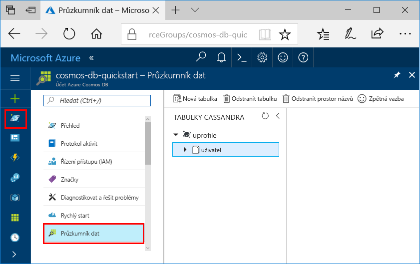

# <a name="quickstart-build-a-cassandra-app-with-net-and-azure-cosmos-db"></a>Rychlý úvod: Vytváření Cassandra aplikace pomocí rozhraní .NET a Azure Cosmos DB

Tento rychlý start ukazuje způsob použití rozhraní .NET a Azure Cosmos DB [Cassandra API](cassandra-introduction.md) k vytvoření profilu aplikace klonováním příklad z Githubu. Tento rychlý start také vás provede procesem vytvoření účtu Azure Cosmos DB pomocí portálu Azure založených na webu.   

Azure Cosmos DB je globálně distribuované databáze více modelu služby společnosti Microsoft. Můžete rychle vytvořit a dotazovat dokumentu, tabulka, klíč hodnota a graf databází, které těžit z globální distribuci a možnosti vodorovné škálování základem Azure Cosmos DB. 

## <a name="prerequisites"></a>Požadavky

[!INCLUDE [quickstarts-free-trial-note](../../includes/quickstarts-free-trial-note.md)]Alternativně můžete [zkuste Azure Cosmos DB zdarma](https://azure.microsoft.com/try/cosmosdb/) bez předplatného Azure, bez poplatků a závazky.

Přístup k rozhraní API služby Azure Cosmos DB Cassandra programu preview. Pokud jste ještě nenainstalovali pro přístup k ještě [nyní](cassandra-introduction.md#sign-up-now).

Navíc platí: 
* Pokud ještě nemáte nainstalované Visual Studio 2017, můžete stáhnout a použít **volné** [Visual Studio 2017 Community Edition](https://www.visualstudio.com/downloads/). Nezapomeňte při instalaci sady Visual Studio povolit možnost **Azure Development**.
* Nainstalujte [Git](https://www.git-scm.com/) klonovat v příkladu.

<a id="create-account"></a>
## <a name="create-a-database-account"></a>Vytvoření účtu databáze

[!INCLUDE [cosmos-db-create-dbaccount-cassandra](../../includes/cosmos-db-create-dbaccount-cassandra.md)]


## <a name="clone-the-sample-application"></a>Klonování ukázkové aplikace

Teď přejděme k práci s kódem. Pojďme klonovat aplikace Cassandra API z Githubu, nastavení připojovacího řetězce a potom ho spusťte. Přesvědčíte se, jak snadno se pracuje s daty prostřednictvím kódu programu. 

1. Otevřete okno terminálu git, jako je například git bash a použít `cd` příkaz Přejít do složky pro instalaci ukázkové aplikace. 

    ```bash
    cd "C:\git-samples"
    ```

2. Ukázkové úložiště naklonujete spuštěním následujícího příkazu. Tento příkaz vytvoří kopii ukázková aplikace ve vašem počítači.

    ```bash
    git clone https://github.com/Azure-Samples/azure-cosmos-db-cassandra-dotnet-getting-started.git
    ```

3. Poté otevřete soubor řešení CassandraQuickStartSample v sadě Visual Studio. 

## <a name="review-the-code"></a>Kontrola kódu

Tento krok je volitelný. Pokud vás zajímá učení vytváření databázových prostředků v kódu, můžete zkontrolovat následující fragmenty kódu. Fragmenty kódu jsou převzaty z `Program.cs` nainstalován ve složce C:\git-samples\azure-cosmos-db-cassandra-dotnet-getting-started\CassandraQuickStartSample souboru. Jinak, můžete přeskočit na [aktualizovat připojovací řetězec](#update-your-connection-string).

* Připojte se k koncový bod clusteru Cassandra inicializujte relace. Rozhraní API Cassandra v Azure Cosmos DB podporuje pouze TLSv1.2. 

  ```csharp
   var options = new Cassandra.SSLOptions(SslProtocols.Tls12, true, ValidateServerCertificate);
   options.SetHostNameResolver((ipAddress) => CassandraContactPoint);
   Cluster cluster = Cluster.Builder().WithCredentials(UserName, Password).WithPort(CassandraPort).AddContactPoint(CassandraContactPoint).WithSSL(options).Build();
   ISession session = cluster.Connect();
   ```

* Vytvořte nový keyspace.

    ```csharp
    session.Execute("CREATE KEYSPACE uprofile WITH REPLICATION = { 'class' : 'NetworkTopologyStrategy', 'datacenter1' : 1 };"); 
    ```

* Vytvořte novou tabulku.

   ```csharp
  session.Execute("CREATE TABLE IF NOT EXISTS uprofile.user (user_id int PRIMARY KEY, user_name text, user_bcity text)");
   ```

* Vložte entity uživatele pomocí objektu IMapper s novou relací, která se připojuje k uprofile keyspace.

    ```csharp
    mapper.Insert<User>(new User(1, "LyubovK", "Dubai"));
    ```
    
* Dotaz pro získání všechny uživatelské informace.

    ```csharp
   foreach (User user in mapper.Fetch<User>("Select * from user"))
   {
      Console.WriteLine(user);
   }
    ```
    
 * Dotaz se získat informace o jenom jednoho konkrétního uživatele.

    ```csharp
    mapper.FirstOrDefault<User>("Select * from user where user_id = ?", 3);
    ```

## <a name="update-your-connection-string"></a>Aktualizace připojovacího řetězce

Teď se vraťte zpátky na portál Azure Portal, kde najdete informace o připojovacím řetězci, a zkopírujte je do aplikace. Informace o připojovacím řetězci umožňuje aplikaci ke komunikaci s vaší hostované databází.

1. V [portál Azure](http://portal.azure.com/), klikněte na tlačítko **připojovací řetězec**. 

    Použití  tlačítko na pravé straně obrazovky zkopírujte hodnotu uživatelského jména.

    

2. V aplikaci Visual Studio 2017 otevřete soubor Program.cs. 

3. Vložit hodnotu uživatelského jména z portálu přes `<FILLME>` na řádku 13.

    Řádek 13 Program.cs by teď měl vypadat podobně jako 

    `private const string UserName = "cosmos-db-quickstart";`

3. Přejděte zpět na portál a zkopírujte hodnotu heslo. Vložte hodnotu HESLA z portálu přes `<FILLME>` na řádku 14.

    Řádek 14 Program.cs by teď měl vypadat podobně jako 

    `private const string Password = "2Ggkr662ifxz2Mg...==";`

4. Přejděte zpět na portál a zkopírujte hodnotu obraťte se na bodu. Vložit hodnotu bodu obraťte se na portálu přes `<FILLME>` na řádku 15.

    Řádek 15 Program.cs by teď měl vypadat podobně jako 

    `private const string CassandraContactPoint = "cosmos-db-quickstarts.documents.azure.com"; //  DnsName`

5. Uložte soubor Program.cs.
    
## <a name="run-the-app"></a>Spuštění aplikace

1. V sadě Visual Studio, klikněte na tlačítko **nástroje** > **Správce balíčků NuGet** > **Konzola správce balíčků**.

2. Na příkazovém řádku použijte následující příkaz se nainstalovat balíček NuGet ovladačů rozhraní .NET. 

    ```cmd
    Install-Package CassandraCSharpDriver
    ```
3. Spusťte aplikaci stisknutím CTRL+F5. Aplikace se zobrazí v okně konzoly. 

    

    Stisknutím kombinace kláves CTRL + C zastavení exection programu a zavřete okno konzoly. 
    
    Nyní lze otevřít Průzkumníku dat na portálu Azure najdete v části dotazu, úpravu a pracovat s Tato nová data. 

    

## <a name="review-slas-in-the-azure-portal"></a>Ověření smluv SLA na webu Azure Portal

[!INCLUDE [cosmosdb-tutorial-review-slas](../../includes/cosmos-db-tutorial-review-slas.md)]

## <a name="clean-up-resources"></a>Vyčištění prostředků

[!INCLUDE [cosmosdb-delete-resource-group](../../includes/cosmos-db-delete-resource-group.md)]

## <a name="next-steps"></a>Další kroky

V tomto rychlém startu jste se seznámili s postupem vytvoření účtu Azure Cosmos DB, vytvoření kolekce pomocí Průzkumníka dat a spuštění webové aplikace. Teď můžete do účtu databáze Cosmos importovat další data. 

> [!div class="nextstepaction"]
> [Importovat Cassandra data do Azure Cosmos DB](cassandra-import-data.md)
