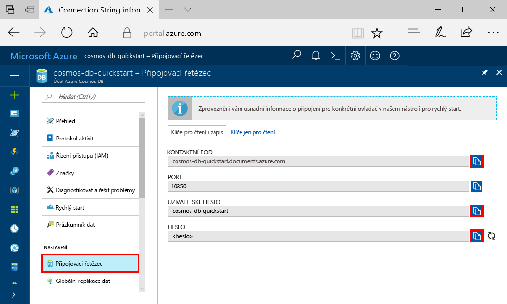

# <a name="quickstart-build-a-cassandra-app-with-java-and-azure-cosmos-db"></a>Rychlý start: Sestavení aplikace Cassandra pomocí Javy a Azure Cosmos DB

Tento rychlý start ukazuje, jak pomocí Javy a rozhraní Azure Cosmos DB [Cassandra API](cassandra-introduction.md) sestavit aplikaci profilu naklonováním příkladu z GitHubu. Tento rychlý start vás také provede vytvořením účtu Azure Cosmos DB pomocí webu Azure Portal.

Azure Cosmos DB je globálně distribuovaná databázová služba Microsoftu pro více modelů. Můžete rychle vytvořit a dotazovat databáze dokumentů, párů klíč-hodnota a grafů, které tak můžou využívat výhody možnosti globální distribuce a horizontálního škálování v jádru služby Azure Cosmos DB. 

## <a name="prerequisites"></a>Požadavky

[!INCLUDE [quickstarts-free-trial-note](../../includes/quickstarts-free-trial-note.md)]Alternativně můžete [vyzkoušet službu Azure Cosmos DB zdarma](https://azure.microsoft.com/try/cosmosdb/) bez předplatného Azure, poplatků a závazků.

Přejděte k programu Azure Cosmos DB Cassandra API Preview. Pokud jste ještě nepožádali o přístup, [zaregistrujte se](cassandra-introduction.md#sign-up-now).

Navíc platí: 

* [Java Development Kit (JDK) 1.7+](http://www.oracle.com/technetwork/java/javase/downloads/jdk8-downloads-2133151.html)
    * Na Ubuntu nainstalujte sadu JDK spuštěním příkazu `apt-get install default-jdk`.
    * Nezapomeňte nastavit proměnnou prostředí JAVA_HOME tak, aby odkazovala na složku, ve které je sada JDK nainstalovaná.
* [Stáhněte](http://maven.apache.org/download.cgi) a [nainstalujte](http://maven.apache.org/install.html) binární archiv [Maven](http://maven.apache.org/).
    * Na Ubuntu můžete Maven nainstalovat spuštěním příkazu `apt-get install maven`.
* [Git](https://www.git-scm.com/)
    * Na Ubuntu můžete Git nainstalovat spuštěním příkazu `sudo apt-get install git`.


## <a name="create-a-database-account"></a>Vytvoření účtu databáze

Než budete moct vytvořit databázi dokumentů, je potřeba pomocí služby Azure Cosmos DB vytvořit účet Cassandra.

[!INCLUDE [cosmos-db-create-dbaccount-cassandra](../../includes/cosmos-db-create-dbaccount-cassandra.md)]

## <a name="clone-the-sample-application"></a>Klonování ukázkové aplikace

Teď přejděme k práci s kódem. Teď naklonujeme aplikaci Cassandra z GitHubu, nastavíme připojovací řetězec a spustíme ji. Přesvědčíte se, jak snadno se pracuje s daty prostřednictvím kódu programu. 

1. Otevřete okno terminálu Git, například Git Bash, a pomocí příkazu `cd` přejděte do složky, do které chcete nainstalovat ukázkovou aplikaci. 

    ```bash
    cd "C:\git-samples"
    ```

2. Ukázkové úložiště naklonujete spuštěním následujícího příkazu. Tento příkaz vytvoří na vašem počítači kopii ukázkové aplikace.

    ```bash
    git clone https://github.com/Azure-Samples/azure-cosmos-db-cassandra-java-getting-started.git
    ```

## <a name="review-the-code"></a>Kontrola kódu

Tento krok je volitelný. Pokud chcete zjistit, jak se v kódu vytvářejí prostředky databáze, můžete si prohlédnout následující fragmenty kódu. Jinak můžete rovnou přeskočit k části [Aktualizace připojovacího řetězce](#update-your-connection-string). Všechny fragmenty kódu pocházejí ze souboru src/main/java/com/azure/cosmosdb/cassandra/util/CassandraUtils.java.  

* Je nastavený hostitel Cassandra, port, uživatelské jméno, heslo a možnosti SSL. Informace o připojovacím řetězci pocházejí ze stránky připojovacího řetězce na webu Azure Portal.

   ```java
   cluster = Cluster.builder().addContactPoint(cassandraHost).withPort(cassandraPort).withCredentials(cassandraUsername, cassandraPassword).withSSL(sslOptions).build();
   ```

* Příkaz `cluster` se připojí k rozhraní Cassandra API služby Azure Cosmos DB a vrátí relaci pro přístup.

    ```java
    return cluster.connect();
    ```

Následující fragmenty kódu pocházejí ze souboru src/main/java/com/azure/cosmosdb/cassandra/repository/UserRepository.java.

* Vytvořte nový prostor klíčů.

    ```java
    public void createKeyspace() {
        final String query = "CREATE KEYSPACE IF NOT EXISTS uprofile WITH replication = {'class': 'SimpleStrategy', 'replication_factor': '3' } ";
        session.execute(query);
        LOGGER.info("Created keyspace 'uprofile'");
    }
    ```

* Vytvořte novou tabulku.

   ```java
   public void createTable() {
        final String query = "CREATE TABLE IF NOT EXISTS uprofile.user (user_id int PRIMARY KEY, user_name text, user_bcity text)";
        session.execute(query);
        LOGGER.info("Created table 'user'");
   }
   ```

* Vložte entity uživatelů pomocí objektu připravených příkazů.

    ```java
    public PreparedStatement prepareInsertStatement() {
        final String insertStatement = "INSERT INTO  uprofile.user (user_id, user_name , user_bcity) VALUES (?,?,?)";
        return session.prepare(insertStatement);
    }

    public void insertUser(PreparedStatement statement, int id, String name, String city) {
        BoundStatement boundStatement = new BoundStatement(statement);
        session.execute(boundStatement.bind(id, name, city));
    }
    ```

* Použijte dotaz pro získání informací o všech uživatelích.

    ```java
   public void selectAllUsers() {
        final String query = "SELECT * FROM uprofile.user";
        List<Row> rows = session.execute(query).all();

        for (Row row : rows) {
            LOGGER.info("Obtained row: {} | {} | {} ", row.getInt("user_id"), row.getString("user_name"), row.getString("user_bcity"));
        }
    }
    ```

* Použijte dotaz pro získání informací o jednom uživateli.

    ```java
    public void selectUser(int id) {
        final String query = "SELECT * FROM uprofile.user where user_id = 3";
        Row row = session.execute(query).one();

        LOGGER.info("Obtained row: {} | {} | {} ", row.getInt("user_id"), row.getString("user_name"), row.getString("user_bcity"));
    }
    ```

## <a name="update-your-connection-string"></a>Aktualizace připojovacího řetězce

Teď se vraťte zpátky na portál Azure Portal, kde najdete informace o připojovacím řetězci, a zkopírujte je do aplikace. Tím aplikaci umožníte komunikovat s hostovanou databází.

1. Na webu [Azure Portal](http://portal.azure.com/) klikněte na **Připojovací řetězec**. 

    

2. Pomocí tlačítka  na pravé straně obrazovky zkopírujte hodnotu KONTAKTNÍ BOD.

3. Otevřete soubor `config.properties` ve složce C:\git-samples\azure-cosmosdb-cassandra-java-getting-started\java-examples\src\main\resources. 

3. Vložte hodnotu KONTAKTNÍ BOD z portálu místo `<Cassandra endpoint host>` na řádku 2.

    Řádek 2 souboru config.properties by teď měl vypadat nějak takto: 

    `cassandra_host=cosmos-db-quickstarts.documents.azure.com`

3. Přejděte zpátky na portál a zkopírujte hodnotu UŽIVATELSKÉ JMÉNO. Vložte hodnotu UŽIVATELSKÉ JMÉNO z portálu místo `<cassandra endpoint username>` na řádku 4.

    Řádek 4 souboru config.properties by teď měl vypadat nějak takto: 

    `cassandra_username=cosmos-db-quickstart`

4. Přejděte zpátky na portál a zkopírujte hodnotu HESLO. Vložte hodnotu HESLO z portálu místo `<cassandra endpoint password>` na řádku 5.

    Řádek 5 souboru config.properties by teď měl vypadat nějak takto: 

    `cassandra_password=2Ggkr662ifxz2Mg...==`

5. Pokud chcete použít konkrétní certifikát SSL, na řádku 6 nahraďte `<SSL key store file location>` umístěním certifikátu SSL. Pokud není uvedená hodnota, použije se certifikát JDK nainstalovaný v <JAVA_HOME>/jre/lib/security/cacerts. 

6. Pokud změníte řádek 6 pro použití konkrétního certifikátu SSL, aktualizujte řádek 7, aby používal heslo pro tento certifikát. 

7. Uložte soubor config.properties.

## <a name="run-the-app"></a>Spuštění aplikace

1. V okně terminálu Git přejděte příkazem `cd` do složky azure-cosmosdb-cassandra-java-getting-started\java-examples.

    ```git
    cd "C:\git-samples\azure-cosmosdb-cassandra-java-getting-started\java-examples"
    ```

2. V okně terminálu Git použijte následující příkaz pro vytvoření souboru cosmosdb-cassandra-examples.jar.

    ```git
    mvn clean install
    ```

3. V okně terminálu Git pomocí následujícího příkazu spusťte aplikaci v Javě.

    ```git
    java -cp target/cosmosdb-cassandra-examples.jar com.azure.cosmosdb.cassandra.examples.UserProfile
    ```

    Okno terminálu zobrazí oznámení o vytvoření prostoru klíčů a tabulky. Potom vybere a vrátí všechny uživatele v tabulce, zobrazí výstup a potom vybere řádek podle ID a zobrazí příslušnou hodnotu.  

    Stisknutím kombinace kláves CTRL + C zastavte provádění programu a zavřete okno konzoly. 
    
    Teď můžete otevřít Průzkumníka dat na webu Azure Portal a zobrazit dotaz nebo provést úpravy a pracovat s těmito novými daty. 

    

## <a name="review-slas-in-the-azure-portal"></a>Ověření smluv SLA na webu Azure Portal

[!INCLUDE [cosmosdb-tutorial-review-slas](../../includes/cosmos-db-tutorial-review-slas.md)]

## <a name="clean-up-resources"></a>Vyčištění prostředků

[!INCLUDE [cosmosdb-delete-resource-group](../../includes/cosmos-db-delete-resource-group.md)]

## <a name="next-steps"></a>Další kroky

V tomto rychlém startu jste se seznámili s postupem vytvoření účtu Azure Cosmos DB, databáze Cassandra a kolekce pomocí Průzkumníku dat a spuštění aplikace, která to samé udělá programově. Teď můžete do kolekce Azure Cosmos DB importovat další data. 

> [!div class="nextstepaction"]
> [Import dat Cassandra do služby Azure Cosmos DB](cassandra-import-data.md)
